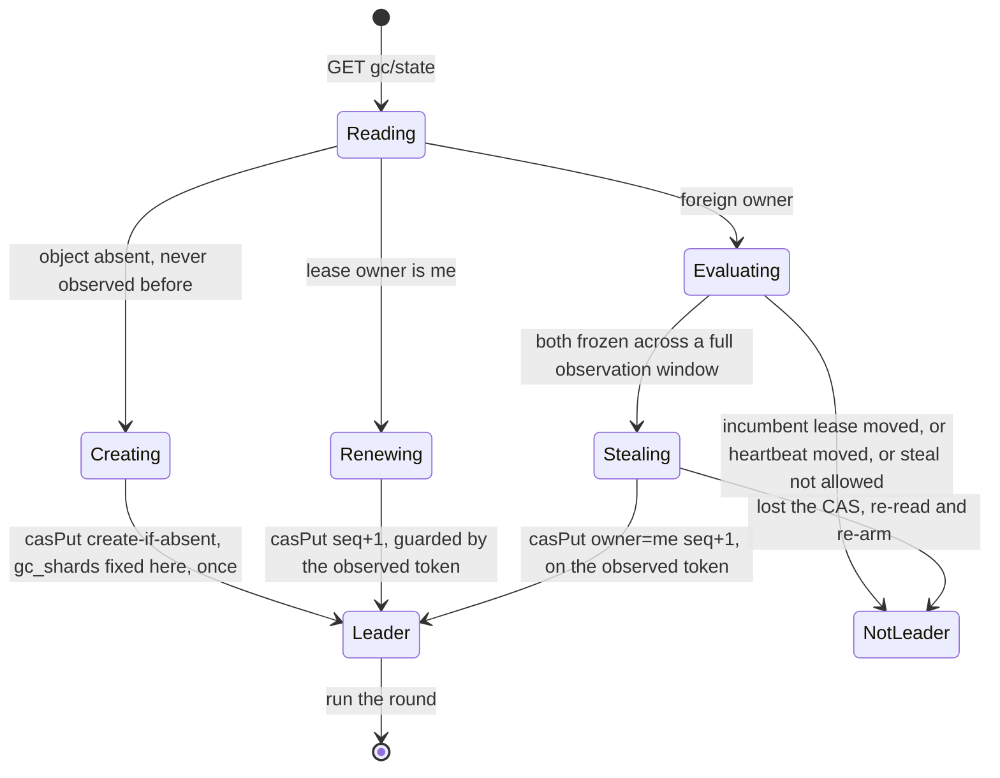
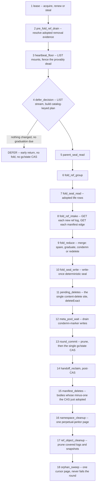
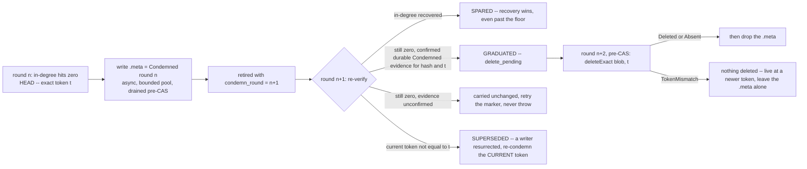

# CAS architecture — garbage collection {#garbage-collection}

`GC` is the only place in `CAS` that ever deletes a blob body or a manifest body. It runs as a
background, lease-paced loop per mount (`Gc::runRegularRound`, `Gc/CasGc.cpp`), folding ref-log
history into blob in-degree, condemning what reaches zero, and deleting only after that
condemnation has survived a full extra round. This page covers leadership, the round's 18 phases,
condemnation and deletion, sharding, pruning, round cost, and observability. Manifest and ref
mechanics that `GC` folds are covered on the
[manifests-and-refs page](/antalya/cas/architecture/manifests-and-refs); the writer-versus-`GC`
race over one blob is covered on the
[blob-protocol page](/antalya/cas/architecture/blob-protocol#writer-gc-race).

## Leadership {#leadership}

There is **no separate `GC` lease object**. The lease lives inside `gc/state` itself as
`{owner, seq}`.

Two independent liveness signals are consulted before a steal: whether `(owner, seq)` moved since
the last tick, and whether the separate `gc/hb` heartbeat moved. The heartbeat is compared only
under the same remembered heartbeat owner, deliberately not against `lease.owner` — a deposed
leader's heartbeat thread keeps pulsing, and that must not cause a live new leader's lease to be
stolen. The paced background loop may steal; a manual `SYSTEM CAS GC RUN` may not, because the
safety argument needs two observations separated by real wall time. Because every renew or steal
bumps `seq`, `seq` doubles as the round's attempt id.

**A deposed leader that keeps running cannot corrupt anything**, and the argument does not rely on
exclusivity at all:

1. `gc/state` is published by exactly **one** `CAS` per round; a deposed leader's `CAS` fails and
   its entire round evaporates.
2. Every fold artifact is written under that leader's own attempt number, invisible to every
   reader, and reclaimed later by wholesale generation pruning.
3. Destructive pre-`CAS` actions are justified only by previously published durable state, so they
   are replay-idempotent.
4. Deletes are exact-token, so a stale leader can never delete a newer incarnation.

The lease is therefore **work de-duplication, not mutual exclusion**.

## The round {#the-round}

A round is one pass of 18 named phases ending in exactly one `gc/state` `CAS`
(`Gc::runRegularRound`, `Gc/CasGc.cpp`).

Orderings that are load-bearing:

- **2 before 4** — a row proved complete by the adopted parent is resolved before `DEFER` or any
  successor plan can publish.
- **15 after 13** — manifest bodies are deleted only after the `CAS` adopted their decrements.
- **13's prune before the `CAS`** — a pre-`CAS` destructive action may rely only on already-
  published state.

**Clamp suppression.** `suppress_destructive = !anomalies.empty() || !carried_holds.empty() ||
!frontier_complete` is computed once and threaded into the merge, current-life ref cleanup and the
perpetual namespace janitor, so they cannot desynchronize. Under suppression there is no
graduation, no redelete, and no ref or namespace deletion; condemnation and sparing continue,
because both are non-destructive.

**Fail-closed aborts.** A throw before the `CAS` means nothing is adopted: unapplied transactions,
a cursor/apply mismatch, a missing adopted seal, a table with a snapshot but no surviving log and
no cursor, a non-total condemned summary, and an observed delete marker (bucket versioning is on).

## The one-pass commit {#gc-state}

`gc/state` is the durable safety and round-adoption state: `round`, `gc_shards`,
`snap_generation`, `snap_pruned_through`, `snap_attempt`, `manifest_sweep_cursor`, and the lease.
Exactly one `CAS` per round publishes it; the fold itself performs no `CAS` of its own.

**The fold seal *is* the coverage record**: generation, parent generation, one `ref_lives` row per
catalog-admitted opaque life (coverage plus optional cleanup evidence), references to the
source-edge run segments, and a per-shard condemned summary. It is encoded deterministically, so a
replayed round produces byte-identical bytes and adopts its own output through the
`putDeterministicArtifact` adoption pin (see the [blob-protocol page](/antalya/cas/architecture/blob-protocol#deterministic-artifacts)).
There is **no separate retired-list object** — condemned entries ride the source-edge run as
sentinel rows at `source_id = 0` — and **no run-file list outside the seal**; runs are resolved
*through* the seal's references, never by key construction.

## Finding orphans {#finding-orphans}

In-degree is a set of source edges, not a refcount. A blob becomes a candidate when its edge set
becomes empty and it was touched this pass: one `HEAD` captures the exact incarnation token and
size that a future delete will name. A blob merely carried from the parent run pays no `HEAD`.

**The grace period is measured in rounds, not acks:** an entry graduates once it has survived one
full round (`condemn_round < current_round`). The heartbeat floor is liveness only and **never**
gates graduation.

**The 404 rule.** A body that is present but invalid is `CORRUPTED_DATA`, hard. A body that is
missing is **never** a throw — the fold records and continues, and the caller decides by position:
a precommit activation clamps as a barrier; a committed or removal fold clamps only that table.
Prunes are likewise fail-open on 404.

## Condemnation and deletion {#condemn-delete}

The `.meta` sidecar carries **no token** — it is a per-hash hint. The exact incarnation token lives
in the condemned sentinel row inside the run, together with the condemn round and two flags,
`delete_pending` and `marker_confirmed`. `GC`'s marker is add-only: `Clean → Condemned` yes, the
reverse never, not even when sparing — only a writer that has already displaced the body may clear
it. Minimum two full rounds separate condemnation from deletion, and `delete_pending` is terminal —
an entry is never un-pended.

## Sharding {#sharding}

`gc_shards` is fixed at first lease acquire and immutable; decoders reject `0`. A blob routes by
the **high** 64 bits of its digest, read big-endian.

The role split is worth internalizing: the **coordinator** — the lease holder — owns discovery,
round visibility, the single global fence, and the generation advance, because a publish into
*one* namespace can protect a blob owned by *any* shard, so these span the whole universe and must
not be sharded. **Reducers** own only their disjoint shard; their run-key namespaces never
collide, so two servers could reduce different shards concurrently and reducer work needs no
lease.

A shard with an empty delta bucket and no condemned entries in the parent summary copies the
parent's run references verbatim — zero run I/O, a "pure carry". A missing parent summary entry on
a non-fresh pool is `CORRUPTED_DATA`, never silently treated as zero.

## Pruning old objects {#pruning}

- **Current-life ref logs and snapshots** (phase 17) — a log is deletable only when covered by
  both durable fold coverage and a durable live snapshot; snapshots strictly older than the newest
  observed one are deletable. There is no batch delete; it is `HEAD` plus `deleteExact` per key.
- **Generations** (phase 13) — keep the last `gc_snapshot_generations_to_keep` (default 3; `0`
  means keep everything, for forensics). Pruning is wholesale: `LIST` the generation prefix and
  delete everything under it, including deposed-leader debris and attempt-scoped outcome sets. A
  generation still referenced by the live seal is skipped, but the cursor still advances past it —
  leak-freedom then rests on the post-`CAS` hand-off reclaim in phase 14.
- **Manifests** — owner-removed bodies delete in phase 15; never-precommitted bodies go through the
  [orphan-manifest sweep](/antalya/cas/architecture/manifests-and-refs#orphan-sweep) in phase 18.

## What a round costs {#round-cost}

Per **folding** round, with `N` live mounts, `S` ref tables and `S_changed` tables carrying new
logs:

| Operation | Count |
|---|---|
| `LIST cas/ns/stream/` | 1 full enumeration |
| `LIST gc/server-roots/` | 1, plus 1 `GET` per mount |
| `GET` the adopted fold seal | 5, explicitly instrumented |
| `GET` ref logs | 1 per new log |
| `GET` manifests | 1 per emitted edge — no manifest-body cache within a round |
| `PUT` run segments | 1 per non-pure-carry shard, plus 1 fold seal |
| `HEAD` blobs | 1 per newly condemned |
| `DELETE` | 1 per graduate |
| `CAS gc/state` | 1 |

The measured `GET` formula is exact: total `GET`s equal ref-log body `GET`s plus manifest body
`GET`s, i.e. `1 + edges_per_log`. An idle round is one `LIST` sweep, `N` heartbeat `GET`s, and one
`CAS`. A deferred round is cheaper still: one `LIST`, three seal `GET`s, the lease `GET`/`PUT` and
the heartbeat floor — no `gc/state` `CAS` at all.

Per-round budgets bound the destructive work of any single pass, all disk-level settings:

| Setting | Default | Bounds |
|---|---|---|
| `gc_round_graduation_budget` | 5000 | condemned to delete_pending, per round |
| `gc_round_redelete_budget` | 5000 | exact-token deletes of prior delete_pending rows |
| `gc_round_sweep_namespace_budget` | 20 | distinct namespaces the orphan sweep may build a protection view for |
| `gc_round_sweep_recovery_op_budget` | 5000 | committed-tail ref-log GET/decode ops the sweep's recovery walk may spend |
| `gc_round_ref_cleanup_budget` | 5000 | covered log/snapshot deletes |
| `gc_round_prefix_wholesale_budget` | 20000 | generation-prefix wholesale-delete object cap |
| `gc_round_handoff_prefix_wholesale_budget` | 5000 | post-CAS hand-off reclaim object cap, reserved separately so a prune-heavy round cannot starve it |
| `gc_round_outcome_entry_budget` | 5000 | forensic outcome-log entries across redelete/spared |
| `manifest_sweep_list_budget_keys` / `manifest_sweep_delete_budget_keys` | 1000 / 100 | orphan-sweep LIST/DELETE pacing |
| `gc_meta_pool_size` | 16 | bounded pool for condemn-marker writes |

## Observability {#observability}

`system.cas_gc_log` emits `Start`, `Finish` and per-`Phase` rows, correlated by `round_id` — not
`round`, which is `0` on `Start` and does not exist at all on a not-a-leader round. Phase rows
carry no verb columns by design: per-phase operation counts ride the row's own `ProfileEvents`
delta, so grouping by phase over an S3 event attributes the LIST/GET/PUT/DELETE budget without
inventing schema. `phase_metrics` carries the semantic counts no counter can supply (clamped
tables, dead precommits skipped, pure-carry shards, generations visited). `Deferred` is kept
distinct from `Success` precisely so "folded and found nothing" is distinguishable from "never
folded". Every `GC`-related `ProfileEvent` carries the uppercase `CAS`/`CASGC` prefix — for example
`CASGCRetiredCondemned`, `CASGCRetiredGraduated`, `CASGCRetiredRedeleted`,
`CASGCClampSuppressedPasses`, `CASGCHeartbeatFenceOuts`.

Alongside it, `system.cas_log` carries the audit trail: the condemn chain, fence-outs, anomalies
(capped per round, each carrying the true total), and manifest deletes.

`ca-fsck` distinguishes two classes that are easy to conflate: `dangling` — referenced but missing,
the `INV-NO-LOSS` data-loss class — versus `unreachable`/`awaiting-gc` — present, unreferenced, and
simply waiting for graduation.

## Operational surface {#operational-surface}

| Command | Effect |
|---|---|
| `SYSTEM CAS GC RUN '<disk>'` | One synchronous round on the contacted node; only the lease holder makes progress |
| `SYSTEM CAS GC STOP` / `SYSTEM CAS GC START` | Stop or resume future rounds on the same scheduler, preserving its identity |
| `SYSTEM CAS GC REBUILD` (`clickhouse-disks ca-gc-rebuild`) | Fail-closed disaster-recovery path that every "GC refuses to run" error points at; deliberately over-protects — it prefers bounded leaks over risking an under-count. It cannot delete live data directly: deletions it produces still flow through the normal round's condemn, graduate, exact-token path |
| `clickhouse-disks ca-gc-dryrun` | Opens the disk read-only, constructs a non-leader `GC`, and prints what would be deleted with a reason per entry. Write-free, resolves runs through the seal's references. Documented caveat: it does not fold new owner events, so away from quiescence it can **over-report** — the subset guarantee holds only at quiescence, and its output must never feed a real delete |

`SYSTEM CAS DROP POOL MEMBER '<server_root_id>' FROM DISK '<disk>'` — permanent removal of a dead
replica, distinct from ordinary `GC` — is covered on the
[mounts-and-leases page](/antalya/cas/architecture/mounts-and-leases#mount-lifecycle). `SYSTEM CAS
FSCK` and its `dangling`/`unreachable` vocabulary are a read-only diagnostic pass, not part of the
`GC` protocol itself.
