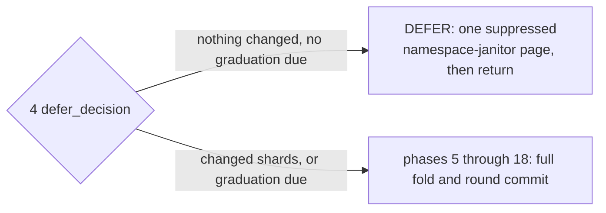
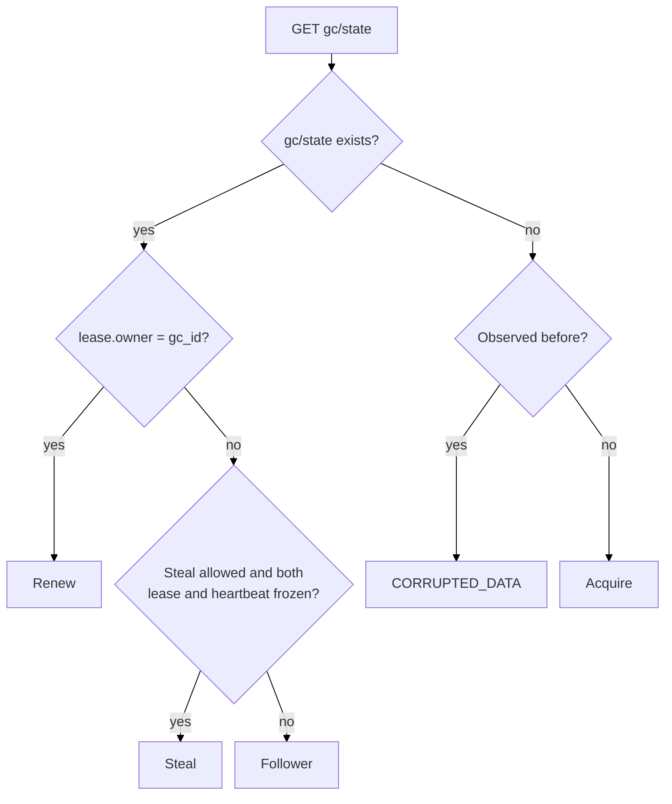
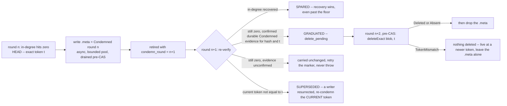

# CAS architecture — garbage collection {#garbage-collection}

## GC model {#gc-model}

`GC` is the only place in `CAS` that ever deletes a blob body or a manifest body. It runs as a
background, lease-paced loop per mount (`Gc::runRegularRound`, `Gc/CasGc.cpp`), folding ref-log
history into blob in-degree, condemning what reaches zero, and deleting only after that
condemnation has survived a full extra round. Each call to `Gc::runRegularRound` is one round
execution. It first processes the `GC` lease by creating, renewing, observing or stealing it, then
either returns as a follower, defers the fold when no destructive decision is due, or folds ref-log
history into a new in-degree snapshot and publishes it.

The [`cas_gc_interval_sec`](/antalya/cas/configuration#disk-settings) disk setting controls the
normal interval between background round executions (60 seconds by default). It is a scheduler
cadence, not a limit on the duration of one round execution. Round duration depends on the amount
of ref-log, manifest, candidate, and cleanup work and on the configured per-round work budgets. A
manual `SYSTEM CAS GC RUN` can request a round execution without waiting for the interval.

This page covers leadership, the round's 18 phases, condemnation and deletion, sharding, pruning,
round cost, and observability. Manifest and ref mechanics that `GC` folds are covered on the
[manifests-and-refs page](/antalya/cas/architecture/manifests-and-refs); the writer-versus-`GC`
race over one blob is covered on the
[blob-protocol page](/antalya/cas/architecture/blob-protocol#writer-gc-race).

## The round {#the-round}

A folding round execution is one pass of 18 named phases ending in exactly one commit `CAS` over
`gc/state` (`Gc::runRegularRound`, `Gc/CasGc.cpp`). Every round execution starts with phase 1, but a
follower or a deferred round execution returns before that commit.

| # | Phase (`GcPhaseTimer` name) | What it does |
|---|---|---|
| 1 | `lease` | Create, renew, observe or steal the lease inside `gc/state`. The only phase a `NotALeader` round execution emits |
| 2 | `pre_fold_ref_drain` | Resolve catalog `Removing` rows whose cleanup evidence the adopted parent already sealed; exact-CAS-delete the completed ones before defer or new fold work |
| 3 | `heartbeat_floor` | One `LIST` of `gc/server-roots/`, one `GET` per mount slot, fence-out `PUT` for any mount whose write-token has held stable past the threshold |
| 4 | `defer_decision` | One full `LIST` of `cas/ns/stream/`, build the catalog-keyed ref walk plan; decide `DEFER` (nothing changed, no graduation due) or continue to a full fold. A `DEFER` verdict still runs one namespace-janitor page — the same work phase 16 does on a folding round — with its deletes suppressed |
| 5 | `parent_seal_read` | Capture the parent fold seal's run references before the fold mutates the in-memory generation/attempt, to detect a ref that moved off an already-pruned generation |
| 6 | `fold_ref_group` | Regroup the one `LIST` from phase 4 into per-table listings — no I/O, the keys are already in hand |
| 7 | `fold_seal_read` | `GET` and decode the adopted fold seal that anchors this fold's coverage |
| 8 | `fold_ref_intake` | `GET` every new ref-log record and every referenced manifest, extracting blob source edges |
| 9 | `fold_reduce` | The three-cursor merge over prior edges, new deltas and the parent's condemned rows: spare, condemn, graduate or redelete each candidate |
| 10 | `fold_seal_write` | Write the new fold seal once, write-once deterministic, adopting a byte-identical replay instead of rewriting it |
| 11 | `pending_deletes` | The single content-delete site: exact-token `deleteExact` of every entry the *previous* round marked `delete_pending`, plus the forensic outcome-log writes |
| 12 | `meta_pool_wait` | Drain the bounded pool of async `.meta` condemn-marker writes queued during the fold |
| 13 | `round_commit` | Retention-prune old generations, then publish the single `gc/state` `CAS` that adopts the whole round |
| 14 | `handoff_reclaim` | Post-`CAS`: reclaim any generation that a ref moved off during this very round, before the ordinary wholesale prune would reach it |
| 15 | `manifest_deletes` | Delete manifest bodies whose owner-removal minus-one edge the `CAS` in phase 13 just adopted |
| 16 | `namespace_cleanup` | One bounded page of the perpetual namespace janitor, reclaiming dead-life debris |
| 17 | `ref_object_cleanup` | Prune ref logs and snapshots once both fold coverage and a live snapshot make them safe to delete |
| 18 | `orphan_sweep` | Post-`CAS` exact-token deletion for the [orphan-manifest sweep](/antalya/cas/architecture/manifests-and-refs#orphan-sweep), after phase 13 adopted each candidate's exact blob-source retirements and the cursor. Planning retains, counts, logs, and advances past undecodable bodies without wedging later candidates; a decoded identity mismatch during planning or token ABA during deletion still fails the round with `CORRUPTED_DATA` |

Phases 5 through 18 run only when phase 4 decides to fold. A `DEFER` verdict is not a bare no-op:
it still runs one bounded namespace-janitor page with `suppress_destructive = true` — cursor
progress and diagnostics only, no deletes — and then returns, publishing no fold artifact and no
commit `CAS`. Its lease `CAS` may already have created or renewed the lease in phase 1:



Orderings that are load-bearing:

- **2 before 4** — a row proved complete by the adopted parent is resolved before `DEFER` or any
  successor plan can publish.
- **15 after 13** — manifest bodies are deleted only after the `CAS` adopted their decrements.
- **13's prune before the `CAS`** — a pre-`CAS` destructive action may rely only on already-
  published state.

**Clamp suppression.** `suppress_destructive = !anomalies.empty() || !carried_holds.empty() ||
!frontier_complete` is computed once and threaded into the merge, current-life ref cleanup and the
perpetual namespace janitor, so they cannot desynchronize. Under suppression there is no
graduation, no redelete, and no ref or namespace deletion; condemnation and sparing continue,
because both are non-destructive.

**Fail-closed aborts.** A throw before the commit `CAS` means nothing is adopted: unapplied transactions,
a cursor/apply mismatch, a missing adopted seal, a table with a snapshot but no surviving log and
no cursor, a non-total condemned summary, and an observed delete marker (bucket versioning is on).

## Phase 1: lease {#phase-1-lease}

There is **no separate `GC` lease object**. The lease lives inside `gc/state` itself as
`{owner, seq}`.

After decoding, the object has this structure:

```text
<pool_prefix>/gc/state
├── header
│   ├── type = cas_gc_state
│   └── format_version
└── body
    ├── round
    ├── gc_shards
    ├── snap_generation
    ├── snap_pruned_through
    ├── snap_attempt
    ├── manifest_sweep_cursor
    └── lease
        ├── owner
        └── seq
```

Phase 1 changes only `lease` during renew or steal; the other body fields are preserved. The
backend token returned with `gc/state` identifies its exact object version and is not a field in
this structure.



### 1.1 Acquire {#phase-1-acquire}

If `gc/state` does not exist and this `Gc` instance has never seen it, phase 1 creates the object.
The new lease has `owner = gc_id` and `seq = 1`; `gc_shards` is also fixed at this point. A
successful create lets the round execution continue. A create conflict causes a bounded re-read.

If the same `Gc` instance has already observed `gc/state` and the object later disappears, phase 1
throws `CORRUPTED_DATA` instead of creating a new history.

### 1.2 Renew {#phase-1-renew}

If `lease.owner` already equals this instance's `gc_id`, phase 1 increments `lease.seq` and replaces
`gc/state` with a token-guarded `CAS`. All non-lease fields stay unchanged. A successful renew lets
the round execution continue; a conflict causes a bounded re-read.

### 1.3 Follower {#phase-1-follower}

If another `GC` owns the lease, phase 1 reads `gc/hb` and normally returns `NotALeader`. When a
scheduled round execution backs off because this is the first observation or because either signal
moved, it records the observed lease and heartbeat in the local `Gc` instance. This observation is
kept only in memory. A new process starts without it, so the first sight of a foreign lease never
causes a steal.

A manual `SYSTEM CAS GC RUN` may acquire a missing lease or renew its own lease. It never steals a
foreign lease and does not record a foreign observation for the background loop.

### 1.4 Steal {#phase-1-steal}

The current leader writes a small `gc/hb` object. It sends one heartbeat immediately after a
successful acquire, renew or steal, before the long work starts. A separate heartbeat loop keeps
advancing it while the scheduler considers itself the leader. The heartbeat is advisory: it shows
activity but does not grant authority to commit a round.

A `Gc` instance that is a candidate to become the leader compares two signals with the values it
recorded during its previous scheduled round execution:

- the `(lease.owner, lease.seq)` pair in `gc/state`;
- the writer and sequence stored in `gc/hb`.

If either signal changed, the current lease owner is treated as active. The candidate records a new
observation and returns as a follower. The heartbeat writer does not have to equal `lease.owner`:
during a handoff, an old heartbeat thread may still write for a short time, and any moving
heartbeat must prevent another steal.

Steal is allowed only when both signals stayed unchanged across two observations made by the paced
background loop. The candidate then replaces `lease.owner` with its own `gc_id`, increments
`lease.seq`, and performs a token-guarded `CAS`. A successful `CAS` lets the round execution
continue. A lost steal `CAS` causes one re-read and returns `NotALeader`; there is no second steal
attempt in the same round execution.

### 1.5 Successful result {#phase-1-result}

Acquire, renew and steal all return the committed `GcState` and the backend token (for example, an
S3 `ETag`) of that exact `gc/state` version. The later `round_commit` uses this token as its expected
token. Any intervening update of `gc/state` therefore rejects the stale leader's commit. The
resulting `lease.seq` also becomes the folding round's attempt id.

### 1.6 Safety after leadership changes {#phase-1-safety}

A deposed leader may keep running, but correctness does not rely on exclusive execution:

1. A folding round is published by exactly **one commit `CAS`** over `gc/state`; a deposed leader's
   commit fails and its candidate generation is not adopted.
2. Every fold artifact is written under that leader's own attempt number, invisible to every
   reader, and reclaimed later by wholesale generation pruning.
3. Destructive pre-`CAS` actions are justified only by previously published durable state, so they
   are replay-idempotent.
4. Deletes are exact-token, so a stale leader can never delete a newer incarnation.

The lease is therefore **work de-duplication, not mutual exclusion**.

### 1.7 Phase costs {#phase-1-costs}

Without token conflicts, phase 1 sends:

| Result | `<pool_prefix>/gc/state` `GET` | `<pool_prefix>/gc/hb` `GET` | `<pool_prefix>/gc/state` conditional `PUT` (`CAS`) | Total |
|---|---:|---:|---:|---:|
| `Acquire` | 1 | 0 | 1 | 2 |
| `Renew` | 1 | 0 | 1 | 2 |
| `Follower` | 1 | 1 | 0 | 2 |
| `Steal` | 1 | 1 | 1 | 3 |

Each acquire or renew token conflict (the conditional `PUT` loses because the `gc/state` token
changed) adds two requests. A lost `Steal` adds one final `gc/state` `GET`, raising its total to four
requests. A heartbeat pulse runs outside this phase and costs one `gc/hb` `GET` and one conditional
`PUT`.

## Phase 2: pre-fold ref drain {#phase-2-pre-fold-ref-drain}

Phase 2 completes namespace removals that were proved safe by the last committed folding round. It
also runs on a round execution that later returns as `Deferred`.

### 2.1 Removal protocol {#phase-2-removal-protocol}

Namespace removal is split across round executions:

During the first, folding round execution:

1. The fold reads a ref-log transaction containing `RemoveNamespace` and writes
   `cleanup_evidence` into its fold seal.
2. `round_commit` makes that fold seal the adopted parent.

During a later leader round execution:

3. Phase 2 uses the adopted evidence to remove the matching `Removing` row from
   `<pool_prefix>/cas/ref_catalog`.
4. Phase 16, `namespace_cleanup`, may delete the old namespace's physical `_log`, `_snap`, `_ckpt`,
   and `_files` objects. Its cleanup is bounded, so some objects may remain for a subsequent round.

The fold that creates `cleanup_evidence` cannot use it immediately. Phase 2 accepts evidence only
from a fold seal already published by an earlier commit `CAS`.

### 2.2 Inputs {#phase-2-inputs}

Phase 1 supplies `snap_generation` and `snap_attempt` from `<pool_prefix>/gc/state`. Together they
identify the adopted parent fold seal.

#### 2.2.1 Adopted parent fold seal {#phase-2-parent-fold-seal}

`<pool_prefix>/gc/gen/<snap_generation>/attempt/<snap_attempt>/fold_seal` describes the last GC
generation published by `round_commit`. It is immutable after publication. Phase 2 reads only the
following part:

```text
<pool_prefix>/gc/gen/<snap_generation>/attempt/<snap_attempt>/fold_seal
└── ref_lives[<life_id>]
    ├── coverage
    │   └── hold                    [optional]
    └── cleanup_evidence            [optional]
        └── remove_txn_id
```

- `ref_lives[<life_id>]` contains the fold state for one namespace incarnation. Its map key is
  compared with `incarnation` in the catalog.
- `coverage.hold`, when present, means the fold could not prove complete coverage. Phase 2 must keep
  the catalog entry.
- `cleanup_evidence` means the fold processed the terminal `RemoveNamespace` transaction for this
  life.
- `cleanup_evidence.remove_txn_id` identifies that terminal ref-log transaction. Phase 2 does not
  read the ref-log again because the adopted seal is the durable evidence.

If `<pool_prefix>/gc/state` points to a missing parent fold seal, phase 2 throws `CORRUPTED_DATA`.

#### 2.2.2 Namespace catalog {#phase-2-ref-catalog}

`<pool_prefix>/cas/ref_catalog` is the durable source of truth for the current incarnation and
lifecycle state of every namespace in the pool. Phase 2 uses these fields:

```text
<pool_prefix>/cas/ref_catalog
└── entries[]
    ├── ns
    ├── state
    ├── incarnation
    └── removal_started_round       [only for Removing]
```

- `ns` is the logical namespace name.
- `state` is `Creating`, `Live`, or `Removing`. Phase 2 considers only `Removing` entries.
- `incarnation` is the unique `life_id` of this namespace life. Recreating the same `ns` produces a
  new value, so evidence for an old life cannot remove the new entry.
- `removal_started_round` records when the entry moved to `Removing` and is required in that state.

An entry is eligible only when it is `Removing`, the adopted parent has `cleanup_evidence` for the
same `incarnation`, and that life has no coverage `hold`. `Creating` and `Live` entries are never
changed by this phase. The catalog's backend token is returned alongside the object; it is not a
catalog field and is used as the precondition when phase 2 replaces the catalog.

### 2.3 No adopted generation {#phase-2-no-adopted-generation}

If the `snap_generation` field of `<pool_prefix>/gc/state` is `0`, no folding round has been
committed yet and there is no adopted parent fold seal. Phase 2 returns successfully without
reading the fold seal or the catalog and without removing anything.

In a new pool, phase 2 is still executed and logged during the first leader round execution, but it
is a no-op. It can remove catalog entries for the first time only during a later leader round
execution after an earlier folding round has committed a generation. This is normally the second
leader round execution, but not necessarily the second call to `Gc::runRegularRound`: a
`NotALeader`, `Deferred`, or failed execution does not create an adopted generation.

### 2.4 Drain {#phase-2-drain}

When an adopted generation exists, phase 2 reads its fold seal and repeatedly processes eligible
catalog entries:

1. Read a complete `<pool_prefix>/cas/ref_catalog` snapshot and its backend token.
2. Select one eligible `Removing` entry.
3. Re-read `<pool_prefix>/gc/state` and verify that `lease.owner` and `lease.seq` still match the
   values obtained in phase 1. A mismatch here skips the write and ends the drain as a lost-authority
   failure.
4. Write a new catalog without that exact entry, using the catalog token as the `CAS` precondition.
5. Re-read the catalog to determine the durable result, and re-read `<pool_prefix>/gc/state` once
   more to confirm leadership was still held across the write. Continue until no eligible entry
   remains; after the eligible set empties, re-read `<pool_prefix>/gc/state` a final time before
   declaring the drain complete.

The two `<pool_prefix>/gc/state` re-reads around every write are why phase 2 issues `2N + 1` state
`GET`s for `N` removed rows (see the [phase costs](#phase-2-costs) below). The catalog row is
removed by replacing the whole catalog with `CAS`; this is not a backend `DELETE`. The mandatory
catalog re-read distinguishes a completed removal, replacement by a new incarnation, and a token
conflict that still left the old entry present.

### 2.5 Result {#phase-2-result}

On success, the final catalog snapshot contains no `Removing` entry that the adopted parent fold
seal already proved complete. Phase 2 invalidates any local runtime for each confirmed old
`(ns, incarnation)` and records the number of catalog rows it removed.

If leadership changes during the drain, phase 2 stops and the round execution fails with a
retry-later exception. A catalog update already sent by the old leader is still safe: it was
authorized by the previously adopted fold seal and guarded by the exact catalog token.

Phase 2 does not change `<pool_prefix>/gc/state` or the parent fold seal, create a new generation,
read ref-log bodies, or physically delete namespace data, manifests, or blobs. Its result is a
barrier: phase 3 starts only after all catalog removals already authorized by the parent have been
resolved.

### 2.6 Phase costs {#phase-2-costs}

If `snap_generation` is `0`, phase 2 sends no requests to the storage backend.

Otherwise, let `N` be the number of eligible catalog rows removed without conflicts. Phase 2 sends:

| Key | Operation | Requests |
|---|---|---:|
| `<pool_prefix>/gc/gen/<generation>/attempt/<attempt>/fold_seal` | `GET` | 1 |
| `<pool_prefix>/cas/ref_catalog` | `GET` | `N + 1` |
| `<pool_prefix>/gc/state` | `GET` | `2N + 1` |
| `<pool_prefix>/cas/ref_catalog` | conditional `PUT` (`CAS`) | `N` |

The total is `4N + 3` backend requests: `3N + 3` reads and `N` writes. Each catalog token conflict
(the conditional `PUT` loses because the catalog token changed, but the old row remains) adds four
requests.

## Phase 3: heartbeat floor {#phase-3-heartbeat-floor}

Phase 3 checks whether each mounted writer is still active and fences writer incarnations that
stopped renewing their mount lease. It runs on both the deferred and folding paths.

Despite its name, this phase does not read or write `<pool_prefix>/gc/hb`. That object tracks the
GC leader and belongs to phase 1. Phase 3 observes the backend token of each writer's `mount`
object.

### 3.1 Mount objects {#phase-3-mount-objects}

Each server root has three control-plane objects:

```text
<pool_prefix>/gc/server-roots/
└── <server_root_id>/
    ├── owner
    ├── epoch
    └── mount
```

Phase 3 lists the whole `server-roots` subtree, but reads only keys ending in `/mount`. It does not
read or change `owner` or `epoch`.

The decoded mount object has this structure:

```text
<pool_prefix>/gc/server-roots/<server_root_id>/mount
├── header
│   ├── type = cas_mount_lease
│   └── format_version
└── body
    ├── server_uuid
    ├── writer_epoch
    ├── hostname
    ├── pid
    ├── started_at_ms
    ├── seq
    ├── expires_at_ms
    ├── min_active
    ├── gc_fenced
    └── write_attempt_id
```

The phase uses the backend token to detect renewals, `gc_fenced` to detect an earlier fence-out,
`min_active = UINT64_MAX` to detect a clean farewell, and `seq` to write `seq + 1` during a
fence-out. All other body fields are preserved. In particular, `expires_at_ms` is not evidence that
the writer stopped: it was produced from another process's wall clock.

### 3.2 Observation window {#phase-3-observation-window}

The `Gc` instance keeps an in-memory observation for each `server_root_id`:

```text
server_root_id -> (last backend token, first observation time)
```

The time comes from the local monotonic clock. A new token starts a new observation window. A new
`Gc` instance starts with an empty map, so it can delay a fence-out but cannot perform one too early.
Observations for terminal or no longer listed mounts are removed.

The token must stay unchanged for this threshold:

```text
mount_lease_ttl_ms + 5% of mount_lease_ttl_ms + mount_renew_period
```

### 3.3 Classification {#phase-3-classification}

Each listed mount has one result:

| Condition | Result |
|---|---|
| The object disappeared after `LIST` | Skip it |
| `gc_fenced = true` | `already_fenced` |
| `min_active = UINT64_MAX` | `terminated` |
| The token is new or changed | `live`; start a new observation window |
| The token is unchanged for less than the threshold | `live` |
| The token is unchanged for the full threshold | Try to fence it out |

The first observation is always `live`, even when `expires_at_ms` is in the past. These results are
local counters; they do not change the defer decision or allow blob graduation.

### 3.4 Fence-out {#phase-3-fence-out}

For an eligible mount, phase 3 preserves its body, sets `gc_fenced = true`, increments `seq`, and
performs a token-guarded conditional `PUT`. A successful write changes the backend token, so the
old writer cannot renew with its previous token. It must remount with a new writer epoch before it
can write again.

If the conditional `PUT` loses because the writer renewed the mount, phase 3 re-reads the object and
classifies it again. A changed token starts a new observation window and produces `live`. Retries
are limited to four conflicts; continued token movement is treated as `live`.

The phase does not recheck the GC lease while scanning. This is safe because the decision uses a
full local token-stability window and the write is guarded by that exact token. A completed
fence-out remains valid even if this GC later loses leadership or does not commit a folding round.

### 3.5 Result {#phase-3-result}

The result records `live`, `terminated`, `fenced_now`, and `already_fenced`, plus the
`server_root_id` of each mount fenced by this execution. These values are used for metrics and
events; phase 4 receives no direct input from them.

Phase 3 does not delete mount objects or user data. It may write `gc_fenced = true` even when the
round later returns as `Deferred` or destructive GC work is suppressed.

### 3.6 Phase costs {#phase-3-costs}

The phase enumerates the subtree to find the `/mount` object of every known `server_root_id`. Let
`P` be the number of backend `LIST` requests used by this enumeration, `M` the number of `/mount`
keys found, `F` the number of successful fence-outs, and `C` the number of fence-out token
conflicts. Each `LIST` response contains up to 1000 keys. A normal server root has three keys
(`owner`, `epoch`, and `mount`), so with `R` complete server roots, `P` is usually
`ceil(3R / 1000)`, while `M = R`. A completed phase sends:

| Key | Operation | Requests |
|---|---|---:|
| `<pool_prefix>/gc/server-roots/` | paginated `LIST` | `P` |
| `<pool_prefix>/gc/server-roots/<server_root_id>/mount` | `GET` | `M + C` |
| `<pool_prefix>/gc/server-roots/<server_root_id>/mount` | conditional `PUT` | `F + C` |

The total is `P + M + F + 2C` backend requests. Each token conflict (the writer changes the mount
token before the fence-out `PUT`) adds one `PUT` and one re-read.

## Phase 4: defer decision {#phase-4-defer-decision}

Phase 4 builds one in-memory plan of ref-stream work and decides whether this execution needs a
full fold:

- `defer` skips generation construction and the round commit;
- `fold` continues with phase 5 and builds a new in-degree snapshot.

The phase only reads the backend. It does not create a generation, change `gc/state`, or delete
objects.

### 4.1 Inputs {#phase-4-inputs}

#### 4.1.1 Ref stream {#phase-4-ref-stream}

Phase 4 fully enumerates this subtree:

```text
<pool_prefix>/cas/ns/stream/
└── <life_id>/
    ├── _log/
    │   └── <writer_epoch>-<ref_sequence>.zst
    └── _snap/
        └── <writer_epoch>-<ref_sequence>.zst
```

It reads only key names, not the bodies of `_log` or `_snap` objects. For each `<life_id>`, it finds
the greatest transaction id in `_log`. A `_snap` key helps describe the listed namespace life, but
does not by itself count as new fold work.

#### 4.1.2 Namespace catalog {#phase-4-ref-catalog}

After the full `LIST`, phase 4 reads `<pool_prefix>/cas/ref_catalog`. `Live` and `Removing` rows are
included in the plan; `Creating` rows are excluded. A listed `<life_id>` that is absent from this
later catalog snapshot is dead-life debris and does not force a fold.

#### 4.1.3 Adopted fold seal {#phase-4-fold-seal}

With an adopted generation, phase 4 reads its `fold_seal` twice:

```text
<pool_prefix>/gc/gen/<snap_generation>/attempt/<snap_attempt>/fold_seal
```

The first read checks `condemned_summary` to decide whether graduation work is due. The second read
loads `ref_lives`, including the last folded ref position for each namespace life. The two reads are
not shared.

Phase 4 also reads the local `rounds_since_last_fold_` counter and the `gc_fold_threshold` and
`gc_fold_max_defer_rounds` settings. The `gc_stuck_removal_rounds` setting controls only a warning
for a `Removing` row that has not produced cleanup evidence; it does not affect the decision.

### 4.2 Walk plan {#phase-4-walk-plan}

The in-memory plan has one row for each admitted catalog life. Each row joins:

- its `Live` or `Removing` catalog entry;
- its last folded ref position from the adopted seal;
- its greatest listed `_log` position;
- the listed `_log` and `_snap` keys needed by later phases.

A row is changed when its greatest listed `_log` position is newer than its last folded position.
The `changed_shards` metric counts these changed plan rows, not GC shards and not individual log
objects.

On the folding path, phase 6 reuses this plan and the same `LIST` result. It does not enumerate the
ref stream again.

### 4.3 Decision {#phase-4-decision}

Phase 4 chooses `fold` when any of these conditions is true:

| Condition | Why a fold is needed |
|---|---|
| Changed plan rows are at least `gc_fold_threshold` | Apply accumulated ref-log work |
| An adopted shard has `pending_total > 0` | Let phase 11 process a published deletion |
| An adopted shard has `oldest_nonpending_condemn_round < state.round + 1` | Advance a condemned blob to `delete_pending` |
| `rounds_since_last_fold_ >= gc_fold_max_defer_rounds` | Bound consecutive deferred executions |

Only when none of these conditions is true does it choose `defer`. The defaults are
`gc_fold_threshold = 1` and `gc_fold_max_defer_rounds = 8`. A missing, invalid, or incomplete
adopted seal cannot produce a quiet defer: the graduation check refuses to defer, and the
plan-building read reports the invalid state.

### 4.4 Result {#phase-4-result}

On `defer`, the phase increments `rounds_since_last_fold_`. After the phase timer ends, one
suppressed page of phase 16, `namespace_cleanup`, runs and the execution returns. It creates no new
generation and performs no commit `CAS`; the already adopted round stays unchanged.

On `fold`, the phase resets `rounds_since_last_fold_` and keeps the walk plan for later phases. A
failure after this decision does not restore the local counter.

Phase 4 does not recheck the GC lease. If leadership changed, a stale plan remains local and a
later round commit is rejected by the `gc/state` token.

### 4.5 Phase costs {#phase-4-costs}

Let `P` be the number of backend `LIST` requests needed to enumerate
`<pool_prefix>/cas/ns/stream/`. Each response contains up to 1000 keys.

| Key | Operation | Requests |
|---|---|---:|
| `<pool_prefix>/cas/ns/stream/` | paginated `LIST` | `P` |
| `<pool_prefix>/cas/ref_catalog` | `GET` | 1 |
| Adopted `fold_seal` | `GET` | 2 with an adopted generation; otherwise 1 |

The total is `P + 3` backend requests with an adopted generation and `P + 2` on a fresh pool. The
plan builder still probes the generation-zero `fold_seal` key on a fresh pool and accepts its
absence; the separate graduation check skips that read. The phase sends no backend writes.

## Phase 5: parent seal read {#phase-5-parent-seal-read}

Phase 5 reads the fold seal adopted before the current fold and copies its `blob_target_runs` into
memory. It runs only when phase 4 selected `fold`.

Here, parent means the previously adopted GC state on which the new state is based. It is not a
parent object in the backend key hierarchy. Deferred executions may have happened since this seal
was committed.

### 5.1 Input {#phase-5-input}

The exact seal is selected by `snap_generation` and `snap_attempt` from the `gc/state` version read
in phase 1:

```text
<pool_prefix>/gc/gen/<snap_generation>/attempt/<snap_attempt>/fold_seal
└── body
    └── blob_target_runs[]
        ├── key
        ├── checksum
        ├── shard
        └── generation
```

Each entry names one run segment containing part of the adopted in-degree snapshot. Its `key`
normally has this form:

```text
<pool_prefix>/gc/gen/<generation>/attempt/<attempt>/blob_target/<shard>/<seq>
```

Phase 5 copies the four reference fields but does not read or validate the run objects themselves.
It performs its own seal `GET`; it does not reuse either seal read from phase 4.

### 5.2 Why it runs before the fold {#phase-5-before-fold}

An adopted seal can reference a run stored under an older generation. When a shard has no new
work, a later fold can reuse that run without rewriting it. The adopted seal generation and the
physical generation of its runs therefore do not have to match.

The current fold may replace such a run and stop referencing its old generation. Reading only the
new seal would then lose two facts: which generation still belongs to the adopted state if the
commit fails, and which generation became unused if the commit succeeds. Phase 5 preserves the old
side of that comparison before the new seal is built.

### 5.3 Later use {#phase-5-later-use}

The saved list is used in two later phases:

1. Before the commit `CAS`, phase 13 protects generations referenced by either the parent seal or
   the new seal from retention cleanup. If the commit loses, the old adopted state therefore still
   has all its runs.
2. After a successful commit, phase 14 compares the parent and new references. It can reclaim an
   old generation when the parent referenced it, the new seal no longer does, and the generation is
   already behind `snap_pruned_through`, subject to destructive suppression and the phase 14 budget.

Phases 6 through 12 do not use this list. Phase 5 itself does not prune or delete anything.

### 5.4 Result {#phase-5-result}

The result is the local `parent_seal_runs` list. On a fresh pool, the generation-zero seal is absent
and the list is empty.

An invalid seal or a backend read failure stops the execution. If an adopted seal disappears after
phase 4, phase 5 gets an empty list; phase 7 checks the adopted seal again and reports
`CORRUPTED_DATA` before the commit.

Phase 5 does not recheck the GC lease. A stale leader can keep the list in memory, but its later
commit is still guarded by the phase 1 `gc/state` token.

### 5.5 Phase costs {#phase-5-costs}

| Key | Operation | Requests |
|---|---|---:|
| `<pool_prefix>/gc/gen/<snap_generation>/attempt/<snap_attempt>/fold_seal` | `GET` | 1 |

The phase sends exactly one backend read and no writes. It does not send a `GET` for any
`blob_target_runs[].key`.

## The one-pass commit {#gc-state}

`<pool_prefix>/gc/state` is the durable safety and round-adoption state: `round`, `gc_shards`,
`snap_generation`, `snap_pruned_through`, `snap_attempt`, `manifest_sweep_cursor`, and the lease. A
folding round publishes it with exactly one commit `CAS` in phase 13, `round_commit`; the fold
itself performs no `CAS` of its own, and phase 1's lease `CAS` over the same object is the only
other writer.

**The fold seal *is* the coverage record**: generation, parent generation, one `ref_lives` row per
catalog-admitted opaque life (coverage plus optional cleanup evidence), references to the
source-edge run segments, and a per-shard condemned summary. It is encoded deterministically, so a
replayed round produces byte-identical bytes and adopts its own output through the
`putDeterministicArtifact` adoption pin (see the [blob-protocol page](/antalya/cas/architecture/blob-protocol#deterministic-artifacts)).
There is **no separate retired-list object** — condemned entries ride the source-edge run as
sentinel rows at `source_id = 0` — and **no run-file list outside the seal**; runs are resolved
*through* the seal's references, never by key construction.

## Finding orphans {#finding-orphans}

In-degree is a set of source edges, not a refcount. A blob becomes a candidate when its edge set
becomes empty and it was touched this pass: one `HEAD` captures the exact incarnation token and
size that a future delete will name. A blob merely carried from the parent run pays no `HEAD`.

**The grace period is measured in rounds, not acks:** an entry graduates once it has survived one
full round (`condemn_round < current_round`). The heartbeat floor is liveness only and **never**
gates graduation.

**The 404 rule.** A body that is present but invalid is `CORRUPTED_DATA`, hard. A body that is
missing is **never** a throw — the fold records and continues, and the caller decides by position:
a precommit activation clamps as a barrier; a committed or removal fold clamps only that table.
Prunes are likewise fail-open on 404.

## Condemnation and deletion {#condemn-delete}



The `.meta` sidecar carries **no token** — it is a per-hash hint. The exact incarnation token lives
in the condemned sentinel row inside the run, together with the condemn round and two flags,
`delete_pending` and `marker_confirmed`. `GC`'s marker is add-only: `Clean → Condemned` yes, the
reverse never, not even when sparing — only a writer that has already displaced the body may clear
it. Minimum two full rounds separate condemnation from deletion, and `delete_pending` is terminal —
an entry is never un-pended.

## Sharding {#sharding}

`cas_gc_shards` is fixed at first lease acquire and immutable; decoders reject `0`. A blob routes by
the **high** 64 bits of its digest, read big-endian.

The role split is worth internalizing: the **coordinator** — the lease holder — owns discovery,
round visibility, the single global fence, and the generation advance, because a publish into
*one* namespace can protect a blob owned by *any* shard, so these span the whole universe and must
not be sharded. **Reducers** own only their disjoint shard; their run-key namespaces never
collide, so two servers could reduce different shards concurrently and reducer work needs no
lease.

A shard with an empty delta bucket and no condemned entries in the parent summary copies the
parent's run references verbatim — zero run I/O, a "pure carry". A missing parent summary entry on
a non-fresh pool is `CORRUPTED_DATA`, never silently treated as zero.

## Pruning old objects {#pruning}

- **Current-life ref logs and snapshots** (phase 17) — a log is deletable only when covered by
  both durable fold coverage and a durable live snapshot; snapshots strictly older than the newest
  observed one are deletable. There is no batch delete; it is `HEAD` plus `deleteExact` per key.
- **Generations** (phase 13) — keep the last `cas_gc_snapshot_generations_to_keep` (default 3; `0`
  means keep everything, for forensics). Pruning is wholesale: `LIST` the generation prefix and
  delete everything under it, including deposed-leader debris and attempt-scoped outcome sets. A
  generation still referenced by the live seal is skipped, but the cursor still advances past it —
  leak-freedom then rests on the post-`CAS` hand-off reclaim in phase 14.
- **Manifests** — owner-removed bodies delete in phase 15; never-precommitted bodies go through the
  [orphan-manifest sweep](/antalya/cas/architecture/manifests-and-refs#orphan-sweep) in phase 18.

## What a round costs {#round-cost}

Per **folding** round, with `N` live mounts, `S` ref tables and `S_changed` tables carrying new
logs:

| Operation | Count |
|---|---|
| `LIST cas/ns/stream/` | 1 full enumeration |
| `LIST gc/server-roots/` | 1, plus 1 `GET` per mount |
| `GET` the adopted fold seal | 5, explicitly instrumented |
| `GET` ref logs | 1 per new log |
| `GET` manifests | 1 per emitted edge — no manifest-body cache within a round |
| `PUT` run segments | 1 per non-pure-carry shard, plus 1 fold seal |
| `HEAD` blobs | 1 per newly condemned |
| `DELETE` | 1 per graduate |
| Successful lease `CAS gc/state` | 1 |
| Commit `CAS gc/state` | 1 |

The measured `GET` formula is exact: total `GET`s equal ref-log body `GET`s plus manifest body
`GET`s, i.e. `1 + edges_per_log`. An idle folding round is one `LIST` sweep, `N` heartbeat `GET`s,
one successful lease `CAS`, and one commit `CAS`. A deferred round execution is cheaper still: one
`LIST`, three seal `GET`s, the lease `GET`/`PUT` and the heartbeat floor — no commit `CAS` at all.

The round's work is internally self-regulated: anything a pass cannot finish is carried and retried
by the next round's cursors, never dropped. The internal pacing knobs are deliberately not part of
the user-facing configuration surface.

| Setting | Default | Bounds |
|---|---|---|
| `cas_gc_meta_pool_size` | 16 | bounded pool for condemn-marker writes |

## Observability {#observability}

`system.cas_gc_log` emits `Start`, `Finish` and per-`Phase` rows, correlated by `round_id` — not
`round`, which is `0` on `Start` and does not exist at all on a not-a-leader round. Phase rows
carry no verb columns by design: per-phase operation counts ride the row's own `ProfileEvents`
delta, so grouping by phase over an S3 event attributes the LIST/GET/PUT/DELETE budget without
inventing schema. `phase_metrics` carries the semantic counts no counter can supply (clamped
tables, dead precommits skipped, pure-carry shards, generations visited). `Deferred` is kept
distinct from `Success` precisely so "folded and found nothing" is distinguishable from "never
folded". Every `GC`-related `ProfileEvent` carries the uppercase `CAS`/`CASGC` prefix — for example
`CASGCRetiredCondemned`, `CASGCRetiredGraduated`, `CASGCRetiredRedeleted`,
`CASGCClampSuppressedPasses`, `CASGCHeartbeatFenceOuts`.

Alongside it, `system.cas_log` carries the audit trail: the condemn chain, fence-outs, anomalies
(capped per round, each carrying the true total), and manifest deletes.

`ca-fsck` distinguishes two classes that are easy to conflate: `dangling` — referenced but missing,
data loss — versus `unreachable`/`awaiting-gc` — present, unreferenced, and
simply waiting for graduation.

## Operational surface {#operational-surface}

| Command | Effect |
|---|---|
| `SYSTEM CAS GC RUN '<disk>'` | One synchronous round on the contacted node; only the lease holder makes progress |
| `SYSTEM CAS GC STOP` / `SYSTEM CAS GC START` | Stop or resume future rounds on the same scheduler, preserving its identity |
| `SYSTEM CAS GC REBUILD` (`clickhouse-disks ca-gc-rebuild`) | Fail-closed disaster-recovery path that every "GC refuses to run" error points at; deliberately over-protects — it prefers bounded leaks over risking an under-count. It cannot delete live data directly: deletions it produces still flow through the normal round's condemn, graduate, exact-token path |
| `clickhouse-disks ca-gc-dryrun` | Opens the disk read-only, constructs a non-leader `GC`, and prints what would be deleted with a reason per entry. Write-free, resolves runs through the seal's references. Documented caveat: it does not fold new owner events, so away from quiescence it can **over-report** — the subset guarantee holds only at quiescence, and its output must never feed a real delete |

`SYSTEM CAS DROP POOL MEMBER '<server_root_id>' FROM DISK '<disk>'` — permanent removal of a dead
replica, distinct from ordinary `GC` — is covered on the
[mounts-and-leases page](/antalya/cas/architecture/mounts-and-leases#mount-lifecycle). `SYSTEM CAS
FSCK` and its `dangling`/`unreachable` vocabulary are a read-only diagnostic pass, not part of the
`GC` protocol itself.
