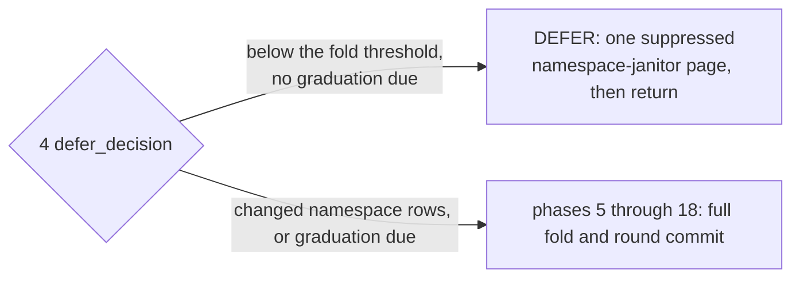
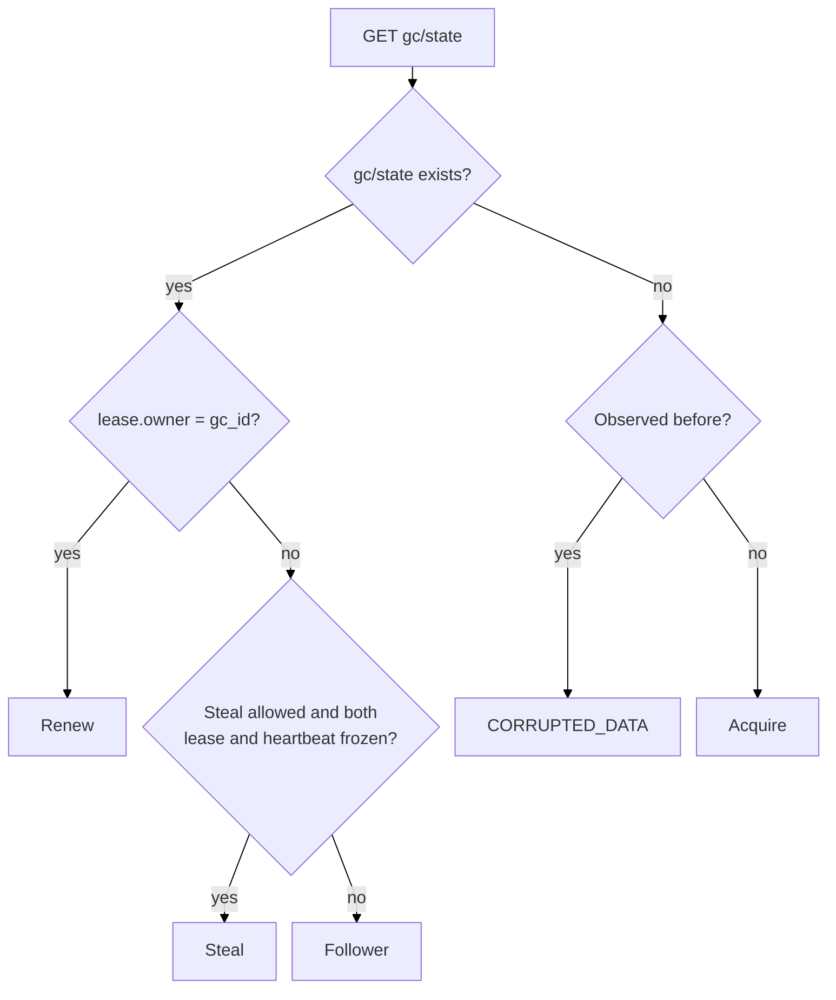

# CAS architecture — garbage collection {#garbage-collection}

## GC model {#gc-model}

`GC` is the only place in `CAS` that ever deletes a blob body, and the only reachability-driven
deleter of manifest bodies (a writer may exact-delete its own never-precommitted staged manifests
when it abandons a transaction, and `SYSTEM CAS DROP POOL MEMBER` sweeps a dead member's manifest
debris; neither consults in-degree). It runs as a
background, lease-paced loop per mount (`Gc::runRegularRound`, `Gc/CasGc.cpp`), folding ref-log
history into blob in-degree, condemning what reaches zero, and deleting only after that
condemnation has survived a full extra round. Each call to `Gc::runRegularRound` is one round
execution. It first processes the `GC` lease by creating, renewing, observing or stealing it, then
either returns as a follower, defers the fold when no destructive decision is due, or folds ref-log
history into a new in-degree snapshot and publishes it.

The [`cas_gc_interval_sec`](/antalya/cas/configuration#disk-settings) disk setting controls the
normal interval between background round executions (60 seconds by default). It is a scheduler
cadence, not a limit on the duration of one round execution. Round duration depends on the amount
of ref-log, manifest, candidate, and cleanup work and on the configured per-round work budgets. A
manual `SYSTEM CAS GC RUN` can request a round execution without waiting for the interval.

This page covers leadership, the round's 18 phases, condemnation and deletion, sharding, pruning,
round cost, and observability. Manifest and ref mechanics that `GC` folds are covered on the
[manifests-and-refs page](/antalya/cas/architecture/manifests-and-refs); the writer-versus-`GC`
race over one blob is covered on the
[blob-protocol page](/antalya/cas/architecture/blob-protocol#writer-gc-race).

## The round {#the-round}

A folding round execution is one pass of 18 named phases ending in exactly one commit `CAS` over
`gc/state` (`Gc::runRegularRound`, `Gc/CasGc.cpp`). Every round execution starts with phase 1, but a
follower or a deferred round execution returns before that commit.

| # | Phase (`GcPhaseTimer` name) | Runs on | What it does |
|---|---|---|---|
| 1 | `lease` | always | Create, renew, observe or steal the lease inside `gc/state`. The only phase a `NotALeader` round emits |
| 2 | `pre_fold_ref_drain` | leader | Resolve catalog `Removing` rows whose cleanup evidence the adopted parent already sealed; drop the completed ones before defer or new fold work |
| 3 | `heartbeat_floor` | leader | One `LIST` of `gc/server-roots/`, one `GET` per mount slot, fence-out `PUT` for any mount whose write-token has held stable past the threshold |
| 4 | `defer_decision` | leader | One full `LIST` of `cas/ns/stream/`, build the catalog-keyed ref walk plan; decide `DEFER` (fewer changed rows than the fold threshold, no graduation due, defer limit not reached) or continue to a full fold |
| 5 | `parent_seal_read` | fold | Capture the parent fold seal's run references before the fold mutates the in-memory generation/attempt |
| 6 | `fold_ref_group` | fold | Regroup the one `LIST` from phase 4 into per-namespace listings — no I/O, the keys are already in hand |
| 7 | `fold_seal_read` | fold | `GET` and decode the adopted fold seal that anchors this fold's coverage |
| 8 | `fold_ref_intake` | fold | `GET` every new ref-log record and every referenced manifest, extracting blob source edges |
| 9 | `fold_reduce` | fold | Merge prior edges, new deltas and the parent's condemned rows: spare, condemn, graduate or redelete each candidate; compute `suppress_destructive` |
| 10 | `fold_seal_write` | fold | Write the new fold seal once, write-once deterministic, adopting a byte-identical replay instead of rewriting it |
| 11 | `pending_deletes` | fold | The single blob-body delete site: exact-token delete of entries a *previous* round marked `delete_pending`, up to the redelete budget, plus the outcome-log writes |
| 12 | `meta_pool_wait` | fold | Drain the bounded pool of async `.meta` condemn-marker writes queued during the fold |
| 13 | `round_commit` | fold | Retention-prune old generations, then publish the single `gc/state` `CAS` that adopts the whole round |
| 14 | `handoff_reclaim` | post-`CAS` | Reclaim a generation a ref moved off during this round, which the ordinary retention prune already skipped and will not revisit |
| 15 | `manifest_deletes` | post-`CAS` | Delete manifest bodies whose owner-removal minus-one edge the `CAS` in phase 13 just adopted |
| 16 | `namespace_cleanup` | leader; suppressed on `DEFER` | One bounded page of the perpetual namespace janitor, reclaiming dead-life debris |
| 17 | `ref_object_cleanup` | post-`CAS` | Prune ref logs and snapshots once both fold coverage and a live snapshot make them safe to delete |
| 18 | `orphan_sweep` | post-`CAS` | Exact-token deletion for the [orphan-manifest sweep](/antalya/cas/architecture/manifests-and-refs#orphan-sweep), after phase 13 adopted each candidate's blob-source retirements and the cursor |

Phases 2 through 4 run on every leader round; a follower returns after phase 1. Phases 5–15 and
17–18 run only when phase 4 decides to fold; phase 16 runs after phase 15 on a fold and right after
phase 4 on a `DEFER`. A `DEFER` verdict is therefore not a bare no-op: it still runs one bounded
namespace-janitor page with `suppress_destructive = true` — listing and classification only, no
deletes and no cursor advance — and then returns, publishing no fold artifact and no commit `CAS`.
Its lease `CAS` may already have created or renewed the lease in phase 1:

Orderings that are load-bearing:

- **2 before 4** — a row proved complete by the adopted parent is resolved before `DEFER` or any
  successor plan can publish.
- **15 after 13** — manifest bodies are deleted only after the `CAS` adopted their decrements.
- **13's prune before the `CAS`** — a pre-`CAS` destructive action may rely only on already-
  published state.

**Clamp suppression.** `suppress_destructive = !anomalies.empty() || !carried_holds.empty() ||
!frontier_complete` is computed once and threaded into the merge, current-life ref cleanup and the
perpetual namespace janitor, so they cannot desynchronize. Under suppression there is no
graduation, no redelete, and no ref or namespace deletion; condemnation and sparing continue,
because both are non-destructive.

**Fail-closed aborts.** A throw before the commit `CAS` means no successor state is adopted (the
exact-token deletes and prune that earlier phases justified from *previously* published state may
already have run; they are idempotent): unapplied transactions and a cursor/apply mismatch (both
`CORRUPTED_DATA`, checked between phases 9 and 10), a missing adopted seal, a table with a snapshot
but no surviving log and no cursor, a non-total condemned summary (all `CORRUPTED_DATA`), and an
observed delete marker (`LOGICAL_ERROR`: bucket versioning is on). The per-phase "fails the round
if" lists below name the protocol checks; an uncaught backend or decode exception fails the round
execution too.

## Phase 1 — lease {#phase-1-lease}

Establishes whether this GC may run the round. There is no separate lease object: the lease lives
inside `gc/state` as `{owner, seq}`, and a round is authorized by winning a token-guarded `CAS` on
that object.

- **Runs on:** always — the only phase a `NotALeader` round emits
- **Reads:** `gc/state`; `gc/hb` (only when another GC owns the lease)
- **Writes / deletes:** one successful `CAS` on `gc/state` (acquire, renew or steal); a conflict is
  re-observed and re-decided by the request engine within the standard 90-second write policy; no
  deletes
- **Safety:** the lease is *work de-duplication, not mutual exclusion* — see below
- **Fails the round if:** this `Gc` instance saw `gc/state` before and it has since disappeared, or
  the `gc_shards` in `gc/state` disagrees with the pool's `_pool_meta` value (both `CORRUPTED_DATA`)
- **Observability:** phase row `lease`; metrics `acquired`, `steal_allowed`

**Acquire / renew.** If `gc/state` is absent and never seen, this GC creates it with `owner = gc_id`,
`seq = 1`, and fixes `gc_shards`. If `lease.owner` is already this `gc_id`, it increments `seq` with
a token-guarded `CAS`. Non-lease fields are always preserved; a conflict causes a bounded re-read.

**Follower / steal.** If another GC owns the lease, this GC reads `gc/hb` and normally returns
`NotALeader`. The leader advances an advisory `gc/hb` object; the heartbeat proves activity but
grants no authority. A candidate compares `(lease.owner, lease.seq)` and the `gc/hb` writer/sequence
against what it recorded on its *previous* scheduled round. If either signal moved, the owner is
live and the candidate records a fresh observation and backs off. A steal is allowed only when both
signals stayed frozen across two paced observations; the candidate then rewrites `lease.owner`,
increments `seq`, and `CAS`es. A conflict is re-observed and re-decided; if the refreshed state
shows a live incumbent the steal declines and returns `NotALeader`. A new process has no
recorded observations, so it can never steal on first sight. A manual `SYSTEM CAS GC RUN` may
acquire or renew but never steals.

**The `CAS` token.** Acquire / renew / steal return the `gc/state` version's backend token; phase 13's
commit `CAS` uses it, so any intervening write to `gc/state` rejects a stale leader's commit. The
resulting `lease.seq` is the folding round's attempt id.

**Safety after leadership changes.** A deposed leader may keep running; correctness does not need
exclusive execution:

1. a folding round is published by exactly one commit `CAS` — a deposed leader's commit fails and
   its candidate generation is never adopted;
2. every fold artifact is written under that leader's own attempt number, invisible to readers and
   reclaimed by generation pruning;
3. destructive pre-`CAS` actions are justified only by previously published durable state, so they
   are replay-idempotent;
4. deletes are exact-token, so a stale leader can never delete a newer incarnation.

## Phase 2 — pre-fold ref drain {#phase-2-pre-fold-ref-drain}

Finishes namespace removals that the last committed fold already proved safe: removes the matching
`Removing` row from the ref catalog. Removal is split across rounds — one fold writes
`cleanup_evidence` into its seal, a *later* round's phase 2 acts on it — so phase 2 never trusts
evidence from the fold running now.

- **Runs on:** always (leader), including on a round that later returns `Deferred`
- **Reads:** the adopted fold seal (`ref_lives` coverage + `cleanup_evidence` only); the ref
  catalog; `gc/state` (leadership re-check around every write)
- **Writes / deletes:** rewrites the ref catalog via `CAS` to drop each eligible row (not a backend
  `DELETE`); no blob, manifest or namespace-object deletes
- **Safety:** a row is dropped only if the adopted parent seal carries `cleanup_evidence` for the
  *same* `incarnation` and that life has no coverage hold; each write is token-guarded and bracketed
  by two `gc/state` re-reads
- **Fails the round if:** `gc/state` points at a missing parent seal (`CORRUPTED_DATA`); leadership
  changes mid-drain (`NETWORK_ERROR`, an `Aborted` finish that the next round retries — a write
  already sent stays safe, authorized by the parent seal and the catalog token)
- **Observability:** phase row `pre_fold_ref_drain`; metric `deleted` (rows removed)

On a fresh pool (`snap_generation = 0`) phase 2 is a no-op that still emits its phase row; it can
first remove a row only in a leader round *after* some earlier fold committed a generation. Phase 3
starts only once every parent-authorized removal has been resolved — phase 2 is a barrier. Phase 16
later deletes the old namespace's physical `_log` / `_snap` / `_ckpt` / `_files` objects.

## Phase 3 — heartbeat floor {#phase-3-heartbeat-floor}

Checks each mounted writer for liveness and fences any writer incarnation that stopped renewing its
mount lease. Despite the name it does not touch `gc/hb` (that is phase 1); it watches the backend
token of each `mount` object.

- **Runs on:** always (leader), fold and deferred paths
- **Reads:** `LIST` of `gc/server-roots/`, then a `GET` of each `<server_root_id>/mount`
- **Writes / deletes:** a token-guarded `PUT` per fenced mount (`gc_fenced = true`, `seq + 1`); no
  deletes
- **Safety:** fences only after this leader's *own* monotonic clock has watched the mount's
  write-token hold unchanged for `cas_mount_lease_ttl_ms + 5% + cas_mount_renew_period_ms`
  (defaults 30 s and 10 s; every server sharing the pool must run the same values); the write is
  guarded by that exact token. A completed fence-out stays valid even if this GC later loses
  leadership. `expires_at_ms` (another host's wall clock) is never trusted.
- **Fails the round if:** nothing — a per-mount `PUT` conflict is re-observed and re-classified
  within the standard write policy, and a mount whose incarnation moved is classified `live`
- **Observability:** phase row `heartbeat_floor`; metrics `live`, `terminated`, `fenced_now`,
  `already_fenced`; `GcFenceOut` audit rows in `system.cas_log`

The first observation of any mount is always `live`; a new `Gc` instance starts with an empty
observation map, so it can only delay a fence-out, never do one early. A mount with
`min_active = UINT64_MAX` is a clean farewell (`terminated`). Results feed metrics and events only —
phase 4 takes no input from them.

## Phase 4 — defer decision {#phase-4-defer-decision}

Builds the round's one ref-stream work plan and decides `fold` vs `defer`. `fold` continues to
phase 5 and builds a new in-degree snapshot; `defer` skips generation construction and the commit.

- **Runs on:** always (leader)
- **Reads:** one full `LIST` of `cas/ns/stream/` (key names only); the ref catalog; the adopted fold
  seal (twice, on an adopted generation)
- **Writes / deletes:** none
- **Safety:** a missing / invalid / incomplete adopted seal cannot produce a quiet defer — the
  graduation check refuses to defer and the plan read surfaces the bad state
- **Fails the round if:** the plan-building seal read reports an invalid adopted seal
- **Observability:** phase row `defer_decision`; metrics `changed_shards` (despite the name, the
  number of changed namespace-life rows), `namespaces_seen`, `ref_log_keys_listed`

The plan has one row per admitted catalog life (`Live` or `Removing`; `Creating` excluded), joining
its last folded position, its greatest listed `_log` position, and the keys later phases need. A row
is *changed* when the listed `_log` is newer than the last folded position. Phase 4 chooses `fold`
if any of: changed rows ≥ `gc_fold_threshold` (default 1); an adopted shard has a published pending
delete; an adopted shard has a condemned blob due to graduate
(`oldest_nonpending_condemn_round < round + 1`); or `gc_fold_max_defer_rounds` (default 8)
consecutive defers were reached. Both thresholds are internal `PoolConfig` fields, not disk
settings. On `defer`, one suppressed namespace-janitor page runs (phase 16's work) and the round
returns without a commit. On `fold`, phase 6 reuses this plan and the same `LIST`.

## Phase 5 — parent seal read {#phase-5-parent-seal-read}

Copies the *previously* adopted fold seal's run references into memory before the new fold can
overwrite them. "Parent" is the prior GC state the new one builds on, not a key-hierarchy parent.

- **Runs on:** fold path only
- **Reads:** the adopted fold seal (its run-reference list only, never the run objects)
- **Writes / deletes:** none
- **Safety:** read-only; a stale leader's saved list only feeds decisions its own commit `CAS` gates
- **Fails the round if:** the seal is unreadable — a seal that vanished after phase 4 yields an
  empty list here, and phase 7 re-checks and reports `CORRUPTED_DATA` before the commit
- **Observability:** phase row `parent_seal_read`

An adopted seal can reference a run stored under an older generation, and the new fold may replace
that run and stop referencing its old generation. Keeping the parent's references lets phase 13
shield those generations from retention pruning if the commit loses, and lets phase 14 reclaim a
generation the parent referenced but the new seal no longer does. Empty on a fresh pool.

## Phase 6 — fold ref group {#phase-6-fold-ref-group}

Regroups phase 4's flat key list into per-namespace listings against the catalog cut phase 4 read.
No backend I/O.

- **Runs on:** fold path only
- **Reads:** nothing (keys already in memory from phase 4)
- **Writes / deletes:** none
- **Safety:** the fold is catalog-authoritative — a namespace exists iff the catalog cut names its
  incarnation; the `LIST` is only a per-namespace hint
- **Fails the round if:** a ref-object key under the stream prefix is unparseable — the round aborts
  the ref walk, produces no ref delta, advances no cursor, records the `ref_folding_aborted`
  anomaly, and forces `suppress_destructive` for the whole round (not re-raised)
- **Observability:** phase row `fold_ref_group`; metrics `ref_keys_listed`, `namespaces_seen`,
  `ref_folding_aborted`

Also computes an empty-universe proof (catalog snapshot has a token and zero entries of any state)
used by phase 9's destructive gate. A malformed key does not skip phase 8's `_ckpt` reads.

## Phase 7 — fold seal read {#phase-7-fold-seal-read}

Reads the adopted fold seal that anchors this fold's coverage and sets up the fold's base state (the
prior coverage view, the mutable successor, the new generation / attempt numbers).

- **Runs on:** fold path only
- **Reads:** the adopted fold seal, twice at the same address. The first read serves only the
  missing-seal check below; the second supplies the parent run references and the condemned
  summary. The second is a known redundant `GET` (same generation, attempt and bytes), counted by
  the `redundant_reads` metric and left in place until a follow-up removes it (see
  [per-phase backend cost](#per-phase-cost))
- **Writes / deletes:** none
- **Safety:** read-only
- **Fails the round if:** the adopted seal is absent while `snap_generation > 0` — `gc/state` points
  at a missing artifact; the fix is `SYSTEM CAS GC REBUILD` (`CORRUPTED_DATA`)
- **Observability:** phase row `fold_seal_read`; metrics `parent_ref_lives`, `parent_runs`,
  `parent_cleanup_evidence`, `redundant_reads`

The fold's writes land under `attempt = lease.seq` and `new_generation = snap_generation + 1`, while
reads of the parent generation keep using `snap_attempt`. On a fresh pool both reads return nothing
and the fold starts from an empty baseline.

## Phase 8 — fold ref intake {#phase-8-fold-ref-intake}

Reads every new ref-log record of every walkable namespace and the manifests it references,
extracting blob source edges. Usually the dominant read phase on ref-log- and manifest-heavy rounds.

- **Runs on:** fold path only
- **Reads:** one `_ckpt` per namespace in the universe; `_log` records from each namespace's cursor
  up to its committed ceiling; one manifest body per folded owner edge; extra `_log` reads when the
  walk crosses an epoch seal
- **Writes / deletes:** none (the successor seal's `cleanup_evidence` rows are written between this
  phase's timer and phase 9's)
- **Safety:** per-namespace failures stay per-namespace — a *hold*, never a whole-round abort. A
  concurrent writer appending mid-round changes nothing: the ceiling (`committed_through`) is
  snapshotted once, so the round folds a fixed amount of work. Transactions apply atomically; the
  durable cursor advances once per fully folded record.
- **Fails the round if** (`CORRUPTED_DATA`): a manifest body whose ref / namespace disagrees with its
  key; a table with no sealed cursor whose baseline logs are already gone; a sealed cursor that does
  not close the run the walk produced; a `RemoveNamespace` for a namespace absent from the catalog
  cut. (`logs_accounted` and `logs_applied` are counted here but compared only after phase 9 — see
  there)
- **Observability:** phase row `fold_ref_intake`; metrics `frontier_namespaces` / `frontier_proven`
  (universe and its proven part), `tables_held`, `logs_accounted` / `logs_applied`; per-cause hold
  reasons are in [GC anomalies](#gc-anomalies)

**The universe** is exactly the `Live` and `Removing` rows of the frozen catalog cut. A namespace
the phase-4 hint omitted, with no carried hold and no `_ckpt`, is walked only while
`gc_frontier_probe_budget` lasts; once spent, the rest ride their cursors verbatim and the round is
suppressed. **The walk** starts at `cursor + 1` (or the checkpoint's genesis position) and stops at
the committed ceiling; a namespace is *proven* only when it reaches the ceiling exactly. Any other
exit — a hold, an unusable checkpoint, the probe budget — leaves it unproven, which feeds phase 9's
gate.

**Read-ahead.** The checkpoint, walk-position, manifest-edge and (in phase 9) zero-candidate `HEAD`
reads are hinted ahead onto a bounded pool (`cas_gc_io_concurrency`, default 16; `1` runs the reads inline) and
taken by the walk at exactly the sites, and in exactly the order, of the inline reads, so every
decision, decode, counter and event stays on the round thread and the phase's semantic metrics do
not depend on the setting. Two things do: a request a worker performed lands on that worker's
`ProfileEvents`, not the phase row's, and a hinted key the walk never takes (a namespace held below
its lookahead, a `HEAD` candidate that kept an edge) is a wasted request. `CASGCReadAheadHit` and
`CASGCReadAheadMiss` are charged to the phase that takes the result; `CASGCReadAheadWasted` is
counted when the reader is destroyed after phase 10, so it shows up in the round-level
`ProfileEvents`, not on the phase-8 or phase-9 row.

## Phase 9 — fold reduce {#phase-9-fold-reduce}

Recomputes the per-shard in-degree snapshot and computes the round's single destructive gate.

- **Runs on:** fold path only
- **Reads:** streaming `GET` of each referenced parent run segment; one `HEAD` per zero-in-degree
  candidate; one `.meta` `GET` per graduation candidate lacking in-process marker confirmation. When
  orphan-sweep planning runs: a `LIST` page of `cas/manifests/`, a `GET` per candidate, plus
  `gc/state`, the adopted seal, the catalog, and per-namespace `_ckpt` / tail `_log`.
- **Writes / deletes:** one `PUT` per rewritten run segment; schedules the async `.meta` condemn
  markers (drained by phase 12). No deletes.
- **Safety:** `suppress_destructive` is computed once here and read at every destructive site of the
  round; a *pure carry* shard (no delta, no orphan retirement, no parent condemned rows) copies the
  parent's run references with zero run I/O
- **Fails the round if** (`CORRUPTED_DATA`): during orphan-sweep planning, a candidate manifest whose
  decoded identity disagrees with its key. Two invariant checks then run after this phase's timer
  and before phase 10's: `transactions_unapplied` (a folded transaction whose deltas reached no
  shard reducer) and `logs_accounted ≠ logs_applied` (the round sealed coverage over more logs than
  it fully folded); either is `CORRUPTED_DATA`
- **Observability:** phase row `fold_reduce`; metrics `shards_reduced` / `shards_pure_carry`,
  `condemned`, `graduated`, `spared`, `redelete_pending`, `suppress_destructive`, `frontier_complete`

`suppress_destructive` is true on any recorded anomaly, any hold in the seal about to be made
durable, or an incomplete frontier (`frontier_proven ≠ frontier_namespaces`, a universe neither
non-empty nor proved empty, or a universe policy that is not authoritative). Under it the round
still condemns, spares and carries, but graduation, redelete, orphan-sweep planning and cursor
adoption, retention prune, hand-off reclaim, manifest deletes and ref-object cleanup do not run,
and namespace cleanup lists and classifies one page without deleting or advancing its cursor. Per
candidate the merge decides one of: `spare`, `condemn`, `supersede`, `graduate` (→
`delete_pending`, deleted by phase 11 of a later round), `redelete` (→ deleted by phase 11 now),
`carry`. The round-wide `GcRoundWorkBudget` (one struct, fed from the `cas_gc_round_*` settings,
`0` = unbounded) caps graduations and redeletes here — their overflow is carried unchanged — and
the other work families of phases 9 (sweep planning), 11 (outcome-log entries, whose overflow is
simply not logged), 13, 14 (one-shot, see there) and 17 (recomputed next round). Phase 18's
volume is bounded by `cas_manifest_sweep_delete_budget_keys` through phase 9's planning.

## Phase 10 — fold seal write {#phase-10-fold-seal-write}

Validates, encodes and writes the new fold seal with one write-once `PUT`.

- **Runs on:** fold path only
- **Reads:** one byte-compare `GET` only on a deterministic replay
- **Writes / deletes:** one write-once `PUT` of the new `fold_seal`; no `CAS`, no deletes
- **Safety:** the seal is deterministic — the same fold inputs produce byte-identical bytes. A
  byte-equal occupant is this leader's own crash / replay and is adopted with no rewrite; a deposed
  leader writes under its own unadopted attempt and never collides with the adopted seal.
- **Fails the round if:** a divergent-bytes occupant (impossible under correct operation)
  (`CORRUPTED_DATA`)
- **Observability:** phase row `fold_seal_write`; metrics `seal_bytes`, `seal_runs`,
  `seal_ref_lives`, `seal_cleanup_evidence`

The seal's existence marks the fold complete; `snap_generation` / `snap_attempt` are advanced *in
memory* here and made durable only by phase 13's commit `CAS`.

## Phase 11 — pending deletes {#phase-11-pending-deletes}

The round's single blob-body delete site, before the commit `CAS`: executes the exact-token blob
deletes for entries a *previous* round published as `delete_pending`, processing up to
`cas_gc_round_redelete_budget` entries per round (the excess is carried unchanged), and writes the
forensic outcome logs.

- **Runs on:** fold path only
- **Reads:** one `HEAD` per `redelete` entry — the persisted condemned token cannot itself be a
  precondition, so the round observes the blob first, which also settles the absent case without
  spending a conditional delete
- **Writes / deletes:** a `DELETE` conditional on the observed etag for each `redelete` entry whose
  live etag matches the condemned token; one write-once outcome log per shard with settled entries
- **Safety:** an entry is deletable only because a previously committed fold seal published it
  `delete_pending` — durable state from an earlier commit, safe at any leader staleness. Exact token
  means a stale leader cannot delete a fresh incarnation; `NotFound` and `TokenMismatch` are
  tolerated. This round's own commit outcome does not affect the delete's safety.
- **Fails the round if:** a backend delete marker appears in a response — object versioning on a
  mis-provisioned pool (`LOGICAL_ERROR`)
- **Observability:** phase row `pending_deletes`; metrics `deleted`, `absent`, `redeleted`,
  `graduated`, `replaced`, `spared`, `outcome_logs_written`

Under `suppress_destructive` the `redelete` set is empty by construction, so nothing is deleted, and
there is no graduation either (would-be graduates are carried unchanged); sparing and superseding
still happen. An outcome log is written only for a shard that collected at least one budget-admitted
redelete or spare outcome. The `RoundReport` counters `deleted`, `absent`, `replaced` and `spared`
are tallied from the durable outcome logs, not the local decisions; `redeleted` counts the
`redelete` entries processed, whether or not a `DELETE` was sent.

## Phase 12 — meta pool wait {#phase-12-meta-pool-wait}

A durability barrier: drains the round's batch of async per-hash `.meta` writes (the `Condemned`
markers scheduled by phases 9 and 11, plus phase 11's meta deletes) before the commit `CAS`.

- **Runs on:** fold path only
- **Reads / writes:** none on the GC thread; waits on the bounded `meta_pool`
  (`cas_gc_meta_pool_size`, default 16)
- **Safety:** a writer's meta point-read gate must see this round's condemns durable no later than
  the ledger they pair with. A throwing round's `SCOPE_EXIT` still drains the same pool, so no jobs
  run into the next round.
- **Fails the round if:** a `ThreadPool` framework failure (per-hash operation exceptions are caught
  inside the meta writer)
- **Observability:** phase row `meta_pool_wait`; job counts `jobs_scheduled`,
  `jobs_completed_on_entry`, `jobs_completed` (the `ProfileEvents` map is empty — work runs off the
  GC thread)

## Phase 13 — round commit {#phase-13-round-commit}

The commit boundary: a pre-`CAS` retention prune of old generations, then the single commit `CAS`
over `gc/state`. One phase because the prune is only safe as a pre-`CAS` action.

- **Runs on:** fold path only
- **Reads / writes:** `LIST` + wholesale `DELETE` of pruned generation prefixes; exactly one `CAS`
  on `gc/state`
- **Safety:** the prune skips any generation still referenced by the parent seal (phase 5) or the
  new seal — this is what stops a losing leader's prune from destroying what the winner's seal still
  points at. `snap_pruned_through` still advances past a skipped generation (phase 14 reclaims it
  later). `suppress_destructive` skips the prune entirely. The commit `CAS` uses phase 1's token, so
  a stale leader's commit is rejected.
- **Fails the round if:** the commit `CAS` is not `Committed` — a precondition conflict is
  `ABORTED` ("gc/state moved during the round"), a backend or deadline failure keeps its own code;
  the round publishes nothing and a transient code finishes as `Aborted`, keeping leadership (see
  [round outcomes](#round-outcomes))
- **Observability:** phase row `round_commit`; metrics `generations_visited`, `pruned_through`,
  `generations_referenced`, `round`, `generation`

Prune bound: keep the last `cas_gc_snapshot_generations_to_keep` generations (default 3; `0` keeps
everything), at most 64 prefixes a round. See [the one-pass commit](#gc-state) for the fold seal's
role as the coverage record.

### Post-commit failures {#post-commit-failures}

After a `Committed` result the round is committed — an exception in phases 14–18 does not un-commit
it. Those phases tolerate the object outcomes they name (`NotFound`, `TokenMismatch`), but only
phase 16 is wrapped in a catch-all; a backend or decode exception in phases 14, 15, 17 or 18
propagates, and `system.cas_gc_log` then records an `Aborted` or `Error` finish (see
[round outcomes](#round-outcomes)) for a round whose new `gc/state` is already durable. Read such a
row as "committed round, failed tail": the next round starts from the committed state, and what
the tail did not delete is picked up later — by the orphan sweep for phase 15's leftovers, by
phase 17's recomputed plan, and for phase 18 only once the sweep cursor (already advanced by phase
13) wraps around the manifest keyspace — or, for phase 14 only, left to `cas-fsck`.

## Phase 14 — handoff reclaim {#phase-14-handoff-reclaim}

First phase of the post-`CAS` tail (phases 14–18 run only after a successful commit). Deletes, up to
its own object budget, a generation prefix that the retention prune already reached and skipped
(still referenced) while its cursor advanced past it, now that a ref has moved off it this round.

- **Runs on:** post-`CAS` (fold path)
- **Reads / writes:** paginated `LIST` + one `DELETE` per listed object, per handed-off generation
  prefix
- **Safety:** reclaims only when the parent seal referenced the generation, the new seal does not,
  it is already behind `snap_pruned_through`, `suppress_destructive` is false, and the phase's own
  budget (separate from phase 13's) is not exhausted
- **Fails the round if:** no protocol check of its own; a backend `LIST` / `HEAD` / `DELETE`
  exception propagates (see [post-commit failures](#post-commit-failures))
- **Observability:** phase row `handoff_reclaim`; metrics `generations_reclaimed`,
  `objects_reclaimed`, `suppressed`

Unlike every other gated site, suppression here *loses* the reclaim rather than postponing it: the
ref moved off this round, nothing revisits, and the prefix is left to `cas-fsck`. A crash in this
window, or a budget that runs out before the prefix is fully drained, leaks the same way
(`generations_reclaimed` counts the generation even when only part of it was deleted).

## Phase 15 — manifest deletes {#phase-15-manifest-deletes}

Deletes owner-removed manifest bodies, now that phase 13's `CAS` adopted their minus-one decrements.

- **Runs on:** post-`CAS` (fold path)
- **Reads / writes:** batch `DELETE` of the manifest keys collected by phase 8's fold of `-1` owner
  edges, in chunks of `cas_gc_bulk_delete_chunk_keys` (default 1000, the backend maximum). A manifest
  key is write-once, so the delete carries no per-key precondition; an absent key is simply gone. A
  backend without a batch-delete verb (GCS) falls back to one admitted `DELETE` per key.
- **Safety:** each body is unreachable from any live ref (its owner-removal was folded and
  committed) and is never re-derived — the intake cursor that found the `-1` edge is now committed,
  so a folded log is never revisited. Hence the phase is unbudgeted by design and drains the whole
  set each run.
- **Fails the round if:** no protocol check of its own; a chunk that exhausts its retry policy
  throws (see [post-commit failures](#post-commit-failures)). Deletion and recording are
  all-or-nothing per request: the chunks before the failing one are recorded, the failing chunk's
  keys are not, and a key one of its attempts did delete shows up as already gone in the next fold
- **Observability:** phase row `manifest_deletes`; metrics `attempted`, `accepted` (keys recorded
  as deleted or absent), `requests` (one per chunk, or the failed bulk call plus one per key on the
  fallback), `suppressed`; one `ManifestDelete` row per key in `system.cas_log`

Only a crash, `suppress_destructive` or a chunk that exhausted its retries leaves an entry — it is
then picked up by the orphan-manifest sweep (phase 18).

## Phase 16 — namespace cleanup {#phase-16-namespace-cleanup}

One bounded page of the perpetual namespace janitor: deletes the physical objects of namespace lives
no longer in the catalog (dead-life debris).

- **Runs on:** fold path here; also on the deferred path right after phase 4 with
  `suppress_destructive` forced on
- **Reads:** the durable `janitor_cursor`; one `LIST` page (≤ 1000 keys) of `cas/ns/`; a fresh
  ref-catalog snapshot; `gc/state` per fence re-check
- **Writes / deletes:** exact-token `DELETE` per dead-life `_log` / `_snap` / `_ckpt` / `_files`
  object; one `CAS` on the maintenance state when the page is decided
- **Safety:** each delete is under a GC fence re-check (`lease.owner` / `lease.seq`) before it and
  once at the end; the incarnation segment in every key makes an old life's objects structurally
  unreachable from a reborn same-name namespace, so a missed key can only leak storage, never expose
  it
- **Fails the round if:** nothing — the whole page is wrapped in a catch-all ("namespace janitor
  skipped this round")
- **Observability:** phase row `namespace_cleanup`; metrics `janitor_pages`, `janitor_keys`,
  `janitor_deleted`, `leaked`

The cursor advances only when the whole page was decided under a held fence and an unambiguous
catalog; under suppression it lists and classifies but deletes nothing and does not advance.

## Phase 17 — ref object cleanup {#phase-17-ref-object-cleanup}

Deletes the `_log` / `_snap` objects of **live** namespace lives once fold coverage and a
checkpoint-named recovery triple make them safe. Distinct from phase 16, which handles lives absent
from the catalog.

- **Runs on:** post-`CAS` (fold path)
- **Reads:** per namespace, the checkpoint-named recovery triple (same-id `_log`, predecessor seal,
  `_snap`) to validate deletion authority; then, before *every chunk*, a fresh ref catalog and
  `gc/state` (authority re-validation). No `HEAD`: `_log` / `_snap` keys are write-once, there is
  nothing to re-observe
- **Writes / deletes:** batch `DELETE` of the planned `_log` / `_snap` keys in chunks of
  `cas_gc_bulk_delete_chunk_keys` (one admitted `DELETE` per key on a backend without batch
  delete); the checkpoint-named snapshot is always retained
- **Safety:** before each chunk, re-validates: ref-catalog token still equals the fold's catalog
  cut, same row and life, unchanged GC fence. The first failure stops the whole pass. The
  per-round `cas_gc_round_ref_cleanup_budget` cap counts objects and cuts a chunk to what remains;
  on exhaustion the same candidates are recomputed next round.
- **Fails the round if:** no protocol check of its own — `suppress_destructive` returns immediately
  (a clamp could leave a covered log whose delta is not yet durable); an authority re-validation
  error or a namespace whose recovery triple does not validate stops the pass or skips that
  namespace, but a chunk delete that exhausts its retry policy propagates (see
  [post-commit failures](#post-commit-failures))
- **Observability:** phase row `ref_object_cleanup`; metrics `namespaces_planned`, `suppressed`,
  `trim_enabled`; `ProfileEvent` `CASRefCleanupObjectsDeleted`

## Phase 18 — orphan sweep {#phase-18-orphan-sweep}

The last phase: executes the [orphan-manifest sweep](/antalya/cas/architecture/manifests-and-refs#orphan-sweep)
planned in phase 9 and adopted by phase 13's `CAS`.

- **Runs on:** post-`CAS` (fold path)
- **Reads / writes:** one `HEAD` per nomination, then a `DELETE` conditional on the observed etag
  when it matches the nominated token (planning `LIST` / `GET` cost was paid in phase 9); an absent
  body sends no `DELETE`
- **Safety:** phase 9 exact-read and identity-validated each candidate and computed its source-edge
  retirements; phase 13's `CAS` adopted both those retirements and the sweep cursor, so a post-`CAS`
  body delete cannot orphan a still-reachable edge. A manifest is deletable only once its epoch's
  closing seal is consumed and no tail record above the cursor names it; any uncertainty retains.
- **Fails the round if:** a `TokenMismatch` — an immutable manifest identity must never change token
  (illegal ABA); stricter than every other post-`CAS` delete (`CORRUPTED_DATA`)
- **Observability:** phase row `orphan_sweep`; metrics `listed`, `floor_lookups` / `floor_reads`
  (mount-floor lookups per namespace and the reads they cost), `deleted`, `skipped`,
  `undecodable`, `cursor_advanced`, `suppressed`, and the retained share of `skipped` by reason:
  `retained_no_coverage`, `retained_hold`, `retained_unconsumed_seal`, `retained_tail_removal`
  (candidates retained because the sweep's work budget ran out are reported only in the sweep's
  retention log line, not in `phase_metrics`)

Under `suppress_destructive` phase 9 planned nothing, so the nomination list is empty and the cursor
does not move.

## GC anomalies {#gc-anomalies}

A GC round records *anomalies* and per-namespace *holds* instead of failing, unless a fail-closed
check fires. Any anomaly or hold in the seal about to be made durable forces `suppress_destructive`
for the whole round (phase 9); condemnation and sparing still run. A hold clears only when a later
walk folds through the offending position. Each hold is recorded in `system.cas_log` as a
`GcFoldClamp` event with its reason; the round's aggregate anomaly count rides the `GcFoldEnd` event
and the `Finish` row of `system.cas_gc_log`. There are no per-anomaly rows.

**Durable per-namespace holds** — persisted in the fold seal under these wire names; the matching
`GcFoldClamp` event in `system.cas_log` carries a human-readable reason. Each holds one namespace
(all phase 8):

| Hold | Meaning | Effect |
|---|---|---|
| `gap_below_witness` | a committed record at or below the ceiling is missing | held |
| `unconsumed_seal_crossing` | an apparent epoch crossing has no consumed `EpochSeal` behind it | held |
| `witness_disappeared` | an epoch-crossing chase resolves back to the absent position | held |
| `body_undecodable` | a ref-log record exists at the walk position but its body cannot be decoded | held at that position |
| `manifest_body_missing` | a folded owner edge's manifest body is absent | held below that record; re-read next round |
| `checkpoint_undecodable` | a live/removing life's `_ckpt` is undecodable, absent, or lacks `life_epoch` | folds nothing; held at `cursor + 1` when the life has a sealed cursor |

**Per-round suppression signals** — not persisted; they force `suppress_destructive` for the
round. `ref_folding_aborted` and `frontier_unprobed_budget` are `phase_metrics`; the three
checkpoint states are counted only in the suppression log line's frontier-deficit breakdown:

| Signal | Phase | Meaning |
|---|---|---|
| `ref_folding_aborted` | 6 | a ref-object key under the stream prefix is unparseable: no ref delta, no cursor advance |
| `CheckpointUnusable` | 8 | in-memory frontier state for a `_ckpt` that could not be used, recorded even when there is no cursor position to hold at |
| `CheckpointFrontierEmpty` | 8 | a checkpoint carries no `committed_through` but the namespace has a nonzero sealed cursor: namespace unproven |
| `CommittedBelowCursor` | 8 | the sealed cursor is already above the committed ceiling: namespace unproven |
| `frontier_unprobed_budget` | 8 | `gc_frontier_probe_budget` ran out before every hint-less namespace was walked |

**Fatal pre-seal checks** — `CORRUPTED_DATA`, evaluated after phase 9 and before phase 10:
`transactions_unapplied` (a folded transaction's deltas reached no shard reducer) and
`logs_accounted ≠ logs_applied` (coverage sealed over more logs than were fully folded).

## The one-pass commit {#gc-state}

`<pool_prefix>/gc/state` is the durable safety and round-adoption state: `round`, `gc_shards`,
`snap_generation`, `snap_pruned_through`, `snap_attempt`, `manifest_sweep_cursor`, and the lease. A
folding round publishes it with exactly one commit `CAS` in phase 13, `round_commit`; the fold
itself performs no `CAS` of its own, and within a round execution phase 1's lease `CAS` over the
same object is the only other writer. Outside the round, `SYSTEM CAS GC REBUILD` replaces the
baseline with a `CAS` of its own.

**The fold seal *is* the coverage record**: generation, parent generation, one `ref_lives` row per
catalog-admitted opaque life (coverage plus optional cleanup evidence), references to the
source-edge run segments, and a per-shard condemned summary. It is encoded deterministically, so a
replayed round produces byte-identical bytes and adopts its own output through the
`putDeterministicArtifact` adoption pin (see the [blob-protocol page](/antalya/cas/architecture/blob-protocol#deterministic-artifacts)).
There is **no separate retired-list object** — condemned entries ride the source-edge run as
sentinel rows at `source_id = 0` — and **no run-file list outside the seal**; runs are resolved
*through* the seal's references, never by key construction.

## Finding orphans {#finding-orphans}

In-degree is a set of source edges, not a refcount. A blob becomes a candidate when its edge set
becomes empty and it was touched this pass: one `HEAD` captures the exact incarnation token and
size that a future delete will name. A blob merely carried from the parent run pays no `HEAD`.

**The grace period is measured in rounds, not acks:** an entry graduates once it has survived one
full round (`condemn_round < current_round`). The heartbeat floor is liveness only and **never**
gates graduation.

**The 404 rule for manifest edges.** When the fold reads a manifest for an owner edge, a body that is
present but invalid (bad encoding, or a ref / namespace that disagrees with its key) is
`CORRUPTED_DATA`, hard. A body that is missing is **never** a throw there — the fold records and
continues, and the caller decides by position: a precommit activation clamps as a barrier; a
committed or removal fold clamps only that table. Prunes and post-`CAS` deletes are likewise
fail-open on 404. Other objects have their own policy: an undecodable ref-log body or checkpoint
holds one namespace (`body_undecodable`, `checkpoint_undecodable`), an undecodable orphan-manifest
candidate is retained and counted, and a missing adopted fold seal fails the round (phases 2 and 7).

## Condemnation and deletion {#condemn-delete}

The `.meta` sidecar carries **no token** — it is a per-hash hint. The exact incarnation token lives
in the condemned sentinel row inside the run, together with the condemn round and two flags,
`delete_pending` and `marker_confirmed`. `GC`'s marker is add-only: `Clean → Condemned` yes, the
reverse never, not even when sparing — only a writer that has already displaced the body may clear
it. A blob whose in-degree reaches zero in round `n` is retired with `condemn_round = n`; it can
graduate to `delete_pending` in round `n+1` at the earliest and be deleted in round `n+2`, so a
minimum of two full rounds separate condemnation from deletion. `delete_pending` is never cleared in
place, but it authorizes a delete only while in-degree stays zero: a fresh edge folded in a later
round spares the entry and removes it from the retired pipeline (recovery wins, even past the
floor).

## Sharding {#sharding}

`cas_gc_shards` is fixed at pool creation and stored in `_pool_meta`; the first lease acquire copies
that authoritative value into `gc/state`, every later lease read throws `CORRUPTED_DATA` if the two
disagree, and decoders reject `0`. A blob routes by the **high** 64 bits of its digest, read
big-endian.

The role split is worth internalizing: the **coordinator** — the lease holder — owns discovery,
round visibility, the single global fence, and the generation advance, because a publish into
*one* namespace can protect a blob owned by *any* shard, so these span the whole universe and must
not be sharded. **Reducers** own only their disjoint shard; their run-key namespaces never
collide, so the design admits reducing different shards on different servers without a lease. The
current implementation does not do that: all shard reducers run sequentially on the lease holder's
fold thread, and the transaction-apply ledger relies on it.

A shard with an empty delta bucket, no orphan-sweep retirement routed to it, and no condemned
entries in the parent summary copies the parent's run references verbatim — zero run I/O, a "pure
carry" (see [phase 9](#phase-9-fold-reduce)). A missing parent summary entry on a non-fresh pool is
`CORRUPTED_DATA`, never silently treated as zero.

## Pruning old objects {#pruning}

- **Current-life ref logs and snapshots** (phase 17) — authority comes from the namespace's
  checkpoint-named, exact-validated recovery triple. A log is deletable only when covered by the
  durable fold cursor and older than that checkpoint (and not the retained predecessor seal);
  snapshots strictly older than the checkpoint-named snapshot are deletable, that snapshot itself is
  always kept. Keys are write-once, so there is no `HEAD`: the plan is chunked, each chunk is
  preceded by a catalog and `gc/state` re-validation and sent as one batch `DELETE`.
- **Generations** (phase 13) — keep the last `cas_gc_snapshot_generations_to_keep` (default 3; `0`
  means keep everything, for forensics). Pruning is wholesale: `LIST` the generation prefix and
  delete everything under it, including deposed-leader debris and attempt-scoped outcome sets. A
  generation still referenced by the live seal is skipped, but the cursor still advances past it —
  leak-freedom then rests on the post-`CAS` hand-off reclaim in phase 14.
- **Manifests** — owner-removed bodies delete in phase 15; never-precommitted bodies go through the
  [orphan-manifest sweep](/antalya/cas/architecture/manifests-and-refs#orphan-sweep) in phase 18.

## What a round costs {#round-cost}

Per **folding** round, with `N` live mounts, `S` ref tables and `S_changed` tables carrying new
logs:

| Operation | Count |
|---|---|
| `LIST cas/ns/stream/` | 1 full enumeration |
| `LIST gc/server-roots/` | 1, plus 1 `GET` per mount |
| `GET` the adopted fold seal | 6 on the fold path of an established pool (phases 2, 4, 5, 7); phase 9 orphan planning adds one more. See [per-phase backend cost](#per-phase-cost) |
| `GET` ref logs | 1 per new log record, plus `_ckpt` reads and epoch-crossing probes |
| `GET` manifests | 1 per folded owner (manifest) edge — a manifest emits many blob edges but is read once per edge event; no manifest-body cache within a round |
| `PUT` run segments | 1 per non-pure-carry shard, plus 1 fold seal |
| `HEAD` blobs | 1 per newly condemned |
| Blob `HEAD` + conditional `DELETE` | 1 `HEAD` per `redelete` entry — an entry that graduated in an *earlier* round, not the current one — up to `cas_gc_round_redelete_budget`; a `DELETE` only when the body is present at the condemned token |
| Successful lease `CAS gc/state` | 1 |
| Commit `CAS gc/state` | 1 |

Phase 8's body reads are one ref-log `GET` per consumed record plus one manifest `GET` per owner
edge; that is the dominant variable term, not the whole-round `GET` total, which also includes the
state, seal, catalog, checkpoint, mount, parent-run and cleanup reads listed per phase below. An idle
folding round is one `LIST` of `cas/ns/stream/`, the heartbeat floor (`LIST` plus `N` `GET`s), the
seal, catalog and `gc/state` reads of phases 2, 4, 5 and 7, one successful lease `CAS`, and one
commit `CAS`. A deferred round execution is cheaper: the same `LIST`, the heartbeat floor, phase 2's
seal / catalog / `gc/state` reads, phase 4's two seal reads and catalog read, the lease `GET`/`CAS`,
and one suppressed namespace-janitor page (its own `LIST` page and reads, no deletes) — no commit
`CAS` at all.

The round's work is self-regulated: what a pass cannot finish within its budgets is carried and
retried by the next round's cursors — with the one exception of phase 14's hand-off reclaim, which
is one-shot and leaves its remainder to `cas-fsck`. The per-round budgets are ordinary
`content_addressed` disk settings, documented under
[advanced GC pacing settings](/antalya/cas/configuration#advanced-gc-pacing-settings) on the
configuration page (`cas_gc_meta_pool_size` and `cas_gc_io_concurrency` sit in its main
[disk-settings table](/antalya/cas/configuration#disk-settings)). `0` means unbounded for every
`cas_gc_round_*` budget; `cas_manifest_sweep_list_budget_keys = 0` disables the sweep,
`cas_manifest_sweep_delete_budget_keys = 0` lists without nominating, and the two pool sizes and
the chunk size reject `0`:

| Setting | Default | Bounds |
|---|---:|---|
| `cas_gc_round_graduation_budget` | 5000 | condemned → `delete_pending` graduations per round (phase 9) |
| `cas_gc_round_redelete_budget` | 5000 | `redelete` entries processed per round (phase 11) |
| `cas_gc_round_outcome_entry_budget` | 5000 | outcome-log entries per round (phase 11) |
| `cas_gc_round_prefix_wholesale_budget` | 20000 | listed objects the retention prune may process per round, gone ones included (phase 13) |
| `cas_gc_round_handoff_prefix_wholesale_budget` | 5000 | listed objects the hand-off reclaim may process per round, reserved separately (phase 14) |
| `cas_gc_round_ref_cleanup_budget` | 5000 | covered `_log` / `_snap` deletes per round (phase 17) |
| `cas_manifest_sweep_list_budget_keys` | 1000 | orphan-manifest sweep `LIST` budget in keys per round; `0` disables the sweep (phase 9) |
| `cas_manifest_sweep_delete_budget_keys` | 100 | orphan-manifest sweep `DELETE` budget per round (phases 9, 18) |
| `cas_gc_round_sweep_namespace_budget` | 20 | namespaces whose protection view the sweep may build per page (phase 9) |
| `cas_gc_round_sweep_recovery_op_budget` | 5000 | committed-tail ref-log reads the sweep's recovery walk may spend (phase 9) |
| `cas_gc_bulk_delete_chunk_keys` | 1000 | keys per batch `DELETE` request for write-once families (phases 15, 17); `1` to `1000` |
| `cas_gc_meta_pool_size` | 16 | bounded pool for condemn-marker writes (phase 12) |
| `cas_gc_io_concurrency` | 16 | bounded pool for the fold's read-ahead of checkpoints, ref logs, manifest bodies and zero-candidate `HEAD`s (phases 8, 9), the orphan-sweep planning reads (phase 9), the rebuild read-ahead and the `pending_deletes` `HEAD` + conditional `DELETE` fan-out (phase 11); other GC requests run on the round thread; `1` runs the covered requests sequentially |

The fold-batching controls `gc_fold_threshold` (default 1), `gc_fold_max_defer_rounds` (default 8)
and `gc_frontier_probe_budget` (default unbounded) are internal `PoolConfig` fields with no disk
setting.

## Per-phase backend cost {#per-phase-cost}

Backend requests each phase issues, by key and operation. These tables describe the current
implementation and expand [what a round costs](#round-cost). Read every count as a conflict-free
lower bound: token conflicts add re-reads and retries, backends whose `LIST` returns no token add
one `HEAD` per key before each exact delete (phases 13, 14, 16), and recovery paths add fan-out.
`N` is the number of items the phase acts on without conflicts; `P` is the number of paginated
`LIST` requests (up to 1000 keys each).

### Phase 1 — lease {#cost-phase-1}

| Result | `gc/state` `GET` | `gc/hb` `GET` | `gc/state` `CAS` |
|---|---:|---:|---:|
| `Acquire` | 1 | 0 | 1 |
| `Renew` | 1 | 0 | 1 |
| `Follower` | 1 | 1 | 0 |
| `Steal` | 1 | 1 | 1 |

A heartbeat pulse runs outside this phase: one `gc/hb` `GET` and one `CAS`.

### Phase 2 — pre-fold ref drain {#cost-phase-2}

No requests when `snap_generation` is `0`. Otherwise, for `N` removed catalog rows:

| Key | Operation | Requests |
|---|---|---:|
| adopted `fold_seal` | `GET` | 1 |
| `<pool_prefix>/cas/ref_catalog` | `GET` | `N + 1` |
| `<pool_prefix>/gc/state` | `GET` | `2N + 1` (two re-reads bracket every write) |
| `<pool_prefix>/cas/ref_catalog` | `CAS` | `N` |

### Phase 3 — heartbeat floor {#cost-phase-3}

`F` successful fence-outs over `M` mounts found by `P` `LIST` requests:

| Key | Operation | Requests |
|---|---|---:|
| `<pool_prefix>/gc/server-roots/` | paginated `LIST` | `P` |
| `<server_root_id>/mount` | `GET` | `M` |
| `<server_root_id>/mount` | token-guarded `PUT` | `F` (a conflicting mount is re-read and re-classified within the standard write policy) |

### Phase 4 — defer decision {#cost-phase-4}

| Key | Operation | Requests |
|---|---|---:|
| `<pool_prefix>/cas/ns/stream/` | paginated `LIST` | `P` |
| `<pool_prefix>/cas/ref_catalog` | `GET` | 1 |
| adopted `fold_seal` | `GET` | 2 with an adopted generation, otherwise 1 |

No writes.

### Phase 5 — parent seal read {#cost-phase-5}

| Key | Operation | Requests |
|---|---|---:|
| adopted `fold_seal` | `GET` | 1 |

No writes. The `blob_target_runs[].key` run objects are not read here.

### Phase 6 — fold ref group {#cost-phase-6}

No requests. The keys are already in memory from phase 4.

### Phase 7 — fold seal read {#cost-phase-7}

| Key | Operation | Requests |
|---|---|---:|
| adopted `fold_seal` | `GET` | 2 |

No writes. The second read is the redundant one noted in [phase 7](#phase-7-fold-seal-read). On the
fold path of an established pool, phases 2, 4, 5 and 7 read the adopted seal 6 times in total; when
phase 9 runs orphan planning it reads the same key once more.

### Phase 8 — fold ref intake {#cost-phase-8}

| Key | Operation | Requests |
|---|---|---:|
| `<life_id>/_ckpt` | `GET` | one per namespace life in the universe |
| `_log` record up to `committed_through` | `GET` | one per record read; none when the cursor already equals the ceiling |
| `_log` record at an epoch start | `GET` | at least two per crossing, plus one per epoch stepped back and one on a failed crossing |
| manifest body | `GET` | one per folded owner edge |

No writes.

### Phase 9 — fold reduce {#cost-phase-9}

| Key | Operation | Requests |
|---|---|---:|
| referenced parent run segments | streaming `GET` | one per referenced run |
| `<pool_prefix>/blobs/...` | `HEAD` | one per zero-in-degree candidate, plus one peek per carried entry that reached zero again |
| blob `.meta` | `GET` | one per graduation candidate with no in-process marker confirmation |
| new run segments | `PUT` | one per written run |
| `<pool_prefix>/cas/manifests/` | `LIST` | one bounded page, only when orphan planning runs |
| manifest candidate body | `GET` | one per nominated candidate (≤ `cas_manifest_sweep_delete_budget_keys`), through the read-ahead; keys decided from their name alone are never read; only when orphan planning runs |
| `gc/state`, adopted `fold_seal`, catalog | `GET` | one each, only when orphan planning runs |
| `<server_root_id>/mount` | `GET` | one memoized mount-floor lookup per namespace per page (`floor_lookups` / `floor_reads`), only when orphan planning runs |
| `_ckpt`, checkpoint-named `_log`, predecessor seal, `_snap`, committed-tail `_log` | `GET` | per namespace on the page (the recovery triple plus the tail), only when orphan planning runs |

Also schedules the async `.meta` condemn-marker writes drained by phase 12.

### Phase 10 — fold seal write {#cost-phase-10}

| Key | Operation | Requests |
|---|---|---:|
| new `fold_seal` | `PUT` | 1 conditional `PUT`; on a deterministic replay the `PUT` fails its precondition and one byte-compare `GET` follows |

No `CAS`.

### Phase 11 — pending deletes {#cost-phase-11}

| Key | Operation | Requests |
|---|---|---:|
| blob body | `HEAD` | one per `redelete` entry (≤ `cas_gc_round_redelete_budget`) |
| blob body | conditional `DELETE` | one per `redelete` entry that is present at the condemned token |
| per-shard outcome log | `PUT` | one per shard with at least one budget-admitted redelete or spare outcome; a replay adds one byte-compare `GET` |

Under `suppress_destructive`, `redelete` is empty and nothing is deleted.

### Phase 12 — meta pool wait {#cost-phase-12}

No backend request on the GC thread. Waits on the bounded `meta_pool` (`cas_gc_meta_pool_size`,
default 16).

### Phase 13 — round commit {#cost-phase-13}

| Key | Operation | Requests |
|---|---|---:|
| pruned generation prefixes | paginated `LIST` + one `DELETE` per listed object | ≤ 64 prefixes and ≤ `cas_gc_round_prefix_wholesale_budget` objects per round |
| `<pool_prefix>/gc/state` | `CAS` | exactly 1 |

### Phase 14 — handoff reclaim {#cost-phase-14}

Paginated `LIST` plus one `DELETE` per listed object for each handed-off generation prefix, within
the hand-off's own budget (`cas_gc_round_handoff_prefix_wholesale_budget`).

### Phase 15 — manifest deletes {#cost-phase-15}

One batch `DELETE` request per `cas_gc_bulk_delete_chunk_keys` entries of `mf_cleanup` (on a
backend without batch delete: the refused bulk call plus one `DELETE` per key). No writes under
`suppress_destructive`.

### Phase 16 — namespace cleanup {#cost-phase-16}

| Key | Operation | Requests |
|---|---|---:|
| `<pool_prefix>/gc/maintenance_state` | `GET` | 1 (durable `janitor_cursor`) |
| `<pool_prefix>/cas/ns/` | `LIST` | one page |
| `<pool_prefix>/cas/ref_catalog` | `GET` | 1 |
| `<pool_prefix>/gc/state` | `GET` | one per fence check |
| dead-life object | `DELETE` | one per object (plus one `HEAD` per object whose `LIST` entry carried no token) |
| `<pool_prefix>/gc/maintenance_state` | `CAS` | 1 when the page is decided |

### Phase 17 — ref object cleanup {#cost-phase-17}

| Key | Operation | Requests |
|---|---|---:|
| checkpoint-named `_log`, predecessor seal, `_snap` | `GET` | per planned namespace (recovery-triple validation before any delete) |
| `<pool_prefix>/cas/ref_catalog` and `<pool_prefix>/gc/state` | `GET` | one each per chunk (authority re-validation) |
| `_log` / `_snap` keys | batch `DELETE` | one request per chunk of ≤ `cas_gc_bulk_delete_chunk_keys` keys (the refused bulk call plus one per key on a backend without batch delete) |

### Phase 18 — orphan sweep {#cost-phase-18}

One `HEAD` per nomination and a conditional `DELETE` for each nomination present at its token. The
planning `LIST` and `GET` cost is paid in phase 9.

## Observability {#observability}

### Round outcomes {#round-outcomes}

A `Finish` row of `system.cas_gc_log` carries one of: `Success` (folded and committed), `Deferred`
(phase 4 chose not to fold), `NotALeader` (returned after phase 1), `Aborted` (the round threw a
*transient* error — `S3_ERROR`, `NETWORK_ERROR`, `TIMEOUT_EXCEEDED`, `SOCKET_TIMEOUT`, `ABORTED`,
`MEMORY_LIMIT_EXCEEDED` — and this `Gc` keeps its leadership and heartbeat, so the next round simply
retries), `Stopped` (a transient error while the disk was being torn down), or `Error` (any other
error code, notably `CORRUPTED_DATA` and `LOGICAL_ERROR`; leadership is dropped). The `error_code`
column carries the code on `Aborted`, `Stopped` and `Error` and is `0` otherwise; every
unrecognised code is `Error` by omission, never silently transient.

`system.cas_gc_log` emits `Start`, `Finish` and per-`Phase` rows, correlated by `round_id` — not
`round`, which is `0` on `Start` and stays `0` on a `NotALeader` finish. Phase rows
carry no verb columns by design: per-phase operation counts ride the row's own `ProfileEvents`
delta, so grouping by phase over an S3 event attributes the LIST/GET/PUT/DELETE budget without
inventing schema (requests performed off the round thread — the `meta_pool` writes and the fold's
read-ahead — land on the worker's counters instead, see [phase 8](#phase-8-fold-ref-intake)).
`phase_metrics` carries the semantic counts no counter can supply (clamped tables, dead precommits
skipped, pure-carry shards, generations visited). `Deferred` is kept distinct from `Success`
precisely so "folded and found nothing" is distinguishable from "never folded", and `Aborted`
from `Error` so a flaky backend is distinguishable from a broken pool. Every `GC`-related
`ProfileEvent` carries the uppercase `CAS`/`CASGC` prefix — for example `CASGCRetiredCondemned`,
`CASGCRetiredGraduated`, `CASGCRetiredRedeleted`, `CASGCClampSuppressedPasses`,
`CASGCHeartbeatFenceOuts`.

Alongside it, `system.cas_log` carries the audit trail: the condemn chain (`IndegZero`,
`GcRetireObserve`, `BlobRetire`), fence-outs (`GcFenceOut`), per-namespace holds (`GcFoldClamp`), the
fold summary (`GcFoldEnd`, with the aggregate anomaly count) and manifest deletes (`ManifestDelete`).

`cas-fsck` separates `dangling` — referenced but missing, i.e. data loss — from the
present-but-unreferenced family. The latter is reported as one `unreachable` total, broken down into
`pending_gc` (already in the retired pipeline, deletion scheduled), `awaiting_gc` (the drop is not
folded yet, or `GC` never ran), `unaccounted` (absent from the whole `GC` view) and pre-precommit
manifest debris. `pending_gc` and `awaiting_gc` are ordinary backlog; `unaccounted` that persists
across rounds is an anomaly; and two further classes are hard findings rather than backlog:
`stale_edge` (every remaining source edge on the blob names a missing manifest, so incremental
`GC` can never reclaim it and a rebuild is needed) and `corrupted_runs` (a source-edge run whose
checksum disagrees with its seal).

## Operational surface {#operational-surface}

| Command | Effect |
|---|---|
| `SYSTEM CAS GC RUN [<disk>]` | One synchronous round execution on the contacted node; only the lease holder makes progress. The disk is optional: without it every content-addressed disk on the node runs one round. It runs even while the scheduler is stopped |
| `SYSTEM CAS GC STOP <disk>` / `SYSTEM CAS GC START <disk>` | Stop or resume future background rounds on that disk's scheduler, preserving its identity. The disk is required |
| `SYSTEM CAS GC REBUILD [FORCE] <disk>` (`clickhouse-disks cas-gc-rebuild`) | Fail-closed disaster-recovery path for a lost or corrupt `GC` baseline — the `CORRUPTED_DATA` errors that name it in their message (missing adopted seal, snapshot without a surviving log, cursor/apply mismatch). An `ABORTED` commit conflict or a `LOGICAL_ERROR` delete marker is not a reason to rebuild. It deliberately over-protects — it prefers bounded leaks over risking an under-count — and cannot delete live data directly: deletions it produces still flow through the normal round's condemn, graduate, exact-token path. The disk is required |
| `clickhouse-disks cas-gc-dryrun` | Opens the disk read-only, constructs a non-leader `GC`, and prints what would be deleted with a reason per entry. Write-free, resolves runs through the seal's references. Documented caveat: it does not fold new owner events, so away from quiescence it can **over-report** — the subset guarantee holds only at quiescence, and its output must never feed a real delete |

`SYSTEM CAS DROP POOL MEMBER '<server_root_id>' FROM DISK '<disk>'` — permanent removal of a dead
replica, distinct from ordinary `GC` — is covered on the
[mounts-and-leases page](/antalya/cas/architecture/mounts-and-leases#mount-lifecycle).
`SYSTEM CAS FSCK <disk>` (`clickhouse-disks cas-fsck`) and its `dangling`/`unreachable` vocabulary
are a read-only diagnostic pass, not part of the `GC` protocol itself.
