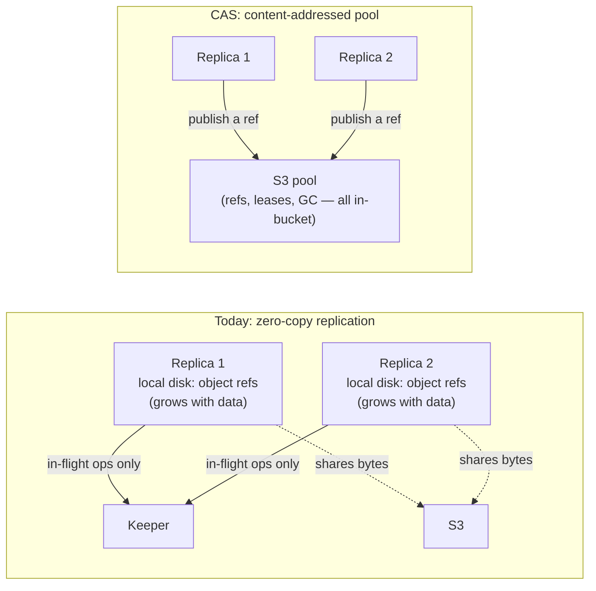

# Content-addressed storage {#content-addressed-storage}

`ReplicatedMergeTree` on object storage has two unattractive options today: every replica stores
its own byte-identical copy of every part (storage cost multiplies with the replication factor), or
replicas share objects through zero-copy replication. Zero-copy's `Keeper` load is only the
in-flight coordination, not a ledger proportional to data — what actually grows with data volume is
the **local-disk** state on every replica, which stores a reference to each shared S3 object it
uses. The structural cost is elsewhere: a commit spans three independent systems (local disk, S3,
and `Keeper`) whose interleaving is easy to get subtly wrong; a failure in any one of the three can
cause worse availability trouble than a single-system design would; the sharing accounting is a
numeric refcount, so a lost or duplicated retry can corrupt the count; and `Keeper` usage is
implemented with varying care across a large number of `MergeTree` special-case branches
accumulated over time.

Content-addressed storage (`CAS`) is a `MetadataStorage` back-end for object-storage disks
(`metadata_type = cas`) that takes the same sharing goal and collapses it onto one system: every
`MergeTree` part file is stored once, keyed by the hash of its content, in the object-storage pool
itself. There is no `CAS` state in `Keeper` at all — a commit is one conditional write against a
single object in the pool — and the reachability accounting is a derived in-degree edge set folded
from append-only deltas, not a mutable refcount a lost message can corrupt.

Every CAS bookkeeping object — refs, mount leases, GC leadership, fencing tokens — lives in the
bucket. There is no external coordinator, and no `Keeper` usage inside the pool protocol; `Keeper`
stays exactly where `ReplicatedMergeTree` already used it, for replication log and part-set
consensus, and its load does not grow with pool size.

## Status {#status}

`CAS` is **experimental**. It ships in Altinity Antalya builds. Experimental means the on-disk
format and the SQL surface can still change between releases — that is deliberate, not a caveat to
apologize for. Pre-release means the format can change cheaply, with zero compatibility
scaffolding, and the design can keep being iterated on invariants rather than migrations. The bet
underneath it: all you need is a good S3 bucket. See [bucket requirements](/antalya/cas/bucket-requirements)
for exactly what "good" means.

`CAS` coexists with zero-copy replication; it does not replace it. `metadata_type = cas` is opt-in
per disk, so adopting it never requires migrating an existing deployment.

## Where to go next {#nav}

| Page | Covers |
|---|---|
| [Quick start](/antalya/cas/quick-start) | A minimal disk config and the first `CREATE TABLE` / `INSERT` / `SELECT` |
| [Configuration](/antalya/cas/configuration) | Every disk-level and server-level setting |
| [Bucket requirements](/antalya/cas/bucket-requirements) | What an object store must support, and which providers qualify |
| [Architecture overview](/antalya/cas/architecture/) | The object model, the Git analogy, and the safety invariants |
| [Correctness](/antalya/cas/architecture/correctness) | How the design was verified: TLA+ models, counterexamples, soak methodology |
| [Design history](/antalya/cas/architecture/design-history) | What earlier designs were tried and rejected, and why |
