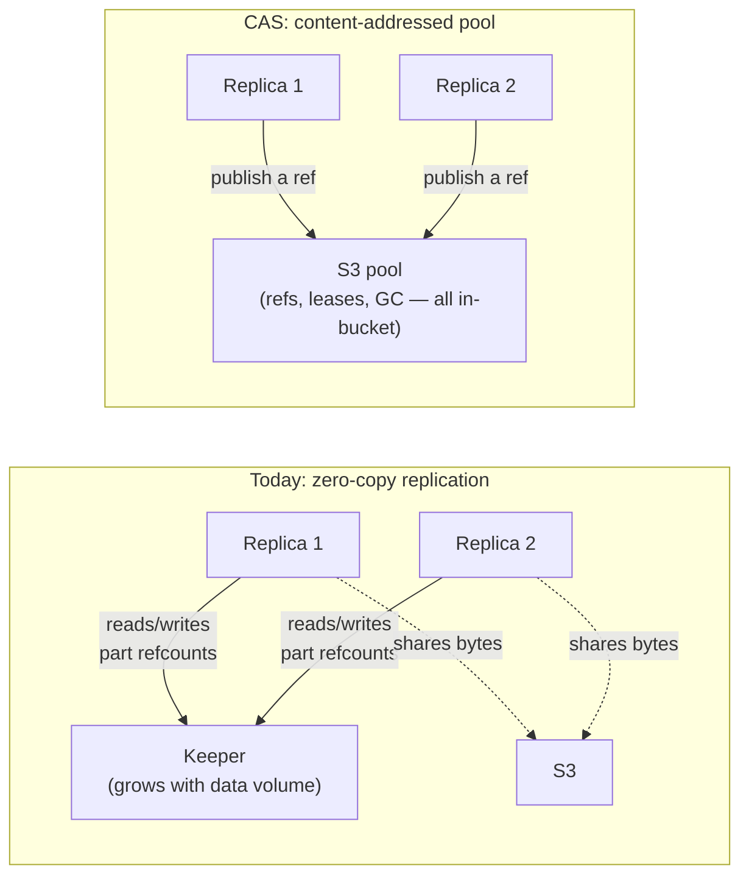

# Content-addressed storage {#content-addressed-storage}

`ReplicatedMergeTree` on object storage has two unattractive options today: every replica stores
its own byte-identical copy of every part (storage cost multiplies with the replication factor), or
replicas share objects through zero-copy replication, whose bookkeeping lives in `Keeper` and grows
with **data volume** rather than cluster size — on a large cluster this is the component that melts.

Content-addressed storage (`CAS`) is a `MetadataStorage` back-end for object-storage disks
(`metadata_type = cas`) that stores every `MergeTree` part file once, keyed by the hash of its
content. Many servers then share one object-storage pool with no byte duplication and no
replication bookkeeping proportional to data volume.

`CAS` takes the sharing property of zero-copy replication and moves the bookkeeping into the object
store itself: refs, mount leases, GC leadership, and fencing tokens are all objects in the bucket.
The only mutual exclusion it needs anywhere is a conditional write — create-if-absent, or
compare-and-swap on a token — against a single object. There is no external coordinator, and no
`Keeper` usage inside the pool protocol; `Keeper` stays exactly where `ReplicatedMergeTree` already
used it, for replication log and part-set consensus, and its load does not grow with pool size.

## Status {#status}

`CAS` is **experimental**. It ships in Altinity Antalya builds. Experimental means the on-disk
format and the SQL surface can still change between releases — that is deliberate, not a caveat to
apologize for. Pre-release means the format can change cheaply, with zero compatibility
scaffolding, and the design can keep being iterated on invariants rather than migrations. The bet
underneath it: all you need is a good S3 bucket. See [bucket requirements](/antalya/cas/bucket-requirements)
for exactly what "good" means.

`CAS` coexists with zero-copy replication; it does not replace it. `metadata_type = cas` is opt-in
per disk, so adopting it never requires migrating an existing deployment.

## Where to go next {#nav}

| Page | Covers |
|---|---|
| [Quick start](/antalya/cas/quick-start) | A minimal disk config and the first `CREATE TABLE` / `INSERT` / `SELECT` |
| [Configuration](/antalya/cas/configuration) | Every disk-level and server-level setting |
| [Bucket requirements](/antalya/cas/bucket-requirements) | What an object store must support, and which providers qualify |
| [Architecture overview](/antalya/cas/architecture/) | The object model, the Git analogy, and the safety invariants |
| [Correctness](/antalya/cas/architecture/correctness) | How the design was verified: TLA+ models, counterexamples, soak methodology |
| [Design history](/antalya/cas/architecture/design-history) | What earlier designs were tried and rejected, and why |
