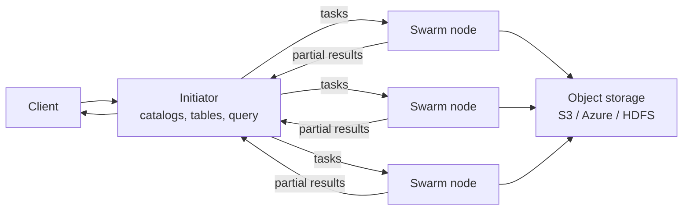
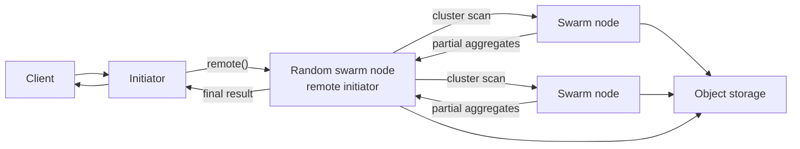

# Swarm {#swarm}

A **swarm** is a ClickHouse cluster whose nodes do not need local table definitions, catalogs, or
persistent data. They only execute object-storage reads that an initiator rewrites into
cluster table functions such as `s3Cluster` and `icebergCluster`.

ClickHouse already knows how to spread a table-function scan across a cluster. A swarm applies the
same idea to table engines and catalog tables: you query `Iceberg`, `S3`, or a lake catalog as usual
on the initiator, and the work runs on swarm nodes.

Because swarm nodes are stateless, you can add them when load grows and remove them when it
subsides. [Cluster discovery](/operations/cluster-discovery.md) is the usual way to register and
forget those nodes without rewriting `<remote_servers>` by hand.



Typical topology:

- **Initiator** — the node (or small stateful cluster) that clients connect to. It holds Iceberg
  catalogs, named collections, and `CREATE TABLE` definitions. It is **not** a swarm member: it
  *observes* the swarm (see [observer mode](/operations/cluster-discovery.md#observer-mode)) so it
  can see swarm hosts without registering as a worker.
- **Swarm** — a pool of workers that can reach the object store. They do not need the same databases
  or tables as the initiator. New nodes join through cluster discovery.
- **Object storage** — S3, Azure Blob Storage, HDFS, and similar. Swarm nodes read files from there;
  the initiator only needs enough access to list metadata and rewrite the query.

## Why a swarm instead of parallel replicas {#why-not-parallel-replicas}

Upstream ClickHouse can parallelize some object-storage engines with
`enable_parallel_replicas` / `cluster_for_parallel_replicas` (and, from 25.10,
`parallel_replicas_for_cluster_engines`). That path expects replica-like nodes that already know
the table.

`object_storage_cluster` is different: the initiator keeps the table and catalog knowledge, rewrites
the query into a cluster table function, and sends that function to workers that have never seen the
table. That is what makes a separate, disposable swarm possible.

The same query:

```sql
SELECT count() FROM catalog.`iceberg.table`;
```

with `SETTINGS object_storage_cluster = 'swarm'` is executed in the same way as if you had written
`icebergCluster('swarm', ...)` yourself — including for engines and catalog tables, not only for
table functions.

## Set up a swarm {#setup}

### Swarm nodes {#swarm-node-config}

On every swarm node, enable cluster discovery and register into the swarm cluster. Example:

```xml
<clickhouse>
    <allow_experimental_cluster_discovery>1</allow_experimental_cluster_discovery>

    <remote_servers>
        <swarm>
            <discovery>
                <path>/clickhouse/discovery/swarm</path>
            </discovery>
        </swarm>
    </remote_servers>
</clickhouse>
```

Give swarm nodes object-storage credentials (disk config, named collections, or IAM roles) so
they can read the same buckets the initiator refers to. They do not need Iceberg catalog
configuration or copies of initiator tables.

Optional: set `object_storage_cluster` in a user profile on swarm nodes so a remote initiator (see
below) can omit the cluster name in the client query:

```xml
<profiles>
    <default>
        <object_storage_cluster>swarm</object_storage_cluster>
    </default>
</profiles>
```

### Initiator {#initiator-config}

On the initiator, declare the same cluster as an observer so the node learns swarm members from
Keeper but does not take swarm tasks itself:

```xml
<clickhouse>
    <allow_experimental_cluster_discovery>1</allow_experimental_cluster_discovery>

    <remote_servers>
        <swarm>
            <discovery>
                <path>/clickhouse/discovery/swarm</path>
                <observer/>
            </discovery>
        </swarm>
    </remote_servers>
</clickhouse>
```

You can also list swarm hosts statically under `<remote_servers>` if the pool is small and
fixed.

Check membership with:

```sql
SELECT host_name, port, is_local
FROM system.clusters
WHERE cluster = 'swarm';
```

## Run queries on the swarm {#querying}

### `object_storage_cluster` {#object-storage-cluster}

The setting `object_storage_cluster` selects the cluster that executes the object-storage scan.
Empty (the default) means the initiator reads locally. A non-empty value is equivalent to using the
matching `*Cluster` table function.

It applies to:

- Table functions: `s3`, `azureBlobStorage`, `hdfs`, `iceberg`, `hudi`, `deltaLake`, `paimon`, and
  their cluster variants
- Table engines: `S3`, `AzureBlobStorage`, `HDFS`, `Iceberg`, and similar object-storage engines
- Tables exposed by a data-lake catalog database

Priority: a query-level `SETTINGS object_storage_cluster` overrides a table or database setting of
the same name. If both are empty, the non-cluster (single-node) implementation is used.

Examples that are equivalent:

```sql
SELECT * FROM s3Cluster(
    'swarm',
    'https://s3.example.com/bucket/data/*.parquet',
    'Parquet'
);

SELECT * FROM s3(
    'https://s3.example.com/bucket/data/*.parquet',
    'Parquet'
)
SETTINGS object_storage_cluster = 'swarm';
```

Engine and catalog examples:

```sql
CREATE TABLE events
ENGINE = Iceberg('https://s3.example.com/bucket/events', 'Parquet')
SETTINGS object_storage_cluster = 'swarm';

SELECT count() FROM events;

SELECT count()
FROM catalog.`db.table`
SETTINGS object_storage_cluster = 'swarm';
```

You can also pin the cluster in a user profile so every query from that user uses the swarm without
repeating the setting.

### `storage_type` for Iceberg {#storage-type}

Antalya unifies Iceberg table functions and engines with a `storage_type` argument (`local`, `s3`,
`azure`, or `hdfs`). The default is `s3`. Use the same `iceberg` / `Iceberg` name with
`object_storage_cluster` (or `icebergCluster`) regardless of the backend.

Old syntax:

```sql
SELECT * FROM icebergS3('http://minio1:9000/root/table_data', 'minio', 'minio123', 'Parquet');
SELECT * FROM icebergAzureCluster('mycluster', 'http://azurite1:30000/devstoreaccount1', 'cont', '/table_data', 'devstoreaccount1', 'Eby8vdM02xNOcqFlqUwJPLlmEtlCDXJ1OUzFT50uSRZ6IFsuFq2UVErCz4I6tq/K1SZFPTOtr/KBHBeksoGMGw==', 'Parquet');
CREATE TABLE mytable ENGINE = IcebergHDFS('/table_data', 'Parquet');
```

New syntax:

```sql
SELECT * FROM iceberg(storage_type = 's3', 'http://minio1:9000/root/table_data', 'minio', 'minio123', 'Parquet');
SELECT * FROM icebergCluster('mycluster', storage_type = 'azure', 'http://azurite1:30000/devstoreaccount1', 'cont', '/table_data', 'devstoreaccount1', 'Eby8vdM02xNOcqFlqUwJPLlmEtlCDXJ1OUzFT50uSRZ6IFsuFq2UVErCz4I6tq/K1SZFPTOtr/KBHBeksoGMGw==', 'Parquet');
CREATE TABLE mytable ENGINE = Iceberg('/table_data', 'Parquet', storage_type = 'hdfs');
```

`storage_type` can live in a named collection:

```xml
<named_collections>
    <s3>
        <url>http://minio1:9001/root/</url>
        <access_key_id>minio</access_key_id>
        <secret_access_key>minio123</secret_access_key>
        <storage_type>s3</storage_type>
    </s3>
</named_collections>
```

```sql
SELECT * FROM iceberg(s3, filename = 'table_data')
SETTINGS object_storage_cluster = 'swarm';
```

### Limit how many swarm nodes take part {#object-storage-max-nodes}

`object_storage_max_nodes` limits how many hosts from the cluster participate in one query (`0` =
all hosts). When it is smaller than the cluster, ClickHouse picks a random subset per query.

```sql
SELECT * FROM s3('https://s3.example.com/bucket/data/*.parquet')
SETTINGS
    object_storage_cluster = 'swarm',
    object_storage_max_nodes = 8;
```

Task assignment among the chosen nodes uses rendezvous hashing so the same file tends to stay on
the same node while the cluster is stable, which helps local caches. See
[task distribution](/sql-reference/distribution-on-cluster.md).

### Joins against local tables {#joins}

A swarm query can `JOIN` a table that exists only on the initiator. Workers do not have that table,
so you must choose how the join is rewritten with `object_storage_cluster_join_mode`
(requires `allow_experimental_analyzer = 1` unless the value is `allow`):

| Value | Behaviour |
| --- | --- |
| `allow` (default) | Leave the join as written. Use this when both sides are object-storage cluster scans, or when workers can see the right-hand table. |
| `local` | Send only the object-storage scan to the swarm; perform the join on the initiator. |
| `global` | Read the right-hand side on the initiator first and ship it to workers as a temporary table. |

```sql
SELECT *
FROM catalog.`iceberg.events` AS e
INNER JOIN local_dim AS d ON e.user_id = d.user_id
SETTINGS
    object_storage_cluster = 'swarm',
    object_storage_cluster_join_mode = 'local';
```

## Remote initiator {#remote-initiator}

Without extra settings, the **client-facing initiator** also coordinates the cluster query: it lists
files, hands out tasks, and merges partial results. For that, the initiator must be able to open
connections to **every** swarm node that participates in the query.

`object_storage_remote_initiator = 1` is optional. It picks a **random swarm node** and runs the
query there as if you had written:

```sql
SELECT count()
FROM remote('swarm_node', icebergCluster('swarm', ...));
```

Use a remote initiator when:

- you want aggregations finished on the swarm so the initiator only receives a small result
- the initiator should not stay in the data path for a long scan
- the cluster name the initiator knows is not the name swarm nodes use among themselves
- you want a **single entry point** into the swarm: the original initiator only needs network access
  to the remote-initiator node (or a small set of such nodes). That node talks to the rest of the
  swarm. Without a remote initiator, the original initiator must be allowed to reach all swarm nodes.

You can put only those entry-point hosts in `object_storage_remote_initiator_cluster` on the
initiator, and keep the full internal swarm cluster on the swarm nodes.



```sql
SELECT count()
FROM catalog.`iceberg.table`
SETTINGS
    object_storage_cluster = 'swarm',
    object_storage_remote_initiator = 1;
```

The remote initiator is chosen uniformly at random from
`object_storage_remote_initiator_cluster` if that setting is set, otherwise from
`object_storage_cluster` (or from the cluster name in a `*Cluster` function).

`object_storage_remote_initiator` requires at least one of: `object_storage_cluster`,
`object_storage_remote_initiator_cluster`, or an explicit cluster name in the table function.

### Different cluster names inside and outside the swarm {#split-cluster-names}

Sometimes the initiator sees the swarm under one name (public addresses, user/password), while swarm
nodes know each other under another name (internal DNS, no credentials, or a cluster that is not
defined on the initiator at all).

Use `object_storage_remote_initiator_cluster` for the name **the initiator knows**. Leave
`object_storage_cluster` unset on the client, and set it in the user profile on swarm nodes to the
**internal** name.

Initiator query:

```sql
SELECT count()
FROM catalog.`iceberg.table`
SETTINGS
    object_storage_remote_initiator = 1,
    object_storage_remote_initiator_cluster = 'swarm_external';
```

On swarm nodes, the profile of the user used for that remote connection:

```xml
<profiles>
    <default>
        <object_storage_cluster>swarm_internal</object_storage_cluster>
    </default>
</profiles>
```

The initiator then sends a non-cluster function (`iceberg(...)` / `s3(...)`) to the remote
initiator. That node applies its own `object_storage_cluster` and fans the scan out internally.

If `object_storage_cluster` is also set on the initiator query, the rewritten query is a cluster
function (`icebergCluster('swarm', ...)`) and the remote initiator uses **that** name, which must
exist on the swarm node.

### Limitations {#remote-initiator-limitations}

- Clusters configured with a `<secret>` cannot be used as a remote-initiator target. The rewrite
  uses `remote` / `remoteSecure` and currently does not send the interserver secret. Use
  `user` / `password` on the cluster definition instead, or omit credentials and rely on the
  default user.
- The settings `object_storage_remote_initiator` and `object_storage_remote_initiator_cluster` are
  stripped before the query is sent, so the remote node does not recurse into another remote call.

## Scale the swarm {#scaling}

### Scale out {#scale-out}

Start a new ClickHouse process with the same swarm discovery config. After it registers in Keeper,
new queries include it. No `SYSTEM` command is required.

### Scale in (graceful shutdown) {#scale-in}

Run this **on the swarm node you are about to stop**, not on the initiator:

```sql
SYSTEM STOP SWARM MODE;
```

That command:

1. Unregisters the node from autodiscovered clusters, so new queries do not choose it.
2. Stops the node from taking new object-storage files. Files already assigned keep running.

Wait until this node has no remaining swarm work. Swarm tasks arrive as **secondary** queries
(the initial query stays on the initiator, or on the remote initiator). On the node you are
draining:

```sql
SHOW PROCESSLIST;

SELECT query_id, elapsed, query
FROM system.processes
WHERE is_initial_query = 0;
```

When that list is empty (aside from the monitoring query itself), in-flight files have finished
and you can stop the process. `system.query_log` is useful after the fact (`is_initial_query = 0`,
`type = 'QueryFinish'`), but it does not tell you what is still running.

If you change your mind:

```sql
SYSTEM START SWARM MODE;
```

re-registers the node and it accepts new tasks again.

Both statements require the `SYSTEM_SWARM` privilege (`SYSTEM STOP SWARM MODE` /
`SYSTEM START SWARM MODE`).

The metric `IsSwarmModeEnabled` is `1` while the node participates and `0` after
`SYSTEM STOP SWARM MODE`. Server shutdown also stops swarm mode so the node leaves discovery before
connections drain.

## Related settings {#related-settings}

| Setting | Role |
| --- | --- |
| `object_storage_cluster` | Cluster that executes the object-storage scan. Empty = local read on the initiator. |
| `object_storage_max_nodes` | Cap on how many hosts from that cluster run a given query. `0` = all. |
| `object_storage_remote_initiator` | Run the cluster query on a random swarm node instead of coordinating from the client-facing initiator. |
| `object_storage_remote_initiator_cluster` | Cluster used only to pick that remote initiator. When empty, `object_storage_cluster` is used. |
| `object_storage_cluster_join_mode` | How to rewrite `JOIN`s when workers cannot see the right-hand table: `allow`, `local`, `global`. |
| `lock_object_storage_task_distribution_ms` | How long a free worker waits before stealing another node's files. Higher values favor cache locality. Default `500`. |
