# CAS MergeTree — Engineering Walkthrough for Reviewers {#cas-walkthrough}

## How to read this document {#how-to-read}

This is the guided tour of the content-addressed storage (CAS) backend for `MergeTree`, aimed at
engineers who are about to review the code. It is organised as a build-up: motivation → object
model → invariants → layout → protocols → garbage collection → introspection → open questions.
Every protocol section carries a diagram and links into the source.

All source paths are relative to the repository root. The implementation lives almost entirely
under one directory:

```
src/Disks/DiskObjectStorage/MetadataStorages/ContentAddressed/
├── Primitives/   digests, hashing write buffer, wire types
├── Formats/      every on-disk object format + the key layout
├── Backend/      the object-store abstraction, conditional ops, capability probe
├── Pool/         the mount: server root, lease, RefLedger, write transactions
├── Parts/        path parsing and the part-folder facade
├── Gc/           the garbage collector
└── Tools/        fsck, inspect, decommission
```

Plus the glue: `ContentAddressedMetadataStorage.*`, `ContentAddressedTransaction.*`,
`ContentAddressedExchange.*`, `ContentAddressedSettings.*` at the top of that directory, the two
audit tables in `src/Interpreters/ContentAddressed*Log.*`, and `system.content_addressed_mounts`
in `src/Storages/System/`.

Reference documentation for individual areas already exists in `docs/superpowers/cas/`
(`01-architecture.md` … `10-backups.md`); this walkthrough is the connective tissue and is written
against the code as it stands on this branch. Where the older docs have drifted from the code, the
drift is called out explicitly — those are marked **Doc drift** and are cleanup items, not review
findings.

---

## 1. What CAS is and why it exists {#what-and-why}

### 1.1 The one-sentence version {#one-sentence}

A new `metadata_type = content_addressed` back-end for object-storage disks that stores every
`MergeTree` part file **once, addressed by the hash of its content**, so that many servers can
share a single object-storage pool with no byte duplication, no zero-copy replication, and no
Keeper state proportional to the data.

The mental model is Git:

| Git | CAS MergeTree |
|-----|---------------|
| blob (file content by hash) | **blob** — one part file's bytes at `blobs/<algo>/<xx>/<hex>` |
| tree (directory listing) | **part manifest** — the immutable file list of one part |
| ref (`refs/heads/main`) | **ref** — `part name → manifest id`, the only mutable state |
| `gc` / reachability | **GC round** — in-degree fold over refs → manifests → blobs |

### 1.2 The problem it solves {#problem}

`ReplicatedMergeTree` on object storage has two unattractive options today:

- **Full copies per replica.** Every replica writes its own byte-identical copy of every part.
  Storage cost multiplies by the replication factor; network cost is paid on every fetch.
- **Zero-copy replication.** Replicas share objects, but the sharing bookkeeping (which replica
  still references which blob) lives in Keeper, and grows with *data volume*, not with cluster
  size. On large clusters this is the component that melts.

CAS takes the sharing property of zero-copy and moves the entire bookkeeping into the object store
itself. The pool is self-describing: refs, leases, GC leadership and fencing tokens are all
objects in the bucket.

### 1.3 Positioning: shared-nothing, not shared-state {#positioning}

This is worth stating precisely because it is the first question a reviewer asks.

- Each server owns its own **ref namespace** (`cas/refs/<server_root_id>/…`) and writes only to
  objects under it.
- The **shared** resource is the `blobs/` content space, which is addressed purely by content hash
  and is therefore write-once and conflict-free by construction — two servers writing the same
  content write the same key with the same bytes.
- The only mutual exclusion required for correctness is a **conditional write** on a single object
  (create-if-absent / compare-and-swap on token).

That is a shared-nothing design. It is explicitly *not* a globally mutable shared catalog with
serializable multi-writer access (the SharedMergeTree model). There is no coordinator, no
metadata service, and — verified by grep over the whole CAS tree — **no ZooKeeper/Keeper usage
at all** inside the pool protocol. (The class named `MountLeaseKeeper` in
`src/Disks/DiskObjectStorage/MetadataStorages/ContentAddressed/Pool/CasMountRuntime.h:64` is a
lease renewer, not a Keeper client.) Keeper remains involved only where
`ReplicatedMergeTree` already used it, for replication log and part-set consensus.

### 1.4 What it buys {#what-it-buys}

- **Cross-replica dedup by reference.** A replicated fetch becomes "publish a ref pointing at the
  blobs that are already there" — zero bytes on the wire.
- **Free carry-forward on mutation.** A mutation touching one column re-hashes that column only;
  the untouched columns are carried into the new manifest by re-referencing their existing blob
  hashes. This is the `createHardLink` path,
  `ContentAddressedTransaction.cpp:1119-1178`.
- **Cache-coherent by construction.** Immutable keys have infinite cache TTL by correctness, so a
  local cache can never go stale.
- **Keeper load flat in pool size.**

### 1.5 What it explicitly does not buy {#what-it-does-not-buy}

- **Dedup of independently recomputed bytes.** ClickHouse parts are not bit-reproducible across
  independent rebuilds (compression block boundaries, codec defaults, TTL `now()`). Dedup works
  because one replica produces the part and the others *reference* it — not because two replicas
  independently arrive at the same bytes.
- **Carry-forward for Compact parts.** A Compact part is one blob; any mutation rewrites it whole.
  Carry-forward is a Wide-part property.

---

## 2. The object model {#object-model}

Four durable object kinds exist in a pool. Everything else in this document is a protocol over
these four.

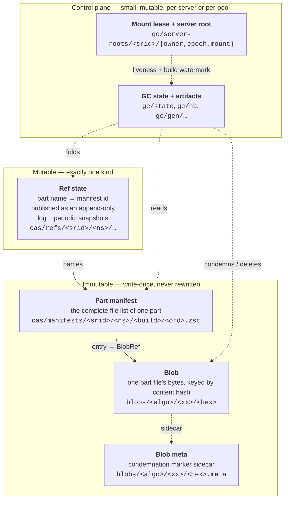

**The reachability rule, stated once:** a blob is live iff some live manifest names it, and a
manifest is live iff some ref (committed **or** precommitted) names it. GC computes exactly this
and nothing else.

### 2.1 Blobs {#blobs}

A blob is the content-addressed bytes of one part file. Identity is the pair
`BlobRef = {BlobHashAlgo algo, BlobDigest digest}` —
`Primitives/CasBlobDigest.h:207-214`. The algorithm travels *with* the digest because it is
pluggable per blob (`CityHash128 = 1`, `XXH3_128 = 2`, `Sha256 = 3`,
`Primitives/CasBlobDigest.h:38-43`) and a pool may legally contain a mix. A bare digest is
never an identity — `ch128` and `xxh3` are both 16 bytes.

The digest is produced **streaming, while the bytes are written**
(`Primitives/CasBlobHashingWriteBuffer.h:18-48`), never read out of `checksums.txt`. For
`CityHash128` it keeps ClickHouse's legacy chunked convention
(`DBMS_DEFAULT_HASHING_BLOCK_SIZE`, chained `CityHash128WithSeed`), so a one-shot hash of the same
bytes would *not* match for inputs larger than one block.

The stored object is `[256-byte envelope header][payload]`
(`Formats/CasBlobEnvelopeFormat.h:46-74`). The header is a padded JSON descriptor carrying a
**freshly minted random `incarnation_tag` per upload attempt**, the build id, and provenance. Two
facts about it are load-bearing and appear repeatedly below:

- **The digest covers the payload only, never the header**
  (`ContentAddressedTransaction.h:320-332`). Hashing the header would make every upload a unique
  key and destroy dedup entirely.
- **Identical content ⇒ identical key, but never identical bytes.** The fresh tag guarantees each
  incarnation of a key has a distinct ETag. This is what makes exact-token deletes safe against
  resurrection (§7.5).

### 2.2 Part manifests {#part-manifests-intro}

An immutable object listing every file of one part as
`path → {placement, BlobRef, size | inline bytes}`. Small files are carried **inline in the
manifest body**, so opening a part costs one GET. Detailed in §9.

### 2.3 Refs {#refs-intro}

The only mutable data. A ref binds a part name to a manifest id inside a namespace. Published as
an append-only log with periodic snapshots rather than as a mutable per-part object; detailed in
§10.

### 2.4 The control plane {#control-plane-intro}

Per server root: an `owner` object (permanent identity), an `epoch` object (durable-monotone
writer epoch), and a `mount` object (liveness lease **and** build watermark in one). Pool-wide: GC
state, GC leader heartbeat, and per-round GC artifacts. Detailed in §8 and §12.

---

## 3. Requirements and invariants {#invariants}

This section is the checklist a reviewer should hold every protocol against. The invariants are
numbered so later sections can cite them.

### 3.1 What the backend must provide {#backend-requirements}

CAS is built on a very small object-store contract, stated at
`Backend/CasBackend.h:180-198`:

| Requirement | Why | Enforcement |
|---|---|---|
| **Read-after-write** on a fresh key | recovery LISTs and point reads must see what was just written | probed at mount, `Backend/CasProbe.cpp:55-69` |
| **`putIfAbsent` (`If-None-Match: *`)** with `PreconditionFailed` as an *outcome*, not an exception | write-once creation for blobs, manifests, ref logs | `CasProbe.cpp:71-83` |
| **`casPut` / `putOverwrite` (`If-Match: <token>`)** | the single mutual-exclusion primitive (ref-free control objects: lease, `gc/state`) | `CasProbe.cpp:85-175` |
| **`deleteExact(key, token)`** — deletes *only* the named incarnation, `TokenMismatch` leaves the object readable | GC must never delete a blob that a writer resurrected in the meantime | `CasProbe.cpp:176-189` |
| **No versioning / no delete markers** | a delete marker over a live key silently breaks exact-token semantics | probed; a created delete marker is `LOGICAL_ERROR`, `Gc/CasGc.cpp:517-520` |
| **TOKEN ⟹ CONTENT** — a repeated token must imply unchanged bytes | the decode caches skip re-reads on token match; a recycled token would serve *stale manifests*, i.e. wrong query results | **not probed** — a standing requirement on every backend, `Backend/CasBackend.h:188-198` |

The capability probe runs at every writable mount and **fails closed**: an object store that does
not enforce the conditions is refused rather than trusted. Note the last row: `TOKEN ⟹ CONTENT`
is the one contract item that cannot be tested cheaply and is therefore a documented assumption —
a fair thing for reviewers to push on.

**Emulated mode caveat.** Over a local (non-S3) object storage the backend falls back to
`Mode::EmulatedSingleProcess`, whose token bookkeeping is per-process. Sharing such a pool between
two servers would break silently. Today that is logged at INFO and **not** enforced
(`ContentAddressedMetadataStorage.cpp:658-686`) — the probe cannot detect it. Worth a reviewer's
opinion on whether it should be a hard refusal outside tests.

### 3.2 The safety invariants {#safety-invariants}

**INV-1 — Never read a condemned object to revive it.**
A blob marked `Condemned` is never adopted and never server-side-copied. It is re-established only
by re-uploading the writer's **own source bytes** under a freshly minted `incarnation_tag`.
`Pool/CasPartWriteTxn.cpp:665-672`, `:684-700`.
*Why it matters:* a verbatim copy would reproduce identical bytes, hence an identical ETag, and
the exact-token delete already queued for the condemned incarnation would then delete the live
resurrection. That is silent data loss. The fresh header guarantees a different token.

**INV-2 — EDGE-BEFORE-OBSERVE (precommit-first).**
The durable write order is fixed: `stageManifest → precommitAdd → putBlob → promote`
(`Pool/CasPartWriteTxn.h:108-113`). Adopting an *existing* blob incarnation is legal only once
this build's precommit is durable, because the adopted blob carries the *original* writer's build
id and is therefore not covered by this build's debris watermark. Violation throws
`LOGICAL_ERROR` — deliberately a real throw, not `chassert`, which compiles out in release
(`Pool/CasPartWriteTxn.cpp:378-397`).

**INV-3 — Exact-token deletes only.** Every destructive operation names the incarnation it
intends to remove. `Backend/CasBackend.h:183-186`.

**INV-4 — TOKEN ⟹ CONTENT.** See §3.1.

**INV-5 — Write-once creation.** Blob bodies, manifests and ref logs are created with
`If-None-Match: *`. The S3-native staging promote is a *conditional* server-side copy, and both
`promoteStaged` and `resurrectStaged` default to `NOT_IMPLEMENTED` so a backend without native
enforced conditional copy can never take that path (`Backend/CasBackend.h:318-353`).

**INV-6 — A single content-delete site.** Exactly one place in the whole codebase deletes a blob
body: the pre-CAS `pending_deletes` phase of the GC round, restricted to entries that a
*previously published* round already marked `delete_pending`.
"Adding a second content-delete site is a protocol defect" — `Gc/CasGc.h:318-325`.

**INV-7 — GC never invents a ref transition.** Cleaning up an abandoned precommit is the writer's
job. If GC appended a synthetic transition, the fold could disagree with the writer's durable
ownership history. `Gc/CasGc.h:315-317`.

**INV-8 — Over-count only; every failure delays reclamation.** A lost fold, a crashed leader, a
stale snapshot or a duplicated record can only *postpone* a delete, never accelerate one. The fold
is idempotent because in-degree is a **set** of source edges, not a counter.

**INV-9 — NO-DANGLE / NO-LOSS / NO-RETURN.**
*No-dangle:* a live ref's transitive closure resolves through present keys.
*No-loss:* a delete requires durable retirement + zero reachability at a later cut + the exact
observed token.
*No-return:* a retired `(kind, hash, token)` triple can never again be a valid dependency — the
logical key may come back, but only as a *different* token.
Model-checked in `docs/superpowers/models/CaIncarnationCore.tla`.

**INV-10 — No resumable write state.** `PartWriteTxn` is a plain in-memory object: never
persisted, never resumed after a restart. There is no "replay a precommit" path anywhere; a dead
precommit is *removed*, never promoted. `Pool/CasPartWriteTxn.h:230-243`.

**INV-11 — Promote fails closed.** A leaf that is neither token-protected nor backed by a durable
manifest edge is `LOGICAL_ERROR`, not a best-effort re-check. `Pool/CasPartWriteTxn.h:213-229`.

**INV-12 — Precommit mint-tightening.** A precommit may name only a manifest id this transaction
minted, or the ref's current committed manifest. Granting fresh ownership to a foreign manifest id
would let the relink confirm compare equal against a token whose blobs may already be reclaimed —
a classic ABA. `Pool/CasPartWriteTxn.h:204-211`.

**INV-13 — No accidental repoint.** Publishing over an existing ref binding throws; an intended
repoint must go through `republishRef`. `Pool/CasPartWriteTxn.cpp:1194-1201`.

**INV-14 — Fail closed on ambiguity.** An operation that *may* have landed must never be treated
as one that did not. Realised as `PrecommitState::Uncertain`, which behaves exactly like
`NotAttempted` for admission and exactly like `Durable` for cleanup
(`Pool/CasPartWriteTxn.cpp:387-397`). This one rule is cited as the root cause of three separate
historical defects — `docs/superpowers/cas/INTENT.md:31-34`.

**INV-15 — Fence-generation gating on every durable write.** Every durable write or delete
captures the mount's fence generation at admission and re-checks it immediately before the
object-store call, and again on every conditional-retry iteration. Reads are deliberately not
gated. `Pool/CasMountRuntime.cpp:98-112`, `Pool/CasPlainObjects.h:81-95`.

**INV-16 — Single-appender assumption.** `writeFile` in `Append` mode is a read-modify-rewrite
that freezes the carried prefix when the buffer opens, and the CAS loop re-reads only the token,
not the base content. This is safe **only** because the sole production appender (the mutation
CSN write) never has a concurrent second appender on the same key
(`ContentAddressedTransaction.cpp:800-808`). Reviewers should treat this as an invariant to
protect, not a property to rely on casually.

**INV-17 — One owner per manifest.** A `ManifestRef` has at most one owner across a table, in one
of two slots (`Committed` or `Precommit`). Violating it would double-count GC's manifest edges.
Indexed in O(1) and fail-closed on drift — `Pool/CasRefCowManifestSet.h:16,41-44`.

**INV-18 — Monotone identities.** `writer_epoch` is durable-monotone and never reissued across
crash, restart or mount deletion; per `(namespace, shard)` every re-materialisation carries a
strictly greater incarnation, closing ABA; a mid-open fence costs an epoch and is recovered by
re-allocating rather than wedging (`NoPermanentWedge`).

**INV-19 — Never publish an uncommitted ref.** The transaction destructor abandons open builds; no
ref is published before `commit`, so an abandoned transaction has nothing to compensate for.
`ContentAddressedTransaction.cpp:107-140`.

**INV-20 — GC's condemnation marker is add-only.** GC may write `Clean → Condemned` and may delete
the marker after a *confirmed* body delete, but never writes `Condemned → Clean` — not even when
sparing a blob. Only a writer that has already displaced the body may clear it. A deposed leader
writing a stray `Clean` over a still-condemned token would lose a live blob to a stale redelete.
`Gc/CasGc.cpp:101-110`, `:604-613`.

### 3.3 Durability and correctness claims {#durability-claims}

- **No acked write is ever lost.** A part becomes visible only when its ref is published; an
  uncommitted transaction never publishes. A crash before publish leaves *debris*, never a
  dangling ref, and debris is reclaimable by construction.
- **Crash safety is asymmetric by design.** Every crash point leaks objects; no crash point loses
  data or creates a dangle. This asymmetry is the core design bet, and §12 explains how the leak
  side is bounded.
- **Ambiguity is never resolved optimistically.** An unresolved conditional write results in
  "uncertain — retry later", plus a durable *wedge* record on the ref lane so that the next flush
  resolves the exact key before allocating a new transaction id (§10.4).

---

## 4. What is mutable and what is immutable in a `MergeTree` part {#mutability}

This is the section most likely to surprise a reviewer who remembers earlier designs.

### 4.1 The mutable set is empty {#mutable-set-empty}

Earlier revisions carried a `RefSidecar` — a small mutable per-part object holding `uuid.txt`,
`txn_version.txt` and `metadata_version.txt`, excluded from the part's identity hash. **That is
gone.** Every file of a part, without exception, is a content-addressed entry in the part's
manifest:

> "The former mutable-per-part-file branch … is DELETED here — these three names fall through to
> the ordinary content path below like any other tree file … the `kMutablePerPartFiles` /
> `isMutablePerPartFile` predicate itself is gone too — there is no filename left to special-case."
> — `ContentAddressedTransaction.cpp:844-850`

`RefSidecar`, `computePartId`, `isMutablePerPartFile` and `kMutablePerPartFiles` have zero
occurrences left in `src/`.

> **Doc drift:** `docs/superpowers/cas/03-writer-protocol.md:379-394` still presents the
> `RefSidecar` table. That table is stale and contradicted both by the code and by the same
> document's own later sections. `01-architecture.md:118-126` is correct.

**So what *is* mutable?** Exactly one thing in the whole system: **the ref state** — the binding
from a part name to a manifest id. Everything else is write-once. Changing a file inside a
committed part does not mutate anything; it publishes a *new manifest* and moves the ref
(§4.3).

### 4.2 The only per-file classification that survives {#blob-vs-inline}

Not "mutable vs immutable" but "standalone blob vs inline in the manifest" — a pure size/IO
optimisation, `Cas::partFileMustStayBlob`, `ContentAddressedTransaction.cpp:65-73`:

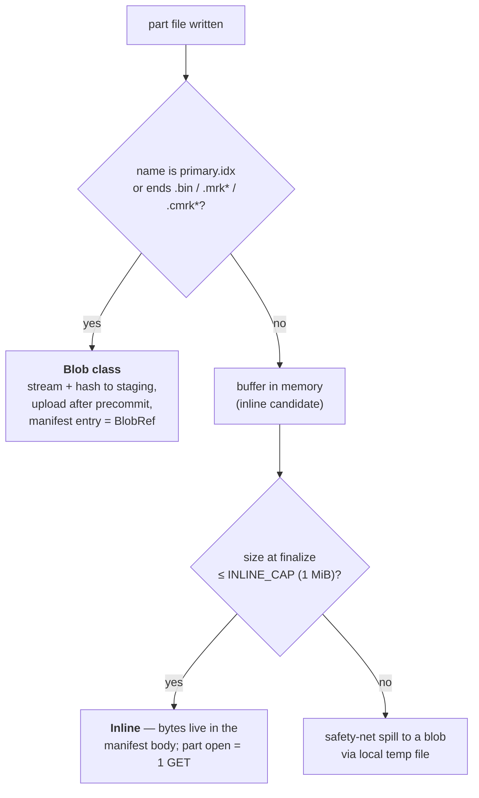

So `columns.txt`, `checksums.txt`, `count.txt`, `serialization.json`, `partition.dat`,
`default_compression_codec.txt`, `ttl.txt`, minmax and skip-index `.idx` files, **and** the three
former "mutable" files `uuid.txt`, `txn_version.txt`, `metadata_version.txt` are all ordinary
inline manifest entries. Opening a part therefore costs **one GET** of the manifest, which
already contains every small file's bytes.

Inline and blob placements of identical content mint the **same** `BlobRef` under every algorithm
(`ContentAddressedTransaction.cpp:923-928`), so promoting a file from inline to blob or back never
changes its identity.

Because `getStorageObjects` cannot return a real remote key for an inline entry, it returns a
sized placeholder with an **empty** remote key: any consumer that bypasses the CA read branch
fails loudly instead of silently reading the wrong bytes
(`ContentAddressedMetadataStorage.h:136-140`).

### 4.3 Writing into an already-committed part: the repoint {#repoint}

MergeTree does write into committed parts — the creation-CSN fill-in, removal-TID lock/unlock,
`ATTACH`'s `metadata_version.txt` rewrite. Under CAS each is an ordinary standalone write that
resolves into a **repoint**: a new manifest naming mostly the same blobs, and one ref move.

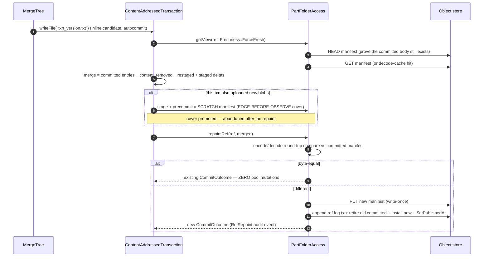

Key points for review:

- The **byte-equal short-circuit** matters: a repoint that would produce an identical manifest does
  nothing at all — no PUT, no ref-log record (`Parts/PartFolderAccess.cpp:536-568`). The
  comparison deliberately goes through an encode/decode round trip because `blob_size` is not
  carried on the wire for inline entries.
- The **scratch precommit** exists solely to hold the EDGE-BEFORE-OBSERVE closure (INV-2) across
  an upload loop inside a repoint; it is never promoted
  (`ContentAddressedTransaction.cpp:342-359`).
- **Fail-close:** staged entries or removal marks for a ref with no existing view and no build is
  `LOGICAL_ERROR` — a rewrite of a non-existent part never fabricates one
  (`ContentAddressedTransaction.cpp:396-398`).

This is also why the `.tmp` + `replaceFile` dance disappears:
`supportsAtomicFileWrites() == true` (`ContentAddressedMetadataStorage.h:257`) lets
`VersionMetadataOnDisk::storeInfoToDataPartStorage` write `txn_version.txt` directly
(`src/Interpreters/MergeTreeTransaction/VersionMetadataOnDisk.cpp:329-339`). MVCC is enabled via
`supportsTransactionalMutableFiles()`, **not** via append capability —
`supportWritingWithAppend` stays `false` deliberately.

### 4.4 The genuinely non-content-addressed files {#verbatim}

Two families bypass CAS entirely and are stored as plain path-keyed objects
(`Pool/CasPlainObjects.h:45-79`):

1. **Namespace files** at `roots/<srid>/<ns>/_files/<name>` — `format_version.txt`, deduplication
   logs, mutation entries.
2. **Loose mountpoint objects** at `roots/<srid>/<path>` — the startup write probe and anything
   outside a `@cas@` table directory.

GC never scans these; they are removed eagerly on unlink, because there is no sharing to reason
about. The boundary marker is the `@cas@` suffix on the table-directory segment: **a node is
immutable iff it is content-addressed, and `@cas@` is exactly that boundary**
(`Parts/PartPathParser.h:58-63`).

### 4.5 Every part-directory operation and its CAS implementation {#operation-table}

`ContentAddressedTransaction` is an **eager staging overlay**, not a queue of `IMetadataOperation`
objects (`transactionIsStagingOverlay() == true`). Each `IMetadataTransaction` override maps as:

| MergeTree operation | CAS implementation | Code |
|---|---|---|
| `writeFile` (blob class) | spill+hash to local scratch or S3 staging; uploaded only at publish | `ContentAddressedTransaction.cpp:852-915` |
| `writeFile` (small) | buffer, classify at finalize → inline entry or spill | `:917-976` |
| `writeFile` (non-part) | verbatim object; `Append` = read-modify-rewrite (INV-16) | `:809-836` |
| `createDirectory` | no-op, still gated as a write (never silently accepted on a dead mount) | `:978-989` |
| `removeDirectory(<part>)` | **the single authoritative ref unlink**; supersedes per-file removal marks and abandons the build ⇒ an unlink storm followed by a drop costs one ref-drop and zero repoints | `:991-1030` |
| `removeRecursive` | table dir ⇒ `dropNamespace`; `detached/`, `moving/` ⇒ drop all prefixed refs; projection subdir ⇒ no-op | `:1032-1117` |
| `unlinkFile` | staged ⇒ drop staged entry; committed ⇒ stage a removal mark resolved by a repoint. One `ForceFresh` proof per `(transaction, ref)`, memoised across the burst | `:1509-1570` |
| **`createHardLink`** (mutations) | manifest-entry copy: adopt a staged entry, or read the committed source manifest and record a tokenless evidence dep. **This is the free carry-forward.** | `:1119-1178` |
| `moveDirectory` tmp→final | pure overlay re-key; publish still happens in `commit`. Differing-bytes collision on one path is `LOGICAL_ERROR`, never a silent lost update | `:1275-1354` |
| `moveDirectory` committed | `republishRef(src, dst)` — one uniform shape for rename / DETACH / ATTACH | `:1367-1371` |
| `moveDirectory` `RENAME TABLE` | best-effort, **no cross-namespace atomicity**; idempotent and re-drivable, logs loudly on partial failure | `:1212-1251` |
| `moveDirectory` projections | `<proj>_<n>.tmp_proj` → `<proj>.proj` is an entry-**prefix re-key** inside the same staged part — projections are nested paths in the parent manifest, never separate refs | `:1257-1273` |
| `truncateFile` | **`NOT_IMPLEMENTED`** — blobs are immutable | `:1603-1608` |
| `generateObjectKeyForPath` | **throws** — keys come from content hashes, not paths | `:531` |
| `createMetadataFile(path, objects)` | **throws** — no content-addressed equivalent | `:697` |
| `getSubmittedForRemovalBlobs` | returns empty — shared objects are reclaimed only by GC | `:536` |

Engine-side adaptations that exist *because* a CAS part is one atomic unit:

- Projections borrow the **parent's** transaction (`MergeTask.cpp:560-567`,
  `IMergeTreeDataPart.cpp:1358-1363`).
- `freeze`/clone wraps the whole clone in **one** transaction when the caller supplied none —
  otherwise per-file autocommit would publish a one-file ref per file and leave only the last one
  (`DataPartStorageOnDiskBase.cpp:535-545`).
- Cross-disk `clonePart` and BACKUP restore each route through a single whole-part transaction.

### 4.6 Non-goals and unsupported operations {#non-goals}

Hard refusals in code:

- **BACKUP via temporary hard links** (Ordinary / non-UUID databases) ⇒ `SUPPORT_IS_DISABLED`
  (`DataPartStorageOnDiskBase.cpp:418-427`). Atomic databases back up normally.
- **Partition commands outside an allowlist** ⇒ `SUPPORT_IS_DISABLED`
  (`MergeTreeData.cpp:6718-6768`). Allowed: `DROP_PARTITION`, `DROP_DETACHED_PARTITION`,
  `FORGET_PARTITION`, `ATTACH_PARTITION`, `REPLACE_PARTITION`, `MOVE_PARTITION`,
  `FETCH_PARTITION`, `FREEZE_*`, `UNFREEZE_*`.
- `supportsChmod`, `supportsStat` are `false`; `getHardlinkCount` returns 0.
- Bucket versioning must not be enabled; probed and refused.
- `<readonly>1</readonly>` disks take no mount claim, run no probe, no writes and no GC.

Fourteen stateless tests still carry `no-content-addressed-storage`, each with an inline rationale.
They fall into: tests asserting `system.parts.path` is a local filesystem path (orthogonal, not a
CAS bug); the Ordinary-database BACKUP case above; one known open defect
(`03350_alter_table_fetch_partition_thread_pool` — concurrent FETCH fan-out tears the shared
`detached` ref under `LocalObjectStorage`'s non-atomic rewrite; S3-backed pools are unaffected);
and tests whose subject does not engage on CAS at all.

Rejected designs, worth knowing so reviewers do not re-propose them: a Merkle `treeId` tree layer;
EBR/epoch-based GC (needed Keeper, and one wedged writer stalled all reclamation); integer
refcounts (distributed decrement); a `gc/registry` object as GC's discovery authority; matching
pools by endpoint+prefix (replaced by a minted `pool_uuid`); and adding any CAS-specific field to
`ReplicatedMergeTreePartHeader` (replication stays disk-agnostic).

---

## 5. The S3 pool layout {#s3-layout}

Every key in a pool is built by one class — `Cas::Layout` in `Formats/CasLayout.h`, which owns
exactly one field, the pool prefix. Reviewing key construction means reviewing that one file.

### 5.1 The key table {#key-table}

| Object | Key template | Builder |
|---|---|---|
| Pool meta | `<prefix>/_pool_meta` | `poolMetaKey()` `CasLayout.h:373-376` |
| **Blob body** | `<prefix>/blobs/<algo>/<hex[0:2]>/<hex>` | `blobKey(ref)` `CasLayout.cpp:34-37` |
| **Blob meta** (condemnation marker) | `<blobKey>.meta` | `blobMetaKey(ref)` `CasLayout.cpp:39-42` |
| **Part manifest** | `<prefix>/cas/manifests/<ns>/<epoch-hex>-<buildseq-hex>/<NNNNNN>.zst` | `manifestKey(id)` `CasLayout.h:205-211` |
| **Ref log** (one transaction) | `<prefix>/cas/refs/<ns>/_log/<epoch-hex>-<seq-hex>.zst` | `refLogKey` `CasLayout.h:130-133` |
| **Ref snapshot** | `<prefix>/cas/refs/<ns>/_snap/<epoch-hex>-<seq-hex>.zst` | `refSnapshotKey` `CasLayout.h:138-141` |
| Ref cleanup marker (0 bytes) | `<prefix>/cas/refs/<ns>/_cleanup/<epoch-hex>-<seq-hex>` | `refCleanupMarkerKey` `CasLayout.h:145-148` |
| Server-root owner | `<prefix>/gc/server-roots/<srid>/owner` | `ownerKey` `CasLayout.h:333-337` |
| Server-root epoch | `<prefix>/gc/server-roots/<srid>/epoch` | `epochKey` `CasLayout.h:339-343` |
| Mount lease | `<prefix>/gc/server-roots/<srid>/mount` | `mountKey` `CasLayout.h:345-349` |
| GC state (incl. the GC lease) | `<prefix>/gc/state` | `gcStateKey()` `CasLayout.h:238-241` |
| GC heartbeat | `<prefix>/gc/hb` | `gcHbKey()` `CasLayout.h:243-247` |
| Fold seal | `<prefix>/gc/gen/<gen>/attempt/<att>/fold_seal` | `foldSealKey` `CasLayout.h:263-267` |
| Source-edge run segment | `<prefix>/gc/gen/<gen>/attempt/<att>/blob_target/<shard>/<seq>` | `blobTargetRunKey` `CasLayout.h:270-275` |
| GC outcome log | `<prefix>/gc/gen/<gen>/attempt/<att>/outcomes/<round>/<shard>.zst` | `outcomesKey` `CasLayout.h:290-294` |
| Verbatim namespace file | `<prefix>/roots/<ns>/_files/<name>` | `namespaceFileKey` `CasLayout.h:179-189` |
| Loose mountpoint object | `<prefix>/roots/<key>` | `mountpointObjectKey` `CasLayout.h:229-235` |
| S3 staging scratch | `<prefix>/staging/<srid>/…` | `CasLayout.h:308-314` |
| Capability probe scratch | `<prefix>/_probe/<u128hex>/{token,cas}` | `Backend/CasProbe.cpp:15-22` |

**Hash encoding.** The algorithm is a path segment — `ch128`, `xxh3`, `sha256`
(`Primitives/CasBlobDigest.cpp:6-17`) — because a pool may legally contain several algorithms at
once. Digests are lowercase hex of the algorithm's exact width (16 bytes for the 128-bit
algorithms, 32 for SHA-256).

**Two independent sharding axes, easy to confuse:**

1. **S3 key shard** — the first two hex characters of the digest, inserted as a path segment
   (`shardedKey`, `CasLayout.h:397-405`). A flat prefix fan-out for request distribution. Not
   configurable.
2. **`gc_shards`** — a GC-internal reduction fan-out (default 1, fixed at pool creation, must be
   ≥ 1). It appears **only** inside GC run and outcome keys. A blob routes by the **high** 64 bits
   of its digest, read big-endian explicitly so a little-endian host can never silently reshard
   (`Gc/CasGcShardPlan.h:19-45`).

Prefixes used for discovery LISTs: `cas/refs/`, `cas/manifests/`, `blobs/` (deliberately without
the algorithm segment, so one recursive LIST covers every algorithm), `roots/`,
`gc/server-roots/`. Note `staging/` is a top-level sibling that **no GC LIST ever touches** — it
is reclaimed only by its own server's next mount.

### 5.2 A worked example tree {#example-tree}

Pool prefix `ca-pool`, server root `srv1`, one Atomic table, one part `all_1_1_0` with one blob
column file and one small inline file, written at `writer_epoch = 1, sequence = 3`:

```
ca-pool/_pool_meta

ca-pool/cas/refs/srv1/store/3f2/3f2a1b7c-…-abcdefabcdef@cas@/_log/0000000000000001-0000000000000003.zst
ca-pool/cas/refs/srv1/store/3f2/3f2a1b7c-…-abcdefabcdef@cas@/_snap/0000000000000001-0000000000000003.zst

ca-pool/cas/manifests/srv1/store/3f2/3f2a1b7c-…-abcdefabcdef@cas@/0000000000000001-0000000000000003/000001.zst

ca-pool/blobs/xxh3/a1/a1b2c3d4e5f60708b1c2d3e4f5061728
ca-pool/blobs/xxh3/a1/a1b2c3d4e5f60708b1c2d3e4f5061728.meta

ca-pool/roots/srv1/clickhouse_access_check_8f3a1c2d

ca-pool/gc/state
ca-pool/gc/hb
ca-pool/gc/server-roots/srv1/{owner,epoch,mount}
ca-pool/gc/gen/7/attempt/1/fold_seal
ca-pool/gc/gen/7/attempt/1/blob_target/0/1
ca-pool/gc/gen/7/attempt/1/outcomes/1/0.zst

ca-pool/staging/srv1/<upload scratch>
```

`count.txt` has **no object of its own** — it is inline inside the manifest body.

### 5.3 The object envelope {#envelope}

Every persisted CAS metadata object is **text**, not protobuf (`Formats/README.md:1-13`): a header
line `{"type":"cas_<object>","v":N}`, then a body (a JSON object, sorted NDJSON records, or a
descriptor plus a raw payload zone), plus an optional count trailer. `Formats/CasTextFormat.*`
owns that container shape, and `CasFormat.cpp:93-108` is the single registry with one row per
object kind giving its type string, text family, key strictness (whether unknown keys are skipped
or rejected; a `!`-prefixed key is always critical), compression policy, and byte caps. A
`.zst` suffix in a key means, exactly, that the kind's policy is "always compress".

Blob bodies use the separate fixed-length envelope described in §2.1: a JSON descriptor padded to
a pool-constant `blob_header_len` (256), so the payload always begins at a constant offset and no
header parse is needed to locate content.

> **Doc drift:** `docs/superpowers/cas/05-formats-and-backend.md` still describes a superseded
> generation — binary `CABL`/`CATR` magic envelopes, protobuf mutable objects, a mutable
> `cas_ref_shard` object, and a `Tree` object kind. None of that exists in the code. The bucket-map
> table in `Formats/README.md:19-33` is current and was cross-checked against the code.

---

## 6. The path-conversion layer {#path-conversion}

This is the layer that lets `MergeTree` keep thinking in POSIX-ish paths while the pool stores
content-addressed objects. It has two halves: **classification** (`Parts/PartPathParser.*`) and
**routing** (`ContentAddressedMetadataStorage::route`).

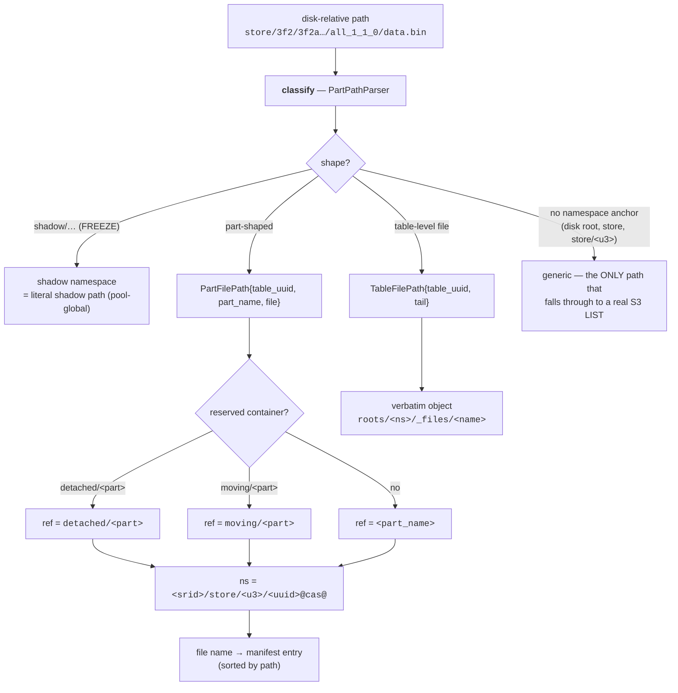

### 6.1 Classification {#classification}

- The Atomic layout is anchored by finding a `<uuid[:3]>/<uuid>` pair **by shape**
  (`PartPathParser.cpp:114-128`), which is robust to a missing leading `store/`.
- Otherwise the rightmost component matching part-directory grammar wins — a partition group plus
  three trailing decimal groups — which correctly also matches `tmp_insert_all_1_1_0` and
  `delete_tmp_all_1_1_0` (`:136-168`).
- The reserved `detached` and `moving` directory boundaries are preferred over the grammar scan, so
  they can never be folded into a table id (`:186-229`).
- `deduplication_logs` is a reserved table-level subdirectory, never a part directory.
- A `.proj` / `.tmp_proj` final component marks a projection directory, which becomes a **path
  prefix inside the parent's manifest**, never a separate object.

### 6.2 Namespace and ref name {#namespace-and-ref}

The namespace for a live table is `<server_root_id>/<mirrored archive path>`, e.g.
`srv1/store/3f2/3f2a1b7c-…@cas@`. The mirroring reproduces ClickHouse's own `store/<u3>/<uuid>`
fan-out and appends the boundary suffix `@cas@` to the table-directory segment
(`PartPathParser.cpp:376-386`). That suffix is the marker referenced in §4.4: inside `@cas@` a node
is content-addressed and immutable; outside it, verbatim.

Ref names are canonical clean relative paths (`Primitives/CasCodecUtil.h:93`), in practice:

| Path shape | Ref name |
|---|---|
| live part | `all_1_1_0` |
| detached | `detached/all_1_1_0` |
| mover staging | `moving/all_1_1_0` |
| FREEZE shadow | `all_1_1_0`, but inside a separate shadow namespace |

`moving/` deliberately gets its own ref so that a crash mid-move never exposes a premature live
part; the mover's swap is then a real ref repoint `moving/<part>` → `<part>`.

### 6.3 Directory operations without LISTs {#dir-ops}

`classifyDirectory` (`ContentAddressedMetadataStorage.cpp:1353-1446`) buckets a directory path into
a shape purely from its structure, and each shape is answered from CAS structures:

| Operation | Answered by | S3 cost |
|---|---|---|
| `existsFile` (part file) | manifest binary search on the cached view | 0 (cache hit) |
| `existsDirectory` (table dir) | `hasAnyRefWithPrefix(ns, "")` on the in-memory ref index | 0 |
| `existsDirectory` (part dir) | ref resolve | 0 |
| `existsDirectory` (projection) | `hasDirectory(prefix)` over sorted manifest entries | 0 |
| `listDirectory` (table dir) | `listRefs(ns)` + `listNamespaceFiles(ns)`, collapsed to first components | 0 for refs |
| `listDirectory` (part / projection) | prefix range over the manifest's sorted entries | 0 |
| `getFileSize` | the manifest entry's size | 0 |
| `getLastModified` | the ref's `published_at_ms` | 0 |
| `listDirectory` (disk root, `store`, `store/<u3>`) | **real mirrored S3 LIST** | 1 LIST |

The last row is the deliberate escape hatch for paths that have no namespace anchor. Everything
else is answered from the ref ledger and manifest caches, which is why part enumeration does not
scale with pool size.

### 6.4 End-to-end mapping {#end-to-end-mapping}

`store/3f2/3f2a1b7c-1111-4444-8888-abcdefabcdef/all_1_1_0/data.bin`, server root `srv1`,
`writer_epoch = 1`, `build_sequence = 3`, manifest ordinal 1, `xxh3` digest `a1b2…1728`:

1. **Parse** → `table_uuid = 3f2a1b7c-…`, `part_name = all_1_1_0`, `file = data.bin`.
2. **Route** → `ns = srv1/store/3f2/3f2a1b7c-…@cas@`, `ref = all_1_1_0`, `file = data.bin`.
3. **Ref log** → `ca-pool/cas/refs/srv1/store/3f2/3f2a1b7c-…@cas@/_log/0000000000000001-0000000000000003.zst`
4. **Manifest** → `ca-pool/cas/manifests/srv1/store/3f2/3f2a1b7c-…@cas@/0000000000000001-0000000000000003/000001.zst`
5. **Entry** `data.bin` → `placement = Blob`, `ref = {XXH3_128, a1b2…1728}`
6. **Blob** → `ca-pool/blobs/xxh3/a1/a1b2c3d4e5f60708b1c2d3e4f5061728`

---

## 7. Blobs: conditional operations, concurrent writes, concurrent deletes {#blobs-protocol}

### 7.1 The backend surface {#backend-surface}

`Cas::Backend` (`Backend/CasBackend.h:203-355`) is deliberately tiny. A `Token` is
`{String value; TokenType type}` with `TokenType ∈ {ETag, Generation (GCS), Emulated}`
(`Primitives/CasTypes.h:248-263`).

| Method | S3 mapping | Behaviour on precondition failure |
|---|---|---|
| `get` / `getStream` | GET, optionally ranged | `nullopt` if absent |
| `head` | HEAD → size + token | `exists = false` |
| `putIfAbsent` / `putIfAbsentStream` | PUT with `If-None-Match: *` | `PutOutcome::PreconditionFailed` — an **outcome, never an exception** |
| `putOverwrite(expected)` | PUT with `If-Match: <etag>` | `PreconditionFailed`; a wrong-dialect token is rejected locally before the wire |
| `casPut(optional expected)` | `If-Match` when set, else `If-None-Match: *` | `CasOutcome::Conflict` |
| `deleteExact(key, token)` | `removeObjectIfTokenMatches` | `Deleted` / `TokenMismatch` / `NotFound` (+ `created_delete_marker`) |
| `list(prefix, cursor, limit)` | paginated LIST, cursor = last key returned | — |
| `promoteStaged` | server-side COPY with `If-None-Match: *` on the destination | `PreconditionFailed`; **default impl throws `NOT_IMPLEMENTED`** |
| `resurrectStaged` | unconditional re-upload of the staging payload under a fresh header | default `NOT_IMPLEMENTED` |
| `probeSentinelRaw` | four-way outcome; a timeout or 5xx is **never** promoted to "absent" | — |

Two details reviewers should check deliberately:

- **412 classification** (`Backend/CasObjectStorageBackend.cpp:143-166`) folds together
  `S3Exception::isPreconditionFailed()`, a `PreconditionFailed` token in a non-AWS body (RustFS),
  **and** `NoSuchKey` on an `If-Match` PUT. The direction is fail-safe: a misread error becomes a
  retryable conflict, never a false success.
- **Conditional-write settings** (`:807-837`) disable `check_objects_after_upload`, force
  single-part uploads on the generation dialect (GCS enforces no preconditions on
  `CompleteMultipartUpload`) with a RAM cap, and pin `retry_profile = SingleAttempt` so a retry
  inside the S3 client cannot turn one logical conditional write into two.

### 7.2 Blob objects {#blob-objects}

Body key: `blobs/<algo>/<hex[0:2]>/<hex>`; the sidecar marker is the same key `+ ".meta"`
(`Formats/CasLayout.cpp:34-42`). Both parse back to the same `BlobRef`.

The `.meta` object has exactly **two** states (`Formats/CasBlobMetaFormat.h:15-20`):

- `Clean` — body present, may be referenced. **An absent `.meta` reads exactly like `Clean`.**
- `Condemned` — GC observed zero in-degree. The body is *still present*; a writer may resurrect it.

There is no third "unaccounted" state — `unaccounted` is an `ca-fsck` classification, not a stored
state. The record carries `state`, `condemn_round` and `size`, and deliberately carries **no
token**: it is a per-hash hint, not a per-incarnation fact
(`Gc/CasGc.cpp:1318-1319`). All safety comes from the body's in-envelope `incarnation_tag` plus
exact-token deletes; a stale marker costs at worst one spurious re-upload.

### 7.3 Uploading a blob {#blob-upload}

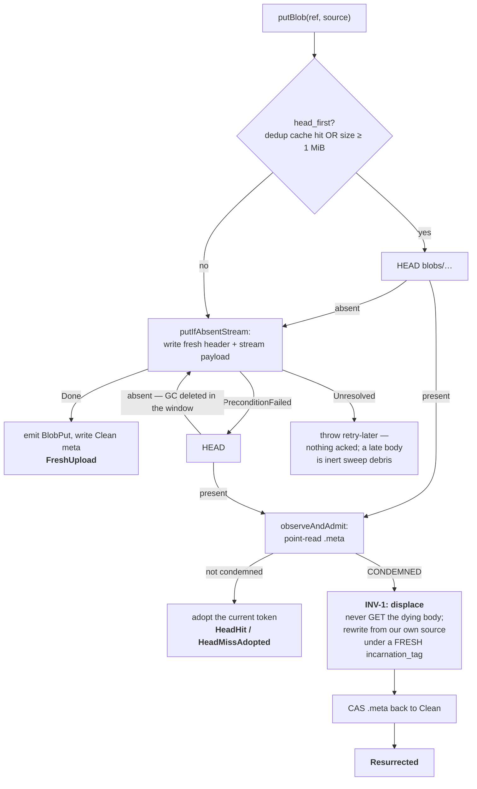

Ordered steps, `Pool/CasPartWriteTxn.cpp:160-245` and `:427-779`:

1. `requireAlive()` — the build is not abandoned, the namespace not dropped, the writer epoch still live.
2. Adaptive dedup gate: HEAD first if the dedup cache says present or the object is at least
   `dedup_head_first_min_bytes` (default 1 MiB). Below that threshold, a speculative conditional
   PUT is cheaper than a HEAD plus a PUT.
3. On a HEAD hit, `observeAndAdmit` point-reads the `.meta` and adopts the live incarnation — the
   body is never streamed.
4. Otherwise a bounded retry loop (≤ 8 attempts) around `uploadFromSource`, which mints a **fresh
   `incarnation_tag` per attempt** and does either a conditional server-side COPY from S3 staging
   or a streaming `putIfAbsentStream`. The byte count is verified against the declared source size;
   a mismatch is `LOGICAL_ERROR`.
5. A 412 means someone occupies the key. Because the key embeds the content digest, **any occupant
   is by definition the intended content** — this is exactly why ambiguity may be resolved by
   *occupancy* (one HEAD) rather than by comparing multi-gigabyte bodies
   (`Backend/CasRequestControl.h:266-270, 380-409`).
6. `Unresolved` never acks. It throws retry-later; a body that lands late is inert debris for the
   orphan sweep.

**Two writers uploading identical content.** Both derive the same key and both send
`If-None-Match: *`. S3 serialises them: one gets `Done`, the other gets 412, HEADs, point-reads
`.meta`, and adopts the winner's token as its own dependency. The loser never published anything
(a failed or cancelled sink publishes nothing), and its adopt is protected by its **own** durable
precommit edge. Both are safe, no bytes are wasted beyond one upload attempt.

### 7.4 The writer-versus-GC race {#writer-gc-race}

This is the heart of the design and deserves the most reviewer attention.

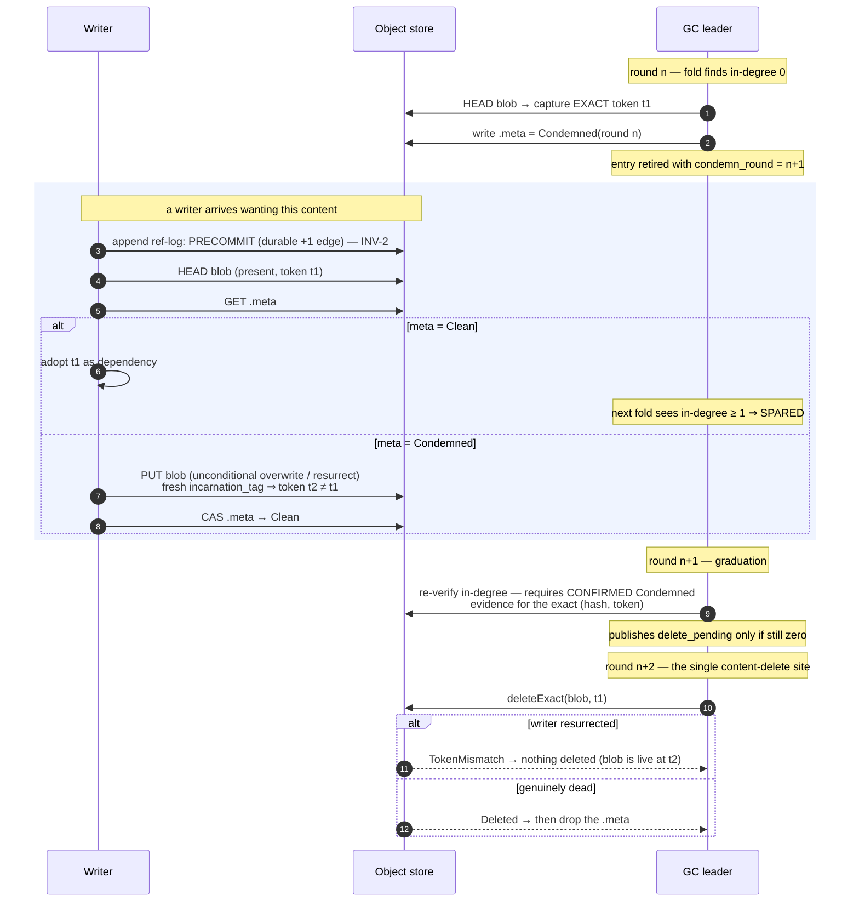

Why every interleaving is safe:

- A writer that **adopts** a token must have read a non-`Condemned` marker, and its precommit edge
  was durable *before* that read (INV-2). So the next fold sees in-degree ≥ 1 and spares the blob.
- A writer that **resurrects** changes the token. A stale `deleteExact(t1)` then returns
  `TokenMismatch` and reclaims nothing.
- The delete lags condemnation by **at least two full rounds**, and publishing `delete_pending` —
  the one edge that authorises an irreversible delete — requires *confirmed durable* `Condemned`
  evidence for that exact `(hash, token)` pair; without it, GC carries the entry and retries the
  marker write rather than throwing (`Gc/CasGc.cpp:1322-1350`).
- Both directions of the race therefore degrade to a spurious re-upload or a no-op delete. Neither
  can lose data or leave a dangling manifest entry.

**One asymmetry worth flagging in review:** the local-staging resurrect path materialises
`[header][payload]` fully in memory (`putOverwrite` has no streaming variant). It is bounded by a
byte-weighted admission semaphore, with overweight bodies running exclusively so they cannot
starve (`Pool/CasBlobUploadPool.h:41-124`), but it is the one place where a large blob is held
whole in RAM.

### 7.5 Deterministic artifacts {#deterministic-artifacts}

`putDeterministicArtifact` (`Gc/CasBlobInDegree.cpp:341-352`) is the write-once helper for objects
whose bytes are a pure function of their inputs — the GC source-edge runs and fold seals:

```cpp
if (backend.putIfAbsent(key, bytes).outcome == PutOutcome::PreconditionFailed) {
    const auto existing = backend.get(key);
    if (!existing || existing->bytes != bytes) throw Exception(CORRUPTED_DATA, ...);
    /* byte-equal ⇒ our own deterministic replay; adopt as a no-op */
}
```

The idempotency argument: the same inputs produce byte-identical output, so a replayed round
(leader deposed mid-round, round CAS aborted, crash-restart) re-derives exactly the same bytes.
A 412 therefore means "already occupied by our own replay", verified by comparison. Divergent
bytes are impossible under correct operation and fail closed.

It is explicitly **not** for observation-bearing artifacts (`Gc/CasBlobInDegree.h:133-135`): GC
outcome logs carry HEAD-observed tokens on which two observers may legitimately disagree, so those
use first-durable-write-wins byte-adopt semantics instead. And a blob body can never use this path,
because the fresh-tag rule makes two attempts of the same logical create legitimately differ.

---

## 8. Server identity, mount leases and server-scoped metadata {#leases}

### 8.1 `server_root_id` — the identity {#server-root-id}

Every content-addressed disk **must** be configured with an explicit `server_root_id` (srid). It
is validated and immutable, and it is deliberately **not** derived from `ServerUUID`
(`ContentAddressedSettings.cpp:83,168-192`; validator `Pool/CasServerRoot.h:198-228`: non-empty,
≤ 255 bytes, no empty / `.` / `..` segment, no `_files` or `_manifests` segment, fail-closed
`BAD_ARGUMENTS` with no sanitising fallback).

It roots four subtrees — `gc/server-roots/<srid>/`, `roots/<srid>/`, `cas/refs/<srid>/`,
`cas/manifests/<srid>/` — plus `staging/<srid>/`. Note that `blobs/` is **not** under it: content
is pool-global, which is what makes cross-server dedup work.

### 8.2 The owner claim {#owner-claim}

`claimOwnerOrThrow` (`Pool/CasServerRoot.cpp:108-163`) binds srid ↔ `server_uuid` permanently:

| Observed | Action |
|---|---|
| owner present, same uuid, not tombstoned | proceed |
| owner present, `retired_at_ms` set | `CORRUPTED_DATA` — explicitly decommissioned, refuses to resume |
| owner present, different uuid | `CORRUPTED_DATA`, message names the regenerated-uuid-file cause and three remedies |
| owner absent **and** subtree provably empty | `putIfAbsent` the owner |
| owner absent **but** subtree non-empty | `CORRUPTED_DATA` — "identity lost over existing data" |
| lost the `putIfAbsent` race | re-read; equal uuid ⇒ proceed, else `CORRUPTED_DATA` |

"Provably empty" means a 1-key LIST returns nothing on **all three** of `cas/refs/<srid>/`,
`cas/manifests/<srid>/`, `roots/<srid>/`. The owner object is never deleted and never reassigned;
decommission tombstones it in place.

A **second server with a different uuid** is refused at two independent gates and can never take
over, regardless of lease expiry. A **same-uuid live twin** (two processes sharing one uuid file
and srid — the classic container misconfiguration) is caught by the claim's token-stability
observation and aborts with a multi-line operator message rather than corrupting the pool
(`Pool/CasServerRoot.cpp:425-454`, thrown at `Pool/CasPool.cpp:625`).

### 8.3 The mount lease {#mount-lease}

One object, `gc/server-roots/<srid>/mount`, carries **both** the liveness lease and the build
watermark — there is no separate watermark object. Fields: server uuid, writer epoch, hostname,
pid, started-at, renewal `seq`, expires-at, `min_active` build sequence, and a `gc_fenced` flag
(`Formats/CasServerRootFormats.h:47-58`).

- **Cadence:** renew every `mount_renew_period` (default 10 s), TTL `mount_lease_ttl_ms`
  (default 30 s) — TTL/3. Each beat is a token-guarded `putOverwrite` with `seq + 1`; the keeper
  **never re-mints** the object (`Pool/CasServerRoot.cpp:1082-1118`).
- **The local fence** uses `CLOCK_BOOTTIME`, explicitly not `CLOCK_MONOTONIC`, so a VM resumed from
  suspend correctly sees itself expired (`Pool/CasMountRuntime.h:75-83`). The deadline is anchored
  at the **attempt-start** instant, never at response time.
- **Every durable write re-checks the fence generation** immediately before the object-store call
  and on every conditional retry (INV-15). Reads are not gated.
- `refAppendFenceOk` additionally refuses to *start* a ref-log attempt unless
  `attempt_timeout + safety_margin` fits inside the remaining lease — a request budget that could
  outlive the lease is rejected at mount time with `BAD_ARGUMENTS`.

**Losing the lease is neither read-only mode nor an abort.** It trips the fence (latch `lost`, bump
the generation, move to `TransientNotLive`) and schedules a self-remount with exponential backoff
1 s → 30 s. Renewal failures are classified five ways
(`Pool/CasServerRoot.cpp:905-986`), and only a *foreign uuid* — protocol-unreachable — is
`LOGICAL_ERROR`. Crucially, a `putOverwrite` that threw *before observing any outcome* does **not**
fence while the confirmed deadline is still comfortably ahead; only a **confirmed** mismatch is
immediately terminal. That is the fix for the historical "GC fences a beat-blocked lease" wedge:
a transient stall rides out, and even a real fence costs only an epoch, recovered by re-claiming
with a fresh one (bounded at 3 attempts).

### 8.4 How GC decides a server is dead {#heartbeat-floor}

`computeHeartbeatFloor` (`Pool/CasServerRoot.cpp:539-660`), GC round phase 2. One LIST of
`gc/server-roots/` plus one GET per mount slot:

- `gc_fenced` ⇒ already fenced (terminal, no write). `min_active == UINT64_MAX` ⇒ cleanly terminated.
- Otherwise a **token-stability observation on the leader's own monotonic clock**: a slot becomes
  fence-eligible only after the *same* renewal token has held for
  `ttl + ttl/20 + cadence` — the identical formula a re-mounting server uses. A stamped
  `expires_at_ms` **never** participates in the decision, and wall-clock `now` is audit-only. This
  makes the protocol immune to clock skew between servers.
- Fencing out is one token-guarded `putOverwrite` preserving the whole body with `gc_fenced = true`.
  On a precondition failure it re-reads and reclassifies (bounded) — it never excludes a server
  without a landed fence.

### 8.5 Server-scoped objects, in full {#server-scoped-objects}

Control plane — exactly three objects per server root:

| Key | Purpose | Lifecycle |
|---|---|---|
| `gc/server-roots/<srid>/owner` | permanent srid ↔ `server_uuid` binding | `putIfAbsent` once over a provably-empty subtree; only ever rewritten to add a decommission tombstone |
| `gc/server-roots/<srid>/epoch` | durable-monotone **next** `writer_epoch` | CAS-bumped on every writable mount and remount |
| `gc/server-roots/<srid>/mount` | liveness lease **+** `min_active` watermark | claimed at mount, `putOverwrite` every beat, `gc_fenced` by GC, terminal farewell on clean stop |

Data plane rooted at the srid: ref logs, ref snapshots and cleanup markers under
`cas/refs/<srid>/<ns>/`; part manifests under `cas/manifests/<srid>/<ns>/<build>/`; verbatim files
under `roots/<srid>/…`; and S3 staging under `staging/<srid>/`, which is excluded from every GC
LIST and reclaimed solely by that same server's next mount.

### 8.6 The two monotone counters {#counters}

**`writer_epoch` is durably monotone** — `allocateWriterEpoch` (`Pool/CasServerRoot.cpp:165-262`)
reads the `epoch` object, CASes it to `next + 1`, and returns `next`. The absent-epoch branch is
deliberately paranoid: absent with a non-empty subtree is `CORRUPTED_DATA` (reset hazard); absent
with an empty subtree decides by `probeSentinelRaw`, **never** by plain `get`-absence, because a
transport fault must not be flattened into "not found". A present mount under a normal mount
attempt is `CORRUPTED_DATA` — this is precisely how a same-`(uuid, epoch)` twin is prevented.

**`build_sequence` is monotone only within one incarnation** — it is a plain in-memory counter
reset to 1 on every process start (`Pool/CasMountRuntime.h:388`). Global ordering comes from the
**pair** `(writer_epoch, build_sequence)` compared lexicographically, which is exactly how GC
evaluates eligibility. The durable authority for both is the mount object itself; **no mount ⇒ no
deletion authority ⇒ nothing swept**.

### 8.7 The mount state machines {#mount-state-machines}

Two coupled machines. The durable slot:

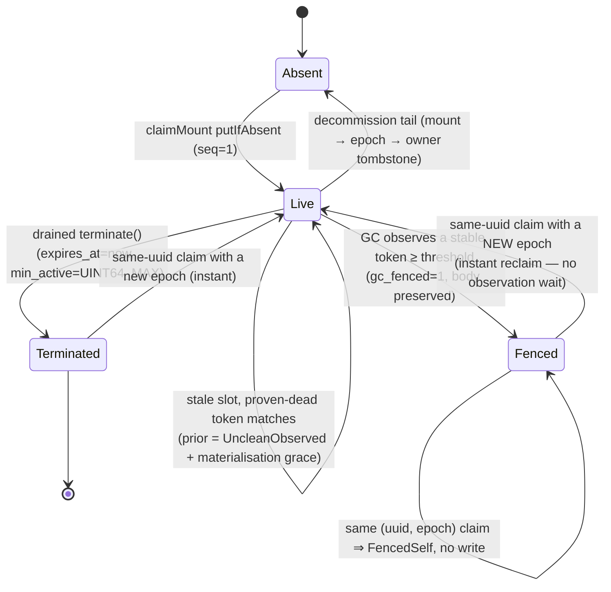

The in-process runtime:

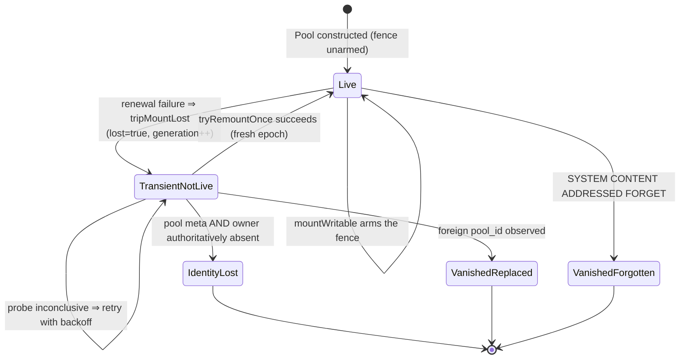

`IdentityLost`, `VanishedReplaced` and `VanishedForgotten` are terminal and absorbing: the remount
and GC threads self-exit, and there is deliberately **no auto-revive** — the pool's identity
disappearing under a live mount is an operator-level event, not something to paper over.

### 8.8 Mount, unmount, crash {#mount-lifecycle}

Writable open runs in a strict order (`Pool/CasPool.cpp:364-718`): bootstrap-residual proof →
capability probe under a random per-mount prefix → pool-meta create-or-validate →
`validateServerRootId` → owner claim → `allocateWriterEpoch` → mount claim and keeper adopt →
materialisation grace if the predecessor was unclean (default 30 s) → arm the fence → start
background renewal. If the grace consumed the TTL, one fresh renewal re-anchors the deadline before
the fence is armed. Startup publishes the pool, facade and GC scheduler under a single mutex
acquisition, so a mid-startup throw leaves nothing half-published.

**Clean unmount:** stop and join the remount thread → drain the ref lanes → only if the drain
certified quiescence, write the terminal farewell (already-expired, `min_active = UINT64_MAX`).
That sentinel is the certificate of clean death that lets a successor reclaim instantly. If the
drain did **not** certify, the keeper stops renewing and writes **no** farewell — deliberately: an
unearned farewell would let a successor start mutating while a stale conditional PUT is still in
flight.

**Crash:** no farewell, the renewal token freezes. Recovery is either (a) the same server restarts,
claims with a fresh epoch and waits out the token-stability observation, or (b) the GC leader
fences the slot first, after which any reclaim is instant.

**Permanent removal** of a dead replica is `Cas::decommissionPoolMember`
(`Tools/CasDecommission.cpp:99-374`): open impersonating the victim with a no-wait claim policy
(refusing immediately if the member is alive) → drop every ref-bearing namespace → sweep manifest
debris **before** the slot (deleting the mount removes the watermark authority) → drain staging and
roots → then, only with zero warnings, retire in the order mount → epoch → liveness re-check →
owner tombstone. One residual race is documented and deliberately left open at `:262-270`.

### 8.9 `system.content_addressed_mounts` {#mounts-table}

A read-only sibling of the heartbeat floor: one LIST plus one GET per slot, zero writes, per-row
fail-open (an undecodable body becomes `state = 'corrupt'`, never an exception). It shows **every**
srid in the pool, including peers. Columns cover identity (`server_root_id`, `server_uuid`,
`hostname`, `process_id`), the lease (`writer_epoch`, `renewal_sequence`, `started_at_ms`,
`expires_at_ms`, `min_active_build_sequence`, `gc_fenced`, `state`), GC health (`is_leader`,
`pending_reclaim`, `last_success_age_seconds`, `wedged_namespace_count` — **NULL on peer rows**,
because process-local facts must not be stamped onto another server's row), and the local
lifecycle. The lifecycle snapshot is I/O-free and ungated, so a not-live, never-started or vanished
disk still produces a row instead of silently disappearing from the table.

---

## 9. Part manifests and the orphan-manifest sweep {#manifests}

### 9.1 What a manifest contains {#manifest-content}

A part manifest has exactly four top-level fields (`Formats/CasPartManifestFormat.h:74-81`):

| Field | Meaning |
|---|---|
| `ref` (`ManifestRef`) | the manifest's own id, repeated in the body for fail-closed validation |
| `root_namespace_id` | the owning namespace, likewise repeated |
| `payload_digest` | integrity/debug **only** — never a key, never a dedup input, never an edge |
| `entries` | strictly ascending by path after decode |

Each entry is `{path, placement, BlobRef, blob_size, inline_bytes}`. The **hash algorithm travels
per entry**, so one manifest may legitimately mix algorithms. Inline bytes ride a raw payload zone
after the JSON records, because arbitrary binary cannot be JSON-encoded. Path hygiene (relative,
no empty / `.` / `..` segments) is enforced **at decode**, because manifest bytes arrive over the
interserver relink channel and are therefore untrusted input.

What a manifest deliberately does **not** contain, verified by reading the whole codec:

- **No offsets and no packed-file support.** One blob is one file's bytes; a read window is
  computed as `{blobKey, blob_header_len, blob_size}` using the pool-wide constant header length.
- **No projections field.** Projections are ordinary entries whose path has a `.proj` component;
  lookup is a prefix range over the sorted entries.
- **No codec info, no parent-manifest link, no source edges, no incarnation token.** A manifest is
  a flat, self-contained file list. The incarnation token is the backend ETag observed by HEAD,
  never stored.

**The manifest id is neither a content hash nor random.** It is
`ManifestRef = {writer_epoch, build_sequence, manifest_ordinal}` — durable writer epoch × monotone
per-incarnation build sequence × monotone per-build ordinal. That gives "no manifest id reuse" by
construction with no randomness. The GC-level identity is the pair
`ManifestId = (RootNamespace, ManifestRef)`; two namespaces may legally carry the same
`ManifestRef`.

Caps are enforced before the body is written: 1 048 576 entries, 256 MiB encoded text, 16 MiB total
inline, 1 MiB per inline entry (`Pool/CasPartWriteTxn.cpp:51-55`).

### 9.2 Immutability and repoints {#manifest-immutability}

A manifest is written once with a conditional create and **never rewritten**. A *different* object
at that key would be an id collision and is `CORRUPTED_DATA`, fail-closed, before any owner
transition names it. An unresolved PUT is not retried at the same key — the ordinal has already
advanced, so a late-landing body is inert debris for the sweep.

A repoint therefore writes a **new** manifest over the **same** blobs and moves the ref in one
ref-log record (§4.3).

### 9.3 Manifest lifecycle and what makes an orphan {#manifest-lifecycle}

```mermaid
stateDiagram-v2
    [*] --> Staged: stageManifest — body PUT (write-once)
    Staged --> PrecommitOwned: precommitAdd — ref-log OwnerTransition (+1 edges on fold)
    PrecommitOwned --> Committed: promote — Precommit→Committed (NO edge; net zero)
    Committed --> OwnerRemoved: drop / repoint / namespace removal (−1 edges)
    OwnerRemoved --> [*]: GC deletes the body AFTER the decrements are sealed (phase 15)

    Staged --> OrphanA: writer died before precommitAdd
    OrphanA --> [*]: writer best-effort delete, else the ORPHAN SWEEP (phase 18)

    PrecommitOwned --> DanglingPrecommit: writer died before promote
    DanglingPrecommit --> OwnerRemoved: binding removed by abandon,<br/>or by a successor's stale-precommit sweep
```

Two disjoint failure classes, and the distinction matters a great deal:

- **(A) Pre-precommit orphan** — the body exists but no ref-log record ever named it. It
  contributes no edges and nobody protects it. *This* is what the orphan sweep reclaims.
- **(B) Dangling precommit** — the transaction died between `precommitAdd` and `promote`. Nothing
  wakes it up (INV-10: `PartWriteTxn` is never persisted). The **binding** must be removed by a
  ref-log transaction — either the live writer's own `abandon`, or a fenced successor's
  stale-precommit sweep, which removes precommits whose
  `manifest_ref.writer_epoch < live_epoch` (`Pool/CasRefLedger.cpp:2677-2762`). Only after that
  `−1` folds does GC delete the body, on the ordinary owner-removal path.

The writer's own best-effort cleanup deliberately **skips** the precommit target when the precommit
was attempted at all — including the `Uncertain` case — because deleting a body that turns out to
be a live precommit would clamp GC's fold barrier forever. And `abandon` ordering is load-bearing:
append the precommit removal, *then* retire the build sequence, *then* best-effort delete debris.
Retiring first would advance the watermark past a build whose binding is still live.

### 9.4 The orphan-manifest sweep {#orphan-sweep}

Runs as the last phase of the GC round, cursor-paced and budgeted, wrapped in try/catch so it can
never fail a round (`Gc/CasOrphanManifestSweep.cpp:342-460`).

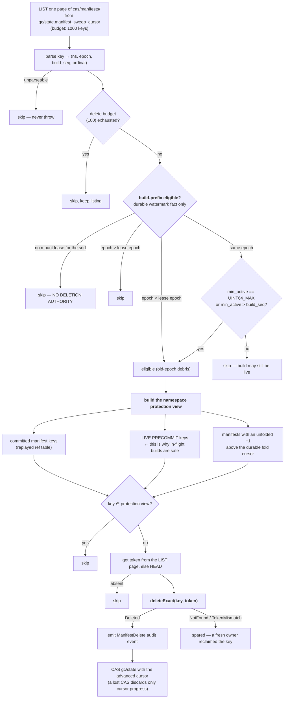

Points a reviewer should verify:

- **There is no age threshold and no time-based grace period anywhere in this protocol.**
  Eligibility comes exclusively from the durable watermark in the mount lease. No mount ⇒ no
  authority ⇒ nothing is swept.
- The protection view is built from the **same complete replay** that writer recovery uses, and a
  namespace whose view fails to build is added to an errored set and has **all** of its deletions
  skipped — an empty owner set is never substituted for a failed one.
- The sweep deletes **only manifest bodies and emits no blob deltas**, which is correct precisely
  because a pre-precommit body never contributed a `+1`.
- Contrast with the owner-removal path, which is ordered the other way: fold the `−1` edges → the
  round CAS adopts the decrements → *then* delete the body (phase 15). A crash there leaks bodies
  to this sweep; it can never produce a dangle.

### 9.5 Source edges: how a manifest makes blobs live {#source-edges}

Blob liveness is a **set of source edges**, not a counter (`Gc/CasBlobInDegree.h:138-156`). This is
what makes the fold idempotent (INV-8).

- An edge id is `sourceEdgeId(ManifestId, path)` = CityHash128 over
  `ns \0 BE64(epoch) BE64(build_seq) BE32(ordinal) \0 path`. It is an *edge identity*, deliberately
  not a content hash and not reconstructable. A collision with the reserved sentinel `0` throws.
- On disk an edge record is `algo ++ digest ++ source_id`, 33 or 49 bytes, in write-once per-shard
  run segments.
- **Edges are never written at manifest-write time.** They materialise only when GC folds a ref-log
  transaction that changes ownership: add-precommit ⇒ `+1` per Blob entry; either removal ⇒ `−1`;
  **promote ⇒ no edge at all** (the manifest never loses an owner, so it is net zero). Inline
  entries produce no edges — they have no separate object to reclaim.
- Deltas and queued body-deletes are staged per log and merged into the round only when the whole
  log folds, so a partially folded log can never delete a body whose edge is still unfolded.

### 9.6 The read-side manifest cache {#manifest-cache}

`CasManifestReader` caches decoded manifests keyed by **`(ManifestId, Token)`** — the token is in
the key precisely so that a re-incarnation under the same id misses.

**A HEAD is mandatory even on a cache hit** (`Pool/CasManifestReader.cpp:63-81`): it proves the
live ref still names an existing object (INV-9 no-dangle) and supplies the token. Only then is the
cache consulted. On a miss, the GET is followed by *both* identity checks — the body's self-declared
`ref` must match the key, and its namespace must match — each `CORRUPTED_DATA` on failure. Only a
fully validated decode enters the cache. Size is byte-weighted (`manifest_decode_cache_bytes`,
default 128 MiB); setting it to 0 disables caching while leaving the HEAD-and-validate sequence
intact.

---

## 10. The RefLedger {#refledger}

Refs are the only mutable state in the system, so this is where the concurrency design is
concentrated.

### 10.1 What a ref is {#what-a-ref-is}

- **Name** — a canonical clean relative path, in practice the part directory name with an optional
  `detached/` or `moving/` prefix (§6.2).
- **Value** — `{ref_name, ManifestRef, published_at_ms}`. Note there is **no token/ETag** in a ref
  row; the cross-server "confirm token" is the text form `epoch:build:ordinal`.
- **Scope** — one ref table per `RootNamespace`, i.e. per table per server root. The namespace is
  not stored inside the ref value; it is re-qualified from the owning context.
- **Ownership slots** — a `ManifestRef` has at most one owner across the table, in one of two
  slots: `Committed` or `Precommit` (INV-17). Precommits are keyed by the pair
  `(ref_name, manifest_ref)`, so several in-flight builds may legitimately contend for one ref name.

### 10.2 In memory {#in-memory}

`RefTableState` holds a copy-on-write map of committed rows, a set of precommits, an O(1)
manifest-ownership index for the uniqueness invariant, a lifecycle (`Live` / `Removed`), the
greatest applied transaction id, and O(1)-maintained body-size counters used for admission.

The COW structures (`Pool/CasRefCowMap.*`, `Pool/CasRefCowManifestSet.*`) are a shared base map plus
an overlay of changes with tombstones. Copying a state is a refcount bump, so the flush's trial and
candidate copies cost O(touched rows), not O(table). Both `swap` operations are **noexcept and
allocation-free** — that is precisely what makes the post-durable install region legal (see step 10
below).

Two mutexes with a fixed order, `ref_queue_mutex → state_mutex`, never the reverse. **Network I/O
is never performed under `state_mutex`.** Readers take `state_mutex` briefly and read the
*installed* state, so a reader sees either a whole transaction or none of it — never a partial
batch.

Whole tables are evicted LRU against `ref_table_cache_bytes` (default 256 MiB), and only when the
table is quiescent, unreferenced, leaderless and **not wedged**.

### 10.3 In S3 {#in-s3}

Three immutable object kinds under `cas/refs/<ns>/`:

| Kind | Key | Content |
|---|---|---|
| log | `…/_log/<epoch-hex>-<seq-hex>.zst` | exactly **one** transaction: `{ns, txn_id, ops[]}` |
| snapshot | `…/_snap/<epoch-hex>-<seq-hex>.zst` | the whole table: lifecycle, sorted committed rows + precommits |
| cleanup marker | `…/_cleanup/<epoch-hex>-<seq-hex>` | zero bytes — GC's proof that a namespace removal physically completed |

`RefTxnId = {writer_epoch, ref_sequence}` is rendered as two fixed-width 16-hex fields, so
**lexical key order equals tuple order**. Ids are **per-namespace and contiguous** (INV-1): within one
`(namespace, writer_epoch)` they run `1, 2, 3, …` with no holes, and a new mount epoch restarts the
sequence at 1, with `writer_epoch` as the primary ordering component. There is no counter — each id is
derived from the table's own greatest applied id (`nextRefTxnId`), so two namespaces of the same mount
both count from 1 independently and an attempt that provably sent nothing consumes no id. A hole is
therefore not an allocation artefact but corruption, and `applyRefLogTxn` rejects a non-successor id as
`CORRUPTED_DATA` — which is what lets a reader conclude "I can see `1..T`, so nothing is missing".

The op vocabulary is deliberately tiny: `NamespaceBirth`, `OwnerTransition{old?, new?}`,
`SetPublishedAt`, `RemoveNamespace`. There are exactly **four** legal `OwnerTransition` shapes —
add precommit, remove precommit, remove committed, and promote — enumerated identically by the
state machine and by GC's edge extractor, which is a nice property for review: the two readers of
the format cannot drift.

Logs are pure conditional creates on write-once keys. **There is no append-to-object and no
CAS-swapped mutable pointer anywhere in the ref lane.** Snapshots are likewise write-once, named by
the transaction they cover. The writer never deletes ref objects; only GC does (§13.7).

Snapshots are published in the background, best-effort, one in flight per table, when the tail
exceeds `snapshot_log_count_threshold` (default 256 logs) or `snapshot_log_bytes_threshold`
(default 1 MiB). Failures arm per-table exponential backoff of 200 ms → 30 s.

### 10.4 Publishing a ref mutation {#ref-write-protocol}

All mutations funnel through one flat-combining lane, `CasRefLedger::appendRefOps`. A single flush
carves a batch out of the queue and commits it as one or more transactions.

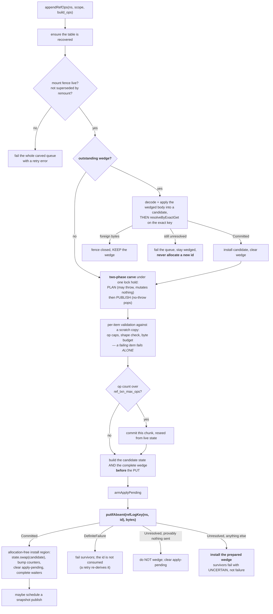

The **wedge** is the mechanism that makes INV-14 concrete: at most one per table, recording the
single conditional PUT whose outcome is unknown, complete with the key and the sealed bytes. The
next flush must resolve *that exact key* before it is allowed to allocate a new transaction id.
That is why an unresolved write can never silently become a gap, and why the ledger never
double-publishes.

Crash points: between the PUT and the install, the object is durable and unapplied — the next
mount's recovery replays it. Between `promote`'s log and its caller, re-driving is idempotent
(`promote` no-ops when the ref already names that exact manifest). Between `precommitAdd` and
`promote`, the dangling precommit is reclaimed by the successor's stale-precommit sweep (§9.3).

### 10.5 Recovery and the memory↔S3 consistency guarantee {#ref-recovery}

Recovery is lazy per table, on first touch (`Pool/CasRefLedger.cpp:394-736`):

1. One paginated LIST of `cas/refs/<ns>/`; every key is strictly re-parsed and re-matched against
   the namespace (untrusted input).
2. Take the **greatest** snapshot; GET and decode with key↔body binding validation.
3. Stream every log strictly greater than it through a replay builder — GET, decode, apply,
   discard, one transaction resident at a time.
4. **Vanish-restart:** an object that disappears between the LIST and the GET is a concurrent GC
   cleanup, not corruption; restart with a fresh LIST, bounded at 3 attempts.
5. **Recovery seal:** on an unclean boundary, publish a snapshot at the synthetic id
   `{my_epoch − 1, UINT64_MAX}` before exposing the table. That id dominates any straggler the dead
   epoch could still materialise. A failed seal leaves the table unrecovered, so the next touch
   retries everything.
6. Transient network errors retry the whole attempt with capped backoff; corruption and logic
   errors fail fast.

**Authority.** For a mounted writer the recovered in-memory table is authoritative for reads of its
own namespaces — there is no other writer of that namespace. S3 is authoritative for durability:
in-memory state advances **only after** a durable PUT. Read-your-writes holds for callers on this
mount: `appendRefOps` returns only after the durable install. In-flight precommits are visible only
through the precommit set, never through `resolveRef`.

**What other processes see.** Two cross-process readers exist:

- **GC and fsck** do their own cold LIST-and-replay. Their staleness bound is "whatever was durable
  at LIST time"; an unpublished tail is invisible to them.
- **The relink confirm** (`confirmExactRef`) does **zero I/O** and answers `Yes` only when the table
  is resident, warm, not superseded, the lane is quiescent, the row matches exactly, and — evaluated
  **last**, under both mutexes — the mount fence is still live. `No` is not proof of the negative;
  only `Yes` is fence-gated. This asymmetry is deliberate and is why the wire collapses `No` and
  `Unknown` into a single `unproven` answer (§12).

> **In-flight work reviewers should know about:** the "v9 contiguous-chain" ref rework — per-namespace
> contiguous ids with an arithmetic chain walk closing the cold-LIST middle-gap hole — exists on this
> branch **only as TLA+ models and written plans**. The C++ ref lane is still the LIST-based
> snapshot+log design described above, which trusts the LIST as complete and enforces strict
> increase, not contiguity (`Pool/CasRefLedger.cpp:2189`). A missing middle log would be silently
> skipped. This is a known, tracked gap, not an oversight.

### 10.6 How GC sees the live set {#gc-sees-refs}

GC never queries the ledger. Per round it LISTs `cas/refs/`, groups keys by table, and GETs every
log above the durable per-table cursor in ascending order, extracting manifest edges (§9.5). The
cursor advances per **fully folded** log. A missing manifest body clamps that table below the log;
an undecodable body or an unrecognised transition shape aborts ref folding for the whole round.

**Namespace removal** is a two-party handshake worth tracing in review: the writer appends the exact
removals plus `RemoveNamespace` and best-effort publishes a constant-size `Removed` snapshot — and
deletes nothing. GC then drains the namespace physically, publishes the zero-byte `_cleanup/<id>`
marker, and republishes the `Removed` snapshot if absent. That marker is the **exact** precondition
the writer's `precommitAdd` requires before it may re-birth the namespace.

---

## 11. The part-add protocol {#part-add}

The durable order is fixed and load-bearing:
**`stageManifest` → `precommitAdd` → `putBlob` → `promote`** (INV-2).

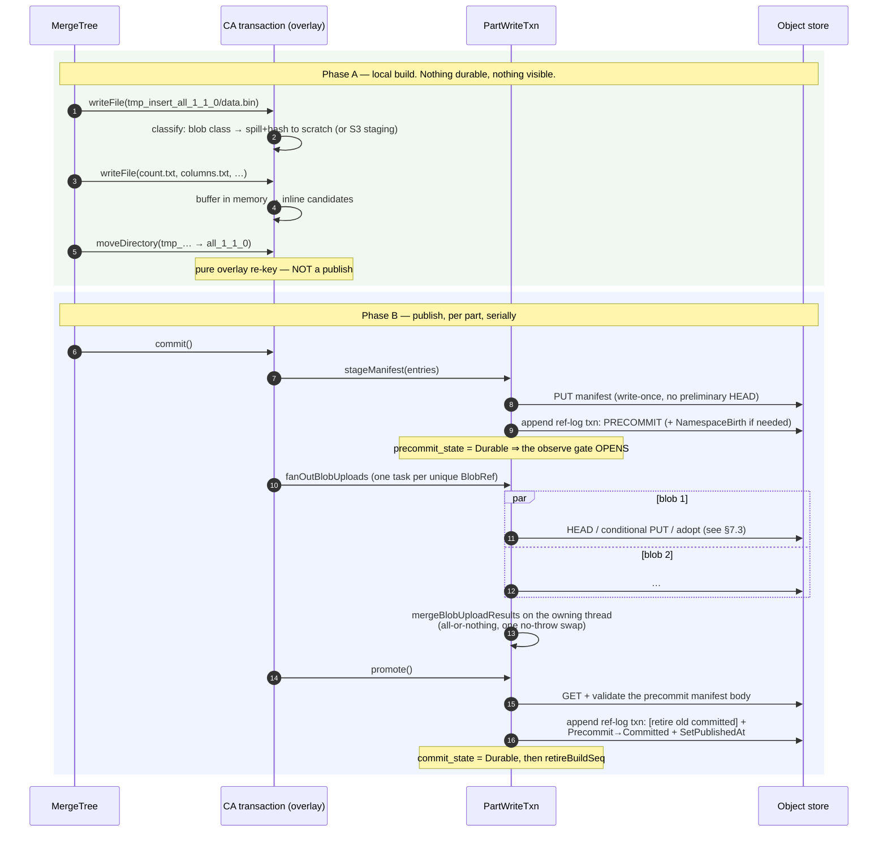

### 11.1 The steps, and why each is where it is {#part-add-steps}

**Phase A — staging.** The transaction is an eager overlay, not a queue: `writeFile` immediately
classifies the path (§4.2) and either spills the bytes to a hashing buffer or holds them in memory.
Blob-class files stage to local scratch by default, or — if `stagingBackend() == S3` **and** the
mount-time conditional-copy probe passed — to an S3 staging object written as `[header][payload]`
so that the later promote is a verbatim server-side copy. The `tmp_ → final` rename is a pure
overlay re-key; the durable publish happens only in `commit`.

**Phase B, step 1 — `stageManifest`.** Caps are checked *before* the write; the id is minted as
`{epoch, build_seq, ordinal++}`; the body goes out with a conditional create and **no preliminary
HEAD**. Both `DefiniteFailure` and `Unresolved` throw retry-later.

**Step 2 — `precommitAdd`.** The intent (target namespace, final ref name, manifest) is recorded
**before** the append, precisely because an unresolved append may have landed. One ref-log
transaction adds the precommit binding. Re-birthing a `Removed` namespace additionally requires
this mount to have *observed* the exact `_cleanup/<remove_txn_id>` marker (§10.6). On return the
precommit is durable — and only now may the writer adopt existing blobs.

**Step 3 — blob upload fan-out.** One task per **unique** `BlobRef`, deterministic dispatch order,
one pre-sized result slot per ref. The calling thread only submits and joins, never occupies a pool
slot, so a size-1 pool degenerates to a correct serial run and can never deadlock. A scope guard
joins every scheduled task on every exit path. The contract is **merge-nothing**: if any task threw,
nothing is merged and the first error in dispatch order is rethrown. Results are folded into the
dependency set **on the owning thread**, into a copy, committed by one no-throw swap — so the
dependency set is never partially merged. Pool size is the server setting
`content_addressed_blob_upload_pool_size` (default 16).

**Step 4 — `promote`.** Reads and revalidates the precommit manifest body once; sets
`commit_state = Uncertain` **before** the append (past this point, failure is no longer proof of
the negative); checks that the precommit is still the live owner; then revalidates leaves. Tokened
leaves are skipped because they are edge-protected; tokenless leaves must be evidence adopts,
trusted through the durable manifest edge with **no per-file HEAD**; anything else is
`LOGICAL_ERROR` (INV-11). The whole thing lands as **one** ref-log record: optional retirement of
the old committed binding, the pure `Precommit → Committed` owner move, and `SetPublishedAt`.
Promotion emits **no blob deltas** — the manifest never loses an owner, so it is net zero.

### 11.2 Crash points and their cleaners {#crash-points}

This table is the single best summary of the design's crash-safety story.

| # | Crash window | Left behind | Who cleans it |
|---|---|---|---|
| C1 | during staging | local temp files / S3 staging objects | local: unconditional cleanup + buffer destructor. S3: the mount's own staging sweep at next mount — never deleted on abort |
| C2 | after `stageManifest`, before `precommitAdd` | an unreferenced manifest body | writer's best-effort exact-token delete; durable backstop = the orphan sweep (§9.4) |
| C3 | `precommitAdd` returned `Unresolved` | a possibly-live precommit binding | intent recorded pre-append; `abandon` appends the exact removal tolerating absence. The **body is never writer-deleted** |
| C4 | between `precommitAdd` and `promote` | a live precommit plus uploaded blobs | no resume path exists (INV-10). Removed by `abandon`, else by a fenced successor's stale-precommit sweep |
| C5 | mid blob fan-out | already-uploaded blobs | nothing merged; blobs become GC-reclaimable debris; the part is not published |
| C6 | `promote` append `Unresolved` | the ref may or may not be committed | `CommitState::Uncertain` — the relink layer maps this to "retry the whole fetch", never to a byte fetch |
| C7 | a later part throws after earlier parts published | a partial multi-part commit | precise rollback: drop only refs this call created, matching the exact manifest — never clobbers a concurrent writer's repoint |
| C8 | transaction destroyed uncommitted | open builds | destructor abandons every build (INV-19) |
| C9 | namespace dropped mid-build | — | one atomic flag; every further op fails closed at `requireAlive` |

Every row leaks; no row loses data or dangles. That is the asymmetry from §3.3, made concrete.

### 11.3 How each MergeTree operation maps {#operation-mapping}

- **INSERT** — the canonical path. Projections ride the **parent** part's transaction.
- **Merge** — identical for the output part. `<proj>.tmp_proj → <proj>.proj` is an entry-prefix
  re-key inside the staged manifest, not a rename.
- **Mutation** — `createHardLink` per unchanged file. Two arms: a source staged in *this*
  transaction copies the entry (and the pending-blob record, so both parts upload independently); a
  **committed** source takes a fresh view of the source manifest and records a **tokenless evidence
  dep with no HEAD and no GET**. So a mutation is a manifest rewrite: unchanged columns are adopted
  by hash, changed ones are fresh uploads, and **zero bytes move** for the carry-forward.
- **ALTER / metadata rewrites** — standalone writes into a committed part, i.e. repoints (§4.3).
- **DROP PART** — `removeDirectory` drops the ref and clears any per-file removal marks, so an
  unlink storm followed by a drop costs exactly one ref-drop and zero repoints.
- **DROP TABLE / DETACHED / UNFREEZE** — namespace or prefixed-ref drops. **Blobs are never deleted
  here**; removal is pointer-unlink plus deferred GC.
- **RENAME TABLE** — republish every ref and verbatim file into the new namespace, then drop the old
  one. Explicitly **not atomic** across namespaces, but idempotent and re-drivable, and it logs
  loudly if it leaves a table split. True atomicity would need a move journal and is deliberately
  out of scope.
- **FREEZE / BACKUP / RESTORE / cross-disk MOVE** — each wraps the whole clone in **one** disk
  transaction, because a CAS part is one atomic unit.

---

## 12. The part-fetch protocol (fetch by relink) {#part-fetch}

When two replicas share a pool, a fetch should move **no bytes**. The mechanism is a three-trip
handshake between the receiver (R) and the sender (Snd), gated on both sides proving they mean the
same pool.

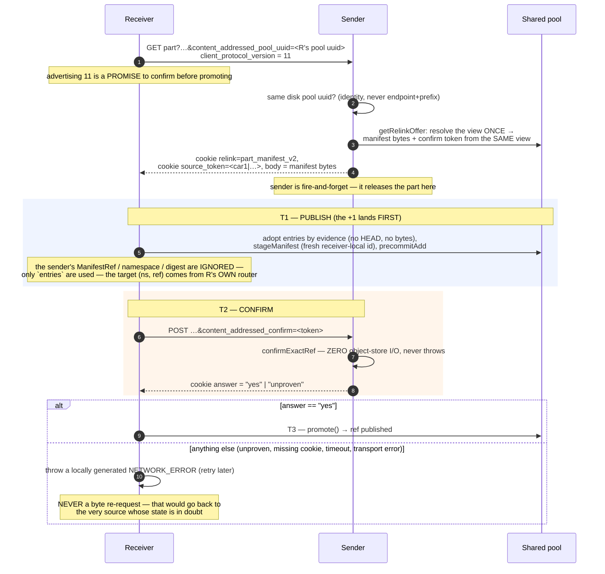

### 12.1 The gates, in order {#relink-gates}

1. **Pool identity.** The receiver advertises its pool uuid; the sender offers relink only if its
   own disk's pool uuid is **equal**. Matching by endpoint and prefix was tried and rejected — a
   minted `pool_uuid` is the identity.
2. **Protocol version 11** on the receiver side is a promise to run the confirm trip before
   promoting.
3. **One resolution for two outputs.** `getRelinkOffer` produces the manifest bytes *and* the
   confirm token from the **same** view. Two separate calls would allow a repoint in between and
   hand the receiver a token naming a manifest whose entries it never adopted.
4. **The receiver trusts nothing from the wire but the entry list.** The sender's manifest id,
   namespace and payload digest are ignored; the target namespace and ref come from the receiver's
   own router (so `TABLE/detached/DIR` folds onto ref `detached/DIR` in the receiver's namespace);
   and manifest path hygiene is validated at decode.
5. **The confirm is I/O-free and fail-closed.** A cold, evicted, unfenced or terminal mount answers
   `Unknown`. `No` and `Unknown` both go on the wire as `unproven`, because the fence check is
   evaluated *last* — so a `No` cannot be distinguished from "I can't prove it right now".
6. **Only the literal `yes` authorises promotion.** Everything else — including a timeout — is one
   outcome: throw and retry later.
7. **Promote outcomes are three-way.** `Committed` proceeds; a *proven* not-committed (body-absent
   precommit, precommit no longer live owner, ref conflict) falls back to a byte fetch; `Unresolved`
   **throws**, because returning "fall back" there would publish the part twice.

The byte-fetch fallback is bounded: it re-invokes the fetch with relink disabled, which stops the
receiver advertising its pool uuid, which stops the sender offering relink — so the relink path
cannot be entered twice for one fetch. Byte-fetched files content-address and dedup on arrival
anyway.

### 12.2 What actually seals "commit before release" {#relink-seal}

The receiver's `+1` (its precommit binding) is durable **before** the sender is asked anything, and
any removal of the sender's binding is appended strictly after that `+1` is in the ref log. That
ordering — steps T1 → T2 → T3 — is the whole seal.

> **A limitation stated in the code itself, and the right thing for reviewers to probe:** this does
> **not** establish that every subsequent GC fold *sees* that `+1`. The TLA+ model
> `CaRelinkConfirmCore.tla` breaks `ConfirmedRelinkNeverDangles` under a configuration with one
> incomplete listing page. So a confirmed relink is **not proven dangle-free**; `yes` means only
> "the source still holds exactly this manifest right now". `ca-fsck`'s reachable-but-absent scan
> is the backstop. Both call sites say so explicitly.

> **Doc drift:** the earlier "sender-created epoch-floor retention pin" design was **superseded** by
> this publish-confirm handshake and does not exist in the code — grepping for retention pin / epoch
> floor in the CAS tree returns nothing.

### 12.3 Detach, attach, drop {#detach-attach-drop}

A detached part is **not** a separate namespace — it is a ref in the table's own namespace with a
`detached/` prefix (same for `moving/`). Only FREEZE uses a genuinely separate shadow namespace,
which `ownsNamespace` deliberately refuses to claim so it can never be relink-confirmed.

DETACH, ATTACH, `delete_tmp_` cleanup and merge-result renames all reduce to the same two moves:
re-key any *staged* source into the destination, then `republishRef(src → dst)` for any *committed*
source. `republishRef` re-reads the source manifest freshly, publishes an equivalent-entry manifest
under the destination ref (a **new** manifest id, blobs untouched and adopted by evidence), then
drops the source ref. A destination that already exists with identical entries just drops the
source — idempotent re-drive; with different entries it throws.

So manifests are per-ref and never moved: a detach creates a new manifest for `detached/<part>` and
retires the old one, and the blobs' net in-degree is unchanged.

---

## 13. Garbage collection {#gc}

> **Read this first — the docs are stale here.** `docs/superpowers/cas/04-gc-protocol.md` describes
> a round shaped as *fold → retire → fence → recheck → trim*. That is the **superseded R1–R4
> design**. The implemented round is a **single pass of 18 named phases ending in exactly one
> `gc/state` CAS**. The authoritative phase list is the enum in
> `src/Interpreters/ContentAddressedGarbageCollectionLog.cpp:63`, and the driver is
> `Gc::runRegularRound` (`Gc/CasGc.cpp:283-923`).

### 13.1 Leadership {#gc-leadership}

There is **no separate GC lease object**. The lease lives inside `gc/state` itself as
`{owner: UInt128, seq: uint64}` (`Formats/CasGcStateFormat.h:15-19`).

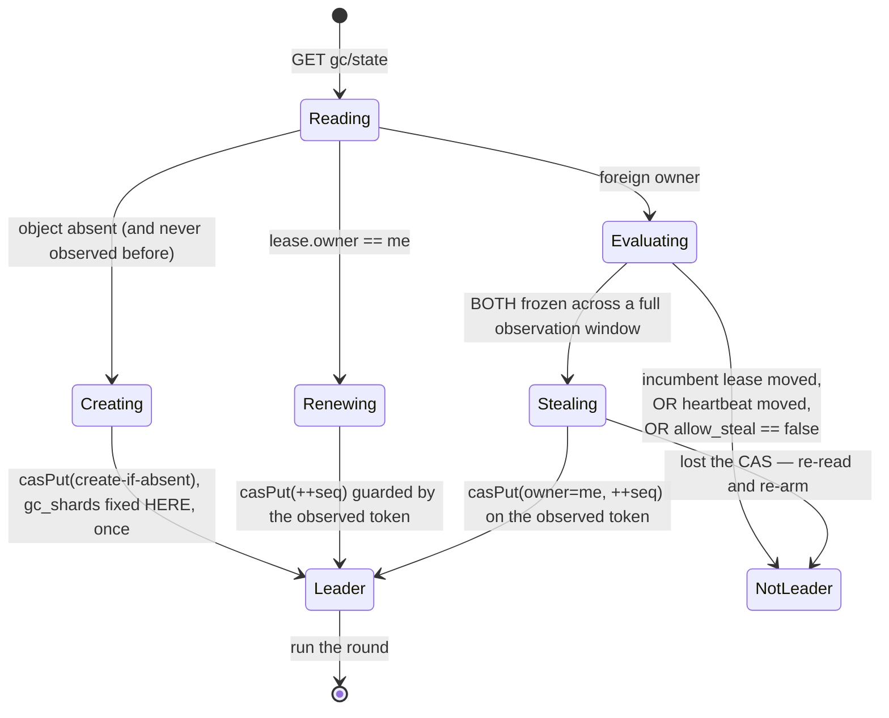

Two independent liveness signals are consulted before a steal: whether the lease `(owner, seq)`
moved since the last tick, and whether the separate `gc/hb` heartbeat moved. The heartbeat is
compared **only under the same remembered heartbeat owner**, and deliberately *not* against
`lease.owner` — a deposed leader's heartbeat thread keeps pulsing, and that must not cause a live
new leader's lease to be stolen. The paced loop may steal; a manual `SYSTEM … GC` round may not,
because the safety argument needs two observations separated by real wall time.

**Because every renew or steal bumps `seq`, `seq` doubles as the round's attempt id** — which is
what makes concurrent leaders safe.

**A deposed leader that keeps running cannot corrupt anything**, and the argument does not rely on
exclusivity at all (`Gc/CasGc.h:218-231`):

1. `gc/state` is published by exactly **one** CAS per round; a deposed leader's CAS fails and its
   entire round evaporates.
2. Every fold artifact is written under that leader's **own attempt number**, so it is invisible to
   every reader and is reclaimed later by wholesale generation pruning.
3. Destructive pre-CAS actions are justified **only** by previously published durable state, so
   they are replay-idempotent.
4. Deletes are exact-token, so a stale leader can never delete a newer incarnation.

The lease is therefore **work de-duplication, not mutual exclusion**. That is an unusual claim and
deserves scrutiny in review.

### 13.2 The round {#gc-round}

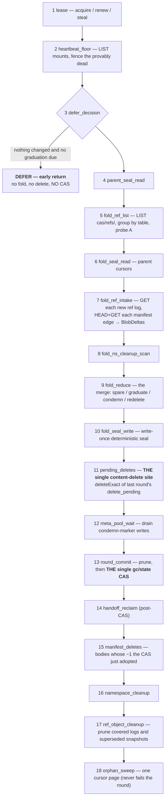

Orderings that are load-bearing and should be checked in review:

- **16 before 17**: the `Removed` snapshot must be durable before the logs it covers are deleted.
- **15 after 13**: manifest bodies are deleted only after the CAS adopted their decrements.
- **13's prune before the CAS**: a pre-CAS destructive action may rely only on already-published
  state.

**Clamp suppression.** `suppress_destructive = !anomalies.empty()` is computed **once** and threaded
into the merge, the ref cleanup and the namespace cleanup so they cannot desynchronise. Under
suppression there is no graduation, no redelete and no ref or namespace deletion; condemnation and
sparing continue, because both are non-destructive.

**Fail-closed aborts** (a throw before the CAS means nothing is adopted): unapplied transactions,
cursor/apply inequality, a missing adopted seal, a table with a snapshot but no surviving log and no
cursor, a non-total condemned summary, and a created delete marker (which means bucket versioning
is on).

### 13.3 The one-pass commit and what persists between rounds {#gc-state}

`gc/state` is the **entire** durable GC control state: `round`, `gc_shards`, `snap_generation`,
`snap_pruned_through`, `snap_attempt`, `manifest_sweep_cursor`, and the lease. Exactly one CAS per
round publishes it; the fold itself no longer CASes.

**The fold seal *is* the coverage record** (`Formats/CasFoldSealFormat.h:84-102`): generation,
parent generation, per-namespace-shard coverage with the last folded ref id, references to the
source-edge run segments, a per-shard condemned summary, and namespace-cleanup items. It is encoded
deterministically, so a replayed round produces byte-identical bytes and adopts its own output
(§7.5).

Two things reviewers often expect and will not find:

- **There is no separate retired-list object.** Condemned entries ride the source-edge run as
  sentinel rows at `source_id = 0`. The parent run *is* the retired input.
- **There is no run-file list outside the seal.** Runs are resolved *through* the seal's references,
  never by key construction — necessary because a pure-carry shard's run physically lives under an
  older generation's key.

The condemned summary is what makes the next round's graduation and pure-carry decisions cost
**zero extra I/O**. Outcome logs are forensic only: nothing reads them back for a protocol decision.
Leader-local state (rounds since last fold, mount observations, confirmed markers) is deliberately
not persisted and is conservative when lost.

### 13.4 Finding orphans {#gc-orphans}

**In-degree is a set of source edges, not a refcount** (§9.5). Universe discovery is a LIST of
`cas/refs/` — there is no registry object any more.

A blob becomes a candidate when its edge set becomes empty and it was touched this pass: one HEAD
captures the **exact incarnation token and size** that a future delete will name. A blob merely
*carried* from the parent run pays no HEAD.

**The grace period is measured in rounds, not acks:** an entry graduates once it has survived one
full round (`condemn_round < current_round`). The heartbeat floor from phase 2 is **liveness only
and never gates graduation** — a common misreading.

**What replaced the old explicit fence and recheck phases:**

1. **The fold barrier** — the cursor never advances past an event that leaves a live precommit whose
   manifest body is not present and valid; it is re-read every round. The escape hatch is that a
   precommit whose build is *provably dead* by the durable watermark is skipped rather than clamping
   forever.
2. **The three-cursor merge itself** — every prior condemned entry is re-verified against this
   pass's in-degree, and recovery wins even past the floor.
3. **Two-phase graduation plus exact-token delete** — an in-flight writer that adopts the same token
   must have observed a non-condemned marker earlier, so its edge landed before the marker turned,
   and the delete fires only from a later fold whose cut postdates it.

**The 404 rule.** A body that is *present but invalid* is `CORRUPTED_DATA`, hard. A body that is
*missing* is **never** a throw — the fold records and continues, and the caller decides by position:
a precommit activation clamps as a barrier; a committed or removal fold clamps that table only.
Prunes are likewise fail-open on 404.

### 13.5 Condemnation and deletion {#gc-condemn-delete}

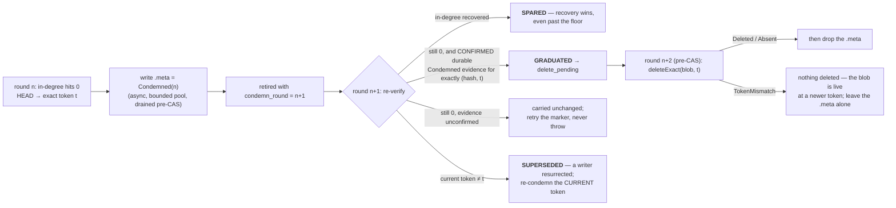

- The `.meta` carries **no token** — it is a per-hash hint. The exact incarnation token lives in the
  condemned sentinel row inside the run, together with the condemn round and two flags
  (`delete_pending`, `marker_confirmed`).
- **GC's marker is add-only** (INV-20): `Clean → Condemned` yes; the reverse never, not even when
  sparing. Only a writer that already displaced the body may clear it.
- **Minimum two full rounds** between condemnation and deletion.
- Settlement rules, per condemned row against the merged in-degree `d`: `delete_pending` with
  `d > 0` ⇒ **spared** with a loud log (structurally unexpected, reachable under a dedup-adopt race
  — and never a fail-closed delete); `delete_pending` with `d == 0` ⇒ redelete;
  `d > 0` ⇒ spared; `d == 0` and old enough and the evidence gate passes ⇒ graduate; otherwise carry
  byte-unchanged.
- `delete_pending` is terminal — an entry is never un-pended.

### 13.6 Sharding {#gc-sharding}

`gc_shards` is fixed at first lease acquire and immutable; decoders reject 0. A blob routes by the
**high** 64 bits of its digest, read big-endian explicitly.

The role split (`Gc/CasGcShardPlan.h:125-136`) is worth internalising: the **coordinator** (the
lease holder) owns discovery, round visibility, the single global fence and the generation advance —
these span the whole universe and must not be sharded, because a publish into *one* namespace can
protect a blob owned by *any* shard. **Reducers** own only their disjoint shard; their run-key
namespaces never collide, so two servers could reduce different shards concurrently and reducer work
needs no lease.

A shard with an empty delta bucket **and** no condemned entries in the parent summary copies the
parent's run references verbatim — **zero run I/O** ("pure carry"). A missing parent summary entry
on a non-fresh pool is `CORRUPTED_DATA`, never silently treated as zero.

> **Doc drift:** `04-gc-protocol.md:683` still lists `Gc::reclaimDroppedShards`. It no longer exists
> — with the snapshot+log ref model there is no mutable per-namespace shard object to tombstone, and
> physical namespace reclamation is the namespace-cleanup item instead.

### 13.7 Pruning old objects {#gc-pruning}

- **Ref logs and snapshots** (phase 17): a log is deletable only when it is covered by **both** the
  durable fold cursor **and** a durable snapshot; snapshots strictly older than the newest observed
  one are deletable. A `remove_namespace` log is retained until its cleanup item completes. There is
  no batch delete, so it is HEAD + `deleteExact` per key.
- **Generations** (phase 13): keep the last `gc_snap_generations_to_keep` (default 3; 0 means keep
  everything, for forensics). Pruning is wholesale — LIST the generation prefix and delete
  everything under it, including deposed-leader debris and attempt-scoped outcome sets. Bounded to
  64 generations per round. A generation still referenced by the live seal is skipped **but the
  cursor still advances past it**, so leak-freedom rests entirely on the post-CAS hand-off reclaim
  in phase 14 — a subtle coupling worth a reviewer's attention.
- **Manifests**: owner-removed bodies in phase 15; never-precommitted bodies via the orphan sweep in
  phase 18.

### 13.8 What a round costs {#gc-cost}

Per **folding** round, with `N` live mounts, `S` ref tables and `S_changed` tables with new logs:

| Operation | Count | Note |
|---|---|---|
| LIST `cas/refs/` | **1 full enumeration** | performed in `defer_decision` and *retained* for `fold_ref_list`. The store-quality detector ("probe A") adds a second enumeration, but only on sampled rounds — `gc_probe_a_period`, default every 16th |
| LIST `gc/server-roots/` | 1 | plus 1 GET per mount |
| GET the adopted fold seal | **5** | explicitly instrumented, not yet optimised |
| GET ref logs | 1 per new log | |
| HEAD + GET manifests | **1 + 1 per emitted edge** | there is no manifest-body cache *within* a round |
| PUT run segments | 1 per non-pure-carry shard | plus 1 fold seal |
| HEAD blobs | 1 per newly condemned | |
| DELETE | 1 per graduate | free of charge on S3 |
| CAS `gc/state` | **1** | |

The measured GET formula is exact: `S3GetObject = ref-log body GETs + manifest body GETs`, on every
sampled row. The often-quoted "4.15 GETs per log" is simply `1 + edges_per_log`, and
`edges_per_log` climbs from 1.54 to 3.73 as backlog grows. Round trips are `logs + 2 × edges` at a
flat ~0.5 ms per round trip across a 140× request range.

An **idle** round is one LIST sweep, `N` heartbeat GETs and one CAS. A **deferred** round is cheaper
still: one LIST, three seal GETs, the lease GET/PUT and the heartbeat floor — and **no CAS at all**.
A measured 416-round `Success` sample cost roughly **$0.007** in total S3 charges.

> **Doc drift:** the per-round cost table in `07-s3-budget.md:279-289` predates retired-in-snapshot
> and the two-LIST probe. It shows one LIST instead of two, and a "retired-run write" row for an
> object kind that no longer exists.

### 13.9 GC observability {#gc-observability}

`system.content_addressed_garbage_collection_log` emits `Start`, `Finish` and per-`Phase` rows.
Design decisions that matter when querying it:

- **`round_id`, not `round`, is the correlator.** `round` is 0 on `Start`, known only after the CAS,
  and does not exist at all on a not-a-leader round.
- **Phase rows carry no verb columns by design** — per-phase operation counts ride the row's own
  `ProfileEvents` delta, so `GROUP BY phase` over `ProfileEvents['S3ListObjects']` attributes the
  LIST budget without inventing schema.
- `phase_metrics` carries only the semantic counts no counter can supply (clamped tables, dead
  precommits skipped, pure-carry shards, generations visited, and so on).
- `meta_pool_wait`'s `ProfileEvents` is empty **by construction** — that work runs on other threads;
  read its `phase_metrics` instead.
- Phase durations do **not** sum to `duration_ms`.
- `Deferred` is kept distinct from `Success` precisely so that "folded and found nothing" is
  distinguishable from "never folded".

Alongside it, `system.content_addressed_log` carries the audit trail: the condemn chain
(`IndegZero` → `GcRetireObserve` → `BlobRetire` → `GcRecheckVerdict` → `BlobDelete`), fold
begin/end/clamp, fence-outs, anomalies (capped at 32 rows per round, each carrying the true total),
and manifest deletes.

`clickhouse-disks ca-gc-dryrun` opens the disk **read-only**, constructs a non-leader GC and prints
what would be deleted with a reason per entry. It is write-free and resolves runs through the seal's
references. Its documented caveat: it does not fold new owner events, so away from quiescence it can
**over-report**. The subset guarantee holds only at quiescence, and its output must never feed a
real delete.

`SYSTEM CONTENT ADDRESSED GC REBUILD` (and `clickhouse-disks ca-gc-rebuild`) is the fail-closed
disaster-recovery path that every "GC refuses to run" error points at.

---

## 14. The read path, briefly {#read-path}

A CAS read never touches the classical local-metadata path. Every file access is served in one of
three ways:

| Access kind | How it is served | S3 cost |
|---|---|---|
| **Inline entry** — the small files listed in §4.2 | decoded straight from the manifest body | **zero** additional operations |
| **Blob-backed file** — `.bin`, marks, large `primary.idx` | ranged GET bounded by `[header_len, header_len + blob_size)` | one GET per column file per part open |
| **Verbatim file** — `roots/…` objects | plain object read, no CAS indirection | one GET |

The full chain for a blob-backed file is
`resolve ref → read manifest → look up path → build a blob view plan → ranged GET → ReadBufferFromFileView`.
Because the payload always starts at a pool-constant offset, no header parse is needed to locate
content.

Two caches sit on this path, and both are deliberately conservative:

- The **manifest decode cache**, keyed by `(ManifestId, Token)`, still performs a **mandatory HEAD**
  on every access — the HEAD is what proves the live ref still names an existing object (INV-9) and
  what supplies the token (§9.6).
- The **part-folder view cache** (`part_folder_cache_bytes`, default 64 MiB) is invalidated on
  every promote and repoint, and its `ForceFresh` policy re-proves the manifest body via that same
  HEAD. The `part_folder_validate` setting (`always` / `never` / `age <seconds>`) controls how
  aggressively.

Read-your-writes for in-flight parts is served by an explicit overlay
(`tryGetInFlightStorageObjects`, `tryReadFileInFlight`, `listInFlightDirectory`). Note one
deliberate subtlety: the bare part directory intentionally reports as *absent* in the overlay, so
that cleanup of a deduplication-rejected temporary part does not mistake it for a real part.

> **Doc drift:** `docs/superpowers/cas/09-read-protocol.md` still refers to `Core/CasStore.cpp`,
> root shards, and a `mutable_files` per-ref sidecar. All three are gone; the mechanics above are
> the current ones.

---

## 15. Configuration surface {#configuration}

The whole disk-level surface is one settings list
(`ContentAddressedSettings.cpp:73-92`). Unknown keys are **rejected**, with an explicitly enumerated
skip-list for keys owned by the generic object-storage layer.

| Setting | Default | Notes |
|---|---|---|
| `server_root_id` | — | **required**, validated, immutable (§8.1) |
| `scratch_path` | server data path | local write-buffer spill directory |
| `blob_hash` | `cityhash128` | `cityhash128` / `xxh3-128` / `sha256`; fixed at pool creation |
| `blob_hash_allow_new` | `false` | explicit opt-in to admit a new algorithm into an existing pool |
| `staging_backend` | `local` | `s3` is **opt-in** and additionally gated on the conditional-copy probe |
| `gc_enabled` / `gc_interval_sec` | `true` / 60 s | background GC scheduler |
| `gc_shards` | 1 | creation-time only, ≥ 1 |
| `gc_snap_generations_to_keep` | 3 | 0 keeps everything, for forensics |
| `gc_meta_pool_size` | 16 | bounded pool for condemn-marker writes |
| `manifest_sweep_list_budget_keys` / `…_delete_budget_keys` | 1000 / 100 | orphan sweep pacing |
| `dedup_cache_bytes` | 64 MiB | blob presence cache (0 disables) |
| `dedup_head_first_min_bytes` | 1 MiB | the adaptive HEAD-before-PUT threshold (§7.3) |
| `manifest_decode_cache_bytes` | 128 MiB | 0 disables caching but keeps HEAD+validate |
| `part_folder_cache_bytes` / `…_max_entries` / `…_max_entry_bytes` | 64 MiB / 10000 / 16 MiB | view cache |
| `part_folder_validate` | `always` | `always` / `never` / `age <seconds>` |
| `gcs_max_conditional_put_bytes` | 1 GiB | GCS single-PUT budget for conditional writes |
| `skip_access_check` | `false` | skips the boot capability probe — start now, fix later |

Server-level: `content_addressed_blob_upload_pool_size` (default 16), the fan-out pool from §11.1.

---

## 16. How this was verified {#verification}

Worth knowing before reviewing, because it tells you where the confidence comes from and where it
does not.

- **101 gtest files** under `src/Disks/tests/gtest_ca*` — format round-trip batteries and encoding
  pins, backend contract tests, mount and lease state machines, ref protocol and recovery, GC fold /
  attempt / resume / leak, fsck, decommission.
- **23 TLA+ models** in `docs/superpowers/models/`. These are used as a *pre-implementation gate*,
  not as after-the-fact documentation: several architectural pivots were forced by counterexamples.
  The notable ones for a reviewer are `CaIncarnationCore` (the no-dangle / no-loss / no-return
  triad), `CaEdgeBeforeObserve` (INV-2), `CaGcLeaseCore` and `CaGcCondemnMarkerGate`,
  `CaRefTableSnapshotLogCore`, `CaRelinkConfirmCore` (which **fails** under an incomplete-listing
  configuration — see §12.2), and `CaGcShardIncarnationCore`.
- **14 adversarial scenarios** in `utils/ca-soak/scenarios/` plus a soak harness, used as an
  empirical oracle for concurrency bugs that neither unit tests nor models catch.
- **51 stateless tests** referencing `content_addressed`, plus a CA-default lane that runs the
  ordinary stateless suite against a content-addressed default disk.
- **Introspection built for the purpose**: `system.content_addressed_log`,
  `system.content_addressed_garbage_collection_log`, `system.content_addressed_mounts`, and the
  `clickhouse-disks` commands `ca-fsck`, `ca-inspect`, `ca-gc-dryrun`, `ca-gc-rebuild`.

---

## 17. Where to focus a review {#review-focus}

An honest list of the places where the design is load-bearing, subtle, or knowingly incomplete.

### 17.1 The strongest claims, which deserve the hardest scrutiny {#claims-to-scrutinise}

1. **The GC lease is de-duplication, not mutual exclusion** (§13.1). Safety rests on four
   independent properties — one CAS per round, attempt-scoped artifacts, pre-CAS destruction
   justified only by published state, and exact-token deletes. If any one of them has a hole, a
   deposed leader becomes dangerous.
2. **`TOKEN ⟹ CONTENT` is assumed, not probed** (§3.1). A backend that recycles ETags would serve
   stale manifests, i.e. wrong query results, not merely an inefficiency.
3. **The writer-versus-GC race** (§7.4). The whole argument reduces to "the precommit edge is
   durable before the observation, and deletes are exact-token". Every step of the ordering matters.
4. **`INV-16` single-appender.** The append path is only safe because there is exactly one
   production appender. That is a property of the current callers, not of the mechanism.
5. **Emulated-mode pools** are not prevented from being shared between processes; the failure would
   be silent (§3.1).

### 17.2 Known, tracked gaps {#known-gaps}

- **The ref lane trusts a cold LIST as complete** (§10.5). A missing middle log would be silently
  skipped; strict increase is enforced, contiguity is not. The v9 contiguous-chain design that
  closes this exists as TLA+ models and plans, **not** as C++ on this branch.
- **A confirmed relink is not proven dangle-free** (§12.2) — the model breaks under an incomplete
  listing page; `ca-fsck` is the backstop.
- **`RENAME TABLE` is not atomic across namespaces** (§11.3) — idempotent and loud, but not atomic.
- **The generation-prune cursor advances past a still-referenced generation**, so leak-freedom
  depends entirely on the post-CAS hand-off reclaim (§13.7).
- **The adopted fold seal is read five times per folding round** (§13.8) — instrumented, not yet
  optimised.
- **No manifest-body cache within a GC round** — the measured `1 + edges_per_log` GET formula is
  precisely that finding (§13.8).
- **Backups**: the snapshot / mirror / fetch / restore model is *designed*, not implemented
  (`10-backups.md`).
- One documented, deliberately unclosed race in decommission (`Tools/CasDecommission.cpp:262-270`).

### 17.3 Documentation drift found while writing this {#doc-drift-summary}

These are cleanup items in `docs/superpowers/cas/`, not code defects. All were verified against the
code:

| Doc | Stale claim | Reality |
|---|---|---|
| `03-writer-protocol.md:379-394` | a mutable `RefSidecar` file class | the mutable set is empty (§4.1) |
| `04-gc-protocol.md` | the round is fold → retire → fence → recheck → trim | 18 phases, one CAS (§13.2) |
| `04-gc-protocol.md:683` | `Gc::reclaimDroppedShards` | removed with the snapshot+log ref model |
| `05-formats-and-backend.md` | binary `CABL`/`CATR` envelopes, protobuf, `cas_ref_shard`, a `Tree` kind | JSON text end-to-end; immutable `_log`/`_snap`; no `Tree` |
| `07-s3-budget.md:279-289` | one `cas/refs/` LIST per round; a "retired-run write" row | two LISTs, deliberately; no separate retired object |
| `09-read-protocol.md` | `Core/CasStore.cpp`, root shards, `mutable_files` sidecar | all three are gone |
| `01-architecture.md:67-70` | blob identity is `cityHash128` | the algorithm is pluggable per blob |
| `01-architecture.md:104-116` | manifests are protobuf | manifests are text (`.zst`) |

### 17.4 Suggested reading order for a reviewer {#reading-order}

1. `Pool/CasPartWriteTxn.h` — the header comments *are* the normative writer spec.
2. `Backend/CasBackend.h:180-198` — the backend contract in 20 lines.
3. `Formats/CasLayout.h` — every key in the pool, in one file.
4. `Gc/CasGc.h:218-380` — the GC safety argument and the phase contracts.
5. `Pool/CasRefLedger.cpp:1293-2250` — the flush, the wedge, and the install region.
6. `Parts/PartFolderAccess.cpp:326-598` — promote, repoint, republish.
7. `src/Storages/MergeTree/DataPartsExchange.cpp:1291-1595` — the relink failure taxonomy; read the
   taxonomy comment before touching any exit path.
