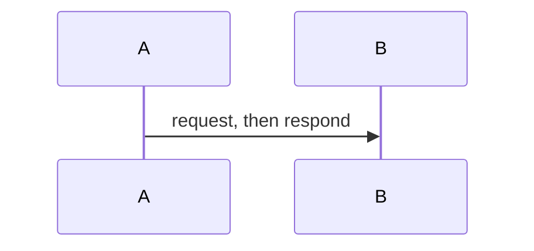

## Overview {#overview}

This is a fixture page for the style gate self-test.

## Diagram {#diagram}

```mermaid
sequenceDiagram
    participant A
    participant B
    A->>B: request, then respond
```

## Conclusion {#conclusion}

End of fixture.
