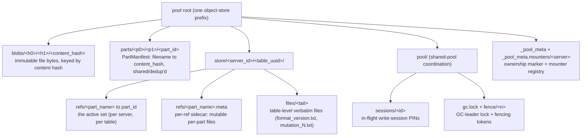
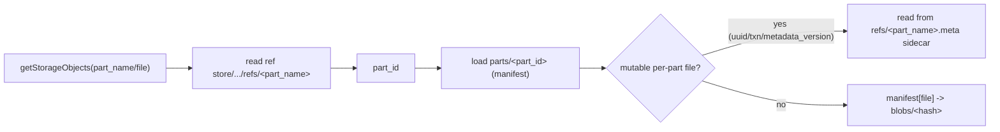
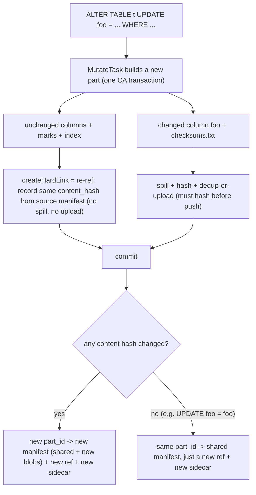
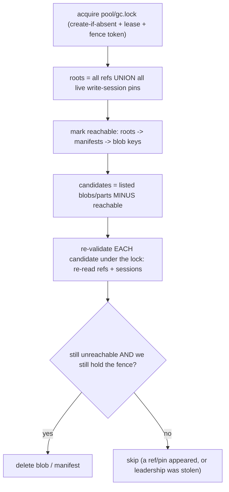
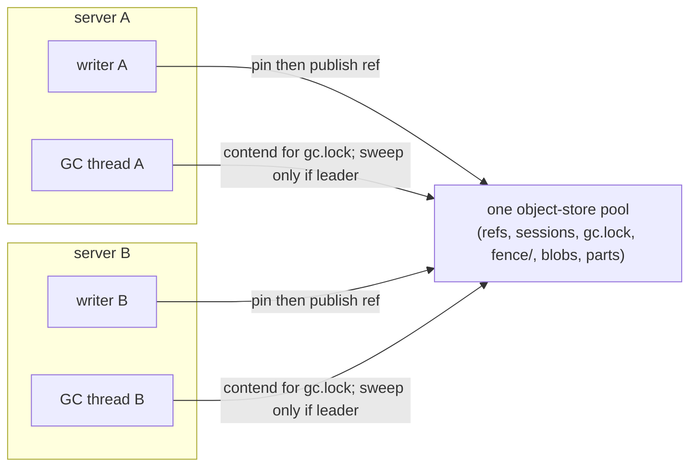

# Content-Addressed MergeTree — how it works {#content-addressed-mergetree}

A `content_addressed` MergeTree disk stores part data as **content-addressed blobs** in a shared
object-store pool, so identical content is stored once and shared across parts, replicas, clones and
mutations by *reference* instead of by copy. It is an opt-in alternative to zero-copy replication
(selected per disk via `metadata_type = content_addressed`), and it **coexists** with zero-copy —
zero-copy is not removed.

## Pool layout {#pool-layout}

Everything lives under one object-store root (the "pool"). The pool is the **single source of truth**:
its state is correct and self-describing at all times, with no external catalog required.



Key ideas:

- **`blobs/<content_hash>`** — a file's bytes, addressed by its content hash. Written once; shared.
- **`parts/<part_id>`** — a `PartManifest`: the map `filename -> content_hash` for one part. `part_id`
  is `SipHash128` over the sorted `(filename, content_hash)` set, **excluding** the mutable per-part
  files. Two parts with identical content share one manifest.
- **`store/<server>/<uuid>/refs/<part_name>`** — a tiny pointer to a `part_id`. The set of refs *is*
  the active set; there is no separate commit journal. A clone or mutation is, at heart, "publish a
  new ref."
- **`refs/<part_name>.meta`** — the per-ref **sidecar** holding the mutable per-part files
  (`uuid.txt`, `txn_version.txt`, `metadata_version.txt`), private to each ref.
- **`pool/…`** — the shared-pool coordination objects (write-session pins, the GC-leader lock,
  fencing tokens). All in the bucket — see [Shared pool](#shared-pool).

## Write (INSERT / merge) flow {#write-flow}

The storage key of a blob **is** its content hash, so a file must be fully written and hashed
**before** it can be uploaded ("build-local, hash-on-write"). Each file is spilled to a server-local
scratch dir while being hashed, then uploaded — or skipped if an identical blob already exists.

```mermaid
sequenceDiagram
    participant MT as MergeTree (build part)
    participant WB as CA write buffer
    participant Scratch as local scratch dir
    participant Pool as object-store pool

    MT->>WB: write file (column / mark / index / checksums.txt / ...)
    WB->>Scratch: spill bytes while hashing
    WB->>WB: finalize -> content_hash known
    Note over WB,Pool: PIN first: record hash in pool/sessions/&lt;id&gt; (+ in-process pin) BEFORE upload
    WB->>Pool: exists blobs/&lt;hash&gt;?
    alt blob is new
        WB->>Pool: PUT blobs/&lt;hash&gt;
    else blob already exists (dedup)
        WB-->>Scratch: discard spill, skip upload
    end
    Note over MT,Pool: ...repeat for every file...
    MT->>Pool: commit: PUT parts/&lt;part_id&gt; (manifest, put-if-absent)
    MT->>Pool: commit: PUT refs/&lt;part_name&gt;.meta (sidecar: mutable files)
    MT->>Pool: commit: PUT refs/&lt;part_name&gt; -> part_id   (publish point)
    MT->>Pool: release the session PIN (the ref now keeps blobs reachable)
```

The whole part is one transaction: all files accumulate, and the **ref is the last, atomic publish
step**. The `part_id` is only knowable once every file is hashed, so it materialises at commit.

## Read (resolve) flow {#read-flow}



A missing manifest for a live ref is a fail-closed error (`CORRUPTED_DATA`), never a silently-empty
read.

## Mutation flow {#mutation-flow}

A mutation (`ALTER TABLE … UPDATE/DELETE`, `MODIFY COLUMN`, lightweight `DELETE`) is "**partial
re-ref + fresh hash-and-push of only what changed**." `MutateTask` builds a new part: unchanged
columns are carried forward by reference (their content hash is already known — no recompute, no
upload), changed files are recomputed, hashed and pushed.



## Clone / partition-operation flow {#clone-flow}

On a content-addressed pool, cloning a part is free: identical content → same `part_id` → a clone is
just **a new ref to the existing `part_id`** (zero byte movement). `MOVE PARTITION … TO TABLE` and
`REPLACE TABLE … CLONE` already work this way. `ATTACH PARTITION`/`ATTACH PART`/`REPLACE PARTITION
FROM` from a *detached* or *cross-table* source are currently **gated** while the clone path's
source-file enumeration on a content-addressed disk is being made complete (it must reuse the source's
known checksums for every file, including `primary.idx` and marks). Cross-disk `MOVE … TO DISK/VOLUME`
(a byte copy) and `BACKUP`/`RESTORE` are separate, still-gated paths.

## Garbage collection {#gc-flow}

Removal is a pure pointer-unlink (drop the ref); the blobs/manifest are reclaimed later by a
**reachability sweep**. The sweep is coordinated so it is safe even with multiple writers and multiple
mounters.



- **Pins** (write-sessions) are roots, so a just-written-or-reused blob is protected from before it is
  uploaded until its ref is published. The pin's lease is **renewed** while the writer is alive, so a
  long write never expires its own pin.
- **Leases are liveness hints, never safety.** Safety is the **fencing token** (a paused/superseded GC
  leader cannot delete) plus the **re-validate-under-lock** immediately before each delete.

## Shared pool (multiple servers, one pool) {#shared-pool}

Multiple servers can mount the same pool. **The bucket is the single source of truth; Keeper is not
required.** All coordination is built on one primitive: **create-if-absent compare-and-set**
(`If-None-Match` on S3/Azure, `O_EXCL` on local). Correctness survives Keeper loss/split-brain because
the bucket-level lock + fencing token are the only mutual exclusion. Keeper, when added, is an
*accelerator* (faster leader election / watches) that still keeps every change in the bucket.



---

# Q&A {#qa}

## Why can't a file be uploaded before its checksum is known? {#qa-hash-before-upload}

Because a blob's storage **key is its content hash** (`blobs/<content_hash>`). You cannot place a file
in content-addressed storage until you have hashed it. So the write path is "build-local, hash-on-
write": each file is **spilled to a server-local scratch dir while being hashed**, and only then
uploaded (or dedup-skipped). You cannot stream a blob directly to its final key, because the key is
unknown until the last byte is hashed. The cost on the write path is one local spill + hash per *new*
file; carried-forward/cloned files cost nothing (their checksum is already known). For files that are
also in `checksums.txt`, the write buffer's hash and the engine's recorded checksum are the same hash
of the same bytes, so they agree by construction.

## How does a mutation work — e.g. `ALTER TABLE t UPDATE foo = foo WHERE 1` on a 11-column table? {#qa-mutation-foo}

`MutateTask` builds a new part:

1. **Hardlink the 10 unchanged columns + their marks + `primary.idx`** → on a content-addressed disk
   `createHardLink` is a **re-ref**: it records the destination pointing at the *same*
   `blobs/<content_hash>`, read from the source manifest. **No spill, no upload, no recompute.**
2. **Recompute `foo`** (the optimizer doesn't know `foo = foo` is identity, so `foo` is "affected") →
   written through the CA write buffer → **spilled to local scratch + hashed**. The hash equals the
   original `foo`'s hash, so the dedup check finds `blobs/<hash>` already present → **upload skipped**,
   spill discarded.
3. **Recompute `checksums.txt`/`columns.txt`** → spilled + hashed → identical content → dedup → not
   uploaded. Every content hash is unchanged, so the **new `part_id` equals the source's** → the
   manifest already exists and is not rewritten.
4. **Publish one new ref** `refs/all_1_1_0_1 → <source part_id>`, with a new sidecar holding the new
   part's mutable files.

**Net result in the pool: one new ref + one tiny sidecar. Zero new blobs, zero new manifest.** Do we
spill to local disk? **Yes** — `foo` and the recomputed metadata are spilled to scratch to be hashed
(you must hash to know they're identical), but nothing is uploaded and nothing new is stored. A plain
S3 (non-content-addressed) disk would actually *upload* the recomputed `foo`; the content-addressed
disk turns it into a dedup no-op.

## What about part files that are not in `checksums.txt`? {#qa-files-outside-checksums}

Content-addressing does **not** decide what to address by `checksums.txt` membership — the write
buffer hashes the *actual bytes* of every file. There are exactly two buckets:

- **Content-addressed (in the manifest):** every part file *except* the mutable trio — including the
  data/marks/index files **and** the small metadata that isn't listed in `checksums.txt`
  (`checksums.txt` itself, `columns.txt`, `count.txt`, `ttl.txt`, `partition.dat`,
  `serialization.json`, `minmax_*.idx`, …). Each is a blob keyed by its own content; all participate
  in `part_id`.
- **Mutable per-part state — the only exception:** `uuid.txt`, `txn_version.txt`,
  `metadata_version.txt`. These are **excluded from the manifest and from `part_id`** and stored
  inline in the **per-ref sidecar**, private to each ref, overlaid on read. They are excluded
  precisely so two parts with identical content can dedup while keeping distinct identity/transaction
  state. (Transient markers like `delete-on-destroy.txt` are dropped on clone/commit, never carried.)

This is why the `foo = foo` mutation collapses correctly: all content (including `checksums.txt`)
dedups to the shared `part_id`, while the new part's `uuid`/`txn_version` live in a new sidecar on the
new ref.

## While writing a huge file for a long time, what stops the GC from deleting its blobs? {#qa-write-vs-gc}

The **write-session pin**. Before a blob is uploaded, its hash is recorded in `pool/sessions/<id>`,
which the GC treats as a reachability root. So the blob is protected from before upload until the ref
is published. For a long write, the session's lease is **renewed on every file and at commit**, so a
writer that is alive and progressing never lets its own pin expire. The lease only lapses if the
writer is genuinely dead, at which point reclaiming its unreferenced blobs is correct.

## An obsolete blob the GC has already chosen to delete, and a new INSERT that dedups onto it arrives mid-GC — what prevents a dangling ref? {#qa-dedup-vs-gc}

Two outcomes, both safe:

- The new writer **pins the blob before the dedup existence-check**, so the GC's **re-validate under
  the lock** (re-reading refs + sessions immediately before deleting) sees the pin and **skips** the
  deletion.
- If the GC deletes first, the new writer's **commit re-checks every referenced blob and fails closed**
  (a retryable error) rather than publishing a dangling ref → the insert retries and re-uploads.

There is never a resolution that publishes a ref to a deleted blob. Same-server, this is enforced by
the in-process GC lock; cross-server, by the bucket session-pin + the GC re-reading sessions + the
commit re-check.

## How are TOCTOU races avoided with only create-if-absent (no atomic compare-and-delete)? {#qa-toctou}

You cannot fuse "check" and "act" into one object-store operation, so the protocol does not try to win
the race — it is structured so safety does not depend on the instant of the check:

1. **Protect across the whole window, not at an instant** — a blob is a GC root (via the pin) for the
   entire window it could be observed, so it cannot be deleted regardless of when the GC looks.
2. **Make both outcomes of the residual gap safe (fail-closed)** — where a check-then-act gap remains
   (GC re-validate→delete; writer re-check→publish), either the writer wins (the GC's next re-validate
   sees the new ref) or the GC wins (the writer fails closed and retries).
3. **Fence + idempotency** — a superseded GC leader's delete is rejected by the fence token; uploads
   are put-if-absent; deletes are remove-if-exists.

The one irreducible residual (a writer stalling past its lease *inside* the few-millisecond commit
window) is shrunk to near-zero by lease renewal and closed fully only by a stronger primitive (a
fenced conditional delete, or Keeper) — it is tracked, not papered over.

## Does content-addressing replace zero-copy replication? {#qa-zero-copy}

No. **Zero-copy replication is not removed** (backward compatibility). Content-addressing is opt-in per
disk (`metadata_type = content_addressed`) and runs **side-by-side** with zero-copy; existing
zero-copy tables and disks keep working unchanged. The two data-sharing mechanisms are mutually
exclusive per disk/table and do not interfere.

## Why is the bucket the single source of truth, and not Keeper? {#qa-bucket-truth}

So that **correctness survives Keeper loss or split-brain**. Every coordination object (refs, write
-session pins, the GC-leader lock, fencing tokens) lives in the bucket, and the only mutual exclusion
is the bucket-level lock + fence. A fresh mount or a full GC can be driven from the bucket alone.
Keeper is an optional **accelerator** added later (faster leader election, watches as a delta feed) —
it never becomes the sole authority, and even with Keeper every change still lands in the bucket so it
stays self-describing.

## What is the status of clones / partition operations? {#qa-clone-status}

- **Work today:** `MOVE PARTITION … TO TABLE` (same disk), `REPLACE TABLE … CLONE` — these clone from
  an active source whose full file set is enumerable, so they produce a correct single-ref clone.
- **Gated (being fixed):** `ATTACH PARTITION`/`ATTACH PART`/`REPLACE PARTITION FROM` from a detached or
  cross-table source — the clone path must be made to enumerate and re-ref *every* source file
  (including `primary.idx`/marks) on a content-addressed disk, and detached-part discovery must be
  fixed. Until then they fail closed rather than producing an incomplete clone.
- **Separate, still gated:** cross-disk `MOVE … TO DISK/VOLUME` (a byte copy), `BACKUP`/`RESTORE`,
  `ReplicatedMergeTree`, projections, experimental transactions, and the non-replicated deduplication
  log (the last two need append, which object storage does not provide).
