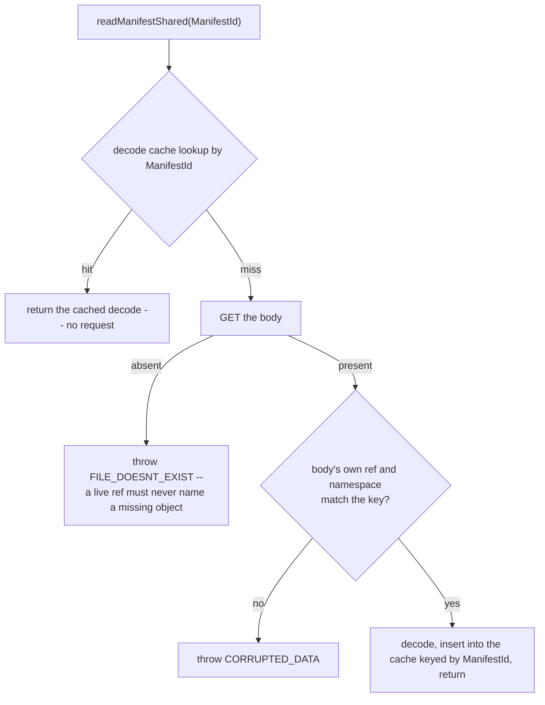

# CAS manifest cache by id Implementation Plan

> **For agentic workers:** REQUIRED SUB-SKILL: Use superpowers:subagent-driven-development (recommended) or superpowers:executing-plans to implement this plan task-by-task. Steps use checkbox (`- [ ]`) syntax for tracking.

**Goal:** `CasManifestReader::readManifestShared` caches decoded manifests by `ManifestId` alone, issues no `HEAD` on a hit and exactly one `GET` on a miss, and the `part_folder_validate` setting that existed only to pace that `HEAD` is retired.

**Architecture:** The reader drops the `(ManifestId, Token)` key and the pre-probe `HEAD`; a miss keeps the fail-closed sequence (one `GET`, `ReadMissing` + `FILE_DOESNT_EXIST` on absence, two `CORRUPTED_DATA` identity checks). The part-folder facade loses its `ForceFresh` age-window branch, the `validated_at_ms` stamp and the injected clock, because nothing re-proves a body any more. Dangling-reference detection stays where it is enforced: `promote`, GC's owner-removal fold, the orphan sweep, the rebuild refusal and fsck.

**Tech Stack:** C++ (ClickHouse `src/Disks/DiskObjectStorage/MetadataStorages/ContentAddressed`), gtest (`unit_tests_dbms`), Python soak cards under `utils/ca-soak`.

**Spec:** `docs/superpowers/specs/2026-09-02-cas-manifest-cache-by-id-design.md` (commit `b4ea16701ab`). Read it first; every task below argues from it.

## Global Constraints

- The spec cites line numbers as of commit `4bd24e9acee`. `HEAD` has moved since (a relink commit `bf44441fe61` and others landed). **Locate every edit by symbol, never by line.** Line numbers in this plan are hints only.
- Work on branch `cas-gc-rebuild` in `/home/mfilimonov/workspace/ClickHouse/master`. One commit per task. Never amend, rebase or push. Commit only the files you changed (`git add <path>`, never `git add -A`; the tree has many untracked artifact directories).
- Every commit message ends with exactly these two lines:
  ```
  Co-Authored-By: Claude Fable 5.1 <noreply@anthropic.com>
  Claude-Session: https://claude.ai/code/session_01DAu8zEhBXrwRKTPhpXgZnS
  ```
- TDD: each task writes its failing test first and runs it before the implementation.
- C++: Allman braces (opening brace on its own line). No `sleep` to fix races. No fallback paths (an error propagates; nothing substitutes a default). Comments give the reason, never a provenance (no "per spec", no task or finding ids).
- Prefer a new test over extending an existing one; when an existing test encodes the retired behaviour, change or delete that test.
- Build: `ninja -C build_debug unit_tests_dbms` with no `-j`, output redirected to a log under `build_debug/`. Tests: `build_debug/src/unit_tests_dbms --gtest_filter=<filter>` with output redirected to a unique log under `build_debug/`. After every build and test run, dispatch a subagent (sonnet, medium effort) to read the log and return only: the exit code, tests run/passed/failed, and the first failing assertion with `file:line`. Never run tests after a build whose log does not end in `NINJA_EXIT=0`.
- Docs under `docs/`: every header carries an explicit `{#kebab-anchor}`; identifiers in inline code; functions written as `f`, never `f()`; no invariant tags such as `INV-NO-DANGLE` in `docs/en`.
- The build and test command shape, used verbatim with the task's own log names:
  ```bash
  ninja -C build_debug unit_tests_dbms > build_debug/build_mcbi_task<N>.log 2>&1; echo NINJA_EXIT=$? >> build_debug/build_mcbi_task<N>.log
  build_debug/src/unit_tests_dbms --gtest_filter='<filter>' > build_debug/test_mcbi_task<N>_<name>.log 2>&1; echo GTEST_EXIT=$? >> build_debug/test_mcbi_task<N>_<name>.log
  ```

---

### Task 1: Reader keyed by `ManifestId`, no `HEAD`

**Files:**
- Modify: `src/Disks/DiskObjectStorage/MetadataStorages/ContentAddressed/Pool/CasManifestReader.h`
- Modify: `src/Disks/DiskObjectStorage/MetadataStorages/ContentAddressed/Pool/CasManifestReader.cpp`
- Test: `src/Disks/tests/gtest_cas_pool.cpp`
- Test: `src/Disks/tests/gtest_cas_part_folder_access.cpp`

**Interfaces:**
- Consumes: `CountingBackend` (`src/Disks/tests/cas_test_helpers.h`, methods `headCount`, `getCount`, `resetCounts`), `deleteManifestBody(backend, layout, id)` (same header), `manifestRefFor(tag)` and `publishPart(store, ns_string, ref, payload)` (file-local helpers in `gtest_cas_pool.cpp`), `publishPart(store, ns, ref, entries)`, `inlineEntry`, `cacheOn`, `openPoolForTest` (file-local helpers and `cas_test_helpers.h` for `gtest_cas_part_folder_access.cpp`).
- Produces: `CasManifestReader::readManifestShared(const ManifestId &)` with the new contract (hit: no request; miss: one `get`; absent: `ReadMissing` + `FILE_DOESNT_EXIST`). `CasManifestReader::ManifestDecodeCache` is now `CacheBase<ManifestId, PartManifest, std::hash<ManifestId>, PartManifestWeight>`. `ManifestCacheKey` and `ManifestCacheKeyHash` no longer exist. Tasks 2 and 4 rely on "a hit costs no request".

The three `Validate*` facade tests are deleted in this task, not in Task 2, because they assert a `HEAD` that no longer happens after this task; leaving them would make this commit red. The `CASPartFolderValidateParse` suite stays until Task 2 (the parser still exists after this task and those tests still pass).

- [ ] **Step 1: Write the failing tests in `gtest_cas_pool.cpp`**

Find `TEST(CASPool, ManifestCacheIsKeyedByIdAndToken)`. Rename it to `ManifestCacheIsKeyedById`, replace the four comment lines above it with:

```cpp
/// The manifest decode cache is keyed by ManifestId alone: an id is minted once and its body is
/// written once, so one id names one content forever. Resolve+read the same ref twice: the second
/// readManifest is served from the cache with NO request at all. A fresh publish under a DIFFERENT
/// ref name mints a NEW ManifestId, so the cache misses and the body is fetched once.
```

Inside the test, immediately after `const String key1 = layout.manifestKey(id1);` add:

```cpp
    b->resetCounts();
```

After the block that ends with the `EXPECT_EQ(b->getCount(key1), gets_after_first)` assertion, add:

```cpp
    EXPECT_EQ(b->headCount(key1), 0u) << "keyed by id alone: no HEAD on a miss or a hit";
```

At the very end of the test (after the `EXPECT_GE(b->getCount(key2), 1u)` assertion) add:

```cpp
    EXPECT_EQ(b->headCount(key2), 0u);
```

Find `TEST(CASPool, ReadManifestSharedReturnsSharedDecodeWithoutCopy)` and change

```cpp
    EXPECT_EQ(backend->headCount(manifest_key), 2u);        /// mandatory HEAD per call (unchanged)
```
to
```cpp
    EXPECT_EQ(backend->headCount(manifest_key), 0u);        /// keyed by id: no HEAD on a miss or a hit
```

Add a new test directly after `ReadManifestSharedReturnsSharedDecodeWithoutCopy` (the pool's event sink delivers in the emitting thread, so the captured vector is complete when `readManifest` returns):

```cpp
/// A miss whose object is absent is the one dangling-reference case the reader still detects
/// itself: exactly one GET, no HEAD, one `ReadMissing` event, FILE_DOESNT_EXIST.
TEST(CASPool, ReadManifestAbsentBodyEmitsReadMissingWithOneGetAndNoHead)
{
    auto b = std::make_shared<DB::Cas::tests::CountingBackend>();
    auto s = Pool::open(b, PoolConfig{.pool_prefix = "p", .server_root_id = "test"});
    Layout layout("p");
    const RootNamespace ns{"srv1/tbl"};
    const ManifestId id{.root_namespace = ns, .ref = manifestRefFor("absent-body-event")};
    const String key = layout.manifestKey(id);

    std::vector<CasEvent> events;
    s->setEventSink([&](CasEvent e) { events.push_back(std::move(e)); });
    b->resetCounts();
    expectThrowsCode(DB::ErrorCodes::FILE_DOESNT_EXIST, [&] { s->readManifest(id); });
    s->setEventSink(nullptr);

    EXPECT_EQ(b->getCount(key), 1u);
    EXPECT_EQ(b->headCount(key), 0u);
    size_t read_missing = 0;
    for (const auto & e : events)
    {
        if (e.type != CasEventType::ReadMissing)
            continue;
        ++read_missing;
        EXPECT_EQ(e.object_kind, CasEventObjectKind::Manifest);
        EXPECT_EQ(e.detail.at("code"), "FILE_DOESNT_EXIST");
        EXPECT_EQ(e.detail.at("site"), "readManifest");
    }
    EXPECT_EQ(read_missing, 1u);
}
```

- [ ] **Step 2: Write the failing tests in `gtest_cas_part_folder_access.cpp`**

In `TEST(CASPartFolderAccess, RetainedHitSkipsManifestHead)` replace the two comment lines and the `headCount` assertion:

```cpp
    /// ONE body GET (the cold build) and ZERO manifest HEADs: the decode cache is keyed by id, and
    /// every subsequent CachedForLoad call is a validated hit — zero manifest ops.
    EXPECT_EQ(backend->getCount(manifest_key), 1u);
    EXPECT_EQ(backend->headCount(manifest_key), 0u);
```

In `TEST(CASPartFolderAccess, HitPathJournalEmptyAndCheapWhenExplainDisabled)` change `EXPECT_EQ(backend->headCount(manifest_key), 1u);` to `EXPECT_EQ(backend->headCount(manifest_key), 0u);`.

In `TEST(CASPartFolderAccess, BaselineRequestCountsWithoutRetention)` replace the three comment lines and the two assertions at the end with:

```cpp
    /// Retention off: one manifest-body GET (the decode cache absorbs the rest) and no manifest
    /// HEAD at all — a cached decode is served without a request.
    EXPECT_EQ(backend->getCount(manifest_key), 1u);
    EXPECT_EQ(backend->headCount(manifest_key), 0u);
```

In `TEST(CASPartFolderAccess, GetViewFailsClosedOnMissingBody)` replace the comment block that starts `/// Physically delete the live manifest body` (five lines, ending `which turn retention ON.`) with:

```cpp
    /// Physically delete the live manifest body (a protocol violation). Retention is off and the
    /// decode cache is cold (promote reads the body through the backend, not the reader), so every
    /// getView mode reaches the reader's miss path: one GET, no HEAD, FILE_DOESNT_EXIST.
```
then add `backend->resetCounts();` directly after the `deleteManifestBody(*backend, layout, id);` line (the helper itself issues one `HEAD` to learn the token), and after the `for` loop that asserts `FILE_DOESNT_EXIST` for the three modes add:

```cpp
    EXPECT_EQ(backend->headCount(layout.manifestKey(id)), 0u);
```

In `TEST(CASPartFolderAccess, OversizedViewServedNotRetained)` the second `getView` was proven to be a rebuild by a growing `HEAD` count. Replace the `head_before` line, the `view2` block's `EXPECT_GT` and its comment with a rebuild proof that does not depend on a request:

```cpp
    backend->resetCounts();
    auto view2 = access.getView(key, Cas::Freshness::CachedForLoad);
    ASSERT_NE(view2, nullptr);
    /// Not retained: every call rebuilds the view (a new view object over the SAME shared decode) and
    /// records the bypass again; the rebuild costs no manifest request because the decode is cached.
    EXPECT_NE(view1.get(), view2.get());
    EXPECT_EQ(view1->manifest().get(), view2->manifest().get());
    EXPECT_EQ(access.explain(key).last_decision,
              Cas::CachedPartFolderAccess::LastDecision::OversizedBypass);
    EXPECT_EQ(backend->getCount(manifest_key), 0u);
    EXPECT_EQ(backend->headCount(manifest_key), 0u);
    EXPECT_FALSE(access.explain(key).retained);
```

In `TEST(CASPartFolderAccess, DisabledModeKeepsBaseline)` replace the comment `/// Exactly the Phase-3 baseline: bytes=0 restores the no-retention call graph byte-for-byte.` and the two count assertions with:

```cpp
    /// bytes=0 restores the no-retention call graph: one body GET, then the decode cache serves every
    /// rebuild with no manifest request.
    EXPECT_EQ(backend->getCount(manifest_key), 1u);
    EXPECT_EQ(backend->headCount(manifest_key), 0u);
```

In the test that counts `RefResolve` events (find it with `grep -n "ForceFresh always re-proves the manifest body" src/Disks/tests/gtest_cas_part_folder_access.cpp`), replace that two-line comment with `/// ForceFresh always bypasses the retained view, so this is real resolve work again -> +1.`; the assertion stays.

Delete `TEST(CASPartFolderAccess, ForceFreshFailsClosedWhileRetainedViewExists)` entirely (from its `TEST(` line through its closing `}`) and put these two tests in its place:

```cpp
/// The decode cache is keyed by id and an id names one content forever, so a warm reader serves
/// `ForceFresh` from the immutable decode with no manifest request even after the body object is
/// gone. A retained-view hit is not what is being tested here: `ForceFresh` bypasses the view cache
/// and rebuilds the view from the pool's manifest cache.
TEST(CASPartFolderAccess, ForceFreshServesImmutableDecodeWithoutManifestRequestsAfterBodyDeletion)
{
    auto backend = std::make_shared<CountingBackend>();
    auto store = openPoolForTest(backend);
    const Cas::Layout layout("p");
    const Cas::RootNamespace ns{"srv/t1"};
    Cas::CachedPartFolderAccess access(store, cacheOn());
    const auto id = publishPart(store, ns, "part_1", {inlineEntry("f", "x")});
    const Cas::PartRefKey key{ns, "part_1"};
    const String manifest_key = layout.manifestKey(id);

    ASSERT_NE(access.getView(key, Cas::Freshness::ForceFresh), nullptr);   /// warms the decode cache
    deleteManifestBody(*backend, layout, id);   /// protocol violation: live body vanishes
    backend->resetCounts();

    auto view = access.getView(key, Cas::Freshness::ForceFresh);
    ASSERT_NE(view, nullptr);
    EXPECT_NE(view->findFile("f"), nullptr);
    EXPECT_EQ(backend->getCount(manifest_key), 0u);
    EXPECT_EQ(backend->headCount(manifest_key), 0u);
    EXPECT_EQ(access.explain(key).last_decision, Cas::CachedPartFolderAccess::LastDecision::ForceFreshRead);
}

/// With the decode cache disabled a prior read leaves nothing behind, so the deleted body surfaces
/// as FILE_DOESNT_EXIST in every mode: the miss path is the same fail-closed path a cold reader takes.
TEST(CASPartFolderAccess, DeletedBodyFailsClosedInEveryModeWhenDecodeCacheDisabled)
{
    auto backend = std::make_shared<CountingBackend>();
    auto store = DB::Cas::Pool::open(backend,
        DB::Cas::PoolConfig{.pool_prefix = "p", .server_root_id = "test", .manifest_decode_cache_bytes = 0});
    const Cas::Layout layout("p");
    const Cas::RootNamespace ns{"srv/t1"};
    Cas::CachedPartFolderAccess access(store);   /// retention off: every mode reaches the reader
    const auto id = publishPart(store, ns, "part_1", {inlineEntry("f", "x")});
    const Cas::PartRefKey key{ns, "part_1"};

    ASSERT_NE(access.getView(key, Cas::Freshness::ForceFresh), nullptr);
    deleteManifestBody(*backend, layout, id);
    backend->resetCounts();

    for (auto freshness : {Cas::Freshness::CachedForLoad,
                           Cas::Freshness::ForceFresh,
                           Cas::Freshness::StrictValidate})
        expectThrowsCode(ErrorCodes::FILE_DOESNT_EXIST, [&] { access.getView(key, freshness); });
    EXPECT_EQ(backend->headCount(layout.manifestKey(id)), 0u);
    EXPECT_EQ(backend->getCount(layout.manifestKey(id)), 3u);   /// one GET per attempt, nothing cached
}
```

Delete the section comment `/// ==== §3 (part_folder_validate): the ForceFresh body re-proof HEAD is configurable ====` and the three tests `ValidateNeverServesRetainedViewWithoutBodyHead`, `ValidateAlwaysStillHeadsEveryForceFresh`, `ValidateAgeSkipsWithinWindowThenHeadsAfter`. Keep the `CASPartFolderValidateParse` tests and the `configWithDiskSection` helper for now (Task 2 removes them).

- [ ] **Step 3: Build and run the tests to verify they fail**

```bash
ninja -C build_debug unit_tests_dbms > build_debug/build_mcbi_task1a.log 2>&1; echo NINJA_EXIT=$? >> build_debug/build_mcbi_task1a.log
build_debug/src/unit_tests_dbms --gtest_filter='CASPool.ManifestCacheIsKeyedById:CASPool.ReadManifestSharedReturnsSharedDecodeWithoutCopy:CASPool.ReadManifestAbsentBodyEmitsReadMissingWithOneGetAndNoHead:CASPartFolderAccess.*' > build_debug/test_mcbi_task1a.log 2>&1; echo GTEST_EXIT=$? >> build_debug/test_mcbi_task1a.log
```
Expected (via the log subagent): `NINJA_EXIT=0`; the three pool tests and `RetainedHitSkipsManifestHead`, `HitPathJournalEmptyAndCheapWhenExplainDisabled`, `BaselineRequestCountsWithoutRetention`, `GetViewFailsClosedOnMissingBody`, `OversizedViewServedNotRetained`, `DisabledModeKeepsBaseline`, `ForceFreshServesImmutableDecodeWithoutManifestRequestsAfterBodyDeletion` and `DeletedBodyFailsClosedInEveryModeWhenDecodeCacheDisabled` FAIL on `headCount` (expected 0, actual 1 or more) or on `getView` throwing `FILE_DOESNT_EXIST` where a view was expected. Every other `CASPartFolderAccess` test passes; if one more fails on a `HEAD` count, it is a `HEAD` assertion this plan missed: change it to 0 in this task and say so in the task report.

- [ ] **Step 4: Implement the reader**

In `CasManifestReader.h`:

Replace the class comment (the block starting `/// Reads and validates part manifests, caches immutable decodes`) with:

```cpp
/// Reads and validates part manifests, caches immutable decodes by `ManifestId`, and translates blob
/// entries into ranged object reads. A manifest id is minted once and its body is written once, so
/// one id names one content forever: a cache hit is served without any request, and a miss performs
/// one `GET` and validates both the manifest reference and the owning namespace before publication
/// into the cache. A missing body, a decode failure or a failed identity check is surfaced as an
/// exception, never as an empty or partially trusted manifest.
///
/// The reader receives its backend, immutable layout and pool metadata, and event sink by reference;
/// it has no `Pool` back-reference and owns no `Pool`-level mutex. The decode cache is a
/// byte-weighted `CacheBase` LRU whose synchronization is internal to `CacheBase`; a null cache
/// means caching is disabled (`manifest_decode_cache_bytes == 0`).
```

Replace the constructor comment with:

```cpp
    /// Binds the reader to the pool environment. A positive cache budget creates the byte-weighted
    /// LRU; zero disables caching while leaving the one-`GET`-and-validate sequence intact.
```

Replace the `readManifest` comment with:

```cpp
    /// Reads a manifest by value using the fail-closed sequence described above. A missing body,
    /// decode failure, or either identity mismatch throws; only a fully validated decode can enter
    /// the cache.
```

In the private section delete `struct ManifestCacheKey` and `struct ManifestCacheKeyHash` together with their comments. Replace the `PartManifestWeight` comment with:

```cpp
    /// Estimates retained decode memory from fixed object overhead plus entry path and inline-byte
    /// storage. Weighting by bytes gives a server reading many parts an honest memory ceiling
    /// instead of a count-only bound.
```

Replace the alias with:

```cpp
    using ManifestDecodeCache = CacheBase<ManifestId, PartManifest, std::hash<ManifestId>, PartManifestWeight>;
```

In `CasManifestReader.cpp`: delete the whole `CasManifestReader::ManifestCacheKeyHash::operator()` definition. Replace `readManifestShared` from its signature down to (not including) the `PartManifest body = decodePartManifest(...)` line with:

```cpp
std::shared_ptr<const PartManifest> CasManifestReader::readManifestShared(const ManifestId & id)
{
    /// One id names one content forever (minted once, written once, only ever deleted), so a cached
    /// decode is served without any request.
    if (manifest_cache)
        if (auto cached = manifest_cache->get(id))
            return cached;

    /// A live reference naming a missing manifest body is a dangling-reference violation
    /// (`INV-NO-DANGLE`). Never substitute an empty manifest: callers must observe the missing object
    /// as an exception. The `GET` alone carries the absence signal, so no `HEAD` precedes it.
    const String key = layout.manifestKey(id);
    std::optional<GetResult> object = backend.get(key);
    if (!object)
    {
        if (event_sink)
        {
            CasEvent _ev1;
            _ev1.type = CasEventType::ReadMissing;
            _ev1.object_kind = CasEventObjectKind::Manifest;
            _ev1.object_hash = manifestRefDebugString(id.ref);
            _ev1.outcome = "missing";
            _ev1.reason = "live ref names manifest but its object is missing (INV-NO-DANGLE)";
            _ev1.detail = {{"code", "FILE_DOESNT_EXIST"}, {"site", "readManifest"}};
            event_sink(std::move(_ev1));
        }
        throw Exception(ErrorCodes::FILE_DOESNT_EXIST,
            "live ref names manifest at {} but its object is missing — INV-NO-DANGLE", key);
    }
    ProfileEvents::increment(ProfileEvents::CASPartFolderManifestGets);

```

Leave the decode and the two `CORRUPTED_DATA` checks exactly as they are. At the end of the function change

```cpp
        manifest_cache->set(ManifestCacheKey{.manifest_id = id, .token = head.token}, decoded);
```
to
```cpp
        manifest_cache->set(id, decoded);
```

Confirm with `grep -n "head\|Token\|ManifestCacheKey" src/Disks/DiskObjectStorage/MetadataStorages/ContentAddressed/Pool/CasManifestReader.cpp src/Disks/DiskObjectStorage/MetadataStorages/ContentAddressed/Pool/CasManifestReader.h` that no `head` call, `Token` use or `ManifestCacheKey` remains (a match inside a comment word such as "ahead" is fine; a call is not).

- [ ] **Step 5: Build and run the tests to verify they pass**

```bash
ninja -C build_debug unit_tests_dbms > build_debug/build_mcbi_task1b.log 2>&1; echo NINJA_EXIT=$? >> build_debug/build_mcbi_task1b.log
build_debug/src/unit_tests_dbms --gtest_filter='CASPool.*:CASPartFolderAccess.*:CASPartFolderValidateParse.*' > build_debug/test_mcbi_task1b.log 2>&1; echo GTEST_EXIT=$? >> build_debug/test_mcbi_task1b.log
```
Expected: `NINJA_EXIT=0`, `GTEST_EXIT=0`, zero failures.

- [ ] **Step 6: Commit**

```bash
git add src/Disks/DiskObjectStorage/MetadataStorages/ContentAddressed/Pool/CasManifestReader.h \
        src/Disks/DiskObjectStorage/MetadataStorages/ContentAddressed/Pool/CasManifestReader.cpp \
        src/Disks/tests/gtest_cas_pool.cpp src/Disks/tests/gtest_cas_part_folder_access.cpp
git commit -F - <<'EOF'
ca-read: key the manifest decode cache by id, no HEAD on a hit

`CasManifestReader::readManifestShared` probes the cache by `ManifestId` and serves a hit
without any request; a miss is one `GET`. A manifest id is minted once and its body written
once, so the token in the old key distinguished nothing and the `HEAD` that supplied it was a
per-read check of an invariant GC and fsck enforce. An absent body on a miss still emits
`ReadMissing` and throws `FILE_DOESNT_EXIST`. The facade tests that asserted the `HEAD`
count now assert zero, and the `part_folder_validate` mode tests go: there is no `HEAD` left
for the setting to pace.

Co-Authored-By: Claude Fable 5.1 <noreply@anthropic.com>
Claude-Session: https://claude.ai/code/session_01DAu8zEhBXrwRKTPhpXgZnS
EOF
git log -1 --format='%H %s' && git branch --show-current
```

---

### Task 2: Retire `part_folder_validate`

**Files:**
- Modify: `src/Disks/DiskObjectStorage/MetadataStorages/ContentAddressed/Parts/PartFolderAccess.h`
- Modify: `src/Disks/DiskObjectStorage/MetadataStorages/ContentAddressed/Parts/PartFolderAccess.cpp`
- Modify: `src/Disks/DiskObjectStorage/MetadataStorages/ContentAddressed/ContentAddressedSettings.h`
- Modify: `src/Disks/DiskObjectStorage/MetadataStorages/ContentAddressed/ContentAddressedSettings.cpp`
- Modify: `src/Disks/DiskObjectStorage/MetadataStorages/ContentAddressed/ContentAddressedMetadataStorage.h`
- Modify: `src/Disks/DiskObjectStorage/MetadataStorages/ContentAddressed/ContentAddressedMetadataStorage.cpp`
- Modify: `src/Common/ProfileEvents.cpp` (the `CASPartFolderValidateSkipped` entry, near line 954)
- Modify: `src/Disks/DiskObjectStorage/MetadataStorages/ContentAddressed/README.md`, `src/Disks/tests/cas_test_helpers.h` (comments naming the retired type)
- Modify: `utils/ca-soak/scenarios/tests/test_render_tuned_config.py`, `utils/ca-soak/scenarios/framework/cluster_boot.py`, `utils/ca-soak/docker-compose-tuned.yml`
- Test: `src/Disks/tests/gtest_cas_settings.cpp`, `src/Disks/tests/gtest_cas_part_folder_access.cpp`, `src/Disks/tests/gtest_cas_part_folder_view.cpp`

**Interfaces:**
- Consumes: Task 1's reader (a `ForceFresh` rebuild now costs no request).
- Produces: `CachedPartFolderAccess(Cas::PoolPtr, CacheParams)` (the clock parameter is gone), `CacheParams` without `validate`, `PartFolderView(PartRefKey, ManifestId, uint64_t manifest_size, std::shared_ptr<const PartManifest>)`, `PartFolderView::make(PartRefKey, const Resolved &, std::shared_ptr<const PartManifest>)`. `Cas::PartFolderValidate`, `PartFolderView::validatedAtMs`, `ContentAddressedSettings::partFolderValidate`, `ContentAddressedMetadataStorage::parsePartFolderValidate` and `ProfileEvents::CASPartFolderValidateSkipped` no longer exist. Loading a disk config that still carries `cas_part_folder_validate` throws `UNKNOWN_SETTING`.

The facade and the setting go together in one task: the storage's `part_folder_validate` member is read only where the facade is constructed, and `-Wunused-private-field` turns a member that is written but never read into a build error, so neither half compiles green on its own.

- [ ] **Step 1: Write the failing test in `gtest_cas_settings.cpp`**

After `TEST(CASContentAddressedSettings, RemovedCacheSettingsAreRejected)` add (it uses the file's `makeConfig` and `identity_macros` helpers exactly like its neighbour):

```cpp
/// `cas_part_folder_validate` paced a manifest `HEAD` that no longer exists. A config still asking
/// for it must fail the disk open, not be quietly accepted and ignored.
TEST(CASContentAddressedSettings, RetiredPartFolderValidateIsRejected)
{
    for (const std::string & value : {"always", "never", "age 5"})
    {
        SCOPED_TRACE(value);
        auto cfg = makeConfig(
            "<cas_server_root_id>srv1</cas_server_root_id>"
            "<cas_part_folder_validate>" + value + "</cas_part_folder_validate>");
        ContentAddressedSettings settings;
        try
        {
            settings.loadFromConfig(*cfg, "disk", "/data", "/data/scratch", identity_macros);
            FAIL() << "expected the retired setting cas_part_folder_validate to be rejected as unknown";
        }
        catch (const Exception & e)
        {
            EXPECT_EQ(e.code(), ErrorCodes::UNKNOWN_SETTING);
        }
    }
}
```

- [ ] **Step 2: Build and run it to verify it fails**

```bash
ninja -C build_debug unit_tests_dbms > build_debug/build_mcbi_task2a.log 2>&1; echo NINJA_EXIT=$? >> build_debug/build_mcbi_task2a.log
build_debug/src/unit_tests_dbms --gtest_filter='CASContentAddressedSettings.RetiredPartFolderValidateIsRejected' > build_debug/test_mcbi_task2a.log 2>&1; echo GTEST_EXIT=$? >> build_debug/test_mcbi_task2a.log
```
Expected: `NINJA_EXIT=0`; the test FAILS with "expected the retired setting ... to be rejected" (the setting still loads).

- [ ] **Step 3: Remove the facade machinery (`PartFolderAccess.h`)**

- Replace the `Freshness` enum comment (the block starting `/// Read-freshness policy at the part-folder access boundary`) with:
  ```cpp
  /// Read-freshness policy at the part-folder access boundary. The mutable-read-vs-write-evidence
  /// distinction is carried by the METHOD, not a fourth value: mutable per-part reads call `resolve`
  /// (no manifest involved); write-path source reads call `getView`, which under ForceFresh always
  /// resolves fresh and bypasses the retained view.
  ```
- `PartFolderView` constructor: drop the trailing `uint64_t validated_at_ms_` parameter.
- `PartFolderView::make`: drop the trailing `uint64_t validated_at_ms` parameter and replace its comment with:
  ```cpp
    /// Joins a fresh `Resolved` with its validated shared decode.
  ```
- Delete `validatedAtMs` and its three comment lines, and the private member `uint64_t validated_at_ms = 0;`.
- Delete `struct PartFolderValidate` and the comment block above it (starts `/// Controls whether `ForceFresh` must re-prove`).
- In `CacheParams` delete the `validate` member and its comment line.
- Replace the two-argument constructor and its comment with:
  ```cpp
    CachedPartFolderAccess(Cas::PoolPtr store_, CacheParams params_);
  ```
- Replace the `getView` comment with:
  ```cpp
    /// Resolves the ref and, when present, reads and validates its manifest into an immutable view.
    /// `nullptr` means the ref is absent. `ForceFresh` and `StrictValidate` bypass the retained view
    /// and read through the pool's manifest cache; a manifest is immutable per id, so a retained view
    /// can be stale only by naming a different manifest id, which the fresh resolve detects.
  ```
- Delete the `now_ms_fn` member and its comment (the block starting `/// Wall-clock milliseconds; see the constructor comment`).
- Replace the `buildView` comment with:
  ```cpp
    /// Reads a manifest and constructs a view. Cold `CachedForLoad` builds are single-flight per key;
    /// fresh modes perform their own read.
  ```

- [ ] **Step 4: Remove the facade machinery (`PartFolderAccess.cpp`)**

- Delete `extern const Event CASPartFolderValidateSkipped;` from the `ProfileEvents` block.
- `PartFolderView::PartFolderView`: drop the `uint64_t validated_at_ms_` parameter and the `, validated_at_ms(validated_at_ms_)` initializer.
- `PartFolderView::make`: drop the `uint64_t validated_at_ms` parameter and pass four arguments to `std::make_shared<const PartFolderView>`.
- Constructor `CachedPartFolderAccess::CachedPartFolderAccess(Cas::PoolPtr store_, CacheParams params_)`: initializer list `store(std::move(store_)), params(params_)`; delete the `if (!now_ms_fn)` default-clock statement. If `timeInMilliseconds` and `std::chrono` have no other use in the file (`grep -n "timeInMilliseconds\|std::chrono" <file>`), leave the includes alone; unused includes do not fail the build.
- In `getView`, replace the comment above the `CachedForLoad` block (starts `/// Retained views serve `CachedForLoad` directly only after`) with:
  ```cpp
    /// Retained views serve `CachedForLoad` directly only after their manifest ID matches the fresh
    /// resolve. `ForceFresh` and `StrictValidate` always rebuild from the pool's manifest cache.
  ```
  and delete the whole block that starts with the comment `/// With a non-`Always` validation policy` and ends with the closing brace of `if (freshness == Freshness::ForceFresh && view_cache && params.validate.mode != PartFolderValidate::Mode::Always)`.
- In `buildView`, replace the comment `/// Fresh modes do not coalesce: each `ForceFresh`/`StrictValidate` call owns its mandatory HEAD.` with `/// Fresh modes do not coalesce: each `ForceFresh`/`StrictValidate` call owns its own read (a cache hit costs no request).` and change both `PartFolderView::make(key, resolved, store->readManifestShared(resolved.manifest_id), now_ms_fn())` calls to `PartFolderView::make(key, resolved, store->readManifestShared(resolved.manifest_id))`.
- `grep -n "validate\|now_ms_fn\|validated_at" src/Disks/DiskObjectStorage/MetadataStorages/ContentAddressed/Parts/PartFolderAccess.*` must return nothing except the words inside "StrictValidate" and "validated shared decode".

- [ ] **Step 5: Remove the setting**

`ContentAddressedSettings.h`:
- In the `namespace DB::Cas` forward-declaration block delete `struct PartFolderValidate;` and rewrite its comment to mention only `StagingBackend`:
  ```cpp
  /// Forward declared to keep this header light: the full definition lives in
  /// `ContentAddressedMetadataStorage.h`, which is heavy and will itself include this header once the
  /// metadata storage is rewired onto it. A legal opaque declaration: `StagingBackend` fixes no
  /// explicit underlying type, matching its definition.
  ```
- In the `validate` comment change `three enum-valued string settings (`blob_hash`, `staging_backend`, `part_folder_validate`)` to `two enum-valued string settings (`blob_hash`, `staging_backend`)`.
- Delete `Cas::PartFolderValidate partFolderValidate() const;` and in the private comment change `Cas::StagingBackend` / `Cas::PartFolderValidate` types are complete` to `Cas::StagingBackend` type is complete`.

`ContentAddressedSettings.cpp`:
- Delete the line `DECLARE(String, part_folder_validate, "always", "ForceFresh body re-proof policy (always | never | age <seconds>)", 0) \`.
- In `ContentAddressedSettingsImpl` delete `Cas::PartFolderValidate part_folder_validate_cached{};` and change the comment's `Cas::StagingBackend` / `Cas::PartFolderValidate`` to `Cas::StagingBackend``.
- In `validate` delete the `impl->part_folder_validate_cached = ...` line.
- Delete the `ContentAddressedSettings::partFolderValidate` definition.

`ContentAddressedMetadataStorage.h`:
- Delete both `parsePartFolderValidate` declarations with their comments.
- Delete the member `const Cas::PartFolderValidate part_folder_validate;` and its comment line.

`ContentAddressedMetadataStorage.cpp`:
- In the file-header comment change `parseStagingBackend/parsePartFolderValidate/` to `parseStagingBackend/`.
- In the constructor initializer list delete `, part_folder_validate(settings_.partFolderValidate())`.
- Delete both `ContentAddressedMetadataStorage::parsePartFolderValidate` definitions. Then `grep -n "from_chars\|charconv" <file>`; if the deleted parser was the only user of `std::from_chars`, delete `#include <charconv>`.
- In the facade construction (`std::make_shared<Cas::CachedPartFolderAccess>(pool, Cas::CachedPartFolderAccess::CacheParams{...})`) delete the `.validate = part_folder_validate` initializer and the trailing comma on the line before it.

`src/Common/ProfileEvents.cpp`: delete the `M(CASPartFolderValidateSkipped, ...)` line.

- [ ] **Step 6: Remove the parser tests and their helper; update the soak renderer test**

`src/Disks/tests/gtest_cas_part_folder_access.cpp`:
- Delete `extern const Event CASPartFolderValidateSkipped;` (keep the `ProfileEvents` namespace block with `CASRefRollbackBestEffortDropFailed`).
- Delete the `configWithDiskSection` helper and its comment. Then `grep -n "istringstream\|XMLConfiguration\|Poco::Exception" <file>`; delete `#include <sstream>`, `#include <Poco/Util/XMLConfiguration.h>` and `#include <Poco/Exception.h>` for each that has no remaining use.
- Delete the section comment that starts `/// ==== §3: `parsePartFolderValidate` config parsing` and every `TEST(CASPartFolderValidateParse, ...)`.
- Remove `, .validate = {}` from every `CacheParams` initializer: `cacheOn()`, `HitPathJournalEmptyAndCheapWhenExplainDisabled`, `ExplainRecordsDecisions`, `OversizedViewServedNotRetained` (find them all with `grep -n "\.validate" <file>`; the `params.validate = {...}` lines belonged to the `Validate*` tests Task 1 deleted). In the test whose constructor line carries the trailing comment `/// retention on, validate == Always (default)` shorten the comment to `/// retention on`.
- `grep -n "validate\|Validate" <file>` must return only `StrictValidate` uses and the words "validated hit" / "validated shared decode" inside comments.

`src/Disks/tests/gtest_cas_part_folder_view.cpp`: in the fixture that builds a view directly (`std::make_shared<const Cas::PartFolderView>(...)` with the trailing `/*validated_at_ms=*/42` argument), delete that argument so the call passes `key`, `ManifestId`, `manifest_size` and `manifest` only.

`src/Disks/tests/gtest_cas_settings.cpp`: in `TEST(CASContentAddressedSettings, InvalidEnumDiagnosticsNameExternalConfigKeys)` delete the third `expectLoadFailureWithExactMessage(...)` call, the one whose config carries `<cas_part_folder_validate>sometimes</cas_part_folder_validate>` and expects `BAD_ARGUMENTS`; that key is now unknown, and `RetiredPartFolderValidateIsRejected` pins the `UNKNOWN_SETTING` outcome. The `cas_blob_hash` and `cas_staging_backend` clauses stay.

`src/Disks/tests/cas_test_helpers.h`: in the comment above `makeSettingsForTest` change ``(`stagingBackend`, `blobHashAlgo`, `partFolderValidate`)`` to ``(`stagingBackend`, `blobHashAlgo`)``.

`src/Disks/DiskObjectStorage/MetadataStorages/ContentAddressed/README.md`: in the `Parts/` bullet change ``(`PartRefKey` + `Freshness` + `PartFolderValidate` + `PartFolderView` + `CachedPartFolderAccess`)`` to ``(`PartRefKey` + `Freshness` + `PartFolderView` + `CachedPartFolderAccess`)``.

`utils/ca-soak/scenarios/tests/test_render_tuned_config.py`: in `test_render_injects_overrides_into_ca_block` replace the override `"cas_part_folder_validate": "age 5"` with `"cas_part_folder_cache_bytes": "33554432"` and the assertion with `assert "<cas_part_folder_cache_bytes>33554432</cas_part_folder_cache_bytes>" in xml`.

`utils/ca-soak/scenarios/framework/cluster_boot.py` and `utils/ca-soak/docker-compose-tuned.yml`: in the comments that read ``(`manifest_decode_cache_bytes`, `part_folder_validate`)`` replace `part_folder_validate` with `part_folder_cache_bytes`.

Run the Python test: `cd utils/ca-soak && python3 -m pytest scenarios/tests/test_render_tuned_config.py -q > /home/mfilimonov/workspace/ClickHouse/master/build_debug/test_mcbi_task2_render.log 2>&1; echo PYTEST_EXIT=$? >> /home/mfilimonov/workspace/ClickHouse/master/build_debug/test_mcbi_task2_render.log`. Expected: `PYTEST_EXIT=0`.

- [ ] **Step 7: Build and run the tests to verify they pass**

```bash
grep -rn "part_folder_validate\|PartFolderValidate\|partFolderValidate\|CASPartFolderValidateSkipped\|validatedAtMs" src/ utils/ca-soak/ | grep -v "\.pyc"
```
Expected: no output.

```bash
ninja -C build_debug unit_tests_dbms > build_debug/build_mcbi_task2b.log 2>&1; echo NINJA_EXIT=$? >> build_debug/build_mcbi_task2b.log
build_debug/src/unit_tests_dbms --gtest_filter='CASContentAddressedSettings.*:CASPartFolderAccess.*:CASPool.*:CASWiring*' > build_debug/test_mcbi_task2b.log 2>&1; echo GTEST_EXIT=$? >> build_debug/test_mcbi_task2b.log
```
Expected: `NINJA_EXIT=0`, `GTEST_EXIT=0`, `RetiredPartFolderValidateIsRejected` passes.

- [ ] **Step 8: Commit**

```bash
git add src/Disks/DiskObjectStorage/MetadataStorages/ContentAddressed/Parts/PartFolderAccess.h \
        src/Disks/DiskObjectStorage/MetadataStorages/ContentAddressed/Parts/PartFolderAccess.cpp \
        src/Disks/DiskObjectStorage/MetadataStorages/ContentAddressed/ContentAddressedSettings.h \
        src/Disks/DiskObjectStorage/MetadataStorages/ContentAddressed/ContentAddressedSettings.cpp \
        src/Disks/DiskObjectStorage/MetadataStorages/ContentAddressed/ContentAddressedMetadataStorage.h \
        src/Disks/DiskObjectStorage/MetadataStorages/ContentAddressed/ContentAddressedMetadataStorage.cpp \
        src/Common/ProfileEvents.cpp src/Disks/tests/gtest_cas_settings.cpp \
        src/Disks/tests/gtest_cas_part_folder_access.cpp src/Disks/tests/gtest_cas_part_folder_view.cpp \
        src/Disks/tests/cas_test_helpers.h \
        src/Disks/DiskObjectStorage/MetadataStorages/ContentAddressed/README.md \
        utils/ca-soak/scenarios/tests/test_render_tuned_config.py \
        utils/ca-soak/scenarios/framework/cluster_boot.py utils/ca-soak/docker-compose-tuned.yml
git commit -F - <<'EOF'
ca-read: retire part_folder_validate with the HEAD it paced

The setting decided how often a `ForceFresh` view rebuild re-proved the manifest body with a
`HEAD`. That `HEAD` no longer exists, so `always`, `never` and `age` differed only in a
`PartFolderView::make` allocation. The facade loses the age window, the `validated_at_ms`
stamp and the injected clock; the settings layer loses the setting, its parser and the
`CASPartFolderValidateSkipped` event. A config still carrying `cas_part_folder_validate` is
rejected as unknown rather than accepted and ignored.

Co-Authored-By: Claude Fable 5.1 <noreply@anthropic.com>
Claude-Session: https://claude.ai/code/session_01DAu8zEhBXrwRKTPhpXgZnS
EOF
git log -1 --format='%H %s' && git branch --show-current
```

---

### Task 3: Comments and documentation

**Files:**
- Modify: `src/Disks/DiskObjectStorage/MetadataStorages/ContentAddressed/Pool/CasPool.h`
- Modify: `src/Disks/DiskObjectStorage/MetadataStorages/ContentAddressed/ContentAddressedTransaction.cpp`
- Modify: `docs/en/antalya/cas/architecture/read-path.md`, `docs/en/antalya/cas/configuration.md`, `docs/en/operations/storing-data.md`, `docs/en/antalya/cas/operations/troubleshooting.md`
- Modify: `docs/superpowers/cas/BACKLOG/performance.md`

**Interfaces:**
- Consumes: the behaviour landed by Tasks 1 and 2.
- Produces: no code change. The spec's incarnation-contract follow-up is already done (commit `f24785f46db` removed the reader exception from that spec); do not touch `docs/superpowers/specs/`.

There is no runnable test for prose. The verification is a grep that finds no remaining claim of a mandatory `HEAD`, plus a build that proves the comment edits did not break compilation.

- [ ] **Step 1: Code comments**

`CasPool.h`: replace the comment above `PartManifest readManifest(const ManifestId & id);` (the block starting `/// Read the single immutable part manifest named by `id``) with:

```cpp
    /// Read the single immutable part manifest named by `id`. Serves the cached decode when the id
    /// is cached (no request); otherwise derives the key via CasLayout::manifestKey, GETs and decodes
    /// the body, and fails CLOSED: an absent body throws FILE_DOESNT_EXIST (a committed ref naming a
    /// missing body is a dangling reference); a body whose `ref` ≠ id.ref (refMatchesBody) or whose
    /// `root_namespace_id` ≠ id.root_namespace (manifestNamespaceMatches) throws CORRUPTED_DATA — the
    /// ref is addressing the wrong object, or a cross-namespace dangle. Id-keyed decode cache below.
```
and the comment above `readManifestShared` with:
```cpp
    /// Identical to `readManifest` (same fail-closed validation, same decode cache) but returns the
    /// SHARED immutable decode the manifest cache holds — no per-call copy. The wiring read path
    /// uses this variant.
```

`ContentAddressedTransaction.cpp`, in `createHardLink`'s committed-source branch: replace the two comment lines `/// ForceFresh getView == resolveRef(allow_stale=false) + readManifestShared, so this is the same` / `/// request pattern as before, now instrumented via the facade.` with:
```cpp
    /// ForceFresh getView == resolveRef(allow_stale=false) + readManifestShared; the decode is served
    /// from the manifest cache when warm, so a burst of hardlinks from one source part costs no
    /// manifest request after the first.
```
In `unlinkFile`, replace the three comment lines starting `/// One mandatory body-HEAD per (transaction, ref), not per file` with:
```cpp
            /// One fresh resolve per (transaction, ref), not per file: the MergeTree fast-removal path
            /// unlinks every file of the part through THIS transaction right before removeDirectory.
            /// The first unlink resolves ForceFresh; the rest of the burst reads the retained view.
```

`ContentAddressedTransaction.h`: replace the comment above `std::unordered_set<String> force_fresh_validated_refs;` (the block starting `/// Memoizes, per (this transaction, ref), whether `unlinkFile` has already re-proven`) with:
```cpp
    /// Memoizes, per (this transaction, ref), whether `unlinkFile` has already resolved a committed
    /// ref `ForceFresh`. The MergeTree fast-removal path unlinks every file of a part through ONE
    /// transaction right before `removeDirectory`: the first unlink resolves fresh and bypasses the
    /// retained view; the rest of the burst reads the retained view (`Cas::Freshness::CachedForLoad`).
    /// Cleared in `commit()`'s epilogue.
```

`Parts/PartFolderAccess.cpp`, in `republishRef`: replace the three comment lines starting `/// Content addressing has no rename, so move a committed ref by reading the source body freshly` with:
```cpp
    /// Content addressing has no rename, so move a committed ref by reading the source manifest
    /// through the pool's manifest cache after a fresh ref resolve, publishing equivalent entries at
    /// the destination, and then dropping the source. The source blobs are adopted by evidence of the
    /// live source edge, never re-probed; the decode is never taken from a retained view.
```

- [ ] **Step 2: User docs**

`docs/en/antalya/cas/architecture/read-path.md`, section `## The two caches {#caches}`:
- Table row for the manifest decode cache becomes:
  `| Manifest decode cache | `ManifestId` | `cas_manifest_decode_cache_bytes` | 128 MiB | Nothing on a hit; one `GET` on a miss |`
- Table row for the part-folder view cache: replace the last cell with `Nothing on a validated hit; a `ForceFresh` access bypasses the retained view and rebuilds from the manifest decode cache`.
- Replace the paragraph `**The `HEAD` is mandatory even on a cache hit** ...` and the mermaid diagram with:

```markdown
**A cache hit costs no request.** A manifest id is minted once and its body is written once, so one
id names one content forever and a cached decode can be served without asking the object store:


```
- Replace the paragraph that starts `The `HEAD` is what proves the live ref still names an existing object` with:

```markdown
On a miss, the `GET` is followed by the two identity checks in the diagram, each `CORRUPTED_DATA` on
failure, and only a fully validated decode enters the cache. A live ref that names a missing body is
detected on a miss, by the garbage collector before it deletes a manifest, and by `fsck`; a reader
holding a cached decode for a manifest the collector has since removed sees a snapshot-consistent
manifest and fails with a typed error when it reads a blob that is gone. Write paths that carry
entries forward from a committed part (hardlinks, renames, single-file rewrites, relink) adopt the
source blobs on the strength of the source ref's live edge, which the collector honours; deleting
objects out of band, behind the collector's back, is outside that contract and is what `fsck`
reports. Setting either cache's byte budget to `0` disables retention while leaving the
`GET`-and-validate sequence intact — a cache is purely an optimization, never a trust boundary.
```

`docs/en/antalya/cas/architecture/replication.md`: in the sentence `` `republishRef` re-reads the source manifest freshly, publishes an equivalent-entry manifest under the destination ref `` replace `re-reads the source manifest freshly` with `resolves the source ref freshly and reads its manifest through the manifest cache`.

`docs/en/antalya/cas/configuration.md`: delete the table row for `cas_part_folder_validate`.

`docs/en/operations/storing-data.md`: delete the line `<cas_part_folder_validate>always</cas_part_folder_validate>` from the example config, and delete the four-line bullet that starts `- `cas_part_folder_validate` — `always` (default), `never`, or `age <seconds>``.

`docs/en/antalya/cas/operations/troubleshooting.md`: in the row `Stale-looking part metadata after an out-of-band change to the pool`, replace the last cell with: `Set the disk-level `cas_part_folder_cache_bytes = 0` to disable view retention and `cas_manifest_decode_cache_bytes = 0` to make every manifest read fetch the body, then run `fsck`; both are diagnostic kill switches, not steady-state settings`.

- [ ] **Step 3: Backlog**

`docs/superpowers/cas/BACKLOG/performance.md`, section `{#hardlink-per-file-forcefresh-head}`: keep the header unchanged (closed items in this file keep their header and anchor). Insert, as the first paragraph of the section, mirroring the format of `{#dedup-cache-weight-constant-64}`:

```markdown
**✅ CLOSED by the id-keyed manifest decode cache; identifier retained for provenance.** A decode-cache
hit issues no request (`docs/superpowers/specs/2026-09-02-cas-manifest-cache-by-id-design.md`), so the
per-file `HEAD` below is gone without the memo, and `part_folder_validate` was retired with the `HEAD`
it paced.
```

and delete the final two sentences of the section (from `The `Always` default itself stays` through `(`{#part-folder-validate-never-gating}`).`), which deferred to an anchor that never existed.

- [ ] **Step 4: Verify**

```bash
grep -rn "mandatory HEAD\|mandatory \`HEAD\`\|part_folder_validate\|re-proves the body\|re-prove the body\|re-proven\|re-proved\|proves the body once\|source manifest freshly" src/ docs/en/ | grep -v "^src/Disks/tests/"
```
Expected: no output. Then check every header in the touched docs still ends in `{#...}`:
```bash
grep -n "^#" docs/en/antalya/cas/architecture/read-path.md docs/superpowers/cas/BACKLOG/performance.md | grep -v "{#"
```
Expected: no output.

```bash
ninja -C build_debug unit_tests_dbms > build_debug/build_mcbi_task3.log 2>&1; echo NINJA_EXIT=$? >> build_debug/build_mcbi_task3.log
```
Expected: `NINJA_EXIT=0`.

- [ ] **Step 5: Commit**

```bash
git add src/Disks/DiskObjectStorage/MetadataStorages/ContentAddressed/Pool/CasPool.h \
        src/Disks/DiskObjectStorage/MetadataStorages/ContentAddressed/ContentAddressedTransaction.cpp \
        src/Disks/DiskObjectStorage/MetadataStorages/ContentAddressed/ContentAddressedTransaction.h \
        src/Disks/DiskObjectStorage/MetadataStorages/ContentAddressed/Parts/PartFolderAccess.cpp \
        docs/en/antalya/cas/architecture/read-path.md docs/en/antalya/cas/architecture/replication.md \
        docs/en/antalya/cas/configuration.md \
        docs/en/operations/storing-data.md docs/en/antalya/cas/operations/troubleshooting.md \
        docs/superpowers/cas/BACKLOG/performance.md
git commit -F - <<'EOF'
ca-docs: the manifest decode cache serves a hit without a request

Comments and user docs stated a mandatory `HEAD` on every manifest read and a
`part_folder_validate` policy pacing it. Both are gone: the read-path page describes the
id-keyed cache, the configuration and storage pages drop the setting, the troubleshooting row
points at the two cache kill switches, and the backlog item about one `HEAD` per hardlinked
file is closed.

Co-Authored-By: Claude Fable 5.1 <noreply@anthropic.com>
Claude-Session: https://claude.ai/code/session_01DAu8zEhBXrwRKTPhpXgZnS
EOF
git log -1 --format='%H %s' && git branch --show-current
```

---

### Task 4: Stale-snapshot tests at the pool and wiring layers

**Files:**
- Test: `src/Disks/tests/gtest_cas_pool.cpp`
- Test: `src/Disks/tests/gtest_ca_wiring.cpp`

**Interfaces:**
- Consumes: `Pool::readManifestShared`, `Pool::locate(const ManifestEntry &)`, `Pool::backend()`, `Pool::layout()`, `Pool::poolMeta().blob_header_len`, `Pool::beginPartWrite(PartWriteInfo)`; `PartWriteTxn::adoptEvidence`, `stageManifest`, `precommitAdd`, `promote`, `buildId`; `runFsck(Pool &, bool detail)` returning `FsckReport` with `dangling` and `objects` (`FsckObject{key, kind, size, cls, reachable_from}`, `FsckClass::Dangling`) from `Tools/CasFsck.h`; `ContentAddressedMetadataStorage::getBlobViewPlan(path)`, `getStorageObjects(path)`, `readBlobPayload(const Cas::BlobLocation &, path, ReadSettings)`, `store()`; helpers `publishPart(store, ns_string, ref, payload)` and `idOf` in `gtest_cas_pool.cpp`, `publishWiredPart` and `DB::Cas::tests::makeLocalObjectStorageForTest` / `makeSettingsForTest` in `gtest_ca_wiring.cpp`.
- Produces: nothing new; these tests pin the spec's "stale snapshot, end to end", "failure asymmetry" and "consumers" sections.

These tests pass against the code landed by Task 1 and are written now, after the behaviour, because they pin a consequence of the design rather than drive it. Each is still run once before the assertions are trusted: the executor must see them pass, and must also see each fail when its decisive assertion is temporarily flipped, to prove the assertion is live. The third test pins the scoped contract for mutation evidence: it is an executable statement of the documented outcome under out-of-band deletion, not a defect report, and its comment must say so.

- [ ] **Step 1: Pool-layer test**

Append to `gtest_cas_pool.cpp` after `ReadManifestAbsentBodyEmitsReadMissingWithOneGetAndNoHead`:

```cpp
/// A reader holding a decode for a manifest the collector has since removed sees a snapshot-consistent
/// manifest: the second read is the same shared decode with no request, `locate` is pure, and the
/// missing blob is observed only when its key is read. Nothing here is a fallback: the absence is
/// surfaced by the blob read, never masked by the cache.
TEST(CASPool, StaleSnapshotServesCachedManifestAndBlobAbsenceSurfacesOnRead)
{
    auto b = std::make_shared<DB::Cas::tests::CountingBackend>();
    auto s = Pool::open(b, PoolConfig{.pool_prefix = "p", .server_root_id = "test"});
    Layout layout("p");
    const RootNamespace ns{"srv1/tbl"};

    const ManifestId id = publishPart(s, ns.string(), "part_1", "payload-1");
    auto r = s->resolveRef(ns, "part_1");
    ASSERT_TRUE(r.has_value());
    auto m1 = s->readManifestShared(r->manifest_id);
    const String manifest_key = layout.manifestKey(id);
    const String blob_key = layout.blobKey(idOf("payload-1"));

    /// What GC does after the owner is removed and the decrement is adopted: exact-token deletes of
    /// the body and of the now-unreferenced blob.
    {
        const HeadResult h = b->head(manifest_key);
        ASSERT_TRUE(h.exists);
        b->deleteExact(manifest_key, h.token);
    }
    {
        const HeadResult h = b->head(blob_key);
        ASSERT_TRUE(h.exists);
        b->deleteExact(blob_key, h.token);
    }
    b->resetCounts();

    auto m2 = s->readManifestShared(r->manifest_id);
    EXPECT_EQ(m1.get(), m2.get());
    EXPECT_EQ(b->getCount(manifest_key), 0u);
    EXPECT_EQ(b->headCount(manifest_key), 0u);

    ASSERT_EQ(m2->entries.size(), 1u);
    const BlobLocation location = s->locate(m2->entries[0]);
    EXPECT_EQ(location.key, blob_key);
    EXPECT_EQ(b->getCount(blob_key), 0u);          /// locate is pure: no I/O until the read
    EXPECT_FALSE(b->get(location.key).has_value());   /// the read observes the absence
}
```

Add `#include <Disks/DiskObjectStorage/MetadataStorages/ContentAddressed/Tools/CasFsck.h>` to the include block at the top of `gtest_cas_pool.cpp`, then append directly after the test above:

```cpp
/// The scoped contract for mutation evidence, executable. A carry-forward from a committed source
/// (what createHardLink, republishRef, repointRef and the relink receiver do) adopts each entry as a
/// tokenless TrustedManifest dependency and promote issues no probe for it: the live source edge is
/// what keeps the blob alive, and under protocol-compliant GC the state "cached source decode, blob
/// gone" cannot be constructed. Out-of-band deletion of BOTH the cached source body and the blob is
/// outside that contract; the carry-forward then commits a ref to an absent blob and fsck's
/// reachable-but-absent scan is the detector. This test pins that documented outcome so a later
/// change that silently alters it is noticed. It is not a defect report.
TEST(CASPool, CachedSourceDecodeLetsAdoptionCommitAnAbsentBlobThatFsckReports)
{
    auto b = std::make_shared<DB::Cas::tests::CountingBackend>();
    auto s = Pool::open(b, PoolConfig{.pool_prefix = "p", .server_root_id = "test"});
    Layout layout("p");
    const RootNamespace ns{"srv1/tbl"};

    const ManifestId src_id = publishPart(s, ns.string(), "part_src", "payload-src");
    auto src = s->resolveRef(ns, "part_src");
    ASSERT_TRUE(src.has_value());
    const auto src_manifest = s->readManifestShared(src->manifest_id);   /// warms the decode cache
    const String src_manifest_key = layout.manifestKey(src_id);
    const String blob_key = layout.blobKey(idOf("payload-src"));

    /// Out of band: both objects gone, the committed source ref untouched.
    for (const String & key : {src_manifest_key, blob_key})
    {
        const HeadResult h = b->head(key);
        ASSERT_TRUE(h.exists);
        b->deleteExact(key, h.token);
    }
    b->resetCounts();

    /// The carry-forward, in the order prepareEntries runs it for a committed source: adopt, stage,
    /// precommit, promote. No blob body is written.
    PartWriteInfo info;
    info.intended_ref = ns.string() + "/part_dst";
    info.intended_namespace = ns;
    auto build = s->beginPartWrite(info);
    ASSERT_EQ(src_manifest->entries.size(), 1u);
    build->adoptEvidence(src_manifest->entries[0]);
    const ManifestId dst_id = build->stageManifest({src_manifest->entries[0]});
    build->precommitAdd(ns, "part_dst", dst_id);
    EXPECT_NO_THROW(build->promote(ns, "part_dst", build->buildId(), dst_id));
    EXPECT_EQ(b->headCount(blob_key), 0u);   /// a TrustedManifest leaf is not probed, by design
    EXPECT_EQ(b->getCount(blob_key), 0u);

    /// The documented outcome: a committed ref names an absent blob, and fsck reports it.
    ASSERT_TRUE(s->resolveRef(ns, "part_dst").has_value());
    const FsckReport rep = runFsck(*s, /*detail=*/true);
    EXPECT_GE(rep.dangling, 1u);
    bool blob_reported = false;
    for (const FsckObject & o : rep.objects)
        if (o.key == blob_key && o.cls == FsckClass::Dangling)
            blob_reported = true;
    EXPECT_TRUE(blob_reported) << "fsck must report the adopted-but-absent blob " << blob_key;
}
```

- [ ] **Step 2: Wiring-layer test**

Append to `gtest_ca_wiring.cpp` after `TEST(CASWiringRead, BlobViewPlanRidesTheStandardPipeline)`:

```cpp
/// A retained view whose blob the collector has since removed still plans the read (no I/O), and the
/// read itself throws a typed exception at the first byte; it never returns an empty payload, and
/// the size it reports comes from the manifest, not from the missing object.
TEST(CASWiringRead, DeletedBlobUnderStaleViewFailsTypedNotEmpty)
{
    auto object_storage = DB::Cas::tests::makeLocalObjectStorageForTest();
    auto settings = DB::Cas::tests::makeSettingsForTest(
        "test", std::filesystem::temp_directory_path() / "ca_wiring_stale_view");
    auto storage = std::make_shared<DB::ContentAddressedMetadataStorage>(
        object_storage, "pool", "srv1", "", nullptr, settings);
    storage->startup();
    publishWiredPart(*storage, storage->liveNamespace("a11a11a1-1111-4111-8111-111111111111"), "all_1_1_0");

    const std::string path = "a11/a11a11a1-1111-4111-8111-111111111111/all_1_1_0/data.bin";
    auto plan_before = storage->getBlobViewPlan(path);
    ASSERT_TRUE(plan_before.has_value());   /// warms the view and decode caches

    /// Remove the blob object exactly as GC would once nothing references it.
    auto pool = storage->store();
    const String blob_key = pool->layout().blobKey(DB::Cas::tests::idOf("payload-A"));
    {
        const DB::Cas::HeadResult h = pool->backend().head(blob_key);
        ASSERT_TRUE(h.exists);
        pool->backend().deleteExact(blob_key, h.token);
    }

    /// Planning still succeeds from the cached manifest and names the same object.
    auto plan_after = storage->getBlobViewPlan(path);
    ASSERT_TRUE(plan_after.has_value());
    EXPECT_EQ(plan_after->object.remote_path, plan_before->object.remote_path);

    const auto objects = storage->getStorageObjects(path);
    ASSERT_EQ(objects.size(), 1u);
    EXPECT_EQ(objects[0].bytes_size, String("payload-A").size());   /// size comes from the manifest

    const DB::Cas::BlobLocation location{
        .key = objects[0].remote_path,
        .offset = pool->poolMeta().blob_header_len,
        .length = objects[0].bytes_size};
    /// The local object storage opens the file eagerly and maps ENOENT to FILE_DOESNT_EXIST
    /// (ReadBufferFromFile); on S3 the same read raises S3_ERROR at the first byte. Either way the
    /// failure is a typed exception, never an empty payload.
    String got;
    int code = 0;
    try
    {
        auto buf = storage->readBlobPayload(location, path, DB::ReadSettings{});
        DB::readStringUntilEOF(got, *buf);
    }
    catch (const DB::Exception & e)
    {
        code = e.code();
    }
    EXPECT_EQ(code, DB::ErrorCodes::FILE_DOESNT_EXIST)
        << "read of a deleted blob returned " << got.size() << " bytes (code " << code << ")";
    EXPECT_TRUE(got.empty());
}
```

If `gtest_ca_wiring.cpp` does not already include `<IO/ReadHelpers.h>` (for `readStringUntilEOF`) or `<Disks/DiskObjectStorage/MetadataStorages/ContentAddressed/Pool/CasPool.h>`, add them next to the existing includes at the top of the file. If its `namespace DB::ErrorCodes` block does not declare `extern const int FILE_DOESNT_EXIST;`, add that line to the block. Do not rename `objects[0].bytes_size` or `remote_path`: these are the `StoredObject` fields the existing wiring tests already use.

- [ ] **Step 3: Build and run, then prove the assertions are live**

```bash
ninja -C build_debug unit_tests_dbms > build_debug/build_mcbi_task4a.log 2>&1; echo NINJA_EXIT=$? >> build_debug/build_mcbi_task4a.log
build_debug/src/unit_tests_dbms --gtest_filter='CASPool.StaleSnapshotServesCachedManifestAndBlobAbsenceSurfacesOnRead:CASPool.CachedSourceDecodeLetsAdoptionCommitAnAbsentBlobThatFsckReports:CASWiringRead.DeletedBlobUnderStaleViewFailsTypedNotEmpty' > build_debug/test_mcbi_task4a.log 2>&1; echo GTEST_EXIT=$? >> build_debug/test_mcbi_task4a.log
```
Expected: `NINJA_EXIT=0`, `GTEST_EXIT=0`, all three tests pass.

Then temporarily flip one decisive assertion in each test: `EXPECT_FALSE(b->get(location.key).has_value())` to `EXPECT_TRUE(...)` in the read test, `EXPECT_TRUE(blob_reported)` to `EXPECT_FALSE(blob_reported)` in the contract test, and `EXPECT_EQ(code, DB::ErrorCodes::FILE_DOESNT_EXIST)` to `EXPECT_EQ(code, 0)` in the wiring test. Rebuild into `build_debug/build_mcbi_task4b.log`, run the same filter into `build_debug/test_mcbi_task4b.log`, and confirm all three now FAIL. Revert the three flips, rebuild into `build_debug/build_mcbi_task4c.log`, run into `build_debug/test_mcbi_task4c.log`, confirm all three PASS. `git diff --stat` must show only the two test files.

- [ ] **Step 4: Commit**

```bash
git add src/Disks/tests/gtest_cas_pool.cpp src/Disks/tests/gtest_ca_wiring.cpp
git commit -F - <<'EOF'
ca-tests: a stale manifest snapshot reads typed and carries forward by the source edge

Pins the consequences of the id-keyed decode cache. Reads: after the collector removes a
manifest body and its blob, a reader that already holds the decode gets the same shared
decode with no request, `locate` stays pure, and the missing blob surfaces as
`FILE_DOESNT_EXIST` at the first byte, never as an empty payload. Mutation evidence: a
carry-forward from a cached source adopts its blobs on the strength of the live source edge
and probes nothing; after out-of-band deletion of both the source body and a blob the promote
commits and fsck reports the dangling blob, which is the scoped contract stated in the spec.

Co-Authored-By: Claude Fable 5.1 <noreply@anthropic.com>
Claude-Session: https://claude.ai/code/session_01DAu8zEhBXrwRKTPhpXgZnS
EOF
git log -1 --format='%H %s' && git branch --show-current
```

---

### Task 5: Soak verdict: a scan issues no manifest `HEAD`

**Files:**
- Modify: `utils/ca-soak/scenarios/cards/s06_s08_manifest_parts.py`

**Interfaces:**
- Consumes: the S06 card's existing all-column scan (`SELECT sum(cityHash64(*)) FROM {table} SETTINGS max_threads=1`), `Verdict.check(name, expected, observed, ok, note)` from `scenarios.framework.report`, `result.observations`, `cl.node1.query`.
- Produces: a per-query verdict `scan issues no manifest HEAD` in the S06 report, attributed through `system.query_log` so background GC activity (the orphan sweep legitimately issues manifest `HEAD`s) cannot make it flaky.

Prerequisites, all verified before starting: Docker is available; the host-built binary the compose file mounts exists (`ls -la build/programs/clickhouse`; if absent, `ninja -C build clickhouse > build/build_mcbi_task5_clickhouse.log 2>&1; echo NINJA_EXIT=$? >> build/build_mcbi_task5_clickhouse.log` and read the log through a subagent); no other soak run or praktika job is using Docker on this host (`docker ps`).

- [ ] **Step 1: Write the failing verdict**

In `s06_s08_manifest_parts.py`, inside `S06.run`, find the all-column scan block (the `cw2 = _common.counters_window(ctx)` block). Change the query so it carries a comment that identifies it in `system.query_log`:

```python
            scan_comment = f"s06_allcol_scan_{ctx.timestamp}"
            cw2 = _common.counters_window(ctx)
            try:
                cl.node1.query(
                    f"SELECT sum(cityHash64(*)) FROM {table} "
                    f"SETTINGS max_threads=1, log_comment='{scan_comment}' FORMAT TabSeparated")
            except Exception as e:
                ctx.log(f"S06: all-column scan raised: {e}")
```

Directly after `all_gets = all_delta.get("DiskS3GetObject", 0)` add:

```python
            # Manifest reads on a scan pay no HEAD: the decode cache is keyed by id and a hit is served
            # without a request. Attributed to the scan through its own query_log row rather than a
            # wall-clock counter window, because the orphan sweep and fsck legitimately HEAD manifest
            # keys and a background GC round may overlap the window. A missing row is a harness
            # failure, not a pass.
            cl.node1.command("SYSTEM FLUSH LOGS")
            scan_heads_txt = cl.node1.query(
                "SELECT ProfileEvents['CASManifestHead'] FROM system.query_log "
                f"WHERE log_comment = '{scan_comment}' AND type = 'QueryFinish' "
                "ORDER BY event_time_microseconds DESC LIMIT 1 FORMAT TabSeparated").strip()
            if scan_heads_txt == "":
                raise RuntimeError(f"S06: no QueryFinish row for log_comment={scan_comment!r} in system.query_log")
            scan_manifest_heads = int(scan_heads_txt)
            result.observations["s06_allcol_CASManifestHead"] = scan_manifest_heads
            result.add(Verdict.check(
                "scan issues no manifest HEAD",
                "CASManifestHead == 0 for the all-column scan",
                f"CASManifestHead={scan_manifest_heads}", scan_manifest_heads == 0,
                "" if scan_manifest_heads == 0
                else "a read-only scan issued manifest HEADs: a decode-cache hit is not being served without a request"))
```

`ctx.timestamp` is `RunContext.timestamp` (`utils/ca-soak/scenarios/framework/runctx.py`), the same attribute S41 uses to build its query ids.

- [ ] **Step 2: State why there is no failing-first run**

A failing-first run of this verdict needs a release `clickhouse` binary built from the commit before Task 1, which is a separate worktree and a full build. That cost is out of proportion for one verdict, so it is not done. The verdict's liveness is proven instead by the flip in Step 4. Write this sentence into the task report; do not present the verdict as having been seen red on the old binary.

- [ ] **Step 3: Run the card at dev scale against the new binary**

```bash
cd utils/ca-soak && python3 -m scenarios.run --scenario S06 --seed 1 --scale dev > /home/mfilimonov/workspace/ClickHouse/master/build_debug/soak_mcbi_task5_s06.log 2>&1; echo SOAK_EXIT=$? >> /home/mfilimonov/workspace/ClickHouse/master/build_debug/soak_mcbi_task5_s06.log
```
(`--scale dev` is the runner's default; it is passed explicitly so the report names the scale. `--duration` keeps its `15m` default and does not bound a dev-scale S06, which finishes in seconds to minutes.)
Expected: `SOAK_EXIT=0`; the report under `utils/ca-soak/scenarios/runs/<run>/report.md` shows `scan issues no manifest HEAD` with `CASManifestHead=0`, and `s06_allcol_CASManifestHead: 0` in the observations. Dispatch a subagent to read the report and the log and return: the run's exit, every verdict name with its ok flag, and the observed `CASManifestHead` value.

- [ ] **Step 4: Prove the verdict is live**

Temporarily change `scan_manifest_heads == 0` in both places to `scan_manifest_heads != 0`, rerun the card into `build_debug/soak_mcbi_task5_s06_flip.log`, confirm the verdict is reported as failed, then revert the flip. `git diff --stat` must show only the card file.

- [ ] **Step 5: Commit**

```bash
git add utils/ca-soak/scenarios/cards/s06_s08_manifest_parts.py
git commit -F - <<'EOF'
ca-soak: S06 asserts the all-column scan issues no manifest HEAD

A decode-cache hit is served without a request, so a scan's own query_log row must carry
`CASManifestHead == 0`. Attributed per query rather than over a counter window: the orphan
sweep and fsck legitimately HEAD manifest keys, and a background GC round may overlap a
wall-clock window.

Co-Authored-By: Claude Fable 5.1 <noreply@anthropic.com>
Claude-Session: https://claude.ai/code/session_01DAu8zEhBXrwRKTPhpXgZnS
EOF
git log -1 --format='%H %s' && git branch --show-current
```

---

### Task 6: Full CAS gate and tree hygiene

**Files:** none modified.

**Interfaces:**
- Consumes: everything above.
- Produces: the evidence the branch is green. Report the numbers, not a summary word.

- [ ] **Step 1: Full unit gate**

```bash
ninja -C build_debug unit_tests_dbms > build_debug/build_mcbi_task6.log 2>&1; echo NINJA_EXIT=$? >> build_debug/build_mcbi_task6.log
build_debug/src/unit_tests_dbms --gtest_filter='CAS*' > build_debug/test_mcbi_task6_gate.log 2>&1; echo GTEST_EXIT=$? >> build_debug/test_mcbi_task6_gate.log
```
Expected: `NINJA_EXIT=0`, `GTEST_EXIT=0`. The filter is exactly `CAS*`; do not widen it. Dispatch a subagent to read the log and return tests run, passed, failed, and any `DISABLED` or skipped count.

- [ ] **Step 2: Sweep for leftovers**

```bash
grep -rn "ManifestCacheKey\|part_folder_validate\|PartFolderValidate\|validatedAtMs\|CASPartFolderValidateSkipped\|mandatory HEAD" src/ docs/en/ utils/ca-soak/ | grep -v "\.pyc"
git status --short | grep -v "^??"
```
Expected: the grep prints nothing. The status must show no modified tracked file that this plan touched. The tree already carried foreign, uncommitted modifications when this plan was written (`utils/ca-soak/configs/*.xml`, `utils/ca-soak/scenarios/BACKLOG.md`, `utils/ca-soak/scenarios/RUN_HISTORY.md`, from other agents sharing the worktree); leave those alone and list them in the report.

- [ ] **Step 3: Report**

State in the final report: the five commit hashes, the gate numbers from Step 1, the S06 verdict value from Task 5, the sentence required by Task 5 Step 2, and any other step that was skipped with its reason.
