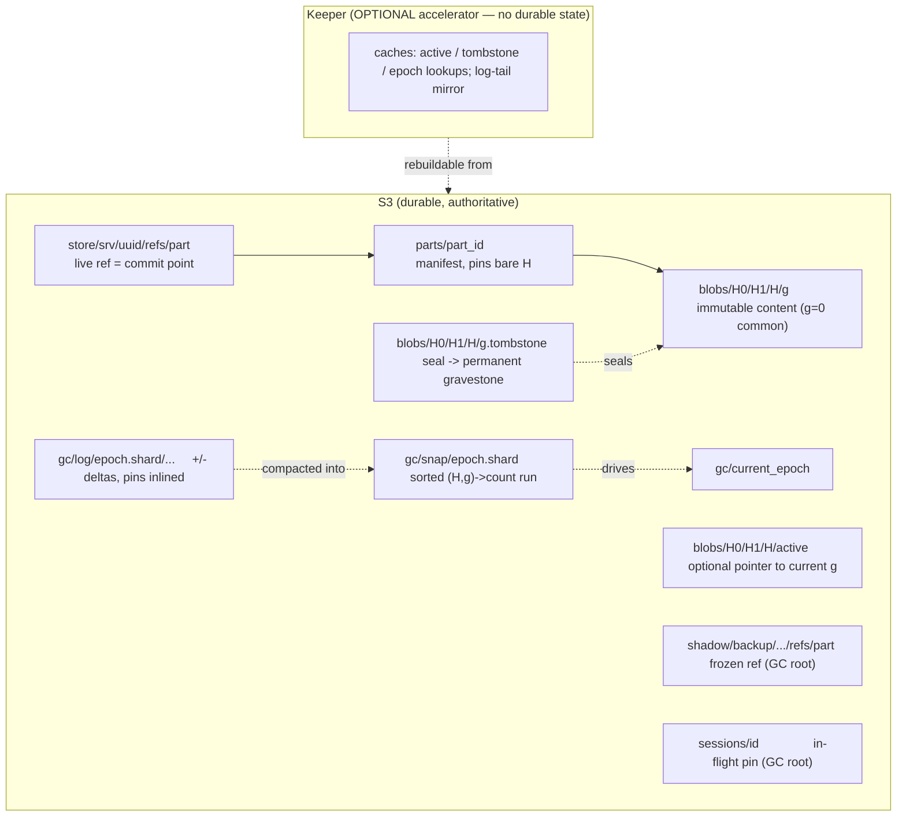

# Content-Addressed MergeTree — GC Convergence Design {#cas-gc-convergence}

**Status:** umbrella design spec, awaiting review. **Date:** 2026-06-04. **Branch:** `cas-mergetree-poc`.
North-star reference: `docs/superpowers/specs/content_addressed_shared_mergetree_design.md` (the original
distributed CAS+GC design; section numbers below, e.g. *(doc §7)*, refer to it).

This is the **umbrella** spec. It re-expresses the north-star design in terms of the actual
`src/Disks/DiskObjectStorage/MetadataStorages/ContentAddressed/` code and defines a **staged, safe path**
from the current PoC to the end-state. Each stage (S1–S4) becomes its own implementation plan.

## 1. Goal and scope {#goal}

Converge the content-addressed (CA) GC subsystem onto the north-star design. Four concepts, each a goal:

- **G1 — Non-blocking writers.** Writers must not block each other or GC on the common commit path. Today
  a shared in-process `gc_lock` serializes every commit-publish against the whole sweep
  (`ContentAddressedTransaction.cpp:1199`, `ContentAddressedGC.cpp:293`). Retire it.
- **G2 — ABA-safe reclamation.** A GC delete can never kill a concurrent re-use of the same content
  (generations + tombstones, doc §5). Absent today.
- **G3 — No bucket-wide scan on the normal path.** GC works from a candidate stream, not a full `LIST` of
  `parts/` + `blobs/` and a re-parse of every live manifest (`ContentAddressedGC.cpp:127,350`).
- **G4 — S3 is the source of truth.** All durable state lives in S3 and is self-describing; coordination
  uses the object store's conditional-create primitive. Keeper is an **optional accelerator** holding no
  durable state.

**Non-goals (explicit):**

- **Packing / small-file bundling** (doc §9/§17) — deferred to its own spec; referenced as future work
  (§13). With the chosen model the refcount is never materialized, so packing is not on the critical path.
- **Changing the content-addressing & dedup core**, `part_id` semantics, or the freeze / fetch /
  replication-by-relink features already built — they are *preserved*; this spec shows how generations and
  the log-structured GC interact with them.
- **Backward-compatibility with existing on-disk PoC pools.** This is a PoC branch: bump `PoolMeta` version
  (2 → 3); a pool created by an older binary is rejected, not upgraded.
- **Multi-region / eventually-consistent object stores** — the single strongly-consistent bucket
  assumption (doc §17) is carried over.

## 2. Where the PoC stands today {#today}

The content-addressing data-plane is faithful to the design; the distributed-safety core was deliberately
deferred. Concretely:

- Blobs are keyed by **bare content hash** `blobs/H0/H1/H` — **no generation**
  (`PoolPaths.cpp:22-31`). Manifests pin the bare `BlobHash` (`PartManifest`), `part_id` is a content-only
  SipHash-128 over `(file, checksum)` excluding mutable files (`PartManifest.cpp:105`).
- The commit point is the **ref** object `store/<srv>/<uuid>/refs/<part>` (`...Transaction.cpp:1296`).
- GC is a **full-scan mark-and-sweep**: list `parts/` + `blobs/`, recompute reachability from every live
  manifest, grace, re-validate, direct-delete (`ContentAddressedGC.cpp:284-444`). No tombstones, no
  generations, no candidate queue, no snapshot/log; the `InMemoryBlobRefIndex` seam exists but is unwired
  (`ContentAddressedGC.h:126-137`, "B9").
- Concurrency safety is a **shared in-process `gc_lock`** (commit ↔ sweep mutual exclusion) plus a
  **single-GC-leader fence lease** in the object store (`PoolCoordination.cpp:223-333`) plus durable
  **session pins** (`WriteSession`) for in-flight / dedup-skip / relink content.

The end-state replaces the lock with the doc's lockless handshake, adds generations/tombstones for
ABA-safety, and replaces the full scan with a log-structured streaming compaction.

## 3. Target architecture at a glance {#overview}



The reverse index (blob → referrers) is **never materialized** as a refcount, in Keeper or in memory. It
exists implicitly inside a **streaming compaction** that merges the sorted snapshot with the epoch's sorted
deltas (§5).

## 4. S3 object layout and the Keeper-optional framing {#layout}

```
blobs/<H0>/<H1>/<H>/<g>             immutable content; g=0 common path
blobs/<H0>/<H1>/<H>/<g>.tombstone   seal + permanent gravestone (one object, three fates — §6)
blobs/<H0>/<H1>/<H>/active          optional, lazily-created pointer to current g (hint, not authority)
parts/<part_id>                     manifest; pins bare H (content-only, idempotent)
store/<srv>/<uuid>/refs/<part>      live ref = commit point (per server)
shadow/<backup>/.../refs/<part>     frozen ref — GC root (unchanged from FREEZE spec)
sessions/<id>                       in-flight / dedup-skip / relink pin — GC root
gc/current_epoch                    the epoch writers currently append deltas to
gc/log/<epoch>.<shard>/...          prefix of small +/- delta objects (one per commit or coalesced batch)
gc/snap/<padded-epoch>.<shard>      sorted (H,g)->count run, per shard
_pool_meta                          PoolMeta v3 (pool_uuid, no back-compat)
```

**Locality by author.** Everything about a single content hash `H` — its generations, their seals, and the
`active` pointer — is co-located under `blobs/H0/H1/H/`, so one `LIST` of that prefix is fully
self-describing, and all of it is authored by the single fenced GC leader. The writer-authored counterpart
is `sessions/<id>`. The two-flag handshake (§7) is the protocol *between* these two authors; they stay
separate objects on purpose (§7.3).

**Keeper holds no durable state.** With tombstones, `active`, the epoch counter, the log, and the snapshot
all in S3 — and GC leadership already on the object-store fence lease (`PoolCoordination`) — **nothing
durable requires Keeper**. This is stronger than the doc's "Keeper accelerator" mode (B): the end-state is
Keeper-*optional*. The door is left open for Keeper to **accelerate** later, purely as a cache (§13): it can
hold hot `active`/tombstone/epoch lookups to save S3 `HEAD`s, and mirror the log tail so the compaction
skips the small-object `LIST`. None of that is built here, and losing the cache is never a correctness
event — only a slowdown.

## 5. The log-structured, streaming GC {#log-structured-gc}

The reverse index is log-structured, like an LSM tree:

- **Snapshot = a sorted run.** `gc/snap/<padded-epoch>.<shard>` holds `(H,g) → count`, **sorted by
  `(H,g)`**. This is the durable folded state.
- **Delta log = the tail.** Commit and drop append `{op:+/-, part_id, pins:[(H,g)…]}` objects under
  `gc/log/<epoch>.<shard>/` (pins inlined and `(H,g)`-resolved, doc §10). S3 has no append, so each
  commit (or coalesced batch) writes its own small object under the prefix. **One write per commit — to
  S3 only.** Keeper is not on this path.
- **A GC epoch is a compaction.** The fenced leader, for each shard: `LIST`s the epoch's `gc/log` objects,
  **sorts** the deltas by `(H,g)`, then **streaming merge-joins** them against the sorted snapshot — an
  external merge-sort. It walks both sorted inputs in lockstep, sums counts per key, **writes the new
  sorted snapshot as it streams**, and **emits any key whose running count reaches 0 as a GC candidate** in
  the same pass. Memory is bounded by the merge frontier, not the number of blobs. Candidates *fall out of
  the merge* — there is no separate decrement-to-zero queue. The epoch then advances `gc/current_epoch` and
  old log/snapshot objects are reclaimed.
- **Ordering invariant (I1/I6).** The `gc/log +` delta is written **before** the ref (commit point). So
  *ref exists ⇒ delta exists* ⇒ the log is complete for every live reference ⇒ a rebuild can only
  over-count (corrected by reconcile, §9), never under-count a live reference. This is what makes deletion
  at `count == 0` safe.

**Sharding by prefix → parallel GC (designed-in, implemented later).** The snapshot, the log, and the
leadership lease are all keyed by **hash-prefix shard** from day one. A shard is the unit of
leadership/epoch/compaction. The first implementation runs one worker across all shards; running **N
workers, one per shard, in parallel** is then a configuration change, not a redesign.

This satisfies G3: the compaction reads only `gc/snap` + `gc/log`, never `LIST blobs/`. The full bucket scan
survives **only** as the rare reconciliation / abandoned-upload fallback (doc §12 heavy fallback).

## 6. Generations and tombstones {#generations}

Generations exist only to make a **lockless, unconditional delete ABA-safe** (doc §5). The common path is
`g=0`; a new generation appears only after GC has condemned the old one.

- **Blob key gains a generation suffix:** `blobs/H/g`. The conditional-create primitive already exists
  (`PoolCoordination`: S3 `If-None-Match`, local `O_EXCL`) and is now also used to create `blobs/H/g` and
  to seal `blobs/H/g.tombstone`.
- **The manifest stays content-only (bare `H`).** This is a deliberate divergence from the doc's literal
  "manifest pins `(H,g)`" wording, chosen to preserve the PoC's dedup and write-once idempotency: a manifest
  remains a pure function of `part_id`, so two identical-content parts that resolved different generations
  during a race still share one manifest. Generation lives only where GC needs it — in the **physical store
  key** and in the **delta log** (the `+` records the resolved `(H,g)`). A reader resolves `g` via the
  `active` hint (default 0) at read time.
- **`<g>.tombstone` — one object, three fates** (doc §5): created by the GC leader as a single-owner seal;
  *deleted* if a writer re-references `(H,g)` before the GC re-check (RECOVER → un-seal); *kept forever* as
  the gravestone if the sweep deletes `<g>`. Once sealed, no new reference may attach to `g`; reuse routes
  to `g+1`; therefore the delete of `g` is **unconditional and ABA-proof** (I4). Generation lineage
  (`max(gen)`) is reconstructable from the surviving `<g>` / `.tombstone` objects even if `active` is lost.
- **`active`** is absent in the common case (readers assume `g=0`); written only on resurrection
  (`→ g+1`), idempotent, and reconstructable — a hint, not authority.
- **Resurrection (doc §8.2):** a contended writer that finds `blobs/H/g.tombstone` present does
  `create blobs/H/(g+1)` → set `active = g+1` (idempotent) → pin / log `(H, g+1)`. It never waits, never
  rescues `g`, never re-uploads to the sealed key.
- **GC becomes mark / recover / sweep** (doc §8.4), replacing the current direct `removeObjectsIfExist`:
  candidate from the compaction → **seal** `<g>.tombstone` → **grace** (liveness only, never a safety
  fence — doc §6.3) → re-check no-reference **and** tomb intact → delete `blobs/H/g`, keep the gravestone.

## 7. The lockless handshake and sessions {#handshake}

This is the payoff. It is safe to ship **only after §6's tomb barrier exists** (S4 depends on S3).

### 7.1 The two-flag handshake (doc §7) {#two-flag}

Both sides do store-then-load; the order *within* each side is what matters, not atomicity across sides.

- **Writer:** publish the reference → **then** re-check `blobs/H/g.tombstone` → commit iff absent, else
  resurrect to `g+1`. In code, the publish currently *inside* the `gc_lock` window
  (`...Transaction.cpp:1199`) moves out, followed by the tomb re-check.
- **GC:** seal `<g>.tombstone` → **then** the authoritative reference check (no live ref, no unmatched `+`
  in the merged state, no session pin) → delete iff none and tomb intact.

The chain `end(publish) ≤ start(recheck) < end(seal) ≤ start(refcheck) < end(publish)` is unsatisfiable
(doc §7), so "writer commits to `g`" and "GC deletes `g`" cannot both hold — with **no lock and no
transaction**, only read/list-after-write. **Dropping the shared `gc_lock` between `commit` and
`runSweepOnce` is the act that lands G1.**

### 7.2 What carries safety once the lock is gone {#carriers}

Cross-mounter safety rests on three things, two of which the PoC already has and we keep:

1. **The §7 handshake** (new) — for content that already has a committed reference being condemned.
2. **Session pins** (kept) — for in-flight content whose ref is not yet published (§7.3).
3. **The single-leader fence lease** (kept, `PoolCoordination`) — prevents GC-vs-GC races; deletes are
   gated on "fence still mine" (the existing `leadership_lost` check generalizes).

The **relink pin-before-publish** path (`ContentAddressedMetadataStorage.cpp:101-259`) already *is* a
§7-shaped handshake; S4 makes the normal commit path match it instead of leaning on the mutex.

### 7.3 Sessions are the in-flight flag {#sessions}

A part is not live until its **ref** is published, but blobs are uploaded — or dedup-decided — earlier.
Between "blob `(H,g)` exists / I will reuse it" and "my ref is published," no ref and no `+` delta names
that blob, so to a concurrent GC it looks unreferenced. `sessions/<id>` is the durable object that lists the
`(H,g)` blobs (and the `parts/<part_id>` manifest key) an uncommitted part intends to reference; GC treats
every listed key as reachable for the session's lifetime (`sessionPinnedBlobs` / `sessionPinnedPartKeys`).
It serves three uses with one primitive: normal in-flight write, dedup-skip (pin *before* deciding not to
re-upload), and relink (pin the existing manifest's blobs *before* publishing a ref).

**Sessions and tombstones stay separate** — they are opposite-polarity flags written by opposite parties
(writer vs single GC leader), and the handshake *requires* two distinct objects: each party raises its own
flag and reads the *other's*. Merging them would lose single-owner sealing and collapse the §7 proof back
into needing a lock. The session is the writer-side realization of "publish the reference before the
re-check" for not-yet-committed parts; conversely, on commit a session's pins become durable `gc/log +`
entries and the session is deleted (O(1) abort: drop the session, nothing was ever referenced).

## 8. Safety invariants {#invariants}

Carried from doc §13, restated against this layout:

- **I1 / I6 (log completeness).** `gc/log +` is written before the ref ⇒ ref exists ⇒ delta exists ⇒
  rebuild never under-counts.
- **I2 (delete gating).** A blob generation is deleted only after an authoritative no-reference check, a
  seal, a grace, and a re-check still showing no reference and an intact tombstone.
- **I3 (writer handshake).** A writer commits a reference to `(H,g)` only after publishing it (ref or
  session pin) and then observing `<g>.tombstone` absent; otherwise it resurrects to `g+1`.
- **I4 (sealed generation).** A sealed generation never gains a new reference; reuse routes to `g+1`;
  delete of a sealed generation is unconditional-safe.
- **I5 (uniqueness).** At most one object per `(H,g)`; concurrent creators collapse via conditional-create.
- **Theorem.** No committed ref names a deleted blob (proof §7).

## 9. Failure handling and degraded modes {#failures}

- **Keeper down** (only relevant once the optional accelerator exists). GC and writers both continue:
  every durable read/write falls back to S3, since Keeper holds no durable state. The cache is repopulated
  lazily on recovery. No correctness event.
- **GC leader crash mid-sweep.** The fence lease expires; a successor takes a higher fence. Seals are
  idempotent; deletes are gated on "fence still mine," so a stale leader cannot authorize a delete after
  losing leadership (generalizes the existing `leadership_lost` check).
- **Writer crash mid-commit.** Order is session/ref → `gc/log +` → manifest → ref. A crash before the ref
  leaves the part not-live; an orphan `+` / blob becomes an over-count (safe), corrected by the
  reconcile-against-root-markers pass (doc §12); orphan blobs are swept by the rare full reconciliation
  scan, kept as a fallback only.
- **Rebuild / catch-up.** Snapshot + log are sufficient to recompute counts without scanning blobs;
  reconcile against the metadata-sized root-marker listing corrects over-counts. The heavy full scan is the
  last resort only.

## 10. Migration: four stages {#stages}

Each stage is independently shippable, keeps the gated stateless suite green (§11), and **retires a named
crutch**. The dangerous lock-removal is last and gated on the tomb barrier existing.

| Stage | Adds | Retires / changes | Safety rests on (until next stage) |
|---|---|---|---|
| **S1 — Reverse index becomes real** | Wire `InMemoryBlobRefIndex` as an incremental reverse index in the GC leader; commit/drop update it; the sweep *validates* it against the existing scan and logs drift | nothing yet (instrumentation only) | `gc_lock` + fence lease (unchanged) |
| **S2 — Log-structured streaming GC** | `gc/log` (S3-only delta append, `+` before ref), `gc/snap` sorted runs, the streaming epoch compaction, shard-keyed layout, the doc §12 rebuild path | GC's full `parts/`+`blobs/` scan → candidate-from-compaction (G3) | `gc_lock` + fence lease |
| **S3 — Generations + tombstones** | `blobs/H/g`, `<g>.tombstone` seal + gravestone, `active` hint, resurrection to `g+1`, mark/recover/sweep | bare-`H` blob key → `H/g`; direct delete → seal/grace/recheck/sweep (G2) | `gc_lock` (still held) + the new tomb barrier |
| **S4 — Lockless handshake** | Writer publish-ref → recheck-tomb; GC seal → ref-check → delete (doc §7) | **Drop the in-process `gc_lock`** between commit and sweep (G1) | the §7 proof + session pins + fence lease |

Dependencies: S2 → S1, S4 → S3. Each stage becomes its own `writing-plans` artifact; backlog items keep the
branch's existing B-number scheme.

**On the in-memory index.** S1's wired `InMemoryBlobRefIndex` is **transitional instrumentation** — its only
job is to validate that incremental ref-counting agrees with the authoritative full scan before anything
trusts it. Once S2's streaming compaction is the authoritative candidate source, the in-memory index is
downgraded to an optional per-epoch pre-filter hint (or removed). This is consistent with §5's "never
materialized" end-state: the durable, authoritative reverse index is always the sorted snapshot + log, not
an in-memory refcount.

## 11. Testing strategy {#testing}

- **Per-stage gtests** extending `gtest_content_addressed*.cpp`:
  - S1 — refcount-vs-scan agreement (the validator must never disagree).
  - S2 — streaming-merge correctness, rebuild-from-snapshot+log, epoch fold + compaction, shard isolation.
  - S3 — seal / resurrect / gravestone-lineage; `active` reconstruction; mark/recover/sweep transitions.
  - S4 — the §7 interleaving oracle, modelled on the existing relink-race gtest (commit `c28411372fa`):
    publish-before-recheck vs seal-before-check, asserting no dangling ref under every interleaving.
- **Race oracles**, each a deterministic interleaving test with **no sleeps**: drop-vs-reuse (C4),
  reuse-vs-delete (C1), concurrent resurrection (C3), rebuild after state loss (C7).
- **Stateless regression.** The `no-content-addressed-storage`-gated suite (per the `cas-test-triage`
  procedure) must stay green across every stage — the behavioral safety net.

## 12. Open questions and assumptions {#open}

- **No back-compat assumption** (§1) — confirmed for the PoC branch; revisit before any non-PoC use.
- **Delta-object volume.** One small `gc/log` object per commit; coalescing many commits' deltas into one
  object per `(shard, window)` is the tuning lever if object count or `LIST` cost bites (an implementation
  detail, not an architecture change).
- **Grace duration** is a liveness knob only and never affects safety (doc §6.3); its value trades
  reclamation latency against the resurrect/recover rate.

## 13. Future work {#future}

- **Packing** (deferred, §1): bundle truly-tiny part files into larger content-addressed blobs to attack
  raw S3 object count and per-request cost. It slots in beneath the manifest (the manifest would pin bundle
  slices); the GC/handshake model here is unchanged because it operates on `(H,g)` regardless of whether
  `H` is a single file or a bundle.
- **Keeper acceleration** (§4): mirror hot `active`/tombstone/epoch lookups and the log tail into Keeper as
  a pure cache. No durable state moves to Keeper; losing it is only a slowdown.
- **Parallel GC** (§5): run N per-shard compaction workers concurrently once a single-worker shard
  compaction is proven.
