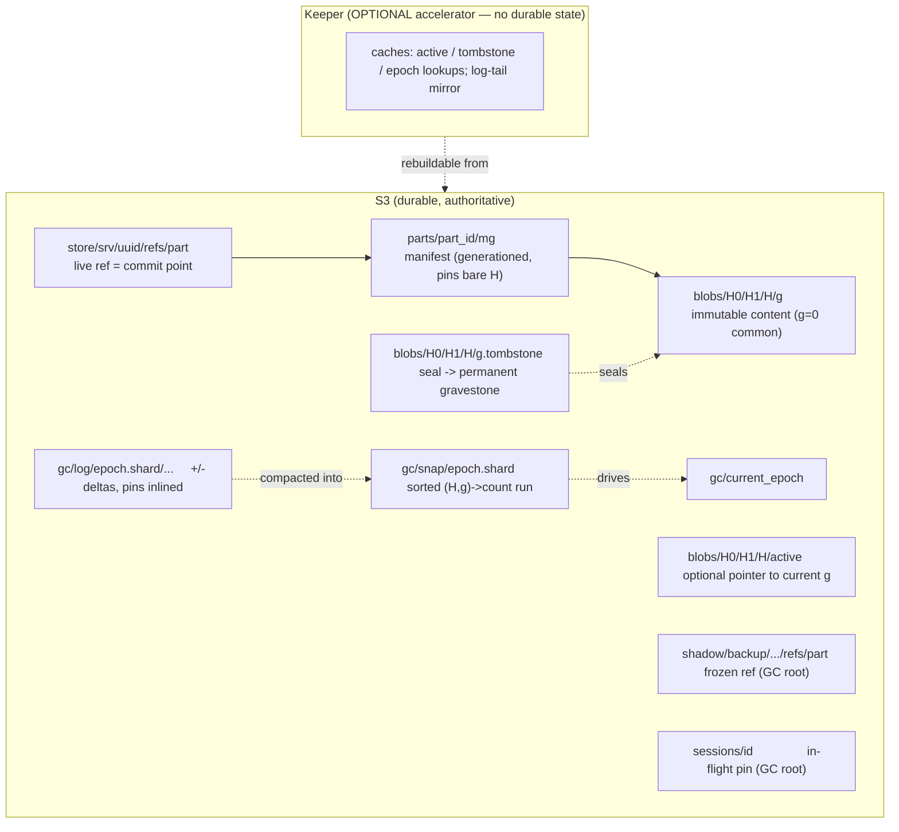

# Content-Addressed MergeTree — GC Convergence Design {#cas-gc-convergence}

**Status:** umbrella design spec, awaiting review (rev. 3). Rev. 2 added the epoch-close / log-completeness
protocol §5.1, read-safety §6.1–§6.2, writer/unlink ordering §7.1, sessions-until-folded §7.3, and orphan
bounds §9. Rev. 3 folds in round-2 review: generationed manifests (`parts/<part_id>/<mg>`, closing the
relink ABA hole), I7 relaxed to *single-attachable*-generation (I7a–d) with byte-identical multi-generation
reads, tombstone gates attachment not reads, the GC RECOVER/drain branches, the session (not the `+`) as the
handshake flag with the `+` logged after the tomb re-check, dropped CAS in favour of fenced PUT (G4-honest),
and `event_id` dedup-on-fold. **Date:** 2026-06-04. **Branch:** `cas-mergetree-poc`.
North-star reference: `docs/superpowers/specs/content_addressed_shared_mergetree_design.md` (the original
distributed CAS+GC design; section numbers below, e.g. *(doc §7)*, refer to it).

This is the **umbrella** spec. It re-expresses the north-star design in terms of the actual
`src/Disks/DiskObjectStorage/MetadataStorages/ContentAddressed/` code and defines a **staged, safe path**
from the current PoC to the end-state. Each stage (S1–S4) becomes its own implementation plan.

## 1. Goal and scope {#goal}

Converge the content-addressed (CA) GC subsystem onto the north-star design. Four concepts, each a goal:

- **G1 — Non-blocking writers.** Writers must not block each other or GC on the common commit path. Today
  a shared in-process `gc_lock` serializes every commit-publish against the whole sweep
  (`ContentAddressedTransaction.cpp:1199`, `ContentAddressedGC.cpp:293`). Retire it.
- **G2 — ABA-safe reclamation.** A GC delete can never kill a concurrent re-use of the same content
  (generations + tombstones, doc §5). Absent today.
- **G3 — No bucket-wide scan on the normal path.** GC works from a candidate stream, not a full `LIST` of
  `parts/` + `blobs/` and a re-parse of every live manifest (`ContentAddressedGC.cpp:127,350`).
- **G4 — S3 is the source of truth.** All durable state lives in S3 and is self-describing; coordination
  uses the object store's conditional-create primitive. Keeper is an **optional accelerator** holding no
  durable state.

**Non-goals (explicit):**

- **Packing / small-file bundling** (doc §9/§17) — deferred to its own spec; referenced as future work
  (§13). With the chosen model the refcount is never materialized, so packing is not on the critical path.
- **Changing the content-addressing & dedup core**, `part_id` semantics, or the freeze / fetch /
  replication-by-relink features already built — they are *preserved*; this spec shows how generations and
  the log-structured GC interact with them.
- **Backward-compatibility with existing on-disk PoC pools.** This is a PoC branch: bump `PoolMeta` version
  (2 → 3); a pool created by an older binary is rejected, not upgraded.
- **Multi-region / eventually-consistent object stores** — the single strongly-consistent bucket
  assumption (doc §17) is carried over.

## 2. Where the PoC stands today {#today}

The content-addressing data-plane is faithful to the design; the distributed-safety core was deliberately
deferred. Concretely:

- Blobs are keyed by **bare content hash** `blobs/H0/H1/H` — **no generation**
  (`PoolPaths.cpp:22-31`). Manifests pin the bare `BlobHash` (`PartManifest`), `part_id` is a content-only
  SipHash-128 over `(file, checksum)` excluding mutable files (`PartManifest.cpp:105`).
- The commit point is the **ref** object `store/<srv>/<uuid>/refs/<part>` (`...Transaction.cpp:1296`).
- GC is a **full-scan mark-and-sweep**: list `parts/` + `blobs/`, recompute reachability from every live
  manifest, grace, re-validate, direct-delete (`ContentAddressedGC.cpp:284-444`). No tombstones, no
  generations, no candidate queue, no snapshot/log; the `InMemoryBlobRefIndex` seam exists but is unwired
  (`ContentAddressedGC.h:126-137`, "B9").
- Concurrency safety is a **shared in-process `gc_lock`** (commit ↔ sweep mutual exclusion) plus a
  **single-GC-leader fence lease** in the object store (`PoolCoordination.cpp:223-333`) plus durable
  **session pins** (`WriteSession`) for in-flight / dedup-skip / relink content.

The end-state replaces the lock with the doc's lockless handshake, adds generations/tombstones for
ABA-safety, and replaces the full scan with a log-structured streaming compaction.

## 3. Target architecture at a glance {#overview}



The reverse index (blob → referrers) is **never materialized** as a refcount, in Keeper or in memory. It
exists implicitly inside a **streaming compaction** that merges the sorted snapshot with the epoch's sorted
deltas (§5).

## 4. S3 object layout and the Keeper-optional framing {#layout}

```
blobs/<H0>/<H1>/<H>/<g>             immutable content; g=0 common path
blobs/<H0>/<H1>/<H>/<g>.tombstone   seal + permanent gravestone (one object, three fates — §6)
blobs/<H0>/<H1>/<H>/active          optional, lazily-created pointer to current g (hint, not authority)
parts/<part_id>/<mg>                manifest; pins bare H (content-only, idempotent); generation mg (mg=0 common)
parts/<part_id>/<mg>.tombstone      manifest seal + permanent gravestone (symmetric with blobs)
parts/<part_id>/active              optional, lazily-created pointer to current manifest generation
store/<srv>/<uuid>/refs/<part>      live ref = commit point (per server)
shadow/<backup>/.../refs/<part>     frozen ref — GC root (unchanged from FREEZE spec)
sessions/<id>                       in-flight / dedup-skip / relink pin — GC root
gc/current_epoch                    the epoch writers currently append deltas to
gc/log/<epoch>.<shard>/...          prefix of small +/- delta objects (one per commit or coalesced batch)
gc/snap/<padded-epoch>.<shard>      sorted (H,g)->count run, per shard
_pool_meta                          PoolMeta v3 (pool_uuid, no back-compat)
```

**Locality by author.** Everything about a single content hash `H` — its generations, their seals, and the
`active` pointer — is co-located under `blobs/H0/H1/H/`, so one `LIST` of that prefix is fully
self-describing, and all of it is authored by the single fenced GC leader. The writer-authored counterpart
is `sessions/<id>`. The two-flag handshake (§7) is the protocol *between* these two authors; they stay
separate objects on purpose (§7.3).

**Keeper holds no durable state.** With tombstones, `active`, the epoch counter, the log, and the snapshot
all in S3 — and GC leadership already on the object-store fence lease (`PoolCoordination`) — **nothing
durable requires Keeper**. This is stronger than the doc's "Keeper accelerator" mode (B): the end-state is
Keeper-*optional*. The door is left open for Keeper to **accelerate** later, purely as a cache (§13): it can
hold hot `active`/tombstone/epoch lookups to save S3 `HEAD`s, and mirror the log tail so the compaction
skips the small-object `LIST`. None of that is built here, and losing the cache is never a correctness
event — only a slowdown.

## 5. The log-structured, streaming GC {#log-structured-gc}

The reverse index is log-structured, like an LSM tree:

- **Snapshot = a sorted run.** `gc/snap/<padded-epoch>.<shard>` holds `(H,g) → count`, **sorted by
  `(H,g)`**. This is the durable folded state.
- **Delta log = the tail.** Commit and drop append `{op:+/-, part_id, pins:[(H,g)…]}` objects under
  `gc/log/<epoch>.<shard>/` (pins inlined and `(H,g)`-resolved, doc §10). S3 has no append, so each batch
  writes its own small object under the prefix, **to S3 only** (Keeper is not on this path).
- **Batching is a requirement, not a tuning lever.** S3 throttles a prefix at ~3,500 `PUT`/s, and
  high-churn MergeTree ingest (small-block inserts + background merges/mutations) can burst commits. So a
  writer **coalesces deltas** — in-memory group-commit over a short window, one object per `(shard,
  window)` — rather than one object per commit, and the hash-prefix sharding (below) spreads `PUT` load
  across prefixes. This is built into the write path from S2, not deferred.
- **A GC epoch is a compaction.** The fenced leader, for each shard: `LIST`s the epoch's `gc/log` objects,
  **sorts** the deltas by `(H,g)`, then **streaming merge-joins** them against the sorted snapshot — an
  external merge-sort. It walks both sorted inputs in lockstep, sums counts per key, **writes the new
  sorted snapshot as it streams**, and **emits any key whose running count reaches 0 as a GC candidate** in
  the same pass. Memory is bounded by the merge frontier, not the number of blobs. Candidates *fall out of
  the merge* — there is no separate decrement-to-zero queue. The epoch then advances `gc/current_epoch` and
  old log/snapshot objects are reclaimed.
- **Ordering invariant (I1/I6).** The `gc/log +` delta is written **before** the ref (commit point). So
  *ref exists ⇒ delta exists* ⇒ the log is complete for every live reference ⇒ a rebuild can only
  over-count (corrected by reconcile, §9), never under-count a live reference. This is what makes deletion
  at `count == 0` safe — **but only if every delta lands in a foldable position; see §5.1.**

**Sharding by prefix → parallel GC (designed-in, implemented later).** The snapshot, the log, and the
leadership lease are all keyed by **hash-prefix shard** from day one. A shard is the unit of
leadership/epoch/compaction. The first implementation runs one worker across all shards; running **N
workers, one per shard, in parallel** is then a configuration change, not a redesign.

This satisfies G3: the compaction reads only `gc/snap` + `gc/log`, never `LIST blobs/`. The full bucket scan
survives **only** as the rare reconciliation / abandoned-upload fallback (doc §12 heavy fallback).

### 5.1 Epoch protocol and log completeness {#epoch-protocol}

Under the `gc_lock` (S2/S3) the lock does a second, easily-missed job: while a compaction holds it, no
commit is appending, so the compaction's `LIST gc/log/E.shard/` sees a **stable** set. Once the lock is
gone (S4), that consistency is not free, and naïvely folding an epoch reintroduces a data-loss race: a
writer reads `current_epoch = E`, the compaction `LIST`s `E`, folds, advances to `E+1`, and reclaims `E`'s
log; *then* the writer's `+` for `E` lands. That delta is never folded and never re-read → the reference is
lost → undercount → a referenced blob is later swept. The writer already committed, so the §7 handshake
cannot save it. **So S4's true prerequisite is not just "the tomb barrier exists" — it is "log completeness
holds under concurrent appends."** This is provided by three rules together:

1. **Epoch close by the fenced leader (no CAS).** A compaction first closes its epoch by writing
   `gc/current_epoch = E+1`. This is a **plain fenced PUT**, not a compare-and-set: `gc/current_epoch` has a
   *single writer* — the GC leader — so the existing fence lease (gated by `leadership_lost`) already
   serializes it, and no `If-Match` primitive is needed (keeping G4's "only conditional-create" honest).
   Only after the close does the leader `LIST` and fold `E`. "Closed" means *intended* to receive no new
   deltas.
2. **Writer re-append on advance.** A writer appends its `+` under the epoch it read, then **re-reads
   `gc/current_epoch`**; if the epoch advanced past the one it wrote, it re-appends the *same logical delta*
   into the now-current open epoch (bounded retry until the epoch is stable across its append). The orphaned
   append in the closed epoch is a harmless leaked object (reclaimed by reconciliation). This converts the
   straggler from *lost* to *re-logged*.
3. **Session held until folded (safety net).** The in-flight session pin (§7.3) is retained until the
   writer's `+` is observed **folded into a durable snapshot**, not merely until commit. So at every
   instant, *(live sessions) ∪ (folded snapshot)* covers every live reference. Any residual straggler that
   slips past rules 1–2 therefore degrades from a **safety** bug (data loss) to a **liveness** bug (the
   session, and thus the blob, leaks until detected) — a category we can tolerate and bound.

**Idempotent deltas.** Every logical delta carries a stable `event_id` (per `part_id` × op), and the delta
object is keyed `gc/log/<epoch>.<shard>/<event_id>`. The compaction **dedupes by `event_id`** while folding,
so a re-append (rule 2) that lands a duplicate in two epochs is collapsed to one count rather than
over-counting; the later `-` then nets correctly. (Absent dedup the duplicate is merely a bounded
over-count reconciliation would catch — but dedup-on-fold is cheap and removes the leak.)

**Completeness invariant (strengthened I6).** Once a compaction closes epoch `E`, every reference whose `+`
targeted `E` is either (a) folded from `E`, (b) re-logged by its writer into an open epoch, or (c) still
covered by a live session. No live reference is ever both unfolded and unpinned.

This must be covered by a dedicated S4 interleaving oracle: a writer appending exactly as its epoch folds,
asserting the blob is never swept while the part is live.

## 6. Generations and tombstones {#generations}

Generations exist only to make a **lockless, unconditional delete ABA-safe** (doc §5). The common path is
`g=0`; a new generation appears only after GC has condemned the old one.

- **Blob key gains a generation suffix:** `blobs/H/g`. The conditional-create primitive already exists
  (`PoolCoordination`: S3 `If-None-Match`, local `O_EXCL`) and is now also used to create `blobs/H/g` and
  to seal `blobs/H/g.tombstone`.
- **The manifest content stays content-only (bare `H`), but is itself a generationed object.** The manifest
  *body* pins bare `H` (so `part_id` is a pure content function — dedup and write-once idempotency
  preserved); generation lives only in the physical store key and the delta log (the `+` records the
  resolved `(H,g)`). Separately, the manifest *object* is keyed `parts/<part_id>/<mg>` and carries the same
  generation/tombstone lifecycle as a blob (§9), so it is ABA-safe to reclaim and re-create. Treat the
  manifest as "just another content-addressed object": everywhere this spec reasons about a blob `(H,g)` —
  seal, recheck, resurrection, the §7 handshake, the read fallback — the manifest `(part_id, mg)` is handled
  identically. A reader/relinker resolves `mg` via `parts/<part_id>/active` (default 0); a writer's tomb
  re-check (§7.1) covers the manifest generation too.
- **`<g>.tombstone` — one object, three fates, all GC-owned** (doc §5): created by the GC leader as a
  single-owner seal; *deleted by the GC leader* during RECOVER, when its post-seal reference check observes
  a session/ref that already protects `g` (un-seal); *kept forever* as the gravestone if the sweep deletes
  `<g>`. **Writers never delete a tombstone** — on seeing one they only resurrect (below). Once sealed, no
  new reference may attach to `g`; reuse routes to `g+1`; therefore the delete of `g` is **unconditional and
  ABA-proof** (I4). Generation lineage (`max(gen)`) is reconstructable from the surviving `<g>` /
  `.tombstone` objects even if `active` is lost.
- **Resurrection (doc §8.2):** a contended writer that finds `blobs/H/g.tombstone` present does
  `create blobs/H/(g+1)` (`If-None-Match`) → best-effort advance `active → g+1` → pin / log `(H, g+1)`. It
  never waits, never rescues `g`, never deletes the tombstone, never re-uploads to the sealed key.
- **GC mark / recover / sweep** (doc §8.4), replacing the direct `removeObjectsIfExist`. Candidate from the
  compaction → **seal** `<g>.tombstone` → **grace** (liveness only, never a safety fence — doc §6.3) →
  **fresh authoritative re-check** (§6.2), which branches (after ChatGPT's review):
  - *no ref/session for `g`* → **sweep**: delete `blobs/H/g`, reset `active` off `g` (§6.1), keep the
    gravestone.
  - *ref/session for `g`, and no successor generation exists* → **recover**: delete `<g>.tombstone`,
    re-open `g` as the attachable generation.
  - *ref/session for `g`, but a successor `g+1…` already exists* → **drain**: keep `<g>.tombstone` and keep
    `blobs/H/g` (do not delete — it is still referenced), but do **not** re-open `g`; new attaches go to the
    successor, and `g` is swept later once its pins drain to zero. This is the multi-generation reality
    (I7a) — two byte-identical generations may be pinned at once; only one is *attachable*.

### 6.1 Generation semantics, `active`, and the read path {#read-safety}

The bare-`H` manifest decouples a part's **read generation** (resolved via `active`) from its **pinned
generation** (recorded in the `+` delta). An earlier draft justified this with a "single live generation"
lemma; that lemma is **false** under this protocol (ChatGPT's review): W1 pins `g`, GC seals `g`, W2
resurrects `g+1`, then GC RECOVERs `g` because W1 still references it — now `g` *and* `g+1` are both pinned.
This is still **content-correct** because all generations of `H` are byte-identical; it just means the
correct invariants are about *attachability* and *availability*, not uniqueness:

- **I7a — single attachable generation.** For each `H`, at most one generation is *attachable by new
  writers*; a tombstoned generation is sealed and receives no new pins. (Multiple byte-identical generations
  may be *pinned* at once — the transient ≤2-copy window of doc §5.)
- **I7b — content availability.** If a committed ref to bare `H` exists, at least one blob generation of
  `H` is present.
- **I7c — read generation ≠ pin generation.** A reader may read *any present* generation of `H`, because
  generations are byte-identical; the per-generation pin is purely a GC accounting device, not the durable
  read identity.
- **I7d — `active` is a preferred-generation hint.** Best-effort monotonic on resurrection, best-effort
  reset off a swept generation on sweep. A stale `active` is repaired by fallback, not treated as
  corruption unless *no* present generation exists.

Concrete rules:
- **`active` is a plain hint PUT, not a conditional update.** It is absent in the common case (readers
  assume `g=0`), written best-effort on resurrection/sweep. Monotonicity is *not* required for safety — a
  stale `active` only triggers a reader `LIST` fallback — so no `If-Match`/CAS is used (G4 stays honest,
  Claude's review).
- **Tombstone gates attachment, not reads.** A `<g>.tombstone` means "no new writer may attach to `g`"; it
  does **not** mean the blob is unreadable. During the seal→recover/sweep window a sealed blob can still be
  present and needed by a live ref, so a reader that `GET`s the blob successfully **uses it regardless of any
  tombstone** (ChatGPT's review). Only a `404` triggers fallback.
- **Reader rule.** Read `active` (default 0) → `GET blobs/H/<g>`; on success, use the bytes (ignore
  tombstone); on `404`, `LIST blobs/H/`, pick any present generation (prefer highest/current), read it, and
  opportunistically repair `active`. The resolved `g` is cached on the node (memory / page cache) so a
  resurrected (`g>0`) content does not pay a repeated S3 round-trip per read — and `LIST` fallback only fires
  on a genuine miss, never on a healthy `g=0` read (so G3 holds and there is no listing storm on the hot
  path).

### 6.2 The sweep's authoritative re-check {#authoritative-recheck}

With the non-materialized refcount (model **C**), the sweep's "no reference?" gate cannot be a re-read of
the epoch's compaction result — that is epoch-stale and would break the §7 proof (GC's check `L` must be
able to observe a `publish` that completed before it). The authoritative re-check, performed **after** the
seal, is: *no live session pins `(H,g)`* **and** *no `+` for `(H,g)` in the log tail since the last fold*
(equivalently, it is the very compaction running at the later sweep epoch, which has folded everything up to
its own post-seal `LIST`). Combined with §5.1 rule 3 (sessions held until folded), *sessions + current
compaction* is a complete, fresh view of all live references — which is exactly what makes the gate
authoritative.

**This is a single pass, not a per-candidate scan** (Claude's review). Live session pins are folded into the
streaming merge as **ephemeral `+`s** — they suppress candidacy but are *not* written into the snapshot — so
a `(H,g)` that any live session pins simply never falls out of the merge as a candidate. The cost is
O(merge), not O(sessions × candidates); the session set is read once per compaction, not once per blob.

## 7. The lockless handshake and sessions {#handshake}

This is the payoff. It is safe to ship **only after §6's tomb barrier (S3) and §5.1's log-completeness
protocol exist** — dropping `gc_lock` exposes both the handshake race *and* the concurrent-append race.

### 7.1 The two-flag handshake (doc §7) {#two-flag}

Both sides do store-then-load; the order *within* each side is what matters, not atomicity across sides.
**The writer-side flag is the session pin, not the `+` delta and not the visible live ref.** Making the
session the flag lets us re-check the tombstone *before* logging the `+`, so an abandoned generation never
leaves a stale `+` in the log (Claude's review: a `+`-then-recheck order folds a spurious count → a
needless RECOVER/leak). The live ref stays the true reader-facing commit point, written last.

**Writer (explicit order):**
1. resolve `H → g` per blob and `part_id → mg` for the manifest (via the respective `active`, default 0);
2. create/extend `sessions/<id>` with the resolved `[(H,g)…]` **and** `(part_id, mg)` — **this is the
   handshake flag** (durable, GC-visible);
3. upload missing blobs (`blobs/H/g`) and the manifest (`parts/<part_id>/<mg>`) via conditional-create;
4. **re-check** the `.tombstone` for every pinned `(H,g)` **and** for `(part_id, mg)`;
5. if any tomb is present → abandon that generation, resurrect to `g+1` / `mg+1`, retry from (2);
6. else settle the final pinset and append the `gc/log +` **once** (with its `event_id`; then the epoch
   re-append check, §5.1 rule 2);
7. write the **live ref** (`store/.../refs/<part>`) — the commit point;
8. keep the session until the `+` is folded (§5.1 rule 3), then delete it.

The `+` thus lands only on the success path, after the tomb re-check, before the live ref (preserving I8).
The §7 proof is unaffected: its "publish" flag `A` is the **session pin** (step 2), which precedes both the
re-check (step 4) and GC's authoritative check (§6.2 reads the live session set).

**GC (explicit order):** seal `<g>.tombstone` → **then** the fresh authoritative reference check (§6.2:
sessions + current compaction) → delete iff none and tomb intact.

The chain `end(publish) ≤ start(recheck) < end(seal) ≤ start(refcheck) < end(publish)` (where *publish* = the
session pin / `+`) is unsatisfiable (doc §7), so "writer commits to `g`" and "GC deletes `g`" cannot both
hold — with **no lock and no transaction**, only read/list-after-write. **Dropping the shared `gc_lock`
between `commit` and `runSweepOnce` is the act that lands G1.**

**Unlink / drop ordering (bias to over-count).** Remove (or tombstone) the live ref **before** appending the
`-` delta. A crash between the two then leaves a not-live part whose blob is briefly over-counted (safe,
reconciled), never an under-count that could strand a delete. Symmetric to the commit ordering (`+` before
ref; ref before session removal).

### 7.2 What carries safety once the lock is gone {#carriers}

Cross-mounter safety rests on three things, two of which the PoC already has and we keep:

1. **The §7 handshake** (new) — for content that already has a committed reference being condemned.
2. **Session pins** (kept) — for in-flight content whose ref is not yet published (§7.3).
3. **The single-leader fence lease** (kept, `PoolCoordination`) — prevents GC-vs-GC races; deletes are
   gated on "fence still mine" (the existing `leadership_lost` check generalizes).

The **relink pin-before-publish** path (`ContentAddressedMetadataStorage.cpp:101-259`) already *is* a
§7-shaped handshake; S4 makes the normal commit path match it instead of leaning on the mutex.

### 7.3 Sessions are the in-flight flag {#sessions}

A part is not live until its **ref** is published, but blobs are uploaded — or dedup-decided — earlier.
Between "blob `(H,g)` exists / I will reuse it" and "my ref is published," no ref and no `+` delta names
that blob, so to a concurrent GC it looks unreferenced. `sessions/<id>` is the durable object that lists the
`(H,g)` blobs (and the `parts/<part_id>` manifest key) an uncommitted part intends to reference; GC treats
every listed key as reachable for the session's lifetime (`sessionPinnedBlobs` / `sessionPinnedPartKeys`).
It serves three uses with one primitive: normal in-flight write, dedup-skip (pin *before* deciding not to
re-upload), and relink (pin the existing manifest's blobs *before* publishing a ref).

**Session lifetime = until folded, not until commit.** A session is retained until its `+` deltas are
observed folded into a durable snapshot (§5.1 rule 3), so *sessions ∪ folded-snapshot* always covers every
live reference and the §6.2 gate is complete. Abort before commit is still O(1) (drop the session, nothing
was ever referenced).

**Session reaping is timer-safe — and here's why that doesn't reintroduce the §6.3 time-fence trap.** A
crashed/paused writer's session would otherwise pin blobs forever, so a background reaper deletes sessions
past a deadline. A *timer* is sound **here** precisely because the gravestone is permanent: a reaped,
then-resumed writer re-checks the tomb at step 4 and **resurrects** rather than committing to a swept
generation — the timer governs liveness, never the commit-vs-delete safety decision. (A reaped in-flight
*new* upload becomes an abandoned-upload orphan for the rare full scan.) **Mechanical reaper rule:** a
session may be deleted only if (a) its ref was never committed, **or** (b) every one of its delta
`event_id`s is visible in a folded snapshot, **or** (c) a root-marker reconciliation has reconstructed
equivalent reachability. Implementation plans define the exact folded watermark.

**Sessions and tombstones stay separate** — they are opposite-polarity flags written by opposite parties
(writer vs single GC leader), and the handshake *requires* two distinct objects: each party raises its own
flag and reads the *other's*. Merging them would lose single-owner sealing and collapse the §7 proof back
into needing a lock.

## 8. Safety invariants {#invariants}

Carried from doc §13, restated against this layout:

- **I1 / I6 (log completeness under concurrent appends).** `gc/log +` is written before the ref, and — once
  the lock is gone — every reference whose `+` targeted a closed epoch is folded, re-logged, or
  session-covered (§5.1). So *(live sessions) ∪ (folded snapshot)* covers every live reference at all times;
  rebuild never under-counts.
- **I2 (delete gating).** A blob generation is deleted only after a seal, a grace, and a **fresh
  authoritative** no-reference re-check (§6.2 — sessions + current compaction, not an epoch-stale count)
  still showing no reference and an intact tombstone.
- **I3 (writer handshake).** A writer commits the live ref only after publishing the **session pin** (the
  flag, §7.1 step 2) and then observing `<g>.tombstone` absent for every pinned `(H,g)`; otherwise it
  resurrects to `g+1`. The `+` is logged after the re-check; the live ref is written last.
- **I4 (sealed generation, GC-owned tombstone).** A sealed generation receives no new *attachment*; reuse
  routes to `g+1`; only the GC leader removes a tombstone (RECOVER, and only when no successor exists,
  §6); delete of a sealed generation is unconditional-safe.
- **I5 (uniqueness).** At most one object per `(H,g)`; concurrent creators collapse via conditional-create.
- **I7 (generation semantics — replaces "single live generation").**
  *I7a:* for each `H`, at most one generation is *attachable* by new writers (sealed generations are not).
  *I7b:* if a committed ref to bare `H` exists, at least one generation of `H` is present.
  *I7c:* a reader may read any present generation (byte-identical); the pin generation is GC accounting,
  not read identity.
  *I7d:* `active` is a best-effort preferred-generation hint, repaired by reader fallback.
- **I8 (ordering biases to over-count).** Commit: session before reuse; `+` (after the tomb re-check)
  before live ref; live ref before session removal. Drop: live ref removal before `-`. A crash thus
  over-counts (safe), never under-counts.
- **Theorem.** No committed ref to content `H` becomes unreadable, because the physical generations of `H`
  are never all deleted while a ref or session names `H` (proof §7, given I1–I8). (Refs name bare `H`, not a
  specific `g`, so the guarantee is content-availability, not "names a live `g`.")

## 9. Failure handling and degraded modes {#failures}

- **Keeper down** (only relevant once the optional accelerator exists). GC and writers both continue:
  every durable read/write falls back to S3, since Keeper holds no durable state. The cache is repopulated
  lazily on recovery. No correctness event.
- **GC leader crash mid-sweep.** The fence lease expires; a successor takes a higher fence. Seals are
  idempotent; deletes are gated on "fence still mine," so a stale leader cannot authorize a delete after
  losing leadership (generalizes the existing `leadership_lost` check).
- **Writer crash mid-commit.** Order is session → blobs/manifest → `gc/log +` → live ref → (fold) → session
  delete (§7.1). A crash before the live ref leaves the part not-live; an orphan `+` / blob becomes an
  over-count (safe), corrected by the reconcile-against-root-markers pass (doc §12); the still-present
  session keeps the blob reachable until reaped, after which an orphan blob is swept by the rare full scan.
- **Manifest reclamation (manifests are generationed, like blobs).** The reverse graph is
  ref → `parts/<part_id>/<mg>` → blobs, but a blob-only `+` delta cannot tell GC when the *manifest* becomes
  unreferenced. The delta carries a **`(part_id, mg)` edge** alongside the blob pins; the compaction counts
  manifest references the same way, and a manifest generation whose count reaches zero is a candidate.
  Crucially, **a manifest is reclaimed by the identical seal/grace/recheck/sweep + resurrection machinery as
  a blob** (chosen over a same-key delete, which would have a relink-after-full-drop **ABA hole**: a
  fixed-key `parts/<part_id>` could be re-created exactly as a stale GC delete fires). Because re-creation
  after a sweep routes to `mg+1` (a different key), the manifest delete is unconditional-safe by the same
  proof as I4. A reader/relinker resolves the manifest generation via `parts/<part_id>/active` (default 0)
  with the same fallback as §6.1; `part_id` remains content-only, so dedup/idempotency are unchanged
  (`mg` is a physical-storage detail, never part of identity).
- **Orphan-drift bound.** Over-counts and abandoned uploads accumulate until the heavy reconciliation scan
  runs. That scan is scheduled by a **bounded policy** — a cadence plus a threshold (e.g. run a shard's full
  reconciliation when estimated orphan bytes exceed a configured fraction of the shard) — so storage drift
  is bounded, not left to a vague "rare" cadence.
- **Rebuild / catch-up.** Snapshot + log are sufficient to recompute counts without scanning blobs;
  reconcile against the metadata-sized root-marker listing corrects over-counts. The heavy full scan is the
  last resort only.

## 10. Migration: four stages {#stages}

Each stage is independently shippable, keeps the gated stateless suite green (§11), and **retires a named
crutch**. The dangerous lock-removal is last and gated on the tomb barrier existing.

| Stage | Adds | Retires / changes | Safety rests on (until next stage) |
|---|---|---|---|
| **S1 — Reverse index becomes real** | Wire `InMemoryBlobRefIndex` as an incremental reverse index in the GC leader; commit/drop update it; the sweep *validates* it against the existing scan and logs drift | nothing yet (instrumentation only) | `gc_lock` + fence lease (unchanged) |
| **S2 — Log-structured streaming GC** | `gc/log` (S3-only, coalesced, `event_id`-keyed, `part_id` edge), `gc/snap` sorted runs, streaming epoch compaction with **fenced epoch-close (no CAS) before fold** + dedup-on-fold (§5.1), shard-keyed layout, doc §12 rebuild | GC's full `parts/`+`blobs/` scan → candidate-from-compaction (G3) | `gc_lock` + fence lease |
| **S3 — Generations + tombstones** | generations on **both** `blobs/H/g` and `parts/<part_id>/<mg>` (manifests symmetric, §9), GC-owned `.tombstone` seal + gravestone, best-effort `active` + sweep-resets + tombstone-doesn't-block-reads fallback (§6.1), resurrection to `g+1`/`mg+1`, mark/recover/**drain**/sweep | bare-key blob/manifest → generationed; direct delete → seal/grace/fresh-recheck/sweep (G2) | `gc_lock` (still held) + the new tomb barrier |
| **S4 — Lockless handshake** | Writer order session→recheck-tomb→`+`→live-ref (§7.1); GC seal → fresh authoritative ref-check (§6.2) → delete; **session held until folded** (§5.1 rule 3) | **Drop the in-process `gc_lock`** between commit and sweep (G1) | the §7 proof + sessions-until-folded + fence lease |

Dependencies: S2 → S1, S4 → S3. **S4's real prerequisite is "log completeness under concurrent appends"
(§5.1), not merely "the tomb barrier exists"** — the epoch-close protocol, writer re-append, and
sessions-until-folded must all be in place, because dropping `gc_lock` is the first time both the handshake
*and* the concurrent-append path are exercised in production. Each stage becomes its own `writing-plans`
artifact; backlog items keep the branch's existing B-number scheme.

**On the in-memory index.** S1's wired `InMemoryBlobRefIndex` is **transitional instrumentation** — its only
job is to validate that incremental ref-counting agrees with the authoritative full scan before anything
trusts it. Once S2's streaming compaction is the authoritative candidate source, the in-memory index is
downgraded to an optional per-epoch pre-filter hint (or removed). This is consistent with §5's "never
materialized" end-state: the durable, authoritative reverse index is always the sorted snapshot + log, not
an in-memory refcount.

## 11. Testing strategy {#testing}

- **Per-stage gtests** extending `gtest_content_addressed*.cpp`:
  - S1 — refcount-vs-scan agreement (the validator must never disagree).
  - S2 — streaming-merge correctness, rebuild-from-snapshot+log, epoch fold + compaction, shard isolation.
  - S3 — seal / resurrect / gravestone-lineage; best-effort `active` + sweep-resets-`active` + reader
    fallback; **tombstone-does-not-block-reads** (a reader `GET`s a sealed-but-present blob successfully);
    mark/recover/**drain**/sweep transitions including the "successor exists → drain, don't recover" branch.
  - S4 — the §7 interleaving oracle, modelled on the existing relink-race gtest (commit `c28411372fa`):
    publish-before-recheck vs seal-before-check, asserting no dangling ref under every interleaving.
- **Race oracles**, each a deterministic interleaving test with **no sleeps**: drop-vs-reuse (C4),
  reuse-vs-delete (C1), concurrent resurrection (C3), rebuild after state loss (C7); the load-bearing one for
  model C — **append-as-epoch-folds** (§5.1): a writer's `+` lands as its epoch is closed/folded; assert the
  blob is never swept while the part is live; plus three from the round-2 review —
  **seal→resurrect→GC-recovers-old-generation** (reads stay correct with *two* generations pinned, exercising
  I7a not single-live-generation), **`active`/default points at a tombstoned-but-present generation during
  grace** (reader still succeeds), and **duplicate `+` re-append across an epoch close** (assert `event_id`
  dedup-on-fold, or that reconciliation bounds the over-count).
- **Stateless regression.** The `no-content-addressed-storage`-gated suite (per the `cas-test-triage`
  procedure) must stay green across every stage — the behavioral safety net.

## 12. Open questions and assumptions {#open}

- **No back-compat assumption** (§1) — confirmed for the PoC branch; revisit before any non-PoC use.
- **`gc/log` truth level — classified.** The log is a **rebuildable accelerator, not durable commit
  truth.** Because at most one generation of `H` is live (I7), `(H,g)` reachability is reconstructable from
  the live refs + manifests + the blob store's own tombstone state (the heavy fallback, doc §12) without the
  log. The log only makes GC *fast*; losing it forces a slower rebuild, never a wrong answer.
- **Grace duration** is a liveness knob only and never affects safety (doc §6.3); its value trades
  reclamation latency against the resurrect/recover rate.
- **Observability (build alongside S1–S4).** Export `cas_generation_resurrections_total`,
  `cas_duplicate_generation_bytes`, `cas_tombstones_total`, `cas_generations_per_hash` (p99),
  `cas_orphan_bytes_estimate`, and `cas_unfolded_sessions`. Hot content that repeatedly cycles
  zero-refs→resurrection grows tombstones/duplicate-bytes; permanent gravestones are safe but not free, so
  these are guardrails, not just dashboards.

## 13. Future work {#future}

- **Packing** (deferred, §1): bundle truly-tiny part files into larger content-addressed blobs to attack
  raw S3 object count and per-request cost. It slots in beneath the manifest (the manifest would pin bundle
  slices); the GC/handshake model here is unchanged because it operates on `(H,g)` regardless of whether
  `H` is a single file or a bundle.
- **Keeper acceleration** (§4): mirror hot `active`/tombstone/epoch lookups and the log tail into Keeper as
  a pure cache. No durable state moves to Keeper; losing it is only a slowdown.
- **Parallel GC** (§5): run N per-shard compaction workers concurrently once a single-worker shard
  compaction is proven.
- **Self-describing refs (optional optimization).** Inlining the resolved `(H,g)` pinset (or a
  `pinsets/<hash>` pointer) into the live ref would let a rebuild resolve generations without reading the
  blob store at all. It is *not* required for correctness — I7 already makes `(H,g)` reconstructable — so it
  is deferred as a rebuild-speed optimization, weighed against the extra commit-path write.
